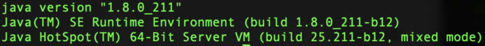
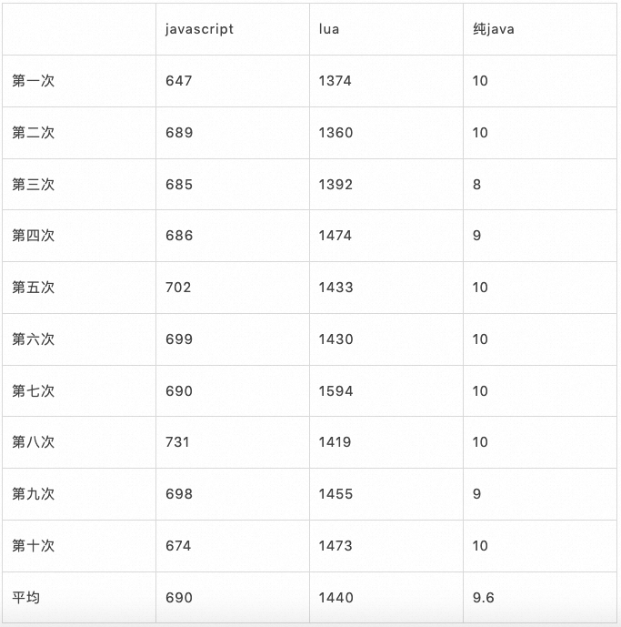
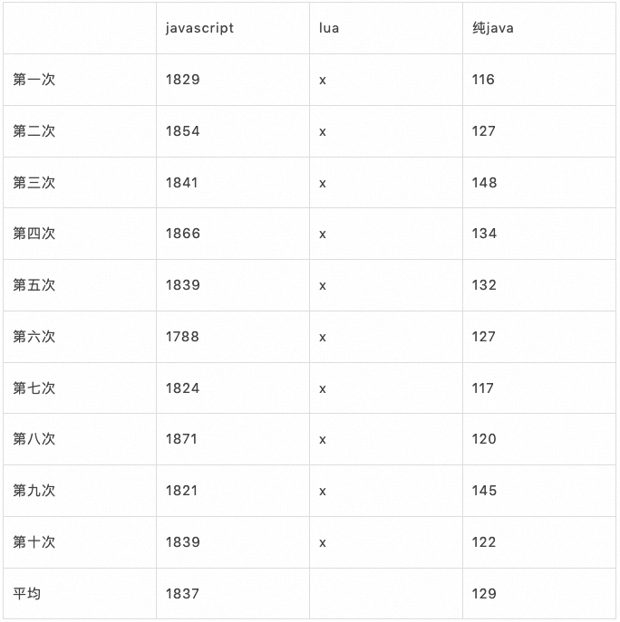
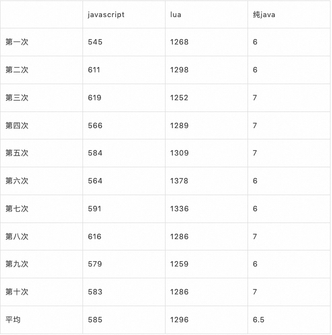
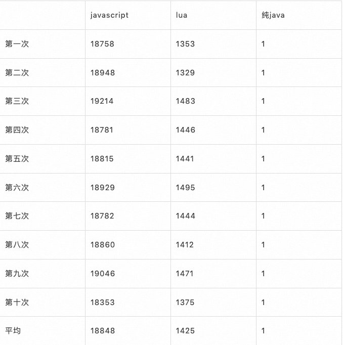
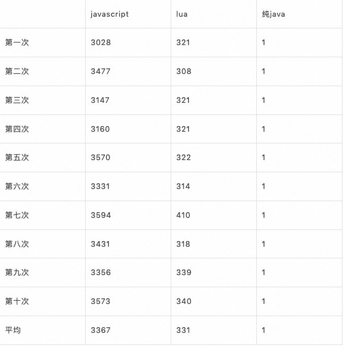

> 本文作者针对实际场景及需求特性，经过安全性，易用性等综合评估，再结合工作场景选择javascript、lua、原生java进行性能测评。

## 背景

因工作需要，需要对java引入动态脚本的支持，当前可实现的动态脚本可选择的空间非常多，但是由于工作特性，作者需要满足一些特征（后面详述），于是把希望在网上看能否找到一些信息。网上针对脚本对比评测的文章有很多，包括涉及类似javascript、groovy、python、ruby等各种脚本，但是大部分为单一测试，且符合当前工作需求的评测较少。组合测试的又不太具有针对性，故作者结合工作场景有针对性的对部分动态脚本进行一期简单的性能评测。

## 需求分析

既然是特定工作业务场景，这里需要满足执行的脚本符合如下特征：

1.  具有简单的逻辑判断能力：即动态脚本需要有，包括if语句，for循环等机制。这基本干掉了所有的表达式语言，包括优秀的google的aviator。当然如果仅仅只是简单的表达式解析，它是一个很好地选择
2.  具有极高的安全稳定特性：这里不仅是需要被生产环境验证过的脚本引擎，更多的我需要脚本的功能只停留在数据处理及基本数据的构建上，不需要其他任何功能的实现，包括构建对象，各种IO及底层服务的调用。这基本干掉了类似groovy等经典的脚本语言，因为存在安全问题的同时，如何确保对内存的消耗有效回收又是另外不可忽略的风险（有很多使用了groovy出现OOM的案例）。
3.  对性能的要求：虽然动态脚本本身都不是主推性能的，但是在生产环境，高并发是无法绕开的话题，能够在有限的条件下尽可能的满足高效性能也是重要考虑因素。

## 确定评测选手

针对实际场景及需求特性，经过从安全性，易用性等综合评估，最终选了3个具有代表性的选手进行对比评测：

### 选手1：最原生态

javascript

该动态脚本为java原生提供的能力，在「官方」「原生」等关键词的加持下，一直被认为有着非常优秀的性能条件，是不可忽略的对手

### 选手2：最轻量级

lua

业界普遍认为最轻量级的脚本语言。在「小」中做了最优的权衡，是所有实用性语言中规模最小的一种。因为它的小，被普遍用在移动端（含j2me）、游戏的动态脚本执行部分。同时又是因为它的快，又被普遍用在服务端领域（如nginx）中。

### 选手3：原生java

通过与原生java做对比比较，我们看看动态脚本与原生java到底有多大差距

## 评测备注

注意：每个脚本语言都有自身的优点和缺点，比如有的更贴近java语法，学习成本更低；有的附属设施更完善，应用场景更丰富；有的对资源消耗更少等。这些都不在本次的评测范围，本次仅仅只考虑对性能的一个对比，是在特定环境下的特定比较，不做整体好坏判断。

## 评测脚本内容

评测的脚本很简单，主要做这些事：

1.  进行千万级的的for循环操作
2.  进行不断的累加操作
3.  进行简单的逻辑判断
4.  进行字符串累加操作（部分场景）

最终看看各个脚本执行完成的时间，判断最终性能。

javascript脚本：

```text
function test(){
  var a=0;
  for(i=0; i<=10000000; i++){
    if(a<i){
      a++;
    };
  }; 
  return a
}
```

lua脚本：

```text
a = 0
for i=0,10000000,1 do
  if(i > a) then
    a=a + 1
  end
end
return a
```

纯java代码：

```text
int a = 0;
for(int i = 0;i<=10000000;i++){
  if(i > a){
    a++;
  }
}
```

## 测评环境


java：



## 测试情况

### 试验1

我们首先在1000w循环量级下跑下各个脚本情况，得到下表（单位ms）



可以看出javascript在速度上有较大的优势，基本是lua的两倍以上

### 试验2

实际操作中大部分时候还是会进去字符串操作，那这里再增加以下字符串累加操作试试：

> javascript:c=c+'c'  
> lua:c=c .. 'c'  
> 纯java:c+='c'

加上了字符串的处理以后，其他不变，进行测试，情况就大不一样了：



经过测试发现，即使纯java开销也不小。而此次lua直接超时（超过1min）

### 试验3

通过减少循环次数，最终在10w量级的for循环中跑出了结果



整体看仍然javascript具有较大的优势，是lua的近2倍

### 试验4

最后在实际生产中，我们往往还需要对脚本引擎进行初始化，这也需要消耗大量资源，我们将初始化次数放到一起进行测试看看效果怎么样：

for循环1w次，内部循环10次，不装配字符串。js代码如下（其他代码类似，故省略）

```text
public static void main(String[] args) throws Exception {
  long now = System.currentTimeMillis();
  for(int i = 0; i<10000;i++){
      jsScript();
  }
  System.out.println(System.currentTimeMillis() - now);
}

  private static void jsScript() throws Exception {
        ScriptEngineManager mgr = new ScriptEngineManager();
        ScriptEngine engine = mgr.getEngineByExtension("js");

        engine.eval("function test(){var a=0;for(i=0;i<=10;i++){ if(a<i){a++;};}; return a}");
        Invocable inv = (Invocable) engine;
        String value = String.valueOf(inv.invokeFunction("test"));

}
```

js核心是构造这两个对象：

> ScriptEngineManager mgr = new ScriptEngineManager();  
> ScriptEngine engine = mgr.getEngineByExtension("js");

lua是这个：

> Globals globals = JsePlatform.standardGlobals();

纯java因为是宿主代码，不需要初始化

最终得到结果如下：



结果大跌眼镜，加入初始化构造后，javascript反而比lua慢了不少，而且有近9倍的差距。

  

那是不是每次使用的时候都要初始化对象呢？，通过查看：

[https://stackoverflow.com/questions/30140103/should-i-use-a-separate-scriptengine-and-compiledscript-instances-per-each-threa](https://link.zhihu.com/?target=https%3A//stackoverflow.com/questions/30140103/should-i-use-a-separate-scriptengine-and-compiledscript-instances-per-each-threa)

以及对应官网：

[https://docs.oracle.com/javase/8/docs/technotes/guides/scripting/prog\_guide/api.html#BABHIFEF](https://link.zhihu.com/?target=https%3A//docs.oracle.com/javase/8/docs/technotes/guides/scripting/prog_guide/api.html%23BABHIFEF)

发现js引擎不需要每次重复注册，只需要更新bindings即可。

> ScriptContext newContext = new SimpleScriptContext(); newContext.setBindings(engine.createBindings(), ScriptContext.ENGINE\_SCOPE); Bindings engineScope = newContext.getBindings(ScriptContext.ENGINE\_SCOPE); engine.setContext(newContext);

同理，lua也可以将这个单独拎出来

> Globals globals = JsePlatform.standardGlobals();

### 试验5



这里javascript执行效率低于其他两个的原因主要是有个编译字节码的过程。

## 写在最后

### **结论**

简单说说最终结论

1.  不要偷懒。所有脚本引擎不要从头构建引擎对象，虽然这样简单粗暴。但是效率上也是有近5~6倍的差距
2.  如果你的脚本相对比较复杂，里面有大量的for循环以及字符串处理。推荐使用javascript。它在处理复杂脚本优势很明显，当然这全靠他内部会编译成java字节码给到jvm执行的功劳（注意java6里的js不是同一个引擎，不会编译字节码，慢很多）。
3.  如果你的脚本相对比较简单，没有大量的for循环等语句，那么lua是比较好的选择，占用资源更少，通用性更高。
4.  无论是何种脚本语言，它的性能都是纯java的百分之一以上，除非必要，使用脚本语言一定要慎重。

### **参考文档**

[https://blog.csdn.net/fuhanghang/article/details/124723417https://blog.51cto.com/fengbohaishang/1080126https://www.iteye.com/topic/361794https://docs.oracle.com/javase/8/docs/technotes/guides/scripting/prog\_guide/api.html#BABHIFEFhttps://www.chrismoos.com/2010/03/24/groovy-scripts-and-jvm-security/https://stackoverflow.com/questions/30140103/should-i-use-a-separate-scriptengine-and-compiledscript-instances-per-each-threa](https://link.zhihu.com/?target=https%3A//blog.csdn.net/fuhanghang/article/details/124723417https%3A//blog.51cto.com/fengbohaishang/1080126https%3A//www.iteye.com/topic/361794https%3A//docs.oracle.com/javase/8/docs/technotes/guides/scripting/prog_guide/api.html%23BABHIFEFhttps%3A//www.chrismoos.com/2010/03/24/groovy-scripts-and-jvm-security/https%3A//stackoverflow.com/questions/30140103/should-i-use-a-separate-scriptengine-and-compiledscript-instances-per-each-threa)