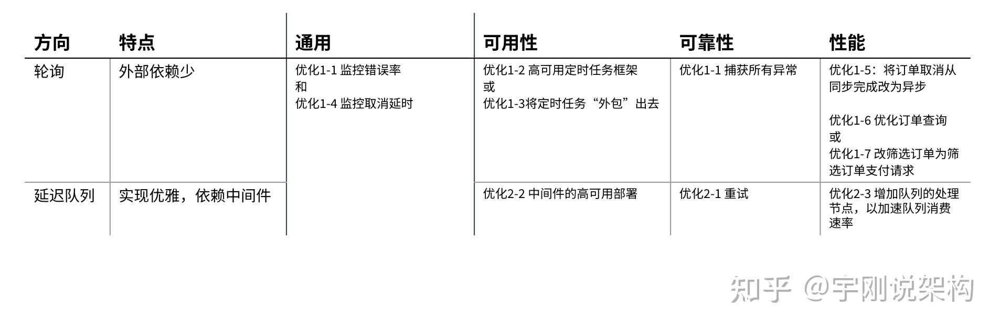
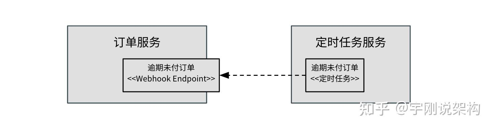
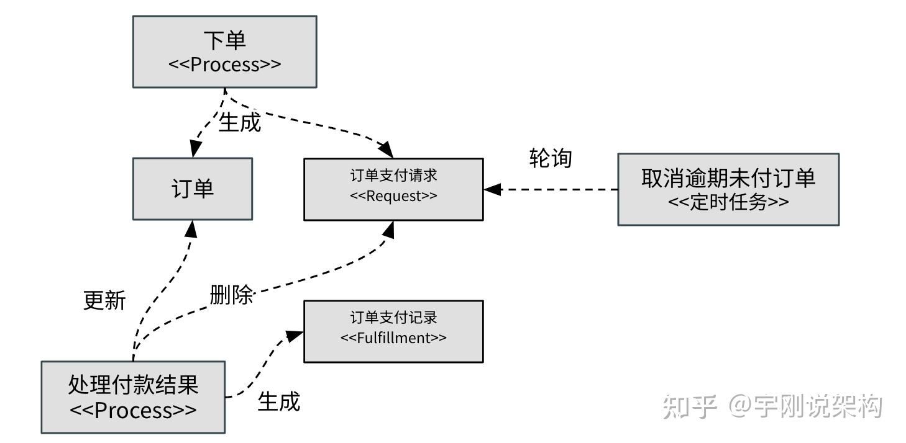
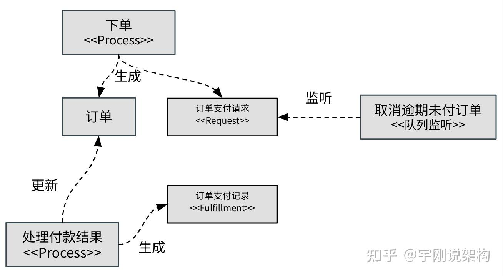

自动取消逾期未付订单可以分解为 1) 监听逾期未付订单 2) 取消订单

**重点是监听逾期未付订单，**一般来说有两个方向：1）轮询 2）带有延迟触发的队列  
最简单的方法是轮询：用定时器按一定间隔筛选逾期未付订单，再逐一取消。可以根据质量要求可以做不同方向的优化，**丰俭由人。**



  
1\. **轮询**

**1.1 可靠性视角：**希望增强容错，避免因为某一笔订单取消失败而导致轮询退出/终止。有些定时任务框架，在轮询中遇到异常就会终止，导致：

a）定时任务失效，不再触发轮询，那么“自动取消逾期未付订单”这个功能就失效了

b）定时任务重试，但由于某一笔订单总是无法取消，导致循环卡住，不再继续处理后面的订单

因此，一般会捕获所有异常（对任一订单取消异常也要单独捕获并继续循环）并记录日志并让循环继续执行，同时**监听错误日志以便人工介入解决问题（优化1-1）**

  

**1.2 可用性视角：**希望确保定时器不会因为单节点失效而整体功能失效，但又不希望每个节点都运行定时任务增加不必要的负载。此时可以考虑：

**优化1-2：使用支持锁的定时任务框架**

这样多个节点中只有一个节点会拿到锁并执行轮询，而当其宕机后，锁会被其他节点拿到，从而继续工作。

**优化1-3**：**将定时任务“外包**”**出去**

由于延时触发是一个常见需求，所以有一些企业会建立一个独立的定时任务服务，通过设置webhook可回调触发逾期未付订单取消。此时，定时任务韧性就交给独立定时任务服务去操心了。



  

**1.3 性能视角：**希望降低轮询间隔，以便缩小逾期未取消的时间窗口

例如从每15分钟轮询一次降低到每分钟轮询一次，但这可能会造成两个新问题：

a）如果逾期未付订单数量大，可能无法在一分钟内跑完，从而导致下一次轮询延期

b）如果订单数量大，更小的轮询间隔意味着更大的查询负载

对于a）可以考虑：

**优化1-4：通过日志监听轮询计划间隔与实际耗时，以便人工介入优化**

**优化1-5：将订单取消从轮询内同步完成改为异步完成（使用异步线程或队列）**

```text
for (Order order: overdueOrders) {
    try {
        doCancel(order); // 交由异步处理或压入队列，以节约时间
    } catch(Exception e) {
       //log and continue
    }
}
```

对于b）可以考虑：

**优化1-6：通过索引优化订单查询性能**

**优化1-7：在订单生成时，再同步插入一条订单支付请求，改筛选订单为筛选订单支付请求**

在订单支付或取消同时，都要同步删除对应记录，因此订单支付请求的数量有限

该优化通过Request-Fulfillment抽象，反过来影响了需求分析的思路，从而提升这类延时触发需求的分析与实现质量基线，并且在Request-Fulfillment抽象中，也适用于队伍解决方案。



  

**2\. 带有延迟触发的队列**

此处，默认采纳支持延迟消息的中间件来实现队列，如Redis、RabbitMQ或等价云服务。使用这个方案，天然适用于Request-Fulfillment抽象，可以认为放入队列的内容就是：订单支付请求。



**2.1 可靠性视角：**希望增强容错，避免因为消息丢失导致的订单未取消

优化2-1：添加重试，并参见监听错误日志以便人工介入解决问题（见优化1-1）

**2.1 可用性视角：**希望队列总是可用

优化2-2：使用支持高可用部署方案的中间件

**2.2 性能视角：**当订单特别多时，希望缩小逾期未取消的时间窗口

记录并监控订单逾期和实际被取消的时间差值（与优化1-4同理）

以及 优化2-3：增加队列的处理节点，以加速队列消费速率

**总结**

轮询与带有延迟触发的队列，两者各有优势：最小依赖 vs 更少代码

但无论哪一种，监控处理延迟（实际取消时间与逾期时间差值）与处理错误都是推荐的实践，再根据可用性、可靠性、性能等视角判断是否需要优化