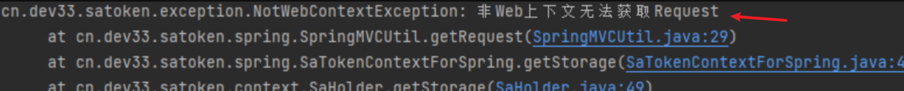
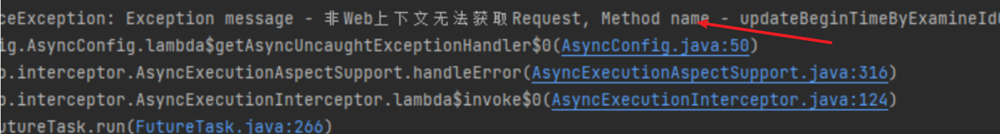
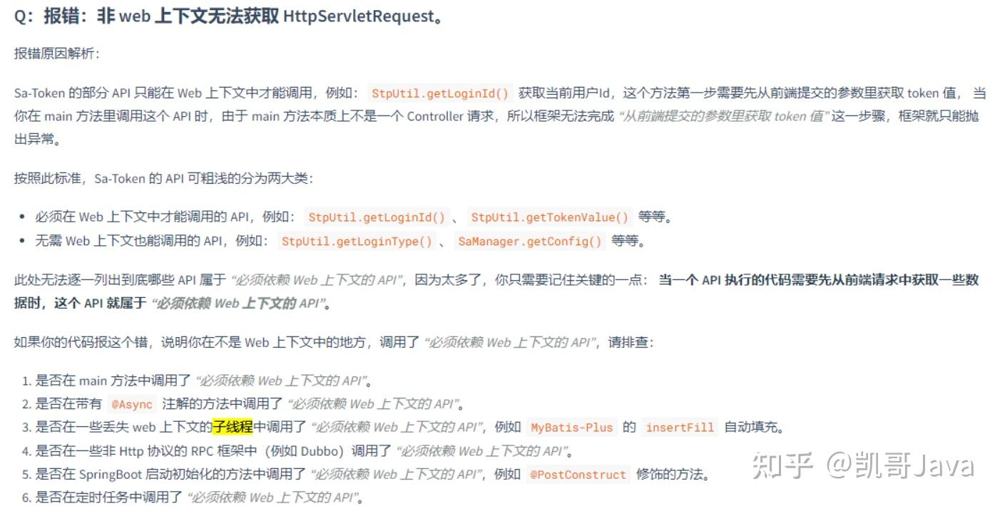
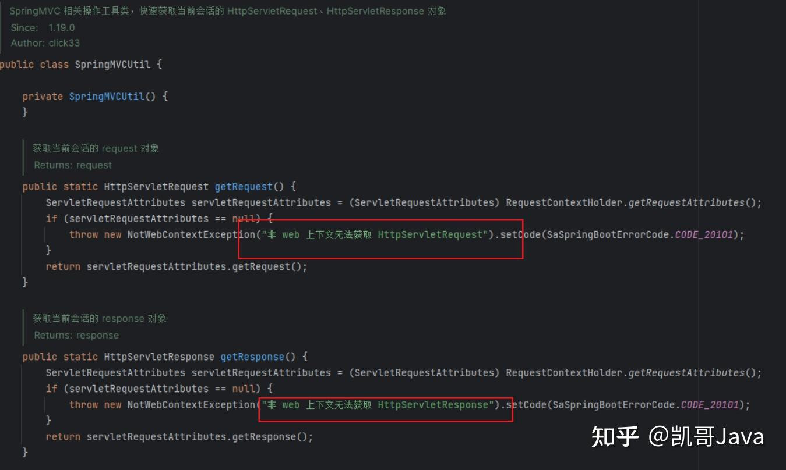
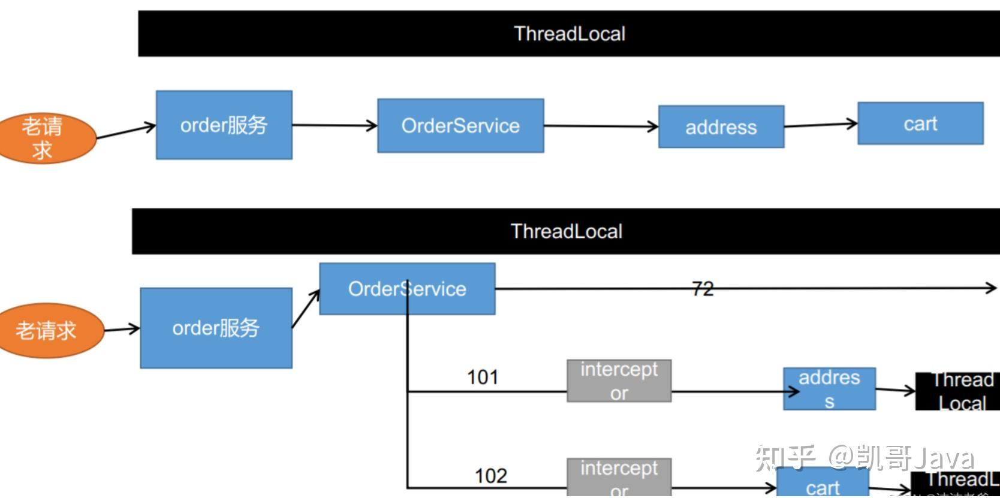

在我们使用sa-token安全框架的时候，有时候会提示：**SaTokenException:非Web上下文无法获取Request**

错误截图：



在官方网站中，查看常见问题排查：



**错误追踪：**  

**跟着源码可以看到如下代码：**



从源码中，我们可以看到，由于非Web上下文中无法直接获取`HttpServletRequest`对象，因此无法直接在子线程中使用SA-Token认证框架中的Web相关功能。

知道了问题原因所在，接下来，我们就来解决：

**解决方案一：**  

  

1.  提取SA-Token信息：从请求中提取SA-Token信息，并将其传递给子线程。您可以在主线程中解析请求参数或读取请求头，获取SA-Token，并将其传递给子线程。
2.  使用线程局部变量：将SA-Token存储在线程局部变量中，以便子线程可以访问它。在主线程中，您可以将SA-Token存储在线程局部变量中，并在子线程中使用该变量来获取SA-Token。
3.  自定义认证逻辑：在子线程中编写自定义的认证逻辑，以处理SA-Token的验证和其他相关操作。您可以使用现有的安全框架或库提供的功能，如加密算法、签名验证等，来进行认证。

以下是一个简单的示例代码，演示了如何在子线程中使用自定义认证逻辑来处理SA-Token：

```text
import java.util.concurrent.ExecutorService;  
import java.util.concurrent.Executors;  
  
public class SaTokenAuthentication {  
    private static final ExecutorService executor = Executors.newSingleThreadExecutor();  
  
    public static void main(String[] args) {  
        // 模拟从请求中提取的SA-Token信息  
        String saToken = "your_sa_token";  
  
        // 提交给子线程执行的任务  
        executor.submit(() -> {  
            // 在子线程中进行自定义认证逻辑  
            boolean isAuthenticated = authenticate(saToken);  
  
            // 根据认证结果执行相应的操作  
            if (isAuthenticated) {  
                // 认证成功，执行其他操作...  
            } else {  
                // 认证失败，处理错误...  
            }  
        });  
    }  
  
    private static boolean authenticate(String saToken) {  
        // 在这里编写自定义的认证逻辑，以验证SA-Token的有效性和完整性等。  
        // 您可以使用现有的安全框架或库提供的功能来进行认证。  
        // 这里只是简单地模拟认证过程并返回结果。  
        return saToken.equals("valid_sa_token"; // 替换为您的验证逻辑  
    }  
}
```

解决方案二：

  

解决方法比较简单：

1、参数透传

修改接口，把需要在ThreadLocal中获取的参数透传到其它方法中。

解决方案:**先获取你想要的值,再把这个值当做一个参数传递到这些方法中,而不是直接从方法内调用Sa-Token的APl。**

2、重置上下文对象

在子线程中重置RequestContextHolder对象。

```text
// 从主线程获取用户数据 放到局部变量中
RequestAttributes attributes = RequestContextHolder.getRequestAttributes();
CompletableFuture<Void> testFuture = CompletableFuture.runAsync(() -> {
    // 把旧RequestAttributes放到新线程的RequestContextHolder中
    RequestContextHolder.setRequestAttributes(attributes);
    ...
    }
```

使用方式1 测试了下，发现问题圆满解决。

示意图：



总结：

因为异步的原因，他会丢掉ThreadLocal中原来线程的数据，从而获取不到loginUser，这种情况下我们可以在方法内的局部变量中先保存原来线程的信息，在异步编排的新线程中拿着局部变量的值重新设置到新线程中即可。