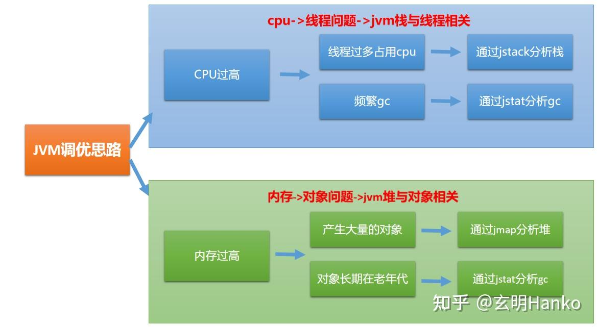

### 场景一、CPU过高

CPU占用过高排查思路：（查进程->查线程列表->查线程堆栈）

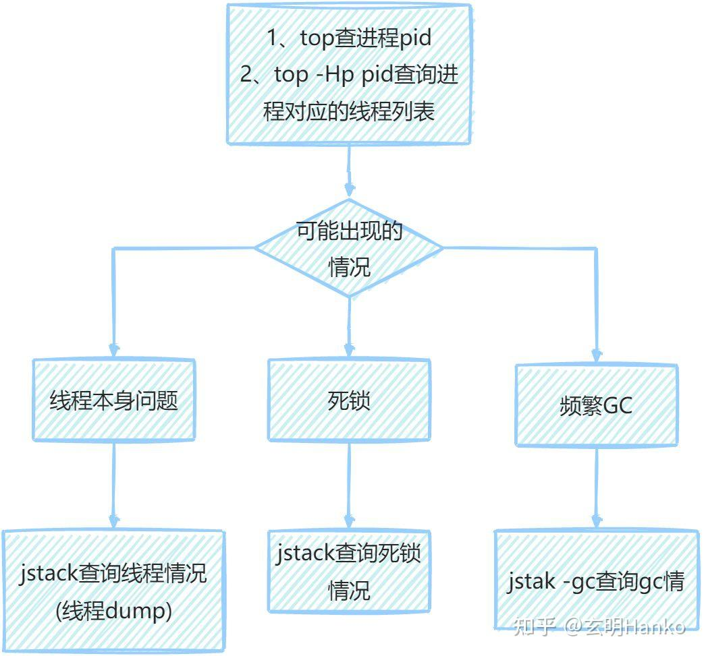

**step1：通过top命令查询占用CPU情况**

```text
top
```

p.s.shift+p(大写的P-cpu排序) shift+m(大写的M-内存排序)

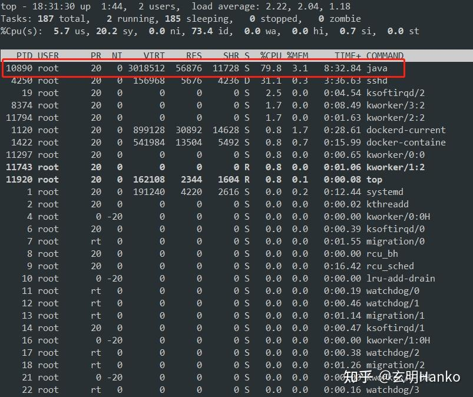

**step2：通过进程pid，查询对应的线程列表**

```text
top -Hp pid
```

-   \-H：显示线程信息
-   \-p pid1,pid2,...：只显示指定进程的信息

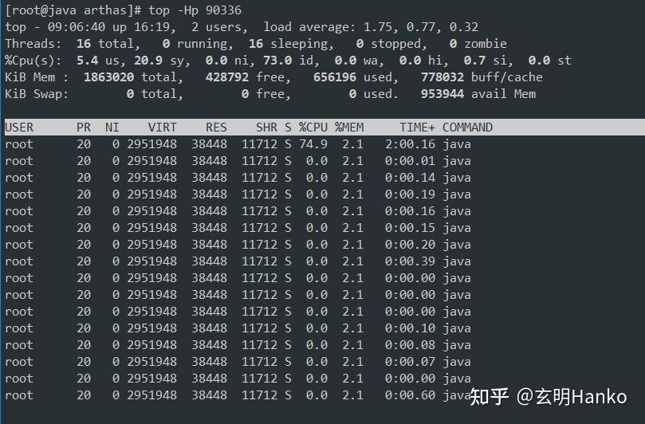

**step3：线程id转为十六进制**

从step2中可以看到占用cpu较高的线程id，打印出十六进制

```text
printf  '%x\n' id
```

  

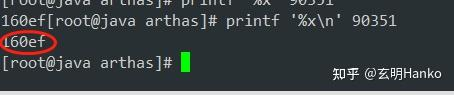

**step4：通过jstack查出线程栈信息**

cpu过高主要是线程方面的问题，我们知道jvm中每个线程都分配了单独的栈，我们可以通过jstack查看线程栈情况。

```text
jstack pid
```

p.s.这里的pid为进程id,也就是第一步top中的pid

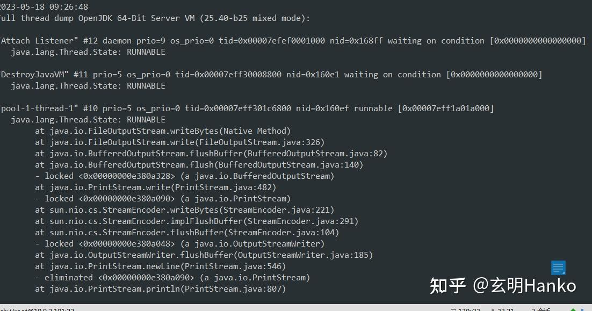

对照着step3中占用cpu最高的线程十六进制值可以定位到线程的栈信息。

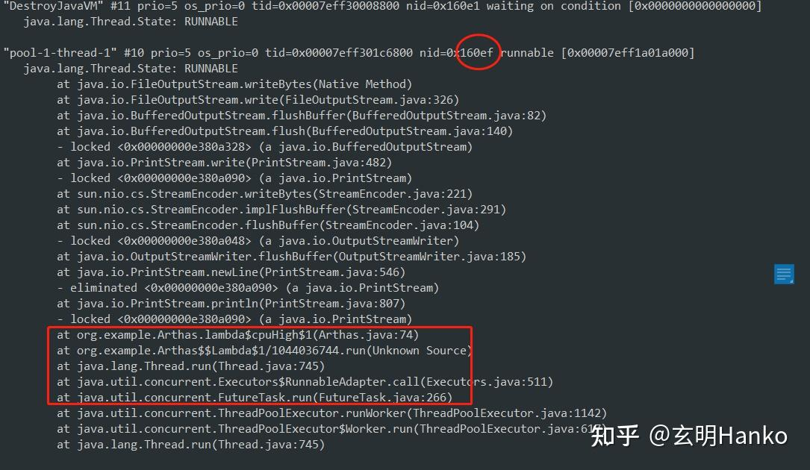

上图可以看到具体定位到了java的代码，就可以具体分析一下这个java代码为什么会创建大量的线程占用大量的cpu。

除了java程序线程问题，cpu过高也可能是线程死锁造成的，我们通过jstack也可以查看线程死锁的情况。

**step5：通过jstack查看情况死锁情况**

```text
jstack -l pid
```

\-l：除了线程列表外，还显示关于锁的附加信息

通过栈中的信息可以定位到代码中死锁的代码。

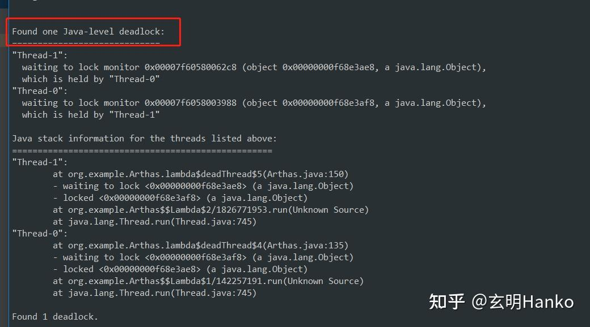

**step6：通过jstat查看gc情况**

除了以上的各种情况，还有一种就是java频繁的gc也会造成cpu占用过高

```text
jstat -gcutil pid 1000
```

1000ms为刷新数据的间隔时间

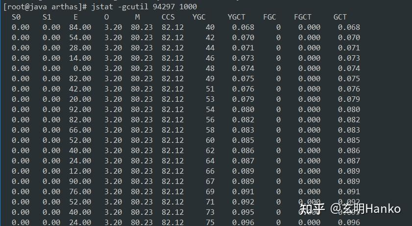

如果有频繁的gc就可以分析堆数据中哪些对象创建的比较多，就可以具体分析了。

### 场景二、内存占用过高

排查思路： （查进程->jvm内存占用）

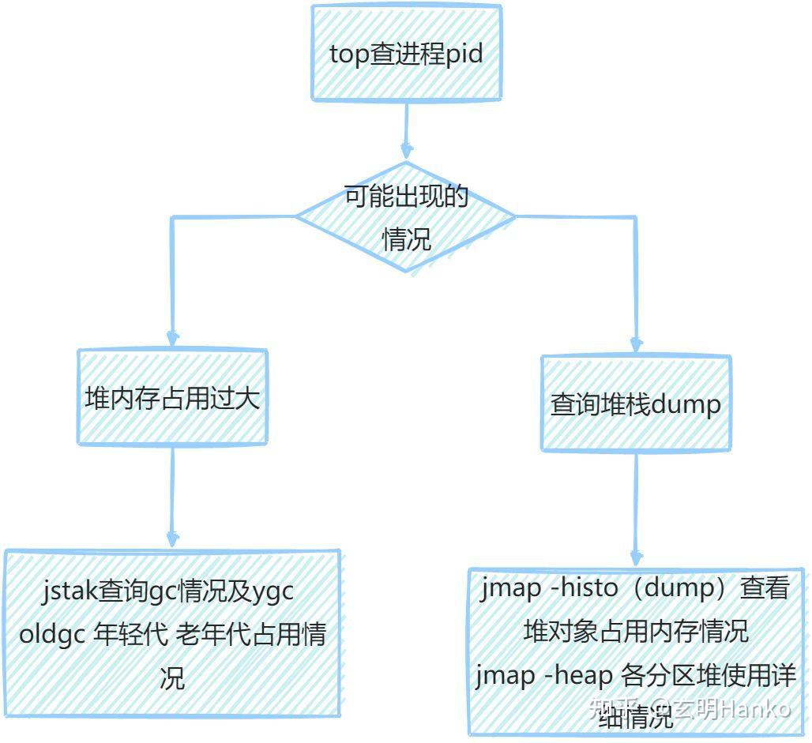

**step1：通过top命令查询占用CPU情况**

```text
top
```

p.s.shift+p(大写的P-cpu排序) shift+m(大写的M-内存排序)


**step2：通过进程pid查看gc情况**

```text
jstat -gcutil pid 1000
```

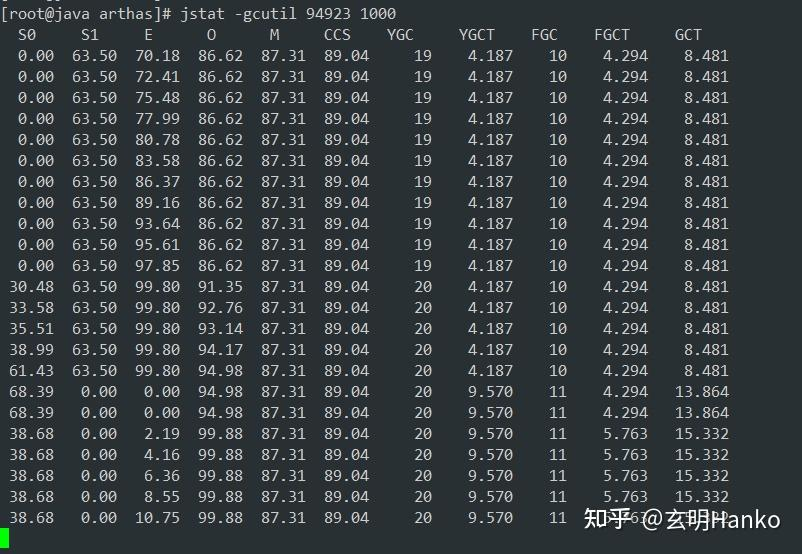

以下是该命令的输出结果说明：

-   S0：表示survivor space 0区域的使用情况，即第1个幸存区的使用情况。
-   S1：表示survivor space 1区域的使用情况，即第2个幸存区的使用情况。
-   E：表示eden space区域的使用情况，即新生代中Eden区的使用情况。
-   O：表示old space区域的使用情况，即老年代中的使用情况。
-   M：表示metaspace区域的使用情况，即元空间中的使用情况。
-   CCS：表示压缩类空间的使用情况。如果JVM启用了类数据共享（CDS）技术并且开启了压缩类指针（Compressed Class Pointer）选项，那么就会存在一个称为“压缩类空间”的特殊区域，用于存放共享的类元数据信息。
-   YGC：表示年轻代垃圾回收的次数。年轻代是JVM中内存分配的主要区域，垃圾回收在此区域较为频繁。
-   YGCT：表示年轻代垃圾回收所花费的时间总和。通常情况下，年轻代垃圾回收所需时间不应过长，否则可能会导致系统响应变慢或出现卡顿现象。
-   FGC：表示Full GC（全局垃圾回收）的次数。Full GC是对整个Java堆进行清理的垃圾回收过程，较为耗时。
-   FGCT：表示Full GC所花费的时间总和。Full GC的执行时间通常比年轻代垃圾回收要长得多，因为它需要处理整个Java堆。
-   GCT：表示所有垃圾回收所花费的时间总和，即YGCT和FGCT的总和。

以上各个区域的使用情况都会以百分比的形式进行显示，即0.0%~100.0%之间。

例如，如果输出结果为“40.00 20.00 60.00 70.00 100.00”，则表示：

-   survivor space 0的使用率为40.00%
-   survivor space 1的使用率为20.00%
-   eden space的使用率为60.00%
-   old space的使用率为70.00%
-   metaspace的使用率为100.00%

**step3：通过jmap查看堆情况**

通过step2已经发现jvm中的数据过多，频繁的ygc并且大量的数据都在老年代没有回收，这样就会表现出内存占用过高。下一步就是分析那些对象占用了内存。

```text
jmap -histo pid
```

jmap -histo命令可以用于输出Java堆内存中各个对象类型及其数量的统计信息。具体说明如下：

-   num 参数代表要分析的Java进程中的对象编号
-   instances：表示Java堆内存中对象的数量
-   bytes：表示Java堆内存中对象占用的总字节数。
-   class name：表示Java堆内存中对象所属类名。

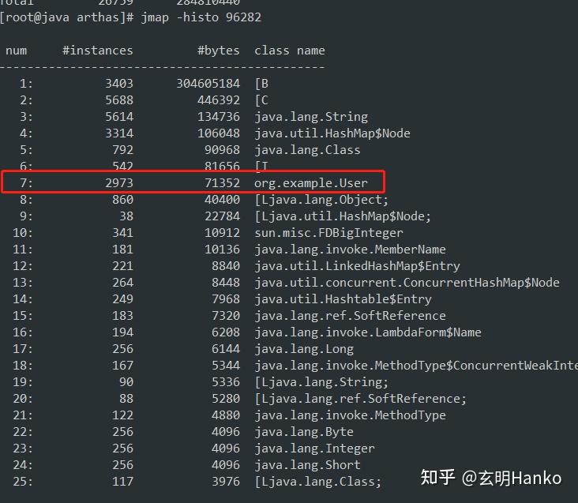

可以看到org.example.User创建的比较多。这相就可以具体分析一下代码中哪些地方创建了User为什么没被回收。

与jmap -histo类似的命令：

```text
#jmap -dump
jmap -dump:format=b,file=heapdump.hprof pid
```

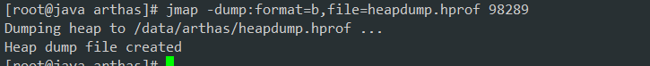

jmap -dump命令可以用于生成Java进程的内存快照文件（.hprof格式），以便进行后续的分析和调试。具体说明如下：

-   filepath：表示生成的内存快照文件路径。该文件可以通过Java虚拟机诊断工具（例如VisualVM、Eclipse Memory Analyzer等）进行分析和调试。
-   pid：表示要生成内存快照的Java进程的进程ID。

导出的快照文件可以通过jvisualvm或mat来查看：

-   jvisualvm

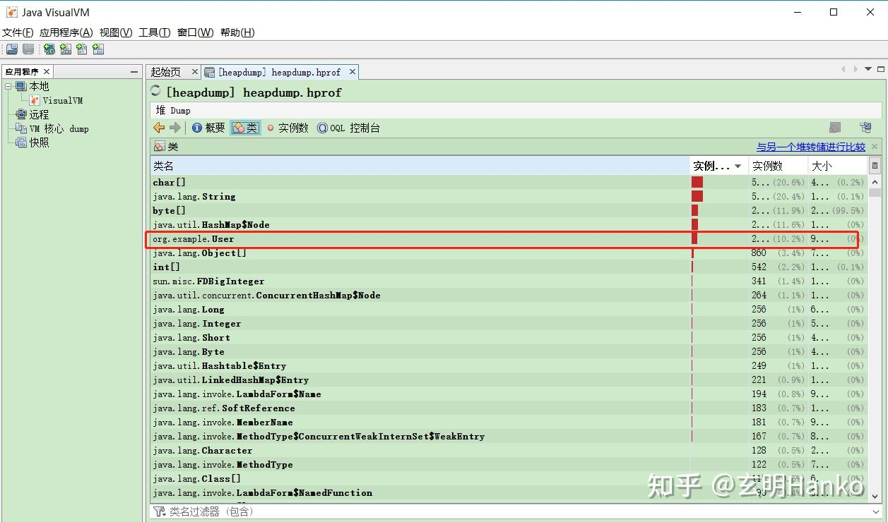

-   mat

mat还比较智能，直接把存在问题的给你列出来

  

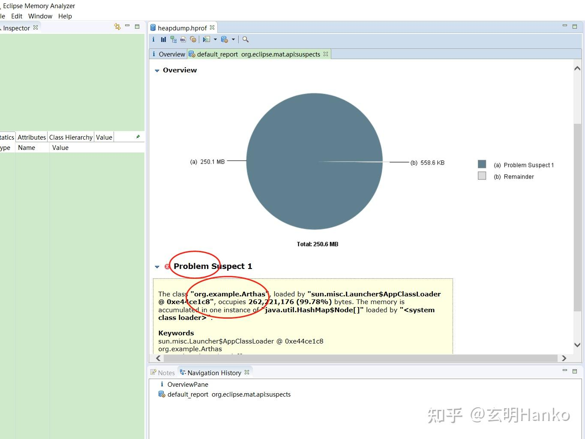

**step4：jmap -heap jvm内存实际占用情况**

除了以上内存占用情况，在java项目中还存在一种情况。比如我java项目没有配置jvm参数都使用默认的配置，我服务器64G内存。会发现用一段时间后java进程占用了8G内存。这时你可以使用命令看看java实际使用的内存情况，然后再调整jvm参数。

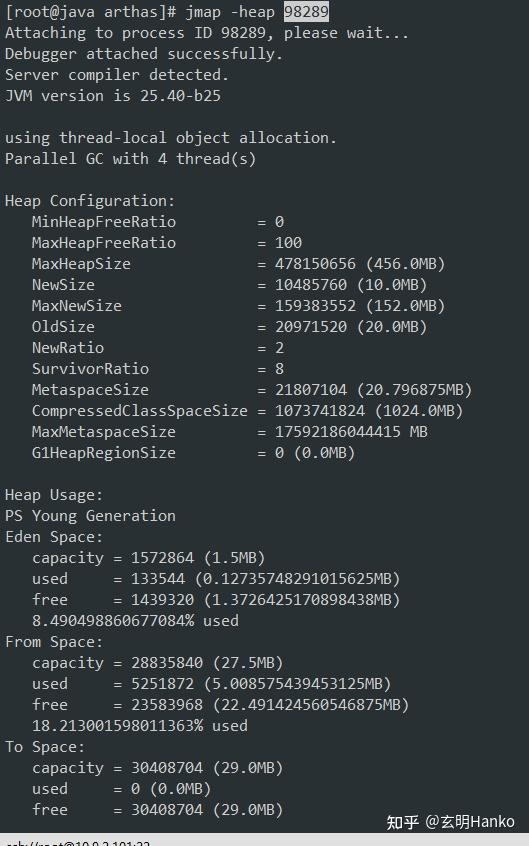

jmap -heap是一个用于获取Java堆内存信息的命令行工具，它可以输出Java虚拟机中堆内存的使用情况和配置信息。

[玄明Hanko：深度剖析JVM调优法则：从两大特性CPU、内存出发轻松掌握调优实战技巧](https://zhuanlan.zhihu.com/p/631212985)[玄明Hanko：JVM调优神器，运用 Arthas 释放 Java应用性能的全部潜力](https://zhuanlan.zhihu.com/p/630532851)