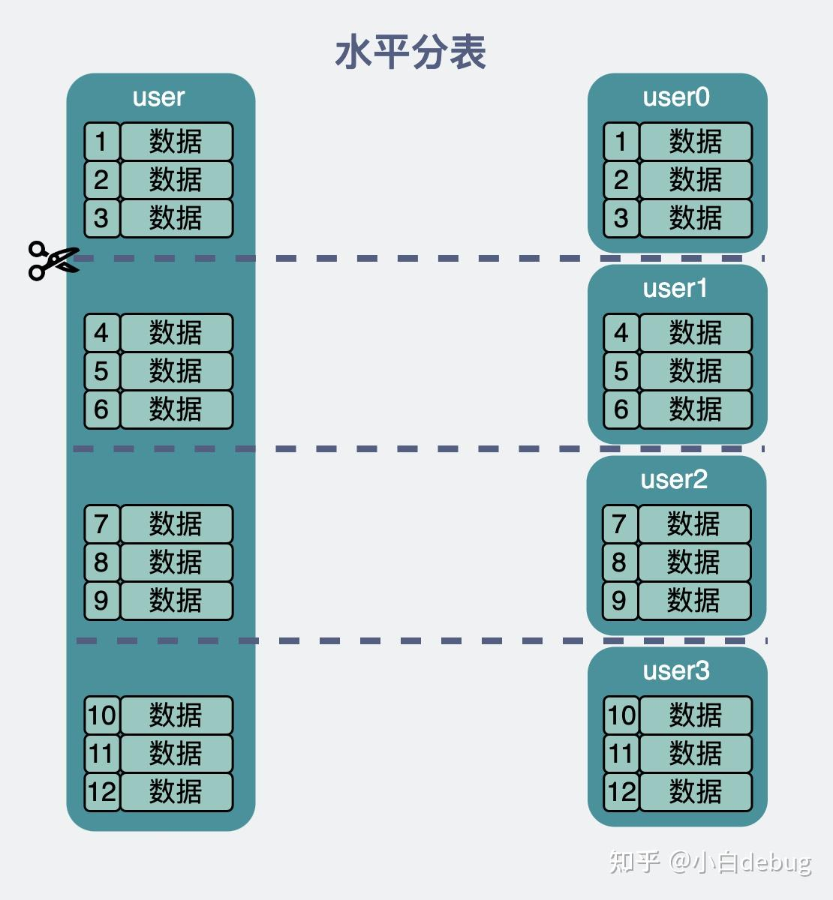
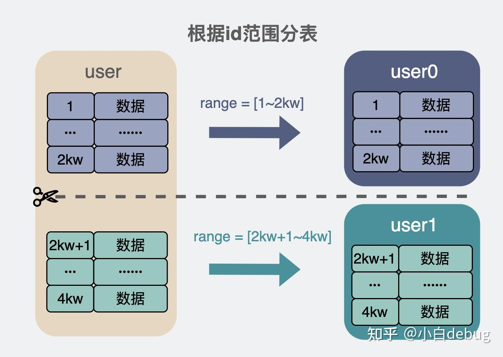
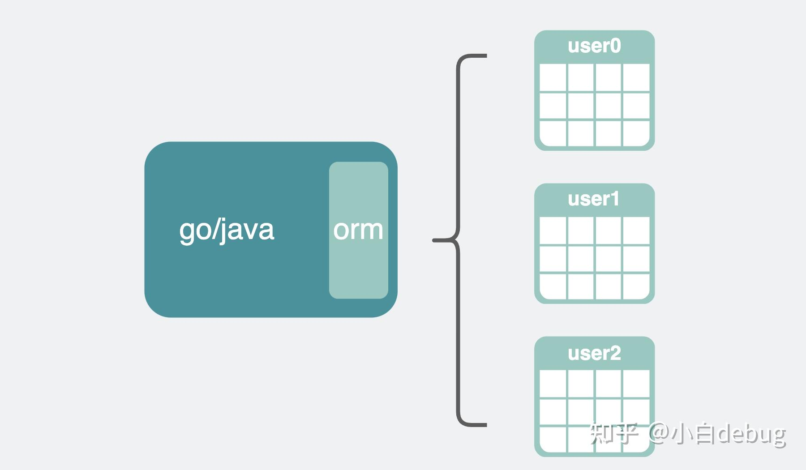
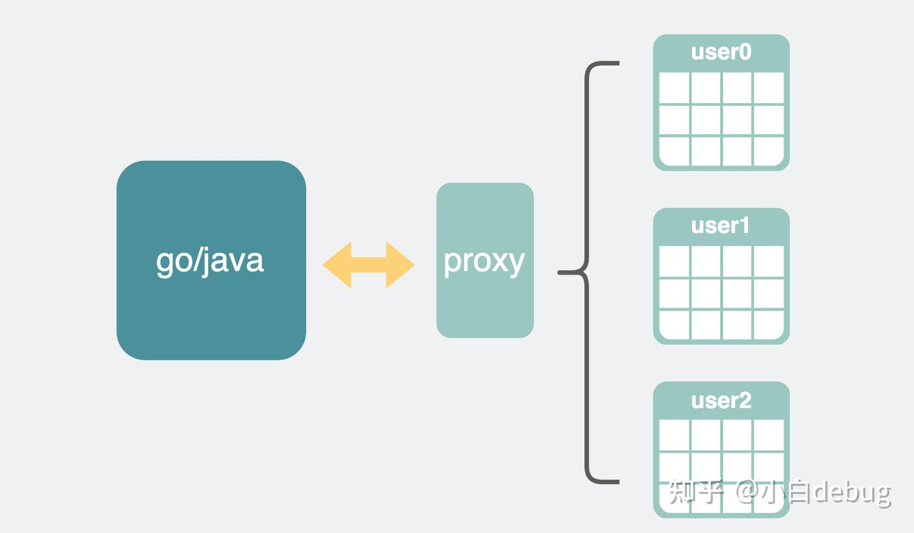
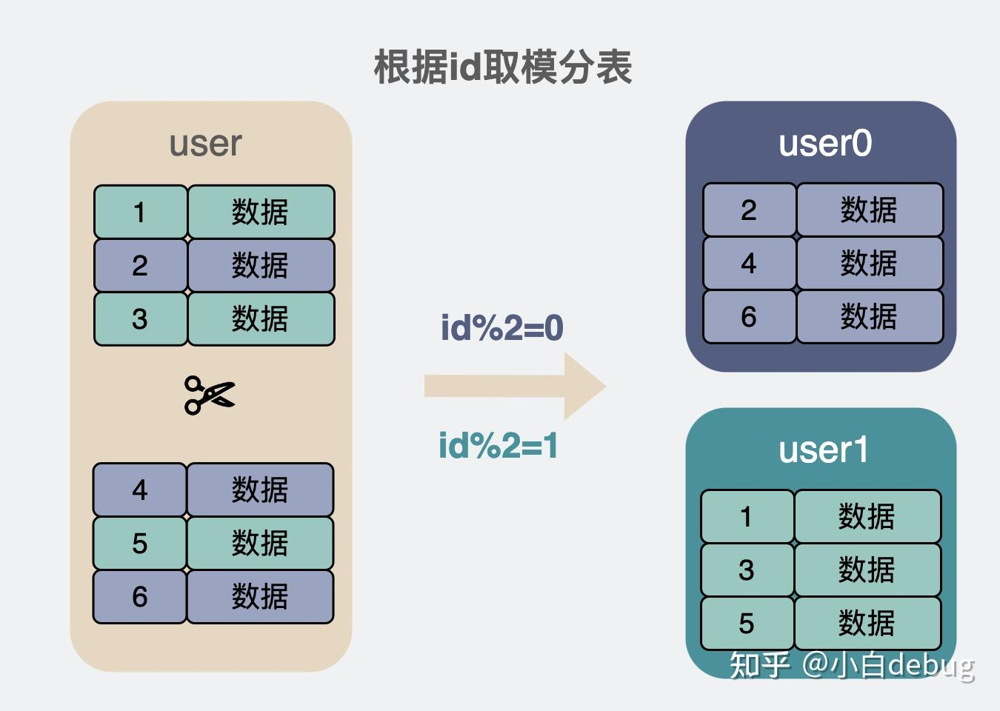
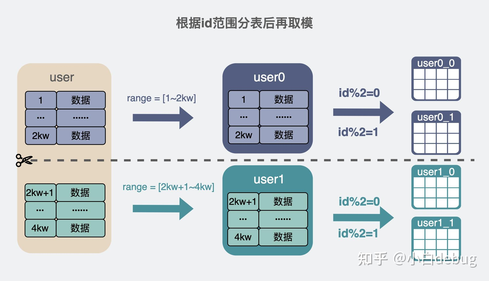

### **分库分表**

我们平时做项目开发。一开始，通常都先用一张数据表，而一般来说数据表写到2kw条数据之后，底层B+树的层级结构就可能会变高，不同层级的数据页一般都放在磁盘里不同的地方，换言之，磁盘IO就会增多，带来的便是查询性能变差。**如果对上面这句话有疑惑的话，可以去看下我之前写的文章。**

于是，当我们单表需要管理的数据变得越来越多，就不得不考虑数据库**分表**。而这里的分表，分为**水平分表和垂直分表**。

**垂直分表**的原理比较简单，一般就是把某几列拆成一个新表，这样单行数据就会变小，B+树里的单个数据页（固定16kb）内能放入的行数就会变多，从而使单表能放入更多的数据。

垂直分表没有太多可以说的点。下面，我们重点说说最常见的**水平分表**。

水平分表有好几种做法，但不管是哪种，本质上都是将原来的 `user` 表，变成 `user_0, user1, user2 .... uerN`这样的N多张小表。

从读写一张user**大表**，变成读写 user\_1 ... userN 这样的N张**小表**。

  

  

  

每一张小表里，只保存一部分数据，但具体保存多少，这个自己定，一般就订个**500w~2kw**。

**那分表具体怎么做？**

### **根据id范围分表**

我认为最好用的，是根据id范围进行分表。

我们假设每张分表能放`2kw`行数据。那user0就放主键id为`1~2kw`的数据。user1就放id为`2kw+1 ~ 4kw`，user2就放id为`4kw+1 ~ 6kw`， userN就放 `2N kw+1 ~ 2(N+1)kw`。

  

  

假设现在有条数据，id=3kw，将这个`3kw除2kw = 1.5`，向下取整得到`1`，那就可以得到这条数据属于`user1表`。于是去读写user1表就行了。这就完成了数据的路由逻辑，我们把这部分逻辑封装起来，放在数据库和业务代码之间。

这样。**对于业务代码来说**，它只知道自己在读写一张 user 表，根本不知道底下还分了那么多张小表。

**对于数据库来说**，它并不知道自己被分表了，它只知道有那么几张表，正好名字长得比较像而已。

这还只是在**一个数据库**里做分表，如果范围再搞大点，还能在**多个数据库**里做分表，这就是所谓的**分库分表**。

  

不管是单库分表还是分库分表，都可以通过这样一个中间层逻辑做路由。

还真的就应了那句话，没有什么是加中间层不能解决的。

如果有，就多加一层。

至于这个中间层的实现方式就更灵活了，它既可以像**第三方orm库**那样加在业务代码中。

  

  

也可以在mysql和业务代码之间加个**proxy服务**。

如果是通过第三方orm库的方式来做的话，那需要根据不同语言实现不同的代码库，所以不少厂都选择后者加个proxy的方式，这样就不需要关心上游服务用的是什么语言。

  

  

### **根据id取模分表**

这时候就有兄弟要提出问题了，"我看很多方案都**对id取模**，你这个方案是不是不完整？"。

取模的方案也是很常见的。

比如一个id=31进来，我们一共分了5张表，分别是user0到user4。对`31%5=1`，取模得`1`，于是就能知道应该读写`user1`表。

  

  

**优点**当然是比较简单。而且读写数据都可以很均匀的分摊到每个分表上。

但**缺点**也比较明显，如果想要扩展表的个数，比如从5张表变成8张表。那同样还是id=31的数据，`31%8 = 7`，就需要读写user7这张表。跟原来就对不上了。

这就需要考虑**数据迁移**的问题。很头秃。

为了避免后续扩展的问题，我见过一些业务一开始就将数据预估得很大，然后心一横，分成100张表，一张表如果存个2kw条，那也能存20亿数据了。

也不是说这样不行吧，就是这个业务直到最后放弃的时候，也就存了百万条数据，每次打开数据库表能看到茫茫多的user\_xx，就是不太舒服，专业点，叫增加了程序员的**心智负担**。

而上面一种方式，根据id范围去分表，就能很好的解决这些问题，数据少的时候，表也少，随着数据增多，表会慢慢变多。而且这样表还可以无限扩展。

那是不是说取模的做法就用不上了呢？

也不是。

  

### **将上面两种方式结合起来**

id取模的做法，最大的好处是，新写入的数据都是实实在在的分散到了**多张表**上。

而根据id范围去做分表，因为id是递增的，那新写入的数据一般都会落到**某一张表**上，如果你的业务场景写数据特别频繁，那这张表就会出现**写热点**的问题。

这时候就可以将id取模和id范围分表的方式结合起来。

我们可以在某个id范围里，引入取模的功能。比如 以前 `2kw~4kw`是user1表，现在可以在这个范围**再分成5个表**，也就是引入user1-0, user1-2到user1-4，在这5个表里取模。

举个例子，id=3kw，根据范围，会分到user1表，然后再进行取模 3kw % 5 = 0，也就是读写user1-0表。

这样就可以将写单表分摊为写多表。

这在分库的场景下优势会更明显，不同的库，可以把服务部署到不同的机器上，这样各个机器的性能都能被用起来。

  

  

> 答案节选自个人公众号《小白debug》文章：  
> [分库分表会带来读扩散问题？怎么解决？](https://link.zhihu.com/?target=https%3A//mp.weixin.qq.com/s%3F__biz%3DMzkxNTU5MjE0MQ%3D%3D%26mid%3D2247493107%26idx%3D1%26sn%3D4a9355eb5078e017a4eb59963b9b30fe%26source%3D41%23wechat_redirect)