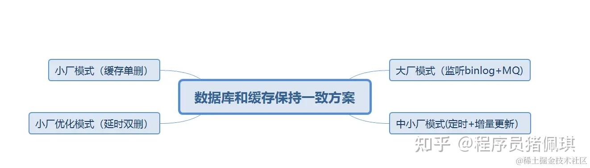
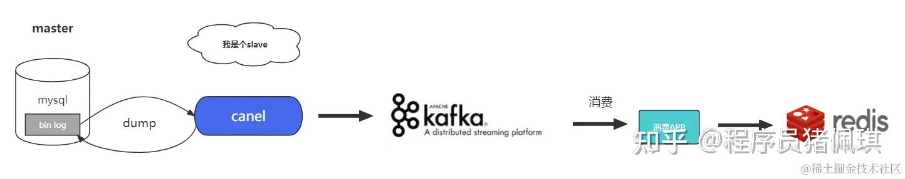
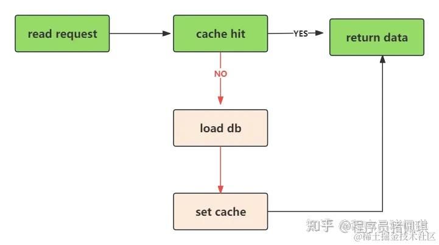
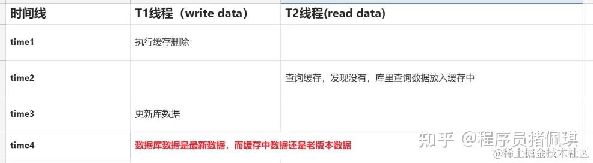
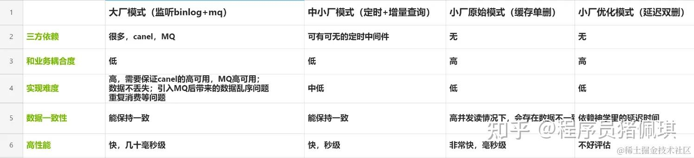

### **目前业界里有哪些方案，让数据库和缓存的数据保持一致了？  
**大概有以下四种



### 大厂模式（监听binlog+mq）

  
大厂模式主要是通过监听数据库的binlog(比如mysql binlog)；通过binlog把数据库数据的更新操作日志（比如insert,update,delete），采集到后，通过MQ的方式，把数据同步给下游对应的消费者；下游消费者拿到数据的操作日志并拿到对应的业务数据后，再放入缓存。  
大概流程图：  



  
**优点：**  
1、把操作缓存的代码逻辑，从正常的业务逻辑里解耦出来；业务代码更加清爽和简洁，两者互不干扰和影响，独立发展。用非人类的话说，减少对业务代码的侵入性。  
2、曾经有幸在大厂里实践过此种方案，速度还贼快，虽然从库到缓存经过了类canal和mq中间件，但基本上耗时都是在毫秒级，99.9%都是10毫秒内能完成库里的数据和缓存数据同步（大厂的优势出来了）  
**缺点：**  
1、技术方案和架构，非常复杂  
2、中间件的运维和维护，是个不小的工作量  
3、由于引入了MQ需要解决引入MQ后带来的问题。比如数据乱序问题：同一条数据**先发后至，后发先至**的到达消费者后，从而引起的MQ乱序消费问题。但一般都能解决（比如通过redis lua+数据的时间戳比较方案，解决并发问题和数据乱序问题）  
在大厂里，不缺类似canal这种伪装为数据库slave节点的自研中间件，并且大厂里也有足够的技术高手+物料，运维资源更是不缺；对小厂来说，慎用吧。

### 中小厂模式（定时+增量查询）

  
定时更新+增量查询：主要是利用库里行数据的更新时间字段+定时增量查询。  
具体为：每次更新库里的行数据，记录当前行的更新时间；然后把更新时间做为一个索引字段（加快查询速度嘛）  
定时任务：会每隔5秒钟（间隔时间可自定义）；把库里最近更新5秒钟的数据查询出来；然后放入缓存，并记录本次查询结束时间。  
整个查询过程和放入缓存的过程都是单线程执行；所以不会存在并发更新缓存问题。另外每次同步成功后，会记录同步成功时间；下次定时任务再执行时，会拿上次同步成功时间，做为本次查询开始时间条件；当前时间做为查询结束时间，以此达到增量查询的目标。  
再加上查询条件里更新时间是个索引，性能也差不到哪里去。  
即使偶尔的定时任务执行失败或者没有执行，也不会丢失数据，只要定时任务恢复了。  
**优点：**  
1、实现方案，和架构很简单。是的，比起大厂那套方案，简直不要太轻量。  
2、也能把缓存逻辑和业务逻辑进行解耦  
3、三方依赖也比较少。如果有条件可以上个分布式定时中间件比如 xxl-job，实在不行就用redis做个分布式锁也能用  
**缺点：**  
1、数据库里的数据和缓存中数据，会在极短时间内，存在不一致，但最终会是一致的。这个极短的时间，取决于定时调度间隔时间，一般在秒级。  
2、如果是分库分表的业务，编写这个查询逻辑，估计会稍显复杂。  
如果业务上不是要求毫秒级的及时性，也不是类似于价格这种非常敏感的数据，这种轻量级方案还真不错。无并发问题，也无数据乱序问题；秒级数据量超过几十万的增量数据并且还需要缓存的，怕是只有大厂才有的场景吧；怎么看此方案都非常适合中小公司。  

### 小厂原始模式（缓存单删）

  
小厂原始模式，即业界俗称的 缓存删除模式。在更新数据前先删除缓存；然后在更新库，每次查询的时候发现缓存无数据，再从库里加载数据放入缓存。  
图 缓存删除  


  
图 缓存加载  



  
此方案主要解决的是佩琪当时在面试回答方案中的弊端；为什么不更新数据时同步进行缓存的更新了？  
主要是有些缓存数据，需要进行复杂的计算才能获得；而这些经过复杂计算的数据，并不一定是热点数据；所以采取缓存删除，当需要的时候在进行计算放入缓存中，节省系统开销和缓存中数据量（毕竟缓存容量有限，单价又不像磁盘那样低廉，公司有矿的请忽略这条建议）  
另外一个原因：面对简单场景时，缓存删除成功，库更新失败；那么也没有关系，因为读缓存时，如果发现没有命中，会从库里再加载数据放入到缓存里。  
**优点：**  

-   此种实现方案简单
-   无需依赖三方中间件
-   缓存中的数据基本能和库里的数据保持一致

**缺点：**  

-   缓存逻辑和正常业务逻辑耦合在一起
-   在高并发的读流量下，还是会存在缓存和库里的数据不一致。见下图

图 缓存单删 数据不一致情况  



  
time1下： T1线程执行缓存删除  
time2下： T2线程查询缓存，发现没有，查库里数据，放入缓存中  
time3下： T1线程更新库  
time4下： 此时数据库数据是最新数据，而缓存中数据还是老版本数据  
此方案非常适合业务初期，或者工期较紧的项目；读流量并发不高的情况下，属于万能型方案。  

### 小厂优化模式（延迟双删）

  
延迟双删其实是为了解决缓存单删，在高并发读情况下，数据不一致的问题。具体过程为： 操作数据前，先删除缓存；接着操作DB；然后延迟一段时间，再删除缓存。  
此种方案好是好，可是延迟一段时间是延迟多久了？延迟时间不够长，还是存在单删时，缓存和数据不一致的问题；延迟时间足够长又担心影响业务响应速度。实在是一个充满了玄学的延时时间  
**优点** 1、技术架构上简单  
2、不依赖三方中间件  
3、操作速度上挺快的，直接操作DB和缓存  
**缺点** 1、落地难度有点大，主要是延迟时间太不好确认了  
2、缓存操作逻辑和业务逻辑进行了耦合  
此种方案放那个厂子，估计都不太合适，脑壳痛。  
方案这么多，我该选择那种方案了？  
为了方便大家选择，列了个每种方案的对比图。请根据自身情况进行选择  



  
佩琪你在那里BI了这么久，到底有没有现成的工具呀？  
推荐款适合中小公司的缓存加载方案吧。基于Redisson，主要是利用 MapLoader接口做实现；主要功能：发现缓存里没有，则从数据库加载；（其实自己封装个类似的应该也不难，想偷懒的可以试试）  

```java
MapLoader<String, String> mapLoader = new MapLoader<String, String>() {

    @Override
    public Iterable<String> loadAllKeys() {
        List<String> list = new ArrayList<String>();
        Statement statement = conn.createStatement();
        try {
            ResultSet result = statement.executeQuery("SELECT id FROM student");
            while (result.next()) {
                list.add(result.getString(1));
            }
        } finally {
            statement.close();
        }

        return list;
    }

    @Override
    public String load(String key) {
        PreparedStatement preparedStatement = conn.prepareStatement("SELECT name FROM student where id = ?");
        try {
            preparedStatement.setString(1, key);
            ResultSet result = preparedStatement.executeQuery();
            if (result.next()) {
                return result.getString(1);
            }
            return null;
        } finally {
            preparedStatement.close();
        }
    }
};
```

### 使用举例

```text
 MapOptions<K, V> options = MapOptions.<K, V>defaults()
                              .loader(mapLoader);

RMap<K, V> map = redisson.getMap("test", options);
// or
RMapCache<K, V> map = redisson.getMapCache("test", options);
// or with boost up to 45x times 
RLocalCachedMap<K, V> map = redisson.getLocalCachedMap("test", options);
// or with boost up to 45x times 
RLocalCachedMapCache<K, V> map = redisson.getLocalCachedMapCache("test", options);
```

### 总结

  
数据库和缓存数据保持一致的问题，本质上还是数据如何在多个系统间保持一致的问题。  
能不能给我一颗银弹，然后彻底的解决它了？  
对不起，没有。请结合自己实际环境，人力，物力，工期紧迫度，技术熟悉度，综合选择。  
是的，当我的领导在问我技术方案，在来挑战我缓存和数据库保持一致时，我会把表格扔到他脸上，请选择一个吧，我来做你选择后的实现。  
  
作者：程序员猪佩琪  
链接：[https://juejin.cn/post/7299354838928785448](https://link.zhihu.com/?target=https%3A//juejin.cn/post/7299354838928785448)  
来源：稀土掘金  
著作权归作者所有。商业转载请联系作者获得授权，非商业转载请注明出处。