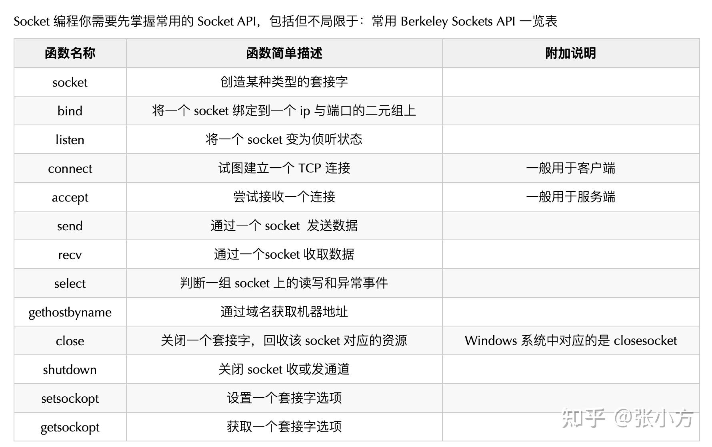
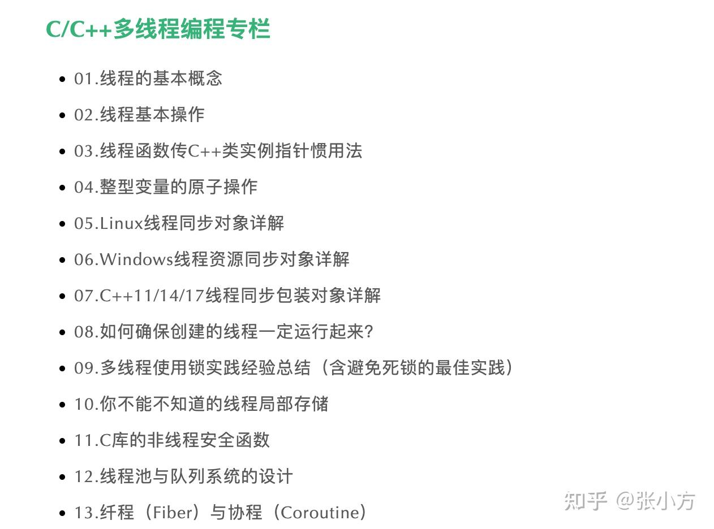
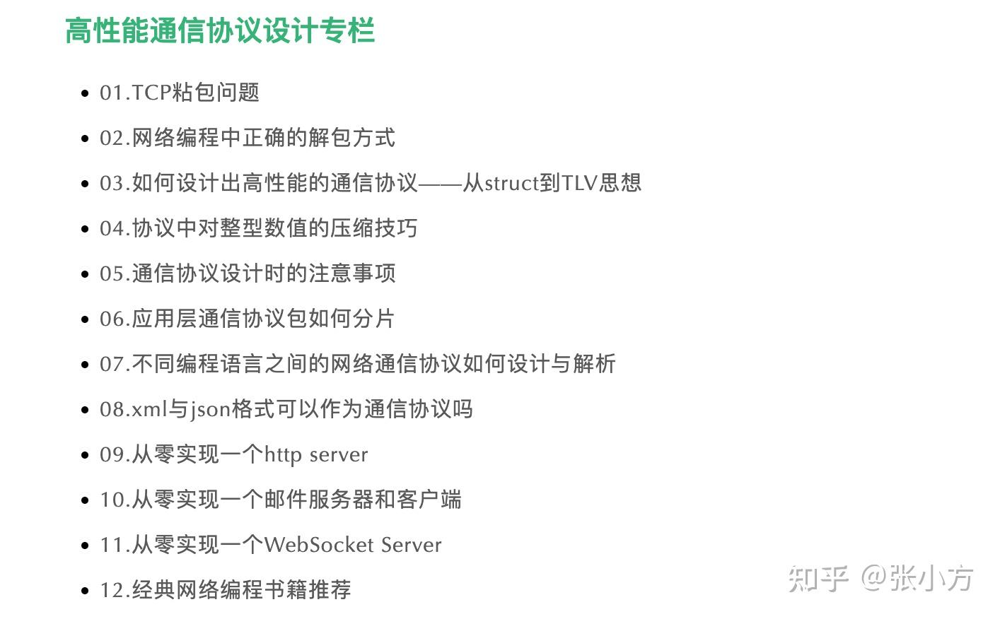
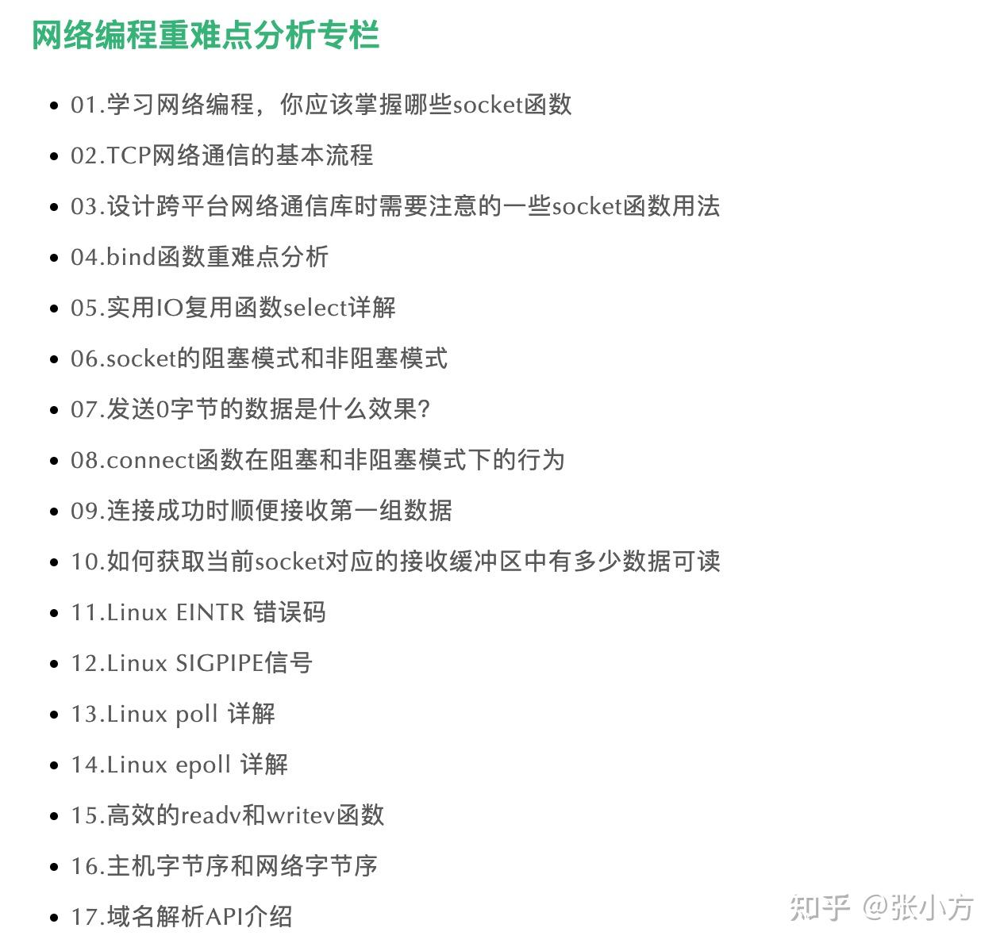
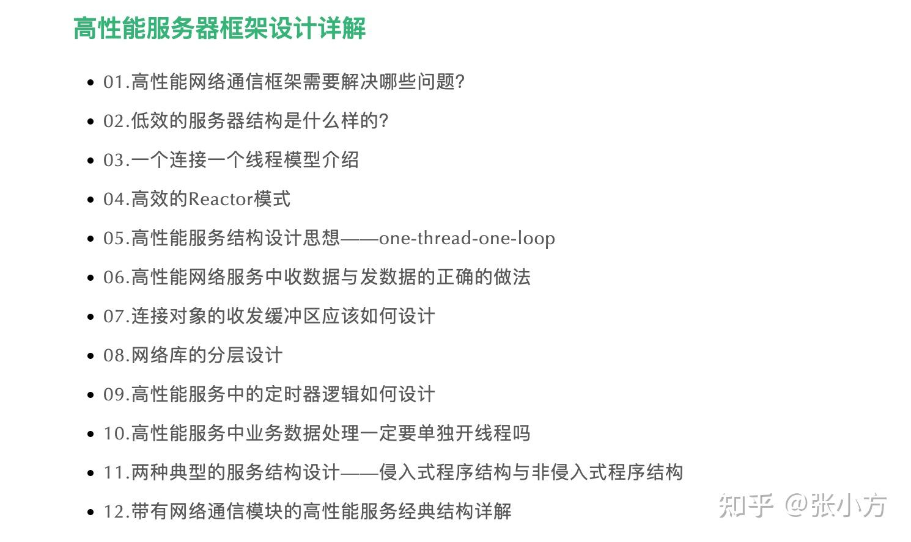

通俗地说就是套接字编程，就是使用操作系统提供的一种叫“套接字”的东西，让相同或者不同的机器上的不同进程可以通过网络交互数据。

我建议你这么学：

## **一、学习方法与内容**

### **1 计算机网络理论知识**

你需要掌握基础的如三次握手和四次挥手的过程以及各个状态值，我建议使用 tcpdump 命令实际抓下包就一目了然了，然后就是网络分层，各层的用途，重点熟悉下 TCP/IP 层相关的知识，还有就是 TCP/UDP 的区别，TCP 的滑动窗口机制、拥塞控制算法、TCP 的保序、重传、确认机制。

学习这些知识的时候，一定不要死记硬背，注重理解。我近来面试了一部分学历学校非常好的同学，然而，在问到这块的知识时却大失所望。例如，有的同学只是单纯把三次握手背下来了，我稍微变通一下他就不知道怎么回答了：

> 1\. 如果连接一个目标主机不存在的 IP 地址握手过程是怎样的？连接一个目标 IP 存在但是端口号不存在的主机又是怎样的握手过程呢？  
> 2\. A 机器上的进程与 B 机器上的进程进行网络通信，分别经历了哪些网络层。

  

**2 Socket 编程本身**

Socket 编程你需要先掌握常用的 Socket API，包括但不局限于：

**常用 Berkeley Sockets API 一览表**

学习这些 Socket API 的时候，不是让你单纯地记忆这些函数的参数，而是掌握每一个函数的重难点。

例如：

> 1\. 如何将一个 socket 设置成非阻塞模式  
> 2\. 阻塞模式下，send 和 recv 函数行为是什么样子的？非阻塞模式下 send/recv 的返回值分别是什么？  
> 3\. 客户端发起连接时，如何主动指定通过本地某个端口号去连接？bind 函数如果端口号设置为 0 是什么行为？  
> 4\. listen 函数的 backlog 参数用途是什么？  
> 5\. 如何实现异步的 connect 函数？  
> 6\. accept 函数调用时，三次握手是否已经完成？  
> 7\. 如何实现半关闭状态？  
> 8\. nagle 算法的用途是什么？  
> 9\. select 函数的第一个参数怎么设置？select 函数的超时参数如果设置为 NULL 是什么行为？

  

接着要重点学习下常用的网络模型：

1.  Windows 上常用的网络模型有 select、WSAEventSelect、WSAAsyncSelect、完成端口模型；
2.  Linux 上常用的网络模型 select、poll、epoll，epoll 需要重点关注的是水平模式和边缘模式。

当然，也建议一定要理解，不要死记硬背。C++ 的同学来面试的时候，我会给他们准备如下面试题：

> 1\. epoll 边缘模式下，某次读取了某个 socket 上的部分数据，下次是否会出发读事件？如果此时又来了一个字节的新数据，是否会触发读事件？  
> 2\. epoll 边缘模式建议尽量一次把数据读完，怎样判断当前数据已经读完？  
> 3\. epoll 边缘模式下，对于写事件应该如何处理？

接着还要熟悉 TCP 协议的流式特性，如何解决粘包问题；还要掌握常见的网络协议格式，像 HTTP、FTP、POP3/SMTP/WebSocket协议的格式都建议熟练掌握。

以 HTTP 协议为例，HTTP 协议包的格式是什么样的，包头和包体如何分界的，GET 与 POST 请求的数据分别放在 HTTP 包的什么位置，如果放在包体中，如何知道包体的数据有多长。

### **3 常用网络命令**

学习了常用的网络命令，可以用来排查网络故障与定位问题，反过来，也可以加深对网络理论知识的理解，建议掌握以下命令：ifconfig、ping、telnet、netstat、lsof、nc、curl、tcpdump。

掌握了这些命令要做到学以致用，例如现在某个服务器连接不上，如何使用这些命令判断是自己网络的问题还是目标主机的问题；开发了一个服务器程序，手头上没有可用的客户端，如何使用 nc 命令模拟一个；或者反过来，开发了一个客户端程序，如果用 nc 模拟一个服务器端用于测试。

  

## **二、推荐的书籍**

1.  我在我自己的《**[C++ 服务器开发精髓](https://link.zhihu.com/?target=https%3A//mp.weixin.qq.com/s/b_KHMHzTP9XwHUuN32EI0Q)**》一书第四章详细地总结了网络编程的二十多个重难点知识，他们可以帮你搞清楚了百分之九十以上的 socket 编程问题，在该书的第五章详细地介绍了ifconfig、ping、telnet、netstat、lsof、nc、curl、tcpdump 这些网络的用户，推荐一下。

2\. 计算机网络理论的书推荐《计算机网络：自顶向下方法》

> 链接: [https://pan.baidu.com/s/1Bu\_iXIwbSuBIWdzbhvh\_Qw](https://link.zhihu.com/?target=https%3A//pan.baidu.com/s/1Bu_iXIwbSuBIWdzbhvh_Qw) 提取码: agq6

3\. 网络编程方面的实战书来，我推荐韩国人尹圣雨写的这本《TCP/IP 网络编程》，这本书也适合无任何 Socket API 编程经验的小白，这本书涵盖从基础的 Socket API 到高级的 IO 网络模型，有非常详细和生动的例子。

> 链接: [https://pan.baidu.com/s/1ZeTJrXxbZfNNdYHT3NZmdw](https://link.zhihu.com/?target=https%3A//pan.baidu.com/s/1ZeTJrXxbZfNNdYHT3NZmdw) 提取码: ix4v

4\. 等你有了一定的网络编程以后（熟练使用常见 Socket API），你可以看看游双的《Linux 高性能服务器编程》（链接: [https://pan.baidu.com/s/1UaW\_R5NpTGr6b0nhSv3zhg](https://link.zhihu.com/?target=https%3A//pan.baidu.com/s/1UaW_R5NpTGr6b0nhSv3zhg) 提取码: 11e9 ），这本书给没有基础的人或者基础不扎实的人的感觉是，尤其是书的前三章，这书怎么这么垃圾，又把网络理论书上面的东西搬过来凑字数，但是如果你有基础再按照书上的步骤在机器上实践一遍，你会发现，真是一本难得的、良心的书，桃李不言下自成蹊吧。如果你掌握了这本书上说的这些知识，你再看陈硕老师的《Linux 多线程服务端编程》或者去看像 libevent 这样的开源网络库，你会进一步的得到提升。

完整的书单在这里：

[计算机必看经典书籍（含下载方式）](https://link.zhihu.com/?target=https%3A//mp.weixin.qq.com/s/JcaLLTBWiRKlfzZIyilNIQ)

### 优质专栏资料领取

我目前在一家外企做C++架构，从业十多年，在编程之路上一路打怪升级走过来，深知个中艰辛。对于工作年长不长，尤其是五年以下的开发者，一味地去追求新技术新框架，最后难免成了只会CRUD的调包侠。我的建议是先深入学好一门重型编程语言、学好操作系统原理（包括多线程编程）、学好计算机网络和网络编程等，这是都是工作早期应该去夯实的必备基本功。

我根据我自己的工作经验和经历写过了相关的技术专栏，以下是专栏目录截图：

我将这些专栏整理成了高清pdf，如果你对这些专栏有兴趣，可以通过下面的链接获取：

[CppGuide公众号 技术专栏打包下载](https://link.zhihu.com/?target=https%3A//mp.weixin.qq.com/s/Z_wu7bClTHICK7p3l2yBMw)

原创不易，觉得有用，请给 [@张小方](https://www.zhihu.com/people/11275cdedcdc7011d17004765b515b0f) 点个赞吧～

  

原创不易，帮忙点个赞呗，欢迎关注 [@张小方](https://www.zhihu.com/people/11275cdedcdc7011d17004765b515b0f) ～～