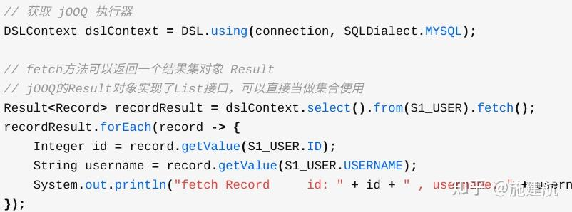
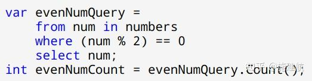
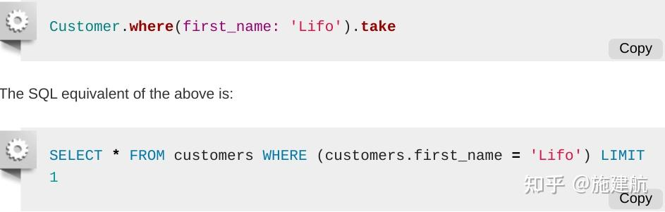
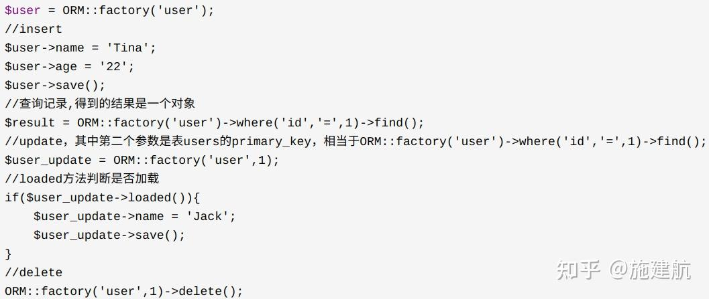

1\. mybatis很low, 单表映射繁琐, 多表关联不支持, 各种在xml中写sql(配置多而杂), 这也能算orm? 还美其名曰`灵活`, 还在国内人人趋之如骛, 真的是大部分人的个人认知=社会认知, 而社会认知被国内top公司给带歪了.

还有, 灵活一多, sql就多, 你在xml中按他那语法写那么多sql, 还不如在代码中用java语法写sql, 还学个啥xml语法? 都是撸sql这个层面的事情, 难道xml就更威武一些么?

2\. jpa是比mybatis简单点, 但是注解(配置)也太多了吧, 注解很明显就是灵活性不足.

3\. ActiveRecord模式才是完备的orm(富血, 面向对象), 如ror如jooq, 同时更好的切合ddd, 最近各种dao(贫血, 面向过程)伪装orm又强行套用ddd, 还各种吹三高(高内聚高可读高扩展)

搞得我瑟瑟发抖, 然后我看看我写的[orm框架](https://link.zhihu.com/?target=https%3A//github.com/shigebeyond/jkmvc/blob/master/doc/orm/using.cn.md), 虽然看起来不够高大上, 但还是觉得用的爽啊

* * *

有人说造轮子不好 -- 我知道其他语言的orm框架优秀在哪里(ror/kohana/jooq), 我看mybatis不咋的我造个好用咋就不行了, 你守旧还不让人搞得创新, dubbo还有一个go版本呢, 咋不去攻击它去

又有人说我造轮子能力不行 -- 我都无语, 连我框架api跟源码都没看过, 你评价个甚

又有人说我的api是字符串拼接, 还不如sql -- 有知友善意提到了dsl, 那看看其他框架的dsl

这是[jooq的dsl](https://zhuanlan.zhihu.com/p/103834378)

这是[.net linq的dsl](https://link.zhihu.com/?target=https%3A//www.cnblogs.com/liusuqi/p/3166206.html)

这是[ror的dsl](https://link.zhihu.com/?target=https%3A//guides.rubyonrails.org/active_record_querying.html%23using-conditionals)

这是[php kohana的dsl](https://link.zhihu.com/?target=https%3A//www.cnblogs.com/beiqiao/p/3968692.html)

这些人坐井观天, 一叶障目, orm又不等于mybatis, 这些人连QueryBuilder跟ActiveRecord都不知道, 连好一点的orm框架都不了解, 连要批评的框架的api跟源码都没看过, 就一根筋来贬低我跟我的框架?

我是做开源, 不是为这些人做的开源, 就是因为多了这些人, 让我感觉到在中国做开源的失望, 我就纳闷了, 我上一版回答就提了一下我的框架用的爽, 我连链接都没放出来, 怎么就急冲冲的过来怼我? 啥心理? 我都懒得说了, 贴了几个有点名气的框架的api让这些人长长见识, 建议他们去怼这些框架, 怼怼怼, 刷刷那可怜的成就感.

知乎是个争吵之地, 吵过几次了, 没啥意思, 你永远叫不醒一个装睡的人, 他不愿意睁眼去看就别好为人师, 从恼怒到失望, 也就那样了, 一个造框架的人跟一个用框架都用不明白的人吵, 吵赢了又如何? 与其在纷扰之地争吵, 不如持续重构, 在团队里用好, 提升项目质量与团队实力.

内卷吗? 国内技术界还是少了一些宽容. 勇士们继续努力, 不要想着在人群中寻找安慰, 征途中要耐得住寂寞, 须知你的荣光在星辰大海.