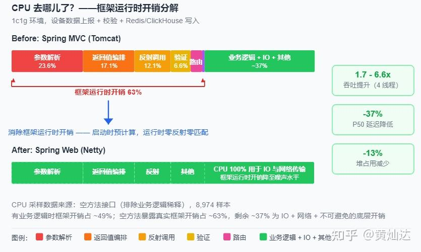
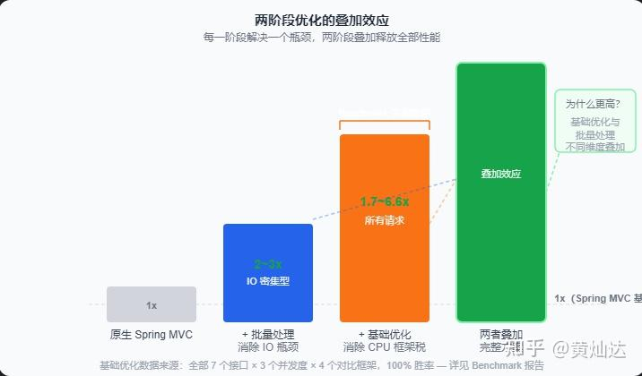

去年做性能测试的时候，碰上一件让我琢磨了很久的事。

同样的业务逻辑——接收数据、校验、写入 Redis 和 ClickHouse——只是接入方式不一样：

| 接入方式 | TPS |
| ----- | ----- |
| Kafka 消费端 | ~15,000 |
| Spring MVC（Tomcat） | < 4,000 |
| Spring WebFlux | < 4,000 |

Kafka 比 Spring MVC 快了将近 4 倍。注意，业务代码完全一样，只是消息队列换成了 HTTP 接口。

更让人意外的是，WebFlux 也没好到哪去——3,000 多 TPS，跟 MVC 半斤八两。

这个结果让我很困惑。WebFlux 不是号称高性能吗？不是说非阻塞 IO 能扛更多并发吗？怎么真实场景下跟 Tomcat 没啥区别？

* * *

### CPU去哪儿了



对，就是这么夸张。一个 HTTP 请求的生命周期里，真正干活的只占一小半。剩下的 CPU 都花在这几件事上：

**参数解析。** 每次请求来了，框架要遍历一遍所有参数解析器，找到匹配的那个。一个方法上 3 个参数，就遍历 3 次。这事启动时就能确定，但 Spring 选择每次都重新查。

**返回值处理。** `@ResponseBody` 的返回值怎么序列化？每次请求都要重新扫描处理器列表、重新做内容协商。Jackson 序列化本身只占 1.75%，但框架在前面编排了 17~27% 的开销。

**路由匹配。** Spring MVC 用 AntPathMatcher 做线性匹配。路由越多越慢。

**反射调用。** `Method.invoke()` 一次大约 200ns，不算多。但如果业务方法本身只跑几微秒，这 200ns 就占了大头。

**校验链。** 每次请求重建 DataBinder，跑完整 Hibernate Validator 链。

这些开销有一个共同特征：**计算所需的信息在请求到达之前已经确定了，但框架在运行时重新算了一遍。**

一个 URL 对应哪个方法、需要什么参数解析器、返回什么 MediaType——启动时就知道了。Spring 选择假装不知道，等请求来了再做一遍。

* * *

### WebFlux 到底解决了什么

先别急着喷 Spring。MVC 这套架构从 Servlet 时代演进过来，兼容性做得好，但性能确实不是优先考虑的事。

WebFlux 的出现是为了解决一个真实问题：Tomcat 一个请求一个线程，并发高了线程数爆炸，上下文切换成本高，内存也撑不住。

Netty + 非阻塞 IO，听起来很合理。但你仔细想想：

**非阻塞 IO 减少的是线程等待时间，不是 IO 次数。**

1000 个请求要读 1000 次数据库，非阻塞 IO 只是让这 1000 次等待不阻塞线程了。该读 1000 次还是读 1000 次，数据库该扛的压力一点没少，网络延迟一点没变。


  

那 WebFlux 为什么还这么受追捧？两个原因：

一是它确实解决了一类问题——连接数极高但每个连接不怎么干活的长连接场景。比如推送服务、网关。

二是”非阻塞 = 快”这个印象深入人心，很多人没去细想过它快在哪、什么时候快。

更关键的是，Java 21 的虚拟线程出来后，WebFlux 最核心的理由被动摇了。虚拟线程让同步代码也能扛大量并发，WebFlux 的”省线程”优势几乎归零。

那为了什么？为了学 Reactor？为了从 10 行同步代码改成 8 行链式调用？

值吗？

* * *

### 更有意思的事

我们顺手对 WebFlux 也做了热点分析。猜怎么着？

WebFlux 的框架开销模式跟 Spring MVC 高度相似。参数解析器每请求遍历、内容协商重新查 MediaType、Reactor 的 operator 链累计开销也不低。

| 开销类别 | Spring MVC（空处理） | WebFlux（空处理） |
| ----- | ----- | ----- |
| 参数解析 + 反序列化 | ~24% | ~11% |
| 返回值序列化编排 | ~17% | ~10% |
| 路由匹配 | ~4% | ~3% |
| 框架总开销 | ~63% | ~40% |

WebFlux 确实少了一些，但远没到”质变”的程度。你付出了学响应式的代价，换来的只是部分框架开销的削减。

而且别忘了：IO 问题还在。数据库、缓存、下游服务这些真正的瓶颈，WebFlux 一个都没解决。

* * *

### 那真正有效的方式是什么

IO 优化和 CPU 优化，两件事分开看都不复杂。

**IO 层面，最有效的方式不是非阻塞，是减少 IO。**

把 1000 个并发请求聚合成 10 个批量操作，IO 等待从 10000ms 降到 200ms。这比任何非阻塞方案都管用。而且对下游服务更友好——少打了 990 次请求。

**CPU 层面，消除框架开销只有一个思路：启动时做完，运行时只查表。**

参数解析器启动时绑定好，运行时数组下标直接取。路由启动时构建 HashMap，O(1) 定位，不遍历。反射用字节码生成替代，调用耗时从 200ns 降到 10~30ns。返回值处理器启动时确定好，运行时零遍历。

这些不是什么黑科技，就是把”该什么时候做的事”放对时间。

但关键一步很多人没想到：**IO 和 CPU 优化必须一起做，只做其中任何一件，天花板都上不去。**

只做 IO 优化（不管是通过批处理还是非阻塞），CPU 会成为新瓶颈。你 IO 不排队了，但框架开销占了 CPU 的大头，吞吐照样上不去。

只做 CPU 优化，IO 的等待时间依然摆在那，业务逻辑大部分时间在等数据库，框架优化得再好也体现不出来。

两件事叠在一起，整条链路才真正通畅。



* * *

### 所以到底选什么

我个人的看法是这样的：

如果你的场景是真的长连接高并发（推送、网关、消息中间件），WebFlux 是一个相对合理选择——虽然要付出学习成本。

如果你的场景是普通 API 服务、微服务、业务系统，**慎重考虑 WebFlux**。它的性能提升有限，学习成本不低，而且虚拟线程正在让它的存在意义变弱。

如果要性能最大化，思路应该是这样的：

> **批处理干掉 IO 瓶颈，框架消除干掉 CPU 瓶颈。两者叠加，整条链路才有质的提升。**

而且这件事不应该让业务方买单。框架该干的活，框架自己干完。

* * *

### 但这里有一个隐藏问题

大部分高性能方案都有一个共同点：**需要你换一套编程范式。**

WebFlux 让你学 Reactor。Vert.x 让你写回调。gRPC 让你定义 proto 文件、生成代码。

对老项目来说，这意味着重写。对新项目来说，这意味着团队要多学一套东西。

我以前也试过 WebFlux，当时的感觉是：我没觉得性能问题出在线程模型上，却要先花两周搞清楚 `Mono` 和 `Flux` 到底怎么用。而且一旦用了，整个团队都得会。没人愿意接手的代码，性能再好也白搭。

所以我的底线是：**性能优化是框架的事，不是业务代码的事。**

* * *

### 所以 Spring Web 是怎么做到的

我们做了一个框架来验证这个思路，叫 **Spring Web 性能版**。

面对”Spring MVC 的 API 习惯 + 远超 MVC 和 WebFlux 的性能”这个目标，我们的做法是回到问题本身：框架的运行时开销到底从哪来，能不能在源头上干掉它。

**第一步：不让业务代码为性能买单。**

这是最核心的设计决策。市面上已有方案的选择逻辑都是”你要性能，就要换一套写法”，我们的选择是反过来——**框架来适配你，而不是你来适配框架。**

迁移成本被压缩到一行 pom.xml：

```text
<!-- 之前 -->
<dependency>
    <groupId>org.springframework.boot</groupId>
    <artifactId>spring-boot-starter-web</artifactId>
</dependency>

<!-- 之后 -->
<dependency>
    <groupId>io.github.springperf</groupId>
    <artifactId>spring-boot-starter-web</artifactId>
</dependency>
```

Controller 代码完全不动。`@RestController` 还是 `@RestController`，`@RequestMapping` 还是 `@RequestMapping`，`@RequestParam`、`@Validated`、`@ExceptionHandler`、`HandlerInterceptor`、`@CrossOrigin`——Spring MVC 的整套注解体系和 SPI 全部保留。

这不是”兼容大部分”，而是**全部覆盖了 Spring MVC 主流功能**。我们统计过，常规业务项目迁移至今没碰到因为框架不兼容而改代码的情况。

**第二步：把运行时开销变成启动时开销。**

前面 JFR 分析已经说了，Spring MVC 的框架开销有一个共同特征——”信息在启动时就确定了，但运行时重新算了一遍”。解法很直接：启动时算完，运行时只查表。

具体来说：

-   **参数解析**：Spring MVC 每次请求遍历所有解析器找匹配的那个，还带锁。我们把每个方法参数对应的解析器在启动时绑定好，运行时通过数组下标直接取，O(1)，无锁。
-   **路由匹配**：Spring MVC 用 AntPathMatcher 做线性匹配，路由越多越慢。我们启动时构建 HashMap + 多级优化器，运行时直接命中，不遍历。
-   **方法调用**：Spring MVC 用 `Method.invoke()` 反射调用，每次约 200ns。我们用 ASM 字节码生成去替代反射，降到 10~30ns，差距一个数量级。
-   **返回值处理**：Spring MVC 的 `writeWithMessageConverters` 每次请求都要遍历返回值处理器列表、做内容协商。我们启动时尽量确定好 MediaType 和对应处理器，运行时零遍历。
-   **校验链**：Spring MVC 每次请求重建 DataBinder。我们在启动时确定方法是否需要校验，运行时跳过空校验链。

代价是启动时间多几百毫秒，换来每次请求的确定性执行路径——**没有遍历、没有锁、没有反射、没有临时对象分配**。

**第三步：IO 层面的瓶颈，用批处置而不是非阻塞。**

非阻塞 IO 减少的是线程等待，不是 IO 次数。真正有效的 IO 优化是让 IO 少发生几次。

框架内置了基于 Disruptor 的请求聚合模块，透明地将高并发独立请求合并为批量操作。开发者只需要写一个接收 List 的批量方法，框架自动完成聚合、背压、线程池隔离。1000 次请求聚合成 10 批，IO 等待从 10000ms 降到 200ms。

这三步走完，整条链路才真正通畅。

* * *

### 数据说话

Benchmark 配置：JDK 8 + G1GC，1GB heap，4 线程。对比 Spring MVC（Tomcat）和 Spring WebFlux（Netty）。

| 接口 | Spring Web | Spring MVC (Tomcat) | WebFlux (Netty) |
| ----- | ----- | ----- | ----- |
| json | 26,718 ops/s | 14,061 ops/s | 15,444 ops/s |
| get | 27,398 ops/s | 12,510 ops/s | 13,172 ops/s |
| bytes | 34,232 ops/s | 20,019 ops/s | 17,202 ops/s |
| valid | 26,706 ops/s | 14,514 ops/s | 15,617 ops/s |
| async | 28,354 ops/s | 13,438 ops/s | 18,293 ops/s |
| bytesLarge | 11,508 ops/s | 4,982 ops/s | 7,724 ops/s |
| sse | 1,226 ops/s | 315 ops/s | 943 ops/s |

延迟和资源方面：

| 指标 | Spring Web | Spring MVC (Tomcat) | WebFlux (Netty) |
| ----- | ----- | ----- | ----- |
| P50 延迟 (bytes) | 0.12ms | 0.19ms | 0.19ms |
| 每请求分配 (json 4t) | 17.7KB | 29.9KB | 36.0KB |
| 每请求分配 (get 4t) | 16.9KB | 40.3KB | 56.1KB |
| 稳态堆占用 (4t) | 20MB | 23MB | 23MB |

7 个接口 × 3 个并发度 × 4 个对比框架（含 Undertow），**100% 胜率**。

代码在 GitHub 上，JMH 基准测试套件也在仓库里，可以自行复现。

> **性能优化不应该是二选一——你不需要在”高性能”和”Spring MVC 的正常写法”之间做选择。**

项目地址：

[https://github.com/springperf/spring-web](https://link.zhihu.com/?target=https%3A//github.com/springperf/spring-web)

[https://gitee.com/springperf/spring-web](https://link.zhihu.com/?target=https%3A//gitee.com/springperf/spring-web)

感兴趣的话来看看，提个 issue 或者聊聊你的场景都行。

* * *

*这篇文章来自去年做性能压测的一些发现和思考。整理了一下写成完整的。水平有限，有不同意见欢迎讨论。*