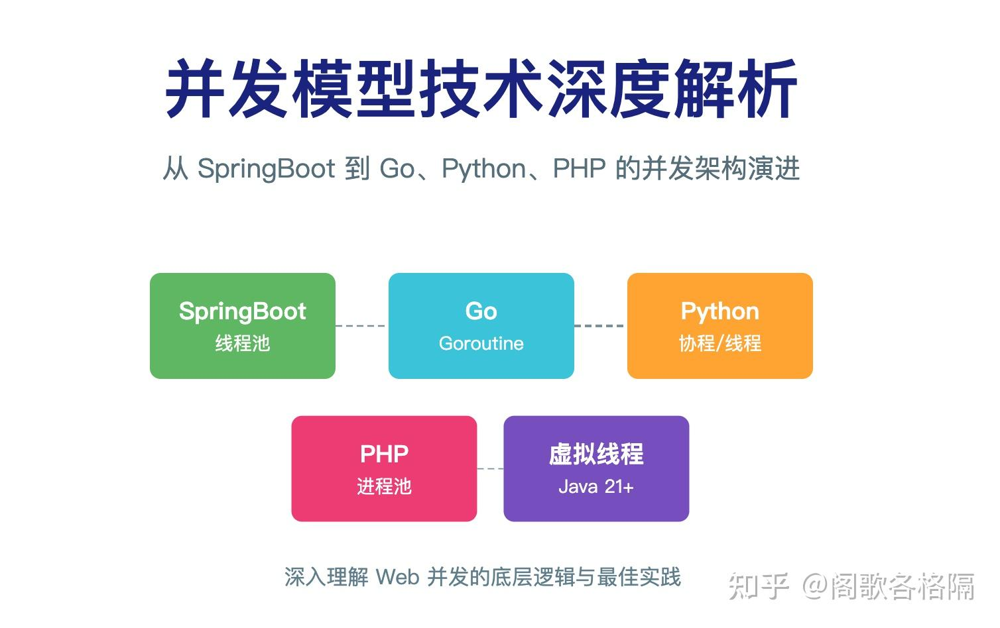
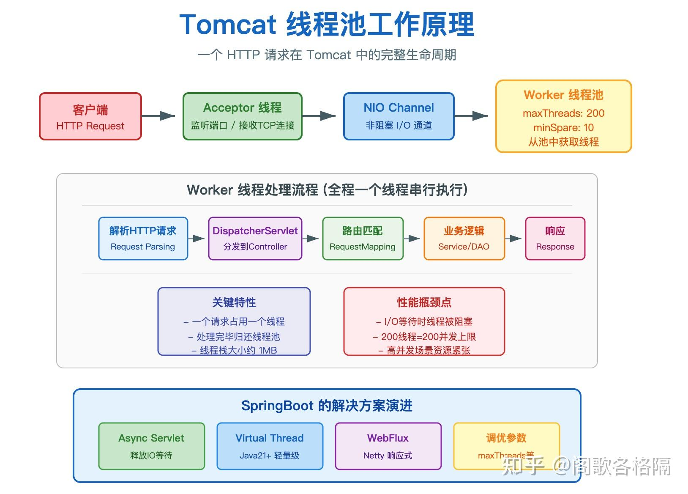
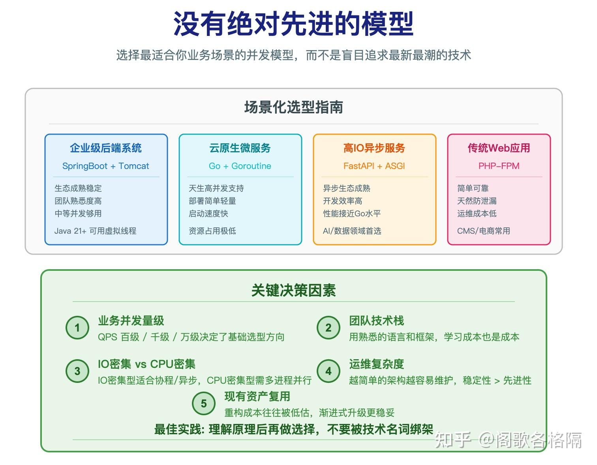

**不是。**

SpringBoot 默认用 Tomcat，Tomcat 默认配置是 200 线程的线程池，每个请求从池里拿一个线程来处理，处理完归还。

**这是标准答案，但如果你只记住这一句就走了，你亏大了。**



其是这背后牵扯着一个更大的问题：

为什么 SpringBoot 要这么设计？

为什么 Go 的做法完全不一样？

为什么 PHP 干脆走进程？

为什么 FastAPI 敢说「我比 Flask 快 3 倍」？

这些问题搞不清楚，你对并发的理解永远停留在「调线程池参数」这个层面。

## **一、 别拿 SpringBoot 默认线程池当真理**

### **1、Tomcat 线程池是怎么跑起来的**

SpringBoot3.x 默认内嵌 Tomcat 作为 Servlet 容器。Tomcat 收到一个 HTTP 请求之后，走的是这样一条链路：

Acceptor 线程在端口上接收到 TCP 连接，把连接丢给 NIO 通道。然后一个 Worker 线程从线程池里被分出来，这个线程全程负责：解析请求、调用 Spring DispatcherServlet、路由到具体 Controller、执行业务逻辑、拼装响应、发回客户端。全程一个线程，串下来的。

Tomcat 官方文档写的清楚：`maxThreads` 默认值 200，`minSpareThreads` 默认值 10。

意思是最多 200 个线程同时跑，低于 10 个空闲线程时开始扩容。这 200 个线程，就是 Tomcat 能扛住的并发上限。

有人觉得 200 并发，不高。但其实大多数中小型业务系统，200 线程绑着数据库连接池，足够。



### **2、 SpringMVC 的异步机制**

很多用了三五年 SpringBoot 的人不知道 SpringMVC 从 3.2 版本就开始支持异步了。

你写一个 Controller，返回类型是 `DeferredResult<String>`。请求进来，DispatcherServlet 拿到这个 DeferredResult，先调用 `request.startAsync()`，然后——这个处理请求的 Worker 线程直接归还线程池。线程池里的 200 个线程这下空出来了，可以去处理别的请求。

DeferredResult 存在一个队列里，挂着。等什么时候另一个线程调用了 `deferredResult.setResult(data)`，SpringMVC 感知到这个结果，再次从线程池里拿一个线程，把这个结果当作 Controller 返回值，继续往下走完 Filter 链和渲染流程。

`Callable<T>` 同理。Controller 返回一个 Callable，SpringMVC 把它扔给 `AsyncTaskExecutor` 的线程池去跑，原线程释放。跑完了再拿一个线程回来接着处理。这叫主线程释放，不是单线程全搞定。

所以你要注意 SpringMVC 异步不是不用线程，是让线程在 I/O 等待的时候释放出来去干别的事。CPU 计算的部分，该占线程还是占线程。

### **3、虚拟线程**

SpringBoot3.x + Java21 开始支持虚拟线程。只要一行配置就行：

```text
server:
  tomcat:
    threads:
      virtual: true
```

开启之后 Tomcat 的 Worker 线程不再是 OS 线程了，变成了 JVM 层面的虚拟线程。虚拟线程的栈初始大小只有几百字节到几KB，不是 OS 默认的 1MB。底层用几十个 OS 线程承载几千个虚拟线程，按需调度。

### **4、Spring WebFlux 彻底换了一条路**

Spring WebFlux 是 Spring5 推出来的响应式分支，现在已经相当成熟了。你用了 WebFlux，Tomcat 和 Servlet 那一套就不走了。

底层是 Netty，用的是 NIO 事件驱动。请求来了，进入事件循环，在 ChannelPipeline 里流转，遇到 I/O 操作不阻塞，直接往下走，等数据回来了再接着处理。线程还是有的，但不再是一个请求占一个线程，处理成千上万的并发连接，靠的不是线程多，是 I/O 让出去得快。

## **二、Go：goroutine，这名字本身就说明了问题**

### **1、每个请求一个 goroutine，不是线程**

Go 官方文档上`net/http` 包的 `Serve` 方法：

> Serve accepts incoming HTTP connections on the listener l, creating a new service goroutine for each.

每个连接进来，Go 运行时创建一个 goroutine 去处理。不是系统线程，不是进程，是一个由 Go Runtime 管理的轻量级执行单元。

goroutine 有多轻呢？

初始栈大小 2KB，可以动态增长，最大到多大取决于具体需求。相比之下，一个 OS 线程的默认栈大小是 1MB，Windows 上有些版本甚至是 8MB。就这一个数字，差距 500 倍到 4000 倍。

你算笔账：1000 并发连接，用线程模型，1GB 内存光给线程栈打底。用 goroutine，2MB。1000 个 goroutine 在 Go 里根本不算事，10 万个 goroutine 同时跑在一台服务器上，Go 官方和一些生产案例里是真实发生过的。

能这么高的原因是 goroutine 的栈是动态的，用多少扩多少，不是一开始就按最大栈大小分配。创建和销毁的成本极低，靠的是 Go Runtime 的 GMP 调度器，不是 OS 的线程调度。

### **2、GMP 调度器是怎么回事**

G 是 goroutine，待执行的代码单元。M 是 Machine，对应一个真实的 OS 线程。P 是 Processor，调度上下文，数量默认等于 CPU 核数，可以通过 GOMAXPROCS 设置。

调度器的工作方式：每个 P 维护一个本地的 goroutine 队列，从队列里拿 G 放到 M 上跑。当一个 G 遇到 I/O 调用，Go 运行时把这个 G 从 M 上摘下来，把 P 让给下一个 G。等 I/O 回来了，调度器再把这个 G 放回某个 P 的队列里。

一个 M 上同时跑多个 G 是常态，不是一个 G 独占一个 M。Go 的每个请求严格来说是一个 goroutine，但 goroutine 不是线程，它跑在 P 上，P 跑在 M 上，M 的数量通常只有 CPU 核数那么多。

## **三、Python 两条路**

### **1、Flask 慢的根源是 WSGI 不支持异步**

很多人知道 FastAPI 比 Flask 快，但不知道为什么快。我告诉你，根本原因在于 WSGI 这个接口规范。

WSGI 是 Python 官方定义的 Web 应用和 Web 服务器之间的接口规范。这个规范是同步的，应用端返回之前，服务器端必须等着，不能处理下一个请求。这是设计层面的约束，不是 Flask 自己的问题。

Flask 跑在 WSGI 上，所以它只能是同步的。Gunicorn 之类的 WSGI 服务器，给你配多少个 worker，就起多少个进程，每个线程处理一个请求，处理完才能接下一个。

Flask 官方文档自己说了：Flask 对 `async def` 函数的支持，是在你的协程外面包一个线程去执行。这不是真正的异步，是用线程去模拟协程，性能当然比不上原生异步框架。Flask 官方把这件事说得很诚实，叫「This compromise introduces a performance cost」。

所以你用 Flask 写 API，就别指望它能有多高性能。Flask 的定位是微框架，轻量、灵活、好上手，不是高性能。业务量大了要换，不是靠调参能解决的。

### **2、FastAPI，ASGI 是关键**

FastAPI 快，是因为它走的是 ASGI。

ASGI 是专门为异步设计的接口规范，底层通常用 uvloop 或 Python 标准库的 asyncio 作为事件循环。

你写一个 `async def` 的路径函数，FastAPI 直接在事件循环里调度它。遇到 `await some_async_library()` 的时候，当前协程让出事件循环，别的协程接着跑。等数据回来了，协程再恢复执行。整个过程在一个线程里完成，不需要线程池，不需要上下文切换。

FastAPI 的性能数据在 Techempower 的测试里，和 Go 是一个量级的。当然，FastAPI 背后的 Starlette 很轻量，大部分性能来自 ASGI 事件循环而不是框架本身。你用 FastAPI 写的 API，性能好不好，关键看你调用的库是不是真的异步。

现在 Python 异步生态已经很成熟。asyncpg、aiomysql、asyncpgsa、aioredis 这些异步数据库驱动都有，httpx、aiohttp 做异步 HTTP 调用，asyncio-SQLAlchemy 也在往前走。你做 Python Web 开发，如果性能是刚需，FastAPI 加异步驱动是正经路径。

### **3、GIL 不是你想象的那么简单**

Python 有 GIL，全局解释器锁，CPython 实现里同一时刻只有一个线程在执行 Python 字节码。这个东西卡死了很多 Python 开发者的思路。

但 GIL 的实际影响要分开看。

**I/O 等待的时候 GIL 是释放的。** 你在线程里做一个 `requests.get()` 调用，发起网络请求之后，字节码执行到这里就停了，GIL 释放，另一个线程可以进来执行。所以 Python 的多线程对 I/O 密集型任务仍然有效，多线程一起等网络响应，吞吐量并不差。

**CPU 密集型任务才是 GIL 的重灾区。** 你在 Python 里开 8 个线程做图像处理、加解密、机器学习推理，对不起，同一时刻只有一个线程在跑，8 个线程排队用那一把 GIL 的锁，其他 7 个线程全在等。这种场景下，Python 多线程等于没开。你只能用多进程，进程间并行才是真的并行。Python 官方的 `concurrent.futures.ProcessPoolExecutor` 就是干这个的。

Python 3.13 正式引入了 PEP 703 的无 GIL 实验构建。这个构建去掉了 GIL，多线程终于可以真正并行跑 CPU 密集型任务了。

如果你的业务主要是 I/O 密集型，现有 CPython + 异步编程已经完全够用，GIL 根本不是你的瓶颈。

## **四、PHP：每个请求一个进程，不是线程**

### **1、PHP-FPM 的进程池模型**

PHP 的并发模型和前面说的所有框架都不一样，它不是线程池，是进程池。

PHP-FPM 是 PHP 主流的生产部署方式。FPM 有一个 Master 进程，负责监听端口、管理进程池。进程池里是一批 Worker 进程，每个 Worker 进程一次处理一个请求，处理完了进入下一轮，等待下一个请求。

这个模型有一个显而易见的好处：进程间内存完全隔离。一个 PHP 请求崩了，只影响那一个 Worker 进程，Master 进程和其他 Worker 全部正常运行。而且 PHP 每次请求结束之后，整个执行环境全部销毁，不存在内存泄漏累积的问题。这不是 FPM 的设计选择，这是 PHP 语言层面的特性：请求开始时初始化，请求结束时销毁。

FPM 有三种进程管理策略：`static`，固定数量进程，负载稳定时最省资源；`dynamic`，进程数在 min 到 max 之间动态伸缩，适合负载波动大的场景；`ondemand`，只有收到请求才启动进程，空闲超过一定时间就销毁，适合突发流量。这三种策略没有绝对的好坏，只有合不合适。

PHP 用进程而非线程的根本原因：**PHP 语言层面不支持多线程**。

### **2、PHP 内置服务器的单线程问题**

PHP 官方文档里有这么一句：

> The web server runs only one single-threaded process, so PHP applications will stall if a request is blocked.

PHP 内置的开发服务器是单进程单线程的。你在开发环境写一个 sleep(10) 试试，整个服务器卡死 10 秒，第二个请求进不来。这不是 Bug，是设计选择。

## **五、底层逻辑：理解了才能不被忽悠**

写到最后，我想说一个很多人没有想清楚的问题。

为什么会有这么多种并发模型？因为**并发的本质是等待**。一个 Web 请求，99% 的时间在等：等数据库返回、等 HTTP 接口返回、等文件系统读完。CPU 在这些等待过程中什么都没干，只是占着内存和线程栈。一个线程占着 1MB 栈空间等 I/O，这 1MB 就浪费了。

所有的并发优化，本质上都是在解决「等待的时候干什么」这个问题。

虚拟线程说：我让出物理线程，让别的虚拟线程来用这块 1MB 的空间。

goroutine 说：我让出 P，让别的 goroutine 来跑。

asyncio 协程说：我让出事件循环，等 I/O 回来了再说。

进程池说：一个进程等 I/O 不耽误另一个进程，反正进程间不共享内存。

没有哪种模型是绝对先进的。

