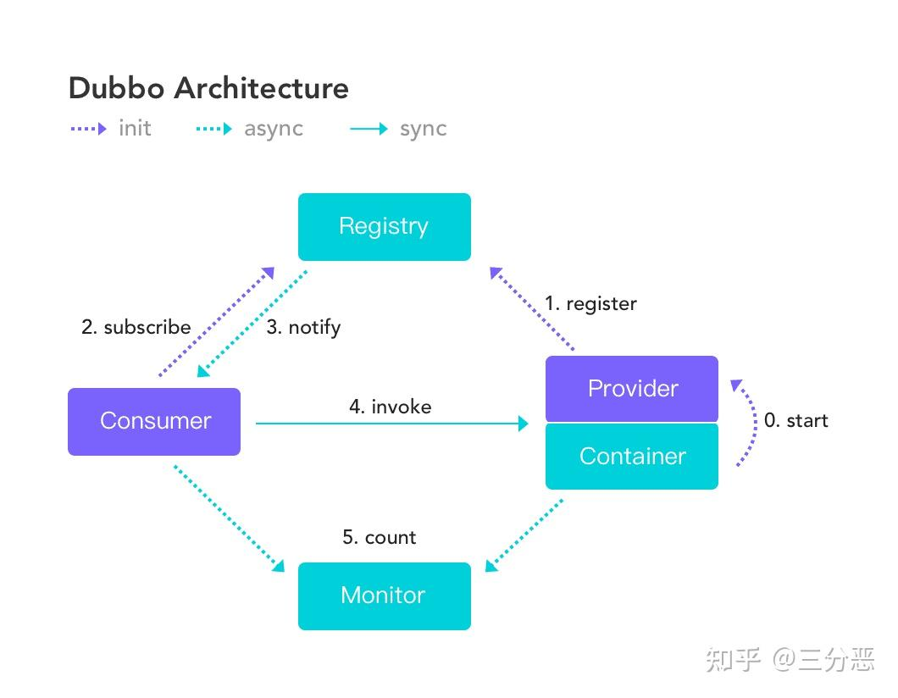
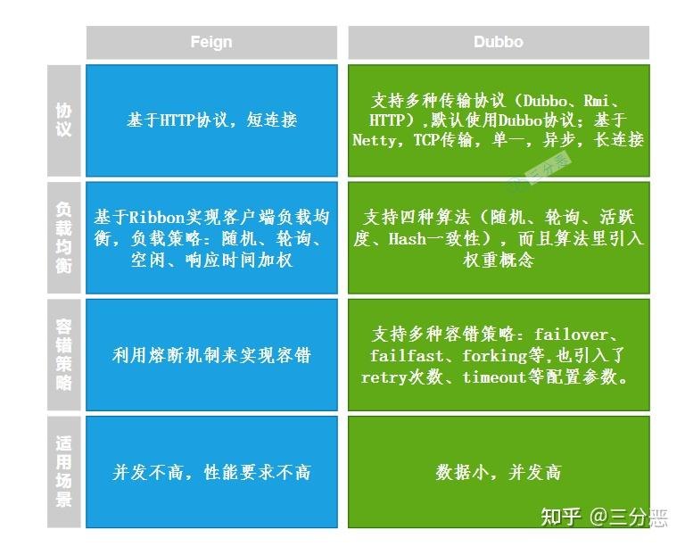
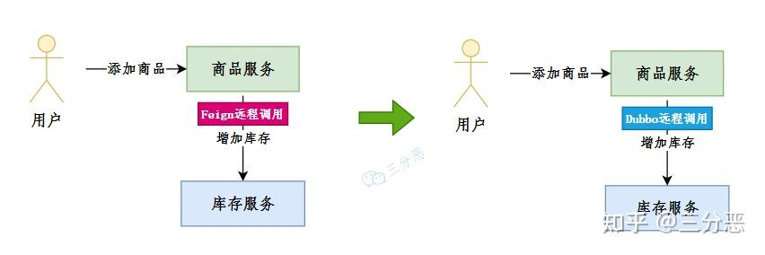
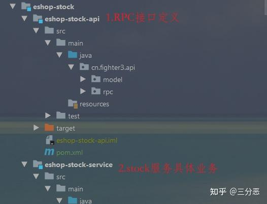
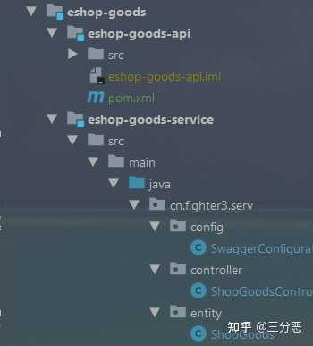
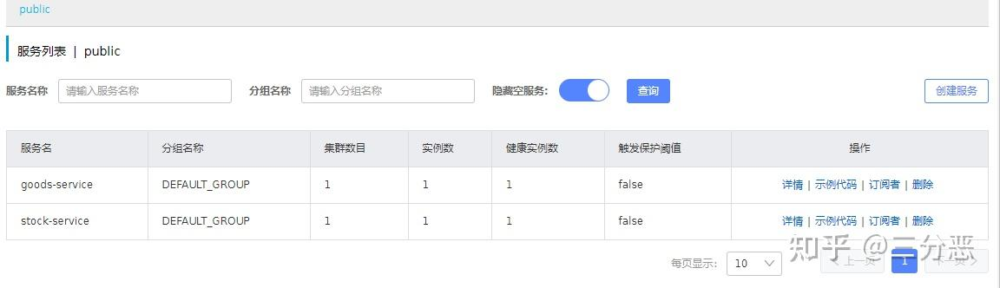
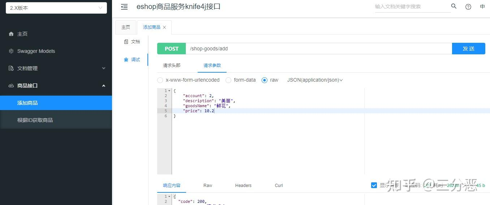
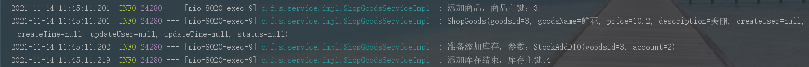
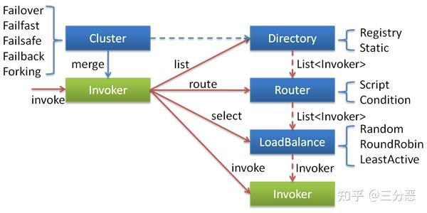

内部服务的话，毫无疑问是dubbo，性能更高，集成起来也非常丝滑！

  

> 源码地址：[https://gitee.com/fighter3/eshop-project.git](https://link.zhihu.com/?target=https%3A//gitee.com/fighter3/eshop-project.git)  
> 持续更新中……  

大家好，我是老三，断更了半年，我又滚回来继续写这个系列了，还有人看吗……

在前面的章节中，我们使用Fegin完成了服务间的远程调用，实际上，在更加注重性能的互联网公司中，一般都会使用RPC框架，如Dubbo等，来实现远程调用。

这一节，我们就来把我们的服务间调用从Feign改造成Dubbo。

## **1.Dubbo简介**



> Apache Dubbo 是一款微服务开发框架，它提供了 RPC通信与微服务治理两大关键能力。这意味着，使用 Dubbo 开发的微服务，将具备相互之间的远程发现与通信能力， 同时利用 Dubbo 提供的丰富服务治理能力，可以实现诸如服务发现、负载均衡、流量调度等服务治理诉求。  

这是Dubbo官网对Dubbo的简介，Dubbo在国内是应用非常广泛的服务治理框架，曾经一度停更，后来又重新维护，并从Apache毕业。

在这一节里，我们主要关注它的RPC通信的能力。

这里再额外提一个老生常谈的问题，Dubbo和我们前面用的Feign的区别：



Dubbo在性能上有优势，Feign使用起来更便捷，接下来，我们来一步步学习Dubbo的使用。

## **2.Dubbo基本使用**

在前面我们使用Feign远程调用实现了一个业务`添加商品`,接下来，我们把它改造成基于Dubbo远程调用实现。



## **2.1.服务提供者**

我们将原来的`eshop-stock`拆成两个子module，`eshop-stock-api`和`eshop-stock-service`，其中`eshop-stock-api`是主要是RPC接口的定义，`eshop-stock-service`则是完成库存服务的主要业务。



### **2.1.1.eshop-stock-api**

-   依赖引入，eshop-stock-api主要是接口和实体类的定义，所以只需要引入对common包的依赖和lombok的依赖

```text
        <!--对common的依赖-->
        <dependency>
            <groupId>cn.fighter3</groupId>
            <artifactId>eshop-common</artifactId>
            <version>1.0-SNAPSHOT</version>
        </dependency>
        <!--lombok-->
        <dependency>
            <groupId>org.projectlombok</groupId>
            <artifactId>lombok</artifactId>
            <optional>true</optional>
        </dependency>
```

-   接口和实体定义

`StockApiService.java`：这个接口定义了两个方法，在哪实现呢？往后看。

```text
/**
 * @Author 三分恶
 * @Date 2021/11/14
 * @Description 对外RPC接口定义
 */
public interface StockApiService {

    /**
     * 添加库存
     *
     * @param stockAddDTO
     * @return
     */
    Integer addStock(StockAddDTO stockAddDTO);

    /**
     * 根据商品ID获取库存量
     *
     * @param goodsId
     * @return
     */
    Integer getAccountById(Integer goodsId);
}
```

`StockAddDTO.java`：添加库存实体类

```text
/**
 * @Author: 三分恶
 * @Date: 2021/5/26
 * @Description:
 **/

@Data
@Builder
@EqualsAndHashCode(callSuper = false)
public class StockAddDTO implements Serializable {
    private static final long serialVersionUID = 1L;

    /**
     * 商品主键
     */
    private Integer goodsId;

    /**
     * 数量
     */
    private Integer account;
}
```

### **2.1.2.eshop-stock-service**

我们把原来eshop-stock的相关业务代码都改到了这个module里。

同时，为了实现RPC服务的提供，我们需要：

-   导入依赖：主要需要导入两个依赖`dubbo`的依赖，和`eshop-stock-api`接口声明的依赖，这里的<scope> 设置为compile，这样我们在编译eshop-stock-service的时候，也会编译相应的api依赖。

```text
        <!--Dubbo-->
        <dependency>
            <groupId>com.alibaba.cloud</groupId>
            <artifactId>spring-cloud-starter-dubbo</artifactId>
        </dependency>
        <!--对api的依赖-->
        <dependency>
            <groupId>cn.fighter3</groupId>
            <artifactId>eshop-stock-api</artifactId>
            <version>1.0-SNAPSHOT</version>
            <scope>compile</scope>
        </dependency>
```

-   `StockApiServiceImpl.java`：创建一个类，实现api中声明的接口，其中`@Service`是Dubbo提供的注解，表示当前服务会发布成一个远程服务，不要和Spring提供的搞混。  
    */\*\**  
    *\* @Author 三分恶*  
    *\* @Date 2021/11/14*  
    *\* @Description 库存服务提供RPC接口实现类*  
    *\*/*  
    @org.apache.dubbo.config.annotation.Service  
    @Slf4j  
    public class StockApiServiceImpl implements StockApiService {  
    @Autowired  
    private ShopStockMapper stockMapper;  
      
    */\*\**  
    *\* 添加库存*  
    *\**  
    *\* @param stockAddDTO*  
    *\* @return*  
    *\*/*  
    @Override  
    public Integer addStock(StockAddDTO stockAddDTO) {  
    ShopStock stock = new ShopStock();  
    stock.setGoodsId(stockAddDTO.getGoodsId());  
    stock.setInventory(stockAddDTO.getAccount());  
    [http://log.info](https://link.zhihu.com/?target=http%3A//log.info)("准备添加库存,参数:{}", stock.toString());  
    this.stockMapper.insert(stock);  
    Integer stockId = stock.getStockId();  
    [http://log.info](https://link.zhihu.com/?target=http%3A//log.info)("添加库存成功,stockId:{}", stockId);  
    return stockId;  
    }  
      
    */\*\**  
    *\* 获取库存数量*  
    *\**  
    *\* @param goodsId*  
    *\* @return*  
    *\*/*  
    @Override  
    public Integer getAccountById(Integer goodsId) {  
    ShopStock stock = this.stockMapper.selectOne(Wrappers.<ShopStock>lambdaQuery().eq(ShopStock::getGoodsId, goodsId));  
    Integer account = stock.getInventory();  
    return account;  
    }  
    }  
      
    

-   远程调用配置：我们需要在`applicantion.yml`中进行dubbo相关配置，由于在之前，我们已经集成了nacos作为注册中心，所以一些服务名、注册中心之类的就不用配置。完整配置如下：

\# 数据源配置  
spring:  
datasource:  
driver-class-name: com.mysql.cj.jdbc.Driver  
url: jdbc:mysql://localhost:3306/shop\_stock?characterEncoding=utf-8&allowMultiQueries=true&serverTimezone=GMT%2B8  
username: root  
password: root  
application:  
name: stock-service  
cloud:  
nacos:  
discovery:  
server-addr: 127.0.0.1:8848  
server:  
port: 8050  
\# dubbo相关配置  
dubbo:  
scan:  
\# dubbo服务实现类的扫描基准包路径  
base-packages: cn.fighter3.serv.service.impl  
#Dubbo服务暴露的协议配置  
protocol:  
name: dubbo  
port: 1  
  

## **2.2.服务消费者**

我们的商品服务作为服务的消费者，为了后续开发的考虑，我也类似地把`eshop-goods`拆成了两个子moudule，服务消费放在了`eshop-goods-service`里。



-   引入依赖：引入两个依赖`dubbo`和`eshop-stock-api`，因为在一个工程里，所以对api的依赖同样用了<scope>为compile的方式，在实际的业务开发中，通常会把服务提供者的api打包上传到私服仓库，然后服务消费者依赖api包，这样就可以直接调用api包里定义的方法。  
    <!--Dubbo相关包-->  
    <dependency>  
    <groupId>com.alibaba.cloud</groupId>  
    <artifactId>spring-cloud-starter-dubbo</artifactId>  
    </dependency>  
    <!--对api的依赖-->  
    <dependency>  
    <groupId>cn.fighter3</groupId>  
    <artifactId>eshop-stock-api</artifactId>  
    <version>1.0-SNAPSHOT</version>  
    <scope>compile</scope>  
    </dependency>  
      
    
-   远程调用：使用`@Reference`注入相应的service，就可以像调用本地jar包一样，调用远程服务。  
    

`ShopGoodsServiceImpl.java:`

```text
@Service
@Slf4j
public class ShopGoodsServiceImpl extends ServiceImpl<ShopGoodsMapper, ShopGoods> implements IShopGoodsService {
    @org.apache.dubbo.config.annotation.Reference
    StockApiService stockApiService;

    /**
     * 添加商品
     *
     * @param goodsAddDTO
     * @return
     */
    public CommonResult addGoods(GoodsAddDTO goodsAddDTO) {
        ShopGoods shopGoods = new ShopGoods();
        BeanUtils.copyProperties(goodsAddDTO, shopGoods);
        this.baseMapper.insert(shopGoods);
        log.info("添加商品，商品主键：{}", shopGoods.getGoodsId());
        log.info(shopGoods.toString());
        StockAddDTO stockAddDTO = StockAddDTO.builder().goodsId(shopGoods.getGoodsId()).account(goodsAddDTO.getAccount()).build();
        log.info("准备添加库存，参数：{}", stockAddDTO.toString());
        Integer stockId = this.stockApiService.addStock(stockAddDTO);
        log.info("添加库存结束，库存主键:{}", stockId);
        return CommonResult.ok();
    }

    /**
     * 获取商品
     *
     * @param goodsId
     * @return
     */
    public CommonResult<GoodsVO> getGoodsById(Integer goodsId) {
        GoodsVO goodsVO = new GoodsVO();
        //获取商品基本信息
        ShopGoods shopGoods = this.baseMapper.selectById(goodsId);
        BeanUtils.copyProperties(shopGoods, goodsVO);
        //获取商品库存数量
        Integer account = this.stockApiService.getAccountById(goodsId);
        log.info("商品数量:{}", account);
        goodsVO.setAccount(account);
        return CommonResult.ok(goodsVO);
    }
}
```

-   相关配置：需要在`applicantion.yml`里进行配置，主要配置了要订阅的服务名。完整配置：  
    \# 数据源配置  
    spring:  
    datasource:  
    driver-class-name: com.mysql.cj.jdbc.Driver  
    url: jdbc:mysql://localhost:3306/shop\_goods?characterEncoding=utf-8&allowMultiQueries=true&serverTimezone=GMT%2B8  
    username: root  
    password: root  
    application:  
    name: goods-service  
    cloud:  
    nacos:  
    discovery:  
    server-addr: 127.0.0.1:8848  
    server:  
    port: 8020  
    #dubbo配置  
    #要订阅的服务名，多个用，隔开  
    dubbo:  
    cloud:  
    subscribed-services: stock-service  
      
    

## **2.3.调试**

-   依次启动`Nacos-Server`，`库存服务`，`商品服务`，可以看到Nacos服务列表里有两个服务



-   打开我们商品服务的knife4j接口http://localhost:8020/doc.html，调试添加商品接口  
    



-   上图可以看到，接口响应成功，查看控制台日志，发现发生了远程调用，查看数据库，发现商品库和库存库都新增了数据  
    



到此，我们一个简单的Dubbo远程调用就完成了。

## **3.Dubbo进阶使用**

在Feign的使用中，它自身集成了Ribbon实现客户端负载均衡，还需要额外继承Hystrix来实现熔断，我们接下来看看类似的一些能力Dubbo是怎么做的。

## **3.1.集群容错**

网络通信中存在很多不可控因素，例如网络延迟、网络中断、服务异常等等，这时候就需要我们的服务消费者在调用服务提供者提供的接口是，对失败的情况进行处理，尽可能保证服务调用成功。

Dubbo默认提供了6中容错模式，默认为Failover 重试\[1\]。



-   Failover Cluster：失败自动切换，当出现失败，重试集群中的其它服务。可通过 `retries="2"` 来设置重试次数，但重试会带来更长延迟。一般用于读操作，因为可能会带来数据重复问题。
-   Failfast Cluster：快速失败，只发起一次调用，失败立即报错。通常用于非幂等性的写操作，比如新增记录。
-   Failsafe Cluster：失败安全，出现异常时，直接忽略。通常用于写入审计日志等操作。
-   Failback Cluster：失败自动恢复，后台记录失败请求，定时重发。通常用于消息通知操作。
-   Forking Cluster：并行调用集群中的多个服务，只要一个成功即返回。通常用于实时性要求较高的读操作，但需要浪费更多服务资源。可通过 `forks="2"` 来设置最大并行数。
-   Broadcast Cluster：广播调用所有提供者，逐个调用，任意一个服务报错则报错。通常用于通知所有提供者更新缓存或日志等本地资源信息。

配置方式很简单，只需要在指定服务的@Service注解上增加一个参数就行了——在@Service注解参数中增加`cluster = "failfast"`。

```text
@org.apache.dubbo.config.annotation.Service(cluster = "failfast")
@Slf4j
public class StockApiServiceImpl implements StockApiService {
```

在实际应用中，我们可以把读写操作接口分开定义和和实现，读操作接口用默认的`Failover Cluster`，写操作用`Failfast Cluster`。

## **3.2.负载均衡**

Dubbo中内置了5种负载均衡策略，默认为random。

| 算法 | 特性 | 备注 |
| ----- | ----- | ----- |

配置方式也很简单，在`@Service`注解上增加参数`loadbalance = "roundrobin"`：

```text
@org.apache.dubbo.config.annotation.Service(cluster = "failfast",loadbalance = "roundrobin")
```

## **3.3.服务降级**

Dubbo提供了一种Mock配置来实现服务降级，也就是说当服务提供方出现网络异常无法访问时，服务调用方不直接抛出异常，而是通过降级配置返回兜底数据。主要步骤如下：

-   在`eshop-goods-service`(服务消费者)中创建MockStockApiServiceImpl，实现StockApiServiceImpl，重写接口方法，返回本地兜底的数据。

```text
/**
 * @Author 三分恶
 * @Date 2021/11/14
 * @Description 库存服务降级兜底类
 */
@Slf4j
public class MockStockApiServiceImpl implements StockApiService {

    @Override
    public Integer addStock(StockAddDTO stockAddDTO) {
        log.error("库存服务添加库存接口调用失败！");
        return 0;
    }

    @Override
    public Integer getAccountById(Integer goodsId) {
        log.error("库存服务获取库存接口调用失败！");
        return 0;
    }
}
```

-   使用也很简单，在`ShopGoodsServiceImpl`（调用远程服务的类）的`@Reference`注解，增加`mock`参数，设置降级类；我们同时设置设置集群容错`cluster="failfast"`快速失败。

```text
@Service
@Slf4j
public class ShopGoodsServiceImpl extends ServiceImpl<ShopGoodsMapper, ShopGoods> implements IShopGoodsService {

    @org.apache.dubbo.config.annotation.Reference(mock = "cn.fighter3.serv.service.impl.MockStockApiServiceImpl",
            cluster = "failfast")
    StockApiService stockApiService;
```

-   不启动服务提供者，我们就可以看到降级数据。

Dubbo实际上还有很多高级的功能，可以满足很多场景的需求，更多内容可以查看官网：[https://dubbo.apache.org/zh/docs/advanced/](https://link.zhihu.com/?target=https%3A//dubbo.apache.org/zh/docs/advanced/)。

## **4.总结**

在本节里，我们把远程调用由Feign改成了Dubbo，学习了Dubbo的一些基础和进阶用法。经过Alibaba的操刀，Dubbo已经能比较快捷地融入SpringCloud的体系中，如果对性能有一定的要求，那妥妥地可以考虑采用Dubbo作为远程调用框架。

实际上，这一节，经过我自己的迁移，Dubbo在应用上确实比Feign稍微麻烦一点点，我原本的计划的是使用Feign作为主要的远程调用组件，但实际上大部分真实电商项目基本都是使用Dubbo，或者自研RPC框架，所以这个项目后面的业务开发，决定改成Dubbo。

> 系列文章持续更新中，`点赞`、`关注`不迷路，咱们下期见。  

  

* * *

**参考：**

\[1\]. **[Dubbo官方文档](https://link.zhihu.com/?target=https%3A//dubbo.apache.org/zh/docs)**

\[2\]. 《Spring Cloud Alibaba 微服务原理与实战》

\[3\]. **[远程调用 Dubbo 与 Feign 的区别](https://link.zhihu.com/?target=https%3A//blog.csdn.net/riemann_/article/details/108762693)**