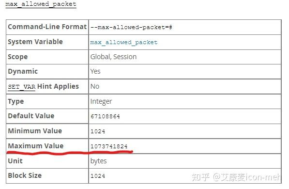

各位，这题干缺一半，并非所有人都是 Oracle 用户，直接出解决方案，可能会误导新同学的。

## **如果是 MySQL（MariaDB）**

在 MySQL中，IN 条件中包含的值的数量，仅受“max\_allowed\_pa​​cket”值的限制。



所以答案是：**1000 个才哪到哪啊，可以凉拌的！**

## 如果是 Oracle

### 1.最基本的选择，**使用（临时）表**

首先将值加载到另一个表中，然后在 IN 条件下使用：

```sql
with t as (
    //组合临时表的语句...
)
select * 
from mytable
where col in (select val from t)
```

好处是可以处理任意数量的值。缺点是需要额外插入，从而减慢了执行过程。

### **2.分组，每组 < 1000**

```sql
select * from mytable
where col in ( 1, ..., 999 ) 
or col in ( 1001, ..., 1999 ) 
or ...
```

这样可以处理任意数量的条件，只要你能够规划并拆分好。

最大的缺点：面对一个巨大的 OR 列表，优化器可能会傻掉！

而且由于 SQL 的文本很长，解析本身就得花时间。

### **3.使用 multi-value IN 列表**

原理：任何 in 语句`x in (1,2,3)`都可以重写为`(1,x) in ((1,1), (1,2), (1,3))`。

这样就可以突破 1000 个元素的限制。

```sql
select * from mytable
where  ( 1, col ) in (
  ( 1, 1 ),
  ( 1, 2 ),
  ...
)
```

## 其它数据库管理系统

不知道！具体只能看对应系统的用户手册！