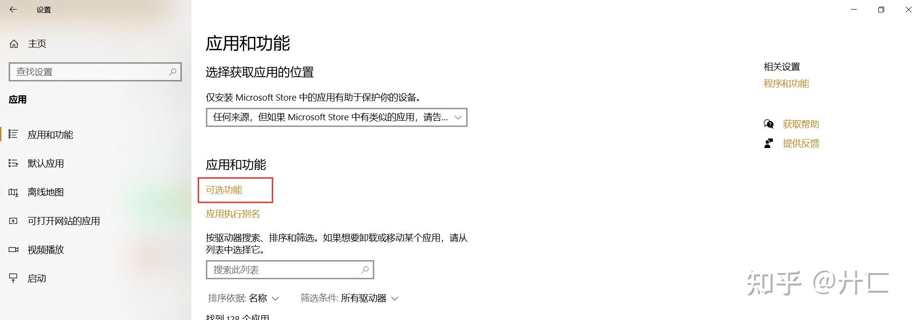
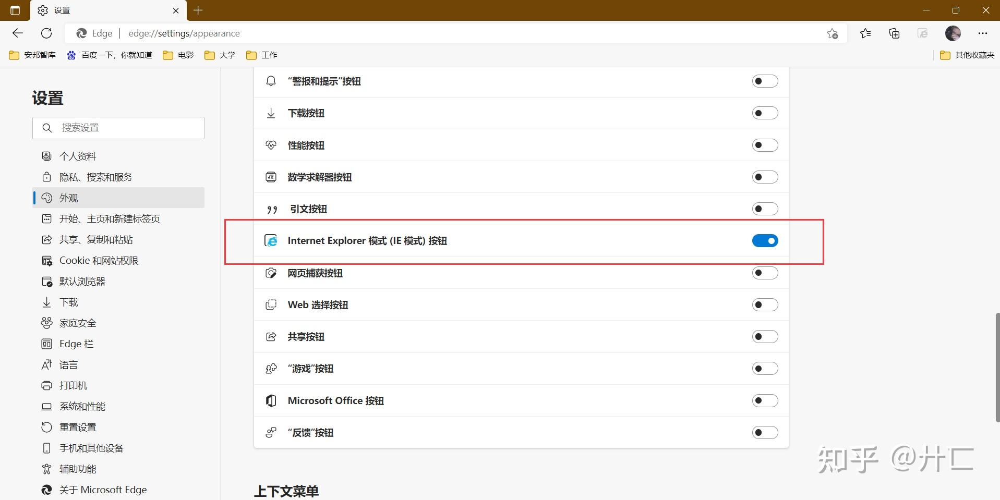
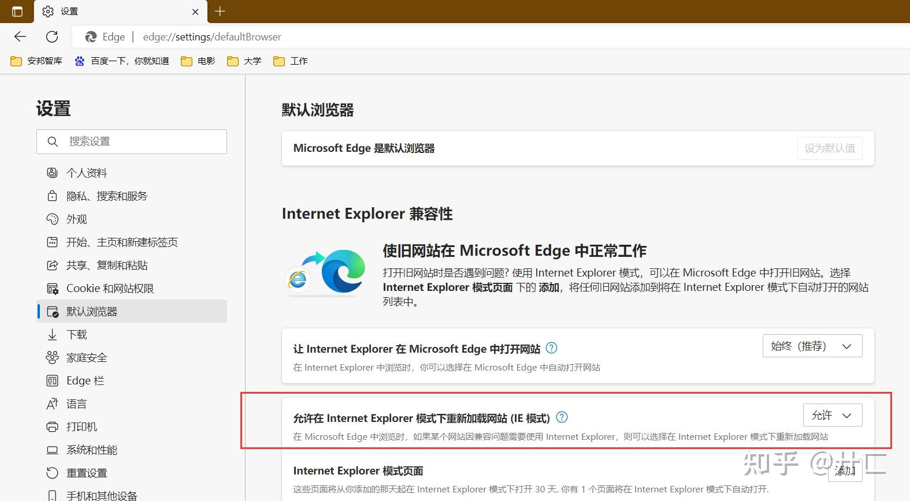

问题：由于各种原因我卸载了ie浏览器，现需要IE模式运行网页，打算重新安装IE，去下载安装包运行提示已安装最新版本安装不了。

程序与功能里也找不到ie，启用或关闭windows功能也找不到ie，在系统盘C盘C:\\Program Files\\internet explorer文件夹里也找不到iexplorer.exe文件。

尝试了网上的各种方法终于解决！希望我的方法能帮助到遇到相同问题的伙伴。

解决办法：ie浏览器是windows系统自带的浏览器，直接在设置-应用-应用和功能-可选功能-添加功能internet explorer11

再重启电脑（很重要‼️）

在edge浏览器的设置-外观：添加ie模式按钮 、设置—默认浏览器—允许在ie模式下重新加载网站。

  

就可以用ie模式进行浏览网页了