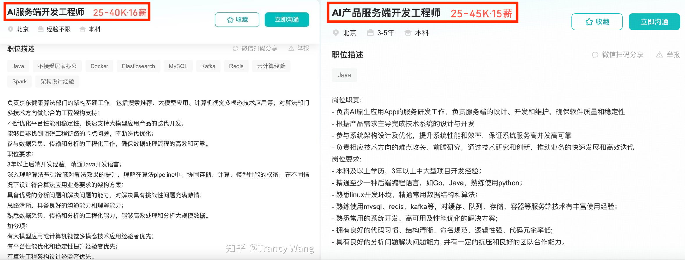
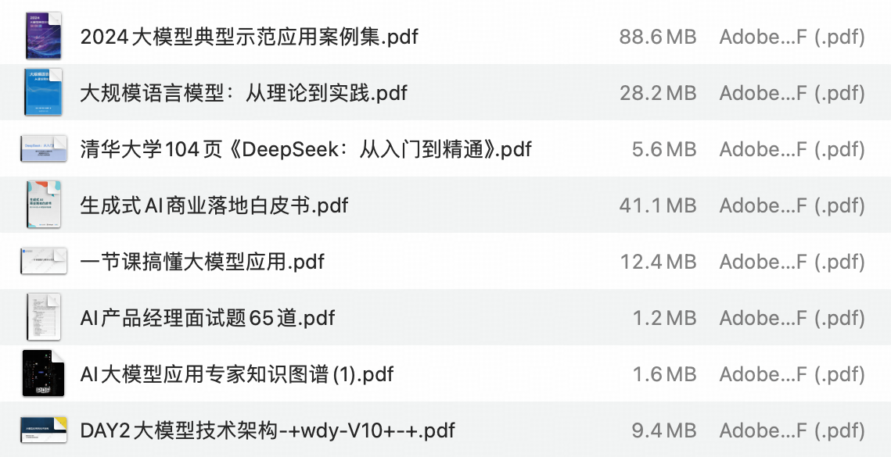

说真的，这两年看着身边一个个搞Java的哥们开始卷大模型，挺唏嘘的。大家最开始都是写接口、搞 Spring Boot、连数据库、配Redis，稳稳当当过日子。  
  
结果一个ChatGPT火了之后，整条后端线上的人都开始有点慌了，谁还不是在想：“我是不是要学点AI，不然这饭碗还能保多久？”  
**我先给出最直接的答案，一定要把你们现有的java技术能力和大模型结合起来，而不是抛弃你们现有的java技术。因为工程和落地能力是你们的强项。后面的趋势一定是AI应用落地！！！**  
  
**题主说自己是普通Java开发，对大模型完全空白，想转但不知道从哪下手——这事儿我太理解了。对于后端工程师来说，先保证自己有能力让大模型相关的项目落地。然后逐渐地补充算法的基础知识，因为你们已经有了工程技术背景，所以需要的做的是如何让既有的技术经验赋能新的技术。**  
  
我身边就有几个朋友，从普通Java后端，一步步搞成了现在的“AI工程师”，虽然不是研究院里的那种大神，但起码现在接的项目已经是“Prompt微调+API整合+大模型微服务框架落地”了，赚得也不少。  
  
**看看现在的招聘，用java做AI服务端的研发是一个很不错的选择，其实你发现没有，从云计算、大数据、到今天AI，都说Java已死，但是最后大数据、AI这些还是得老老实实接入服务端的接口。**

他们的路径很接地气，也适合大多数人。  
  
首先，别一上来就想着看深度学习,Transformer论文精读这种硬核的东西。就像学Java的时候，你不会先学JVM源码，而是搭个Spring Boot Hello World再说。  
大模型这边也一样，建议你先搞清楚这几个问题：  
  
大模型到底是干嘛的？ChatGPT、Claude 这些模型能做什么？为什么公司要用它们？你作为后端开发，怎么参与它们的应用？  
  
这一步，建议你就老老实实看一些**产品侧的落地案例**，比如大模型在客服、智能文档生成、代码补全、金融投研分析中的用法。你可以去试试、GitHub Copilot、Kimi、ChatGPT这些工具，理解下大模型到底“智能”在哪。  
  
然后，开始学点实际技能。别怕AI三个字，其实现在大多数大模型应用，**后端开发背景的人非常有优势**。你熟悉接口？你能写服务？你知道微服务怎么拆？你明白怎么做权限控制、数据缓存？  
  
这些全都能直接迁移到“Agent编排”、“模型服务封装”这些任务里。  
你可以从以下几块着手：  
  
1\. **学会用OpenAI、阿里的通义千问、百度的文心一言这些API；**  
2\. **学会用LangChain或者LlamaIndex这样的框架进行简单的“RAG”开发；**  
3\. **搭建一个自己的私有化大模型微服务，比如部署一个ChatGLM，做个“公司文档搜索助手”；**  
4\. **学Prompt工程技巧，懂得“怎么问”和“怎么改回答”。**  
  
这个阶段，其实你只需要有点Python基础 + API调用能力就够了，不涉及复杂的数学和模型训练，跟你写Java接三方API是一个思路。  
  
看到这里你可能会想：“这些东西看着好像也不难，那我怎么系统化地学？”  
说实话，如果你自学能力强，确实可以靠B站+GitHub+知乎慢慢摸索，但效率可能不太高。而且现在市面上确实课程太杂，有的讲Prompt，有的讲模型压缩，有的讲TensorFlow，学到一半发现根本用不上。  
  
我身边那几个成功转型的朋友，后来统一推荐的是知乎知学堂的**大模型应用开发公开课**，因为它课程设计就是**从“普通后端”转向“大模型应用工程师”的路线**，不是搞学术，也不是做科研，而是手把手教你怎么做一套实战项目，比如：怎么用LangChain + ChatGLM 搭个企业智能客服系统？怎么对接飞书、钉钉做AI助手；怎么利用开源模型搭建私有化问答？怎么做Prompt调优 + Agent任务拆解。**官方报名入口放这里了↓↓↓**

而且重点是，课程里讲师大部分都做过后端，知道你在哪卡壳，讲得很清晰。知乎知学堂还有配套的项目实战包、代码托管、作业批改，有问题随时问。全套资源包需要的话点上面课程卡片加助教微信就能直接领。

你不是一个人在卷，而是一群人一起卷。这个氛围其实特别重要。我那几个朋友学完之后都说：“早知道有这个，去年就报名了，不用在GitHub上摸黑一个月都看不懂LangChain文档。”  
  
说到底，你要是打算转型，真的可以试试知乎知学堂的这个大模型应用开发公开课，至少能帮你少走很多弯路。大模型现在爆发期，这个窗口期也就1-2年，等普及之后，可能又得拼学历和项目经验了。别等潮水退了，才想起没准备好泳裤。  
  
继续聊回正题。  
  
很多人觉得AI、高大上，但你如果是后端开发，其实你就是搞“连接、封装、服务”的专家，而现在大模型最需要的，不正是“把模型接入业务”、“做成接口让前端调用”、“部署成服务跑在生产环境”这种能力吗？  
  
说白了，90%的AI项目都不是在做模型，而是在做“模型应用”。这个部分完全是Java工程师的主场。  
  
我给你举个实际案例：我有个朋友是某大厂Java中级，一年多前开始学LangChain + RAG，最近在一家AI创业公司，专门做一个多轮问答客服系统，给SaaS平台对接。他负责微服务框架和模型推理服务的部署，每天写的代码其实80%还是老老实实在做CRUD + API接口，但薪资涨了60%，还拿了点期权。**核心原因？现在会“懂点模型的工程师”稀缺，懂产品、能接业务、有责任感的人更稀缺。**  
  
所以别管你现在几岁，也别管你会不会数学。你只要能拿出当年学Java时候的热情，跟上这波大模型热，就一定能在AI世界里找到一块属于自己的立足之地。  
  
你不用成为做模型的人，但你可以成为“让模型有用”的人。所以发挥你的优势，就是让大模型落地！！！  
  
总之，如果你是Java开发，又刚好对AI感兴趣，现在转型真的是好时机。别想着3个月能变身顶级AI专家，也别被一堆论文劝退。你只需要搞清楚应用场景、学会一些框架工具、掌握Prompt和接口整合的能力，未来就能参与到大模型各类落地项目中。  
  
记住一点——**你不是从零开始，而是从“后端能力+业务经验”出发，这才是你最大的优势。**  
趁现在，别犹豫了。学起来吧。

原文作者：Trancy Wang