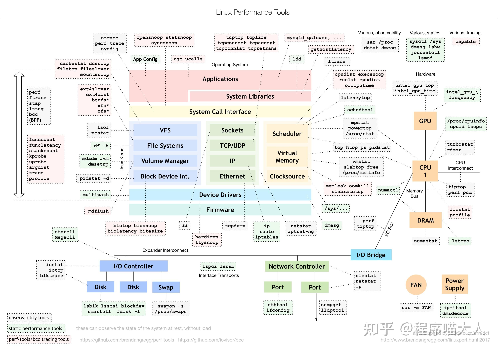
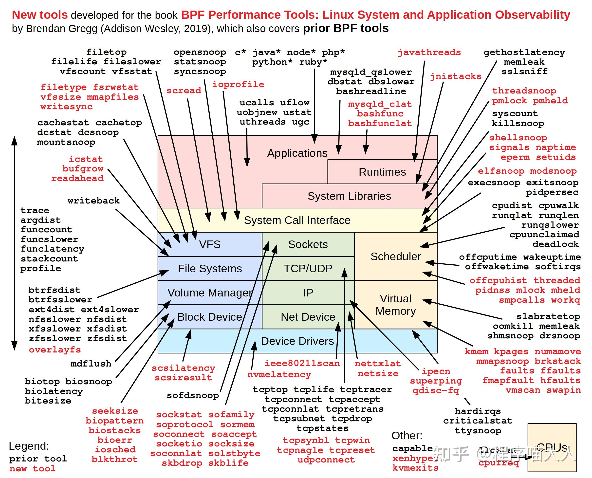

**谢谢邀请，本人经常研究性能优化，这里总结一波吧：**

在这开头，其实有张大佬的图很好的总结过，

没想到有这么多赞，那我就再贴一张图吧，和上面那个图是同一个链接：

原图链接：

[http://www.brendangregg.com/linuxperf.html](https://link.zhihu.com/?target=http%3A//www.brendangregg.com/linuxperf.html)

这个网站里还有好多有用的东西，大家可以去看看。

我结合大佬的图片和其它资料也整理过一篇pdf，大体如下：[Linux Performance](https://link.zhihu.com/?target=http%3A//www.brendangregg.com/linuxperf.html)我结合大佬的图片和其它资料也整理了一下，大体如下：

-   静态代码检测工具或平台：cppcheck、PC-lint、Coverity、QAC C/C++、Clang-Tidy、Clang Static Analyzer、**SonarQube+sonar-cxx**（推荐）、Facebook的infer
-   profiling工具：gnu prof、Oprofile、**google gperftools**（推荐）、perf、intel VTune、AMD CodeAnalyst
-   内存泄漏：**valgrind**、**AddressSanitizer**（推荐）、mtrace、dmalloc、ccmalloc、memwatch、debug\_new
-   CPU使用率：**pidstat**（推荐）、vmstat、mpstat、top、sar
-   上下文切换：**pidstat**（推荐）、vmstat
-   网络I/O：dstat、**tcpdump**（推荐）、sar
-   磁盘I/O：**iostat**（推荐）、dstat、sar
-   系统调用追踪：**strace**（推荐）
-   网络吞吐量：**iftop**、nethogs、sar
-   网络延迟：**ping**
-   文件系统空间：**df**
-   内存容量：free、**vmstat**（推荐）、sar
-   进程内存分布：**pmap**
-   CPU负载：uptime、**top**
-   软中断硬中断：**/proc/softirqs**、**/proc/interrupts**

学Linux和C++可以看这个仓库：  

[CPP学习资料汇总](https://link.zhihu.com/?target=https%3A//lb3fn675fh.feishu.cn/docx/VUjdd8uCdoufThxHEOzcQQaonCh)

**如果觉得这篇文章对你挺有帮助，请帮我两个忙**：

1\. **点赞**，让更多的人也能看到这篇内容（**收藏不点赞，都是耍流氓-**\_-）。

2\. **关注** [@程序喵大人](https://www.zhihu.com/people/23c7eb3e2f720cc933a68499a18d48fd)，让我们多多交流。