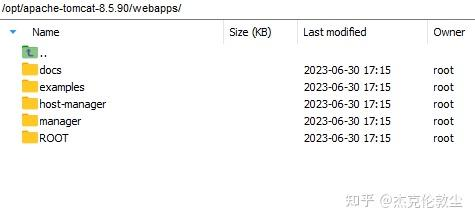
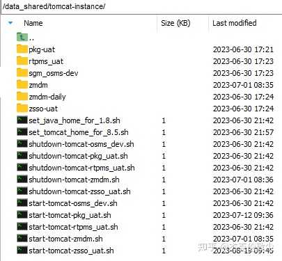
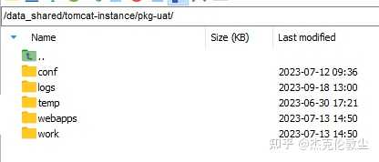

我个人工作多年，没觉得 docker 有什么用。  
我不需要docker。

Apache Tomcat 就挺好的。  
Tomcat 支持多个多种部署方式：

a) 一个 tomcat 的 webapps 下放多个 java .war 应用。

  

b) 共用同一套 tomcat 应用平台, 每个 java .war 应用使用单独一个配置目录、不同的配置文件、配置成不同的 tcp 端口/JDK 版本/日志目录...，以不同的 .sh/.bat 来启动。

c) 单个 windows/ubuntu 下，放多个不同版本的 tomcat(8.5, 10) 、使用不同的 tcp 端口、使用不同版本的 Java JRE(JRE 1.8, JRE11, JRE17)，对应不同的 web-apps。

  

\----------2023-09-10 补充，

至于 docker 迷们所说的「配置隔离」，我都笑死了。  
绝大多数 Java Web 应用，都连接了一个关系型数据库。创建一个 ts\_config(key, value) 表、用来存放配置数据，难道很难么？呵呵呵。

java-web 程序，大多不系统注册表、不额外开 tcp 端口......

  

\-------- 2023-09-19, 补充，

评论区里，有人提到服务拆分，必须要用 docker。  
可 Apache Tomcat 没限制你将一个 web xxx.war 拆分成多个 web xxx1.war、xxx2.war、xxx3.war呀。

评论区里，有人提到规模上升用到多服务器，必须要用 docker。  
可 Apache Tomcat 支持多服务器集群呀。

评论区里，有人提到多服务器的应用软件版本更新，必须要用 docker。  
可 Apache Tomcat 就算有多个服务器 instance，应用软件版本更新时只需要上传新版 .war 文件、最多加上一个 restart tomcat service 的批处理命令即可，难度不大呀。  
文件上传等工作，做成批处理也非常容易。

评论区里，有人提到多服务器的平台软件(tomcat) 版本更新，必须要用 docker。  
这个就有点意思了。tomcat 的版本升级，似乎只要替换某些文件即可，它不读写注册表之类的。  
做成批处理也非常容易。

  

评论区里，有人提到：  
让你配置50个不同的tomcat 看看 ，把这个服务移动到另外的服务器试试？  
答复如下：  
把一个 .war 文件，从一个 tomcat 中删除、上传到另一个 tomcat 中，很难么？  
只要配置参数，在数据库表中，这些都不是个事儿。

评论区里，有人提到：  
你服务只有你一个人维护当然没问题如果有十几个人呢？  
答复如下：  
配置管理，了解一下？把各服务器，每个上面了安装了哪个应用、哪个版本，**写成一个文件(比如 Excel, 或 html table)**、多个人可以查看、修改，这很难么？