```text
文章篇幅较长，建议先点赞收藏，收藏的同时帮忙点个赞支持下，谢谢，有问题可以评论区留言！！
```

**（加VX：GSC7969，免费领取网工学习路线和计算机网络基础学习资料）**

  

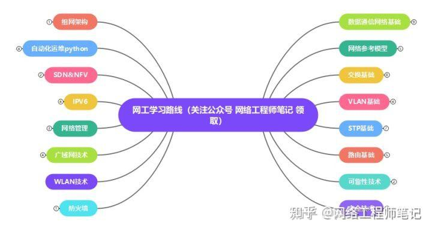

  

  

  

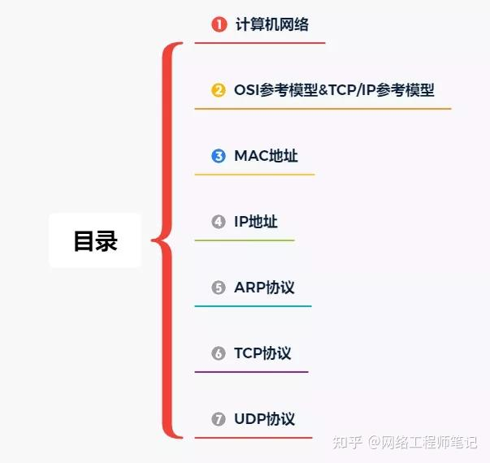

  

**更多图解系列干货文章：**


[万字45张图详解计算机网络基础知识](https://link.zhihu.com/?target=https%3A//mp.weixin.qq.com/s/XzjkhQDfHitxQOWiAadomQ)

[精！万字15图详解OSPF路由协议](https://link.zhihu.com/?target=https%3A//mp.weixin.qq.com/s/U5rLJ7M_gsk5nOw3hJOLsw)

[【干货】万字详解BGP路由技术原理及配置命令！](https://link.zhihu.com/?target=https%3A//mp.weixin.qq.com/s/bvBZ7XnN8Rrwn68enYtz-w)

[请收好这一份详细 & 清晰的计算机网络基础学习指南！](https://link.zhihu.com/?target=https%3A//mp.weixin.qq.com/s/K_-kcGd7aEFmqKb55pMNyg)  

### **计算机网络**

  

  

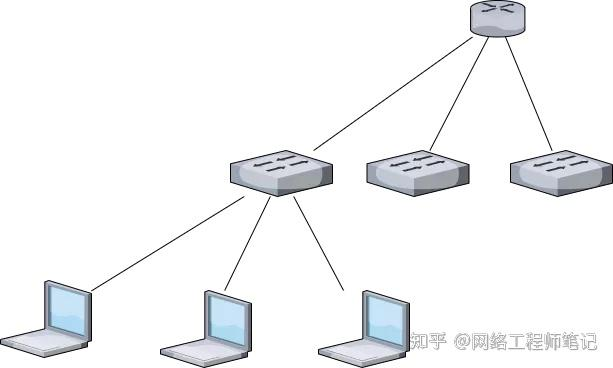

  

  

> 如上图就是一张简单的计算机网络，那么什么是计算机网络呢？  

**百度百科的定义**：

网络是由若干**节点**和连接这些节点的**链路**构成，表示诸多对象及其相互联系。

在我看来**计算机网络**通俗地讲就是通过**传输介质**将分布在各个地方的计算机和**网络设备**连接起来，实现数据通信、资源共享的一张网络。

计算机网络主要包括三部分：

1、**计算机** （可以包括客户端、服务器）

2、**网络设备** （路由器、交换机、防火墙等）

3、**传输介质**（可以分为有线和无线的）

**按照地域范围可以对网络进行如下分类**:

**局域网** ：小范围内的私有网络，一个家庭内的网络、一个公司内的网络、一个校园内的网络都属于局域网。

**广域网**：把不同地域的局域网互相连接起来的网络。运营商搭建连接远距离区域的广域网。

**互联网**：由世界各地的局域网和广域网连接起来的网络。互联网是一个开放、互联的网络，不属于任何个人和任何机构。

  

### **OSI参考模型&TCP/IP参考模型**

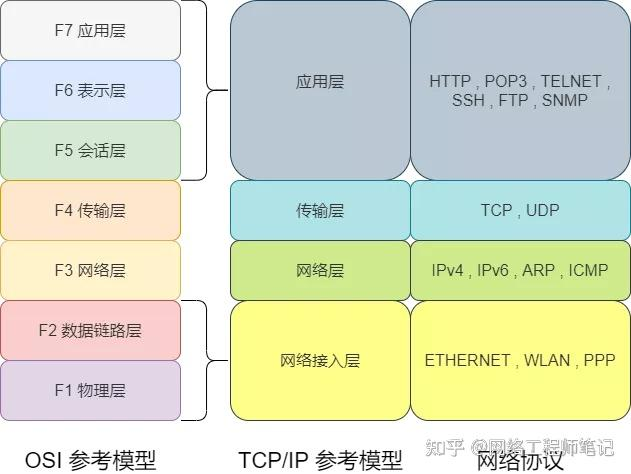

  

> 计算机网络是按照什么标准实现数据的传输通信的呢？这个就不得不提今天的主题OSI参考模型和TCP/IP分层模型。

**OSI参考模型分为七层从下往上分别是：物理层、数据链路层、网络层、传输层、会话层、表示层和应用层**

**TCP/IP分层模型分为四层从下往上分别是：网络接口层、网络层、传输层、应用层**

### **OSI参考模型各层的作用**

**物理层:**  

是参考模型中的**最底层**，主要定义了系统的**电气、机械、过程和功能标准**。如：电压、物理数据速率、最大传输距离、物理联接器和其他的类似特性。

**物理层传输的基本单位是比特流，即0和1**，也就是最基本的电信号或光信号，是最基本的物理传输特征。

计算机的世界里只有0和1, 正如你现在所看这篇文章的文字, 存储在计算机中也是一大串0和1的组合. 但是这些数字不能在真实的物理介质中传输的, 而需要把它转换为光信号或者电信号, 所以这一层负责将这些比特流(0101)与光电信号进行转换.

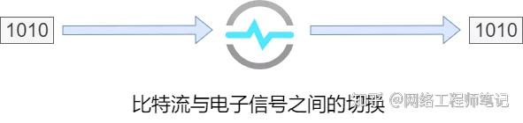

  

物理层示例图

**数据链路层：**

传输的基本单位为“**帧**”，将比特组合成字节，再将字节组合成帧，使用**链路层地址（以太网使用MAC地址）**来访问介质，并为网络层提供**差错控制**和**流量控制**服务。

  

**数据链路层由MAC(介质访问控制子层)和LLC(逻辑链路控制子层)组成。**

**介质访问控制子层**的主要任务是规定如何在物理线路上传输帧。（和物理层相连）

**数据链路控制子层**主要负责逻辑上识别不同协议类型，并对其进行封装。也就是说数据链路控制子层会接受网络协议数据、分组的数据报并且添加更多的控制信息，从而把这个分组传送到它的目标设备。（和网络层对接）

  

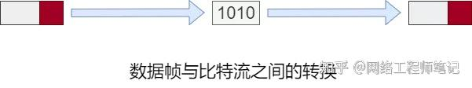

  

数据链路层示例图

  

**网络层：**

传输的基本单位为“**数据包**”，提供IP地址，负责把数据包从源网络传输到目标网络的路由选择工作。

IP协议是网络层中的核心协议。IP协议非常简单，仅仅提供不可靠、无连接的传送服务。

  

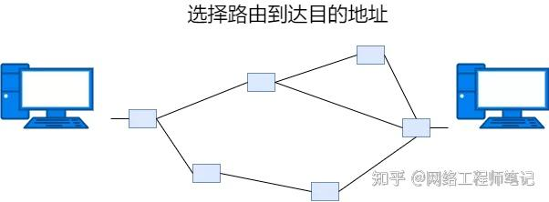

  

网络层示例图

  

**传输层：**

传输的基本单位为“**段**”，提供面向连接或非面向连接的数据传递以及进行重传前的差错检测。

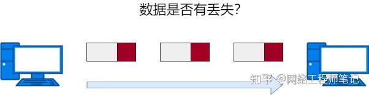

  

传输层示例图

  

**会话层：**

负责建立、管理和终止表示层实体之间的通信会话。该层的通信由不同设备中的应用程序之间的服务请求和响应组成。

  


  

会话层示例图

  

**表示层：**

提供各种用于应用层数据的编码和转换功能，确保一个系统的应用层发送的数据能被另一个系统的应用层识别。

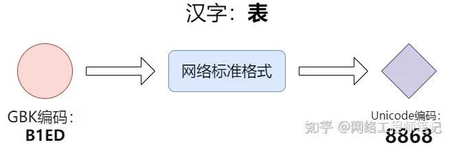

  

表示层示例图

  

**应用层：**

OSI参考模型中最靠近用户的一层，为应用程序提供网络服务。

  

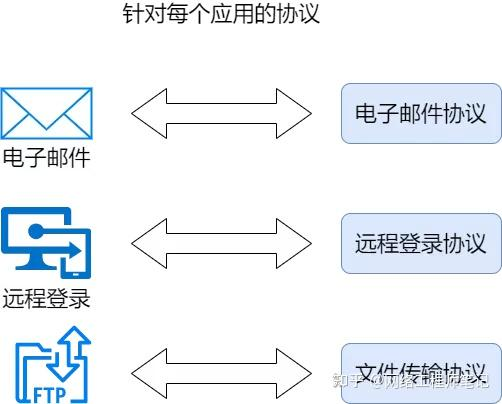

  

应用层示例图

**最介质后用一张图概括**  

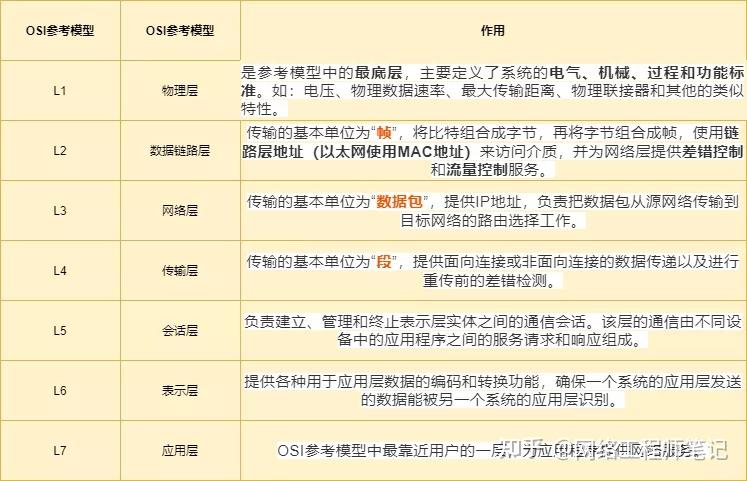

  

### **数据封装/解封装**

  

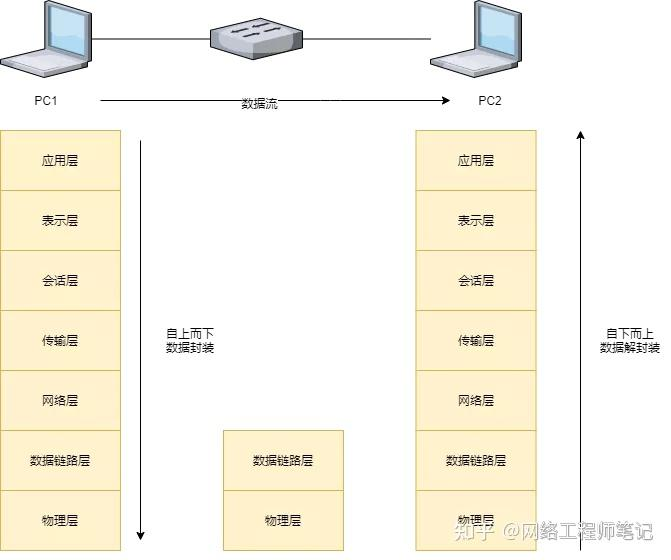

  

> PC1和PC2需要进行数据通信？那么PC1发送给PC2的数据包需要根据OSI参考模型至上而下进行数据封装，PC2收到数据包至下而上进行解封装  

这里的**封装**和**解封装**的概念可以使用寄快递和取快递类比，中间的**传输介质**就是物流公司。

寄快递的时候是不是需要将物品层层包装起来，其实就是数据包封装的过程；取快递的时候需要拆解包裹，这个其实就是数据包解封装的过程。

### **OSI模型每一层对应的数据名称**

  

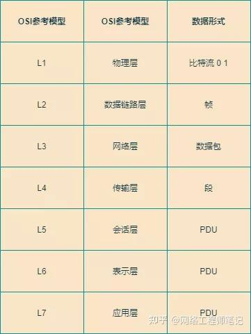

  

### **传输介质**

网络传输介质是指在网络中**传输信息的载体**，常用的传输介质分为**有线传输介质**和**无线传输介质**两大类。  

不同的传输介质具有不同的特性，这些特性直接影响到通信的诸多方面，如**线路编码方式、传输速度和传输距离**；

常用的传输介质分为**有线传输介质**和**无线传输介质**


  

**有线传输介质**是指在**两个通信设备之间实现的物理连接部分**，它能将信号从一方传输到另一方，有线传输介质主要有双绞线、同轴电缆和光纤。双绞线和同轴电缆传输电信号，光纤传输光信号。

**同轴电缆：**

**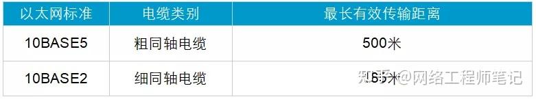**

  

**同轴电缆**是一种早期使用的传输介质，同轴电缆的标准分为两种，**10BASE2和10BASE5**。这两种标准都支持10Mbps的传输速率，**最长传输距离分别为185米和500米**。一般情况下，10Base2同轴电缆使用BNC接头，10Base5同轴电缆使用N型接头。

  

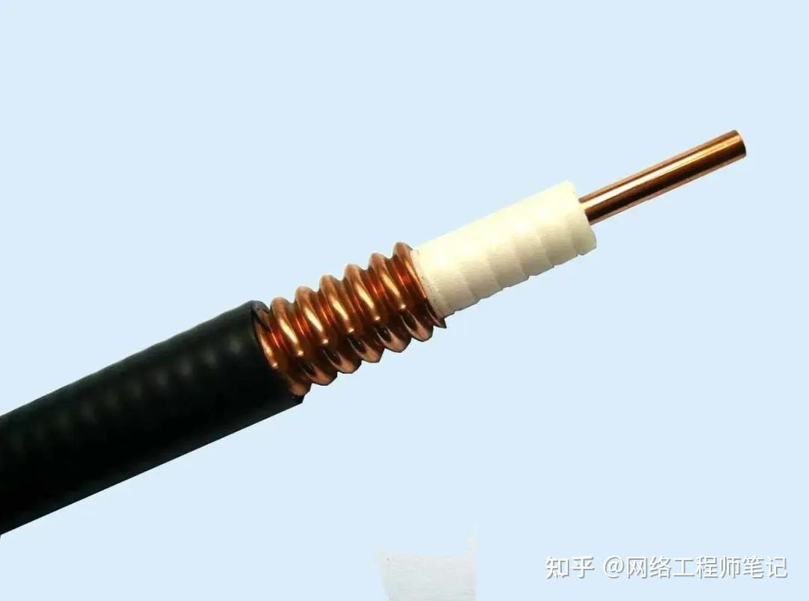

  

  

  

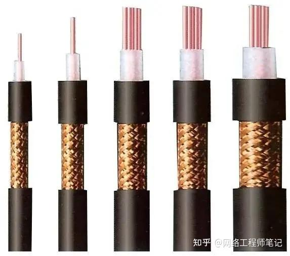

  

  

  

**现在，10Mbps的传输速率早已不能满足目前企业网络需求，因此同轴电缆在目前企业网络中很少应用。这两种以太网已基本被淘汰，企业网中也几乎不再使用它们。**

  

## **双绞线：**

**双绞线**由**两条互相绝缘的铜线**组成，其典型直径为1mm。这两条铜线拧在一起，就可以减少邻近线对电气的干扰。双绞线即能用于传输模拟信号，也能用于传输数字信号，其带宽决定于铜线的直径和传输距离。

  

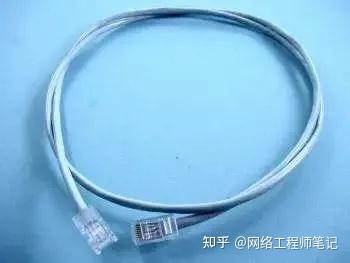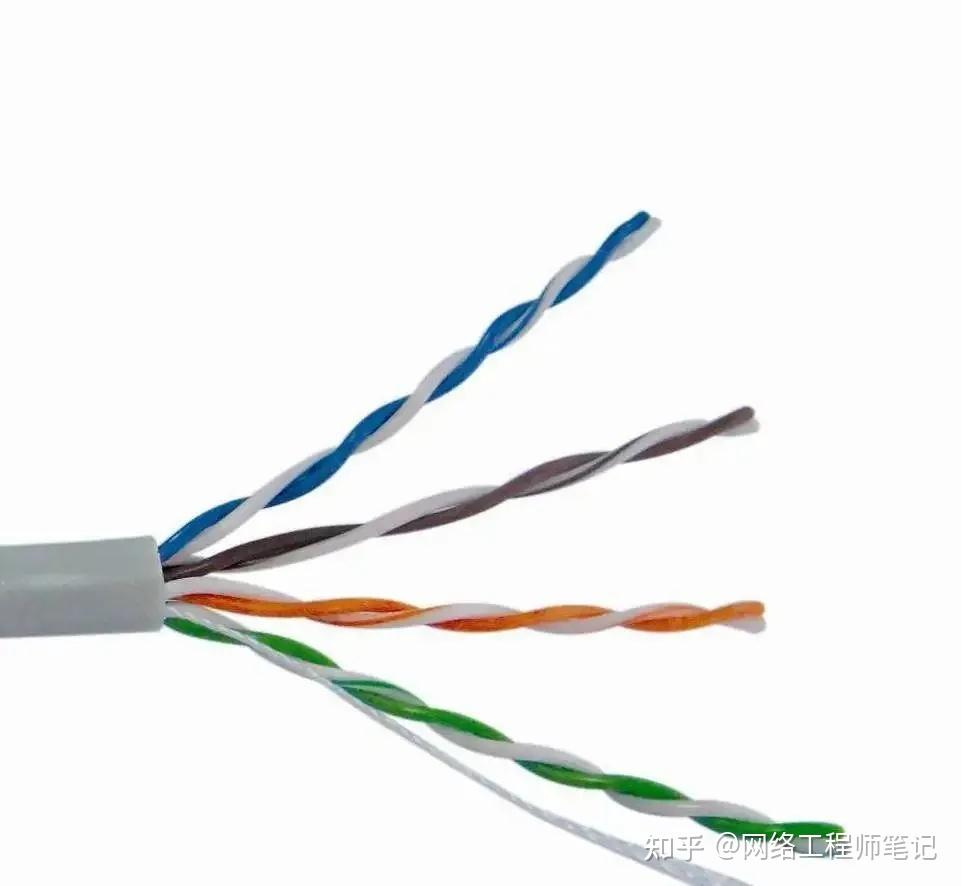

  

  

与同轴电缆相比双绞线（Twisted Pair）具有**更低的制造和部署成本**，因此在企业网络中被**广泛应用**。

  

双绞线可分为**屏蔽双绞线(Shielded Twisted Pair，STP)**和**非屏蔽双绞线(Unshielded Twisted Pair，UTP)**。屏蔽双绞线在双绞线与外层绝缘封套之间有一个**金属屏蔽层**，可以屏蔽电磁干扰。

  

双绞线有很多种类型，**不同类型的双绞线所支持的传输速率一般也不相同**。

  

例如，3类双绞线支持10Mbps传输速率；5类双绞线支持100Mbps传输速率，满足快速以太网标准；超5类双绞线及更高级别的双绞线支持千兆以太网传输。

  

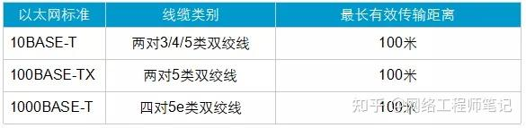

  

双绞线使用**RJ-45接头**连接网络设备。为保证终端能够正确收发数据，**RJ-45接头中的针脚必须按照一定的线序排列。**

## **线序：白橙 橙 白绿 蓝 白蓝 绿 白棕 棕**

  

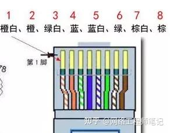

  

  

## **光纤：**

**光纤**是由纯石英玻璃制成的。纤芯外面包围着一层折射率比芯纤低的**包层**，包层外是一**塑料护套**。光纤通常被扎成束，外面有外壳保护。光纤的传输速率可达100Gbit/s.

  

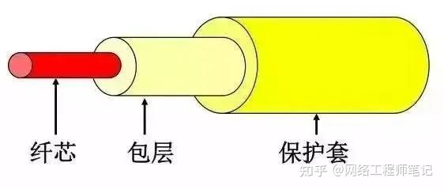

  

  

双绞线和同轴电缆传输数据时使用的是电信号，而**光纤传输数据时使用的是光信号**。

  

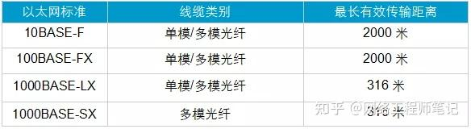

  

光纤支持的传输速率包括10Mbps，100Mbps，1Gbps，10Gbps，甚至更高。

  

**根据光纤传输光信号模式的不同，光纤又可分为单模光纤和多模光纤。**

  

**单模光纤**只能传输一种模式的光，不存在模间色散，因此适用于**长距离高速传输**。

如下图所示：**黄色为单模光纤。**  

  

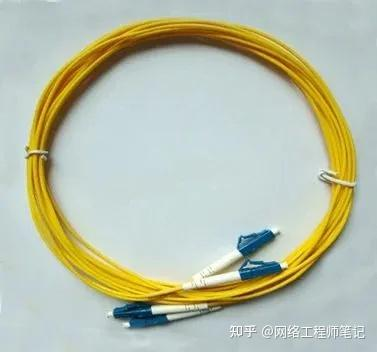

  

  

**多模光纤**允许不同模式的光在一根光纤上传输，由于模间色散较大而导致信号脉冲展宽严重，因此**多模光纤主要用于局域网中的短距离传输**。

如下图所示：**橙色为多模光纤。**

  

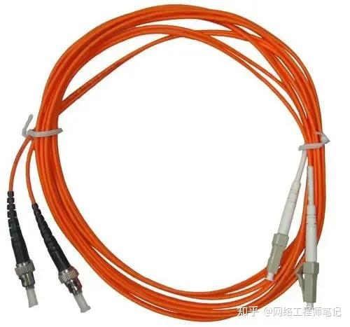

  

  

  

**无线传输介质**指我们周围的自由空间。我们利用无线电波在自由空间的传播可以实现多种无线通信。在自由空间传输的电磁波根据频谱可将其分为无线电波、微波、红外线、激光等，信息被加载在电磁波上进行传输。无线传输的介质有：无线电波、红外线、微波、卫星和激光。

  

无线传输的优点在于安装、移动以及变更都较容易，不会受到环境的限制。但信号在传输过程中容易受到干扰和被窃取，且初期的安装费用较高。

  

### **MAC地址**

  

## **什么是MAC地址**

如同每一个人都有一个名字一样，**每一台网络设备都用物理地址来标识自己，**这个地址就是MAC地址。MAC地址也叫物理地址，大多数网卡厂商把MAC地址烧入了网卡的ROM中。  

网络设备的MAC地址是全球唯一的。

**MAC地址组成**

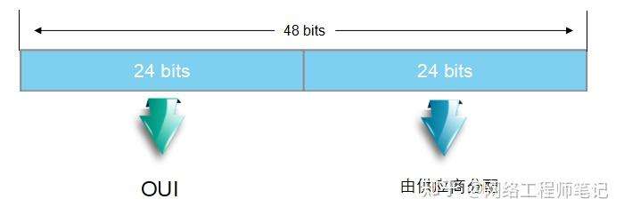

  

MAC地址长度为48比特，通常用十六进制表示。

MAC地址包含两部分：

1、前24比特是**组织唯一标识符（OUI，Organizationally Unique Identifier）**，由**IEEE统一分配给设备制造商**。例如，华为的网络产品的MAC地址前24比特是0x00e0fc。

2、后24位序列号是**厂商分配给每个产品的唯一数值**，由各个厂商**自行分配**（这里所说的产品可以是网卡或者其他需要MAC地址的设备）。

  

## **MAC地址作用**

**数据链路层基于MAC地址进行帧的传输。**发送端使用接收端的MAC地址作为目的地址发送数据帧。

### **IP地址**

大家都知道计算机都会有一个IP地址，**只有配置了IP地址的主机才可以上网**，IP地址的获取可以**手动静态配置**，也可以通过**DHCP动态获取IP地址**。  

如下图所示，本机是自动获取IP地址的，如果使用静态的方式配置IP地址，需要**配置IP地址、子网掩码、默认网关**。

  

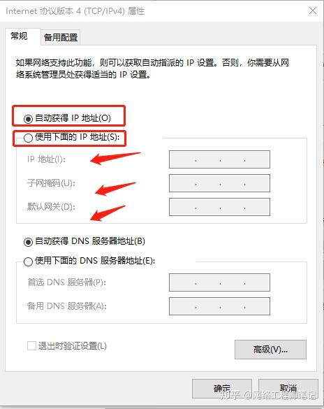

  

  

**如何查看本机动态获取的地址呢？**

通过cmd打开命令提示符，输入“**ipconfig**”,如下图所示可以看到本机获取的IP地址为**192.168.1.25,** 子网掩码为**255.255.255.0**，网关为**192.168.1.1**。

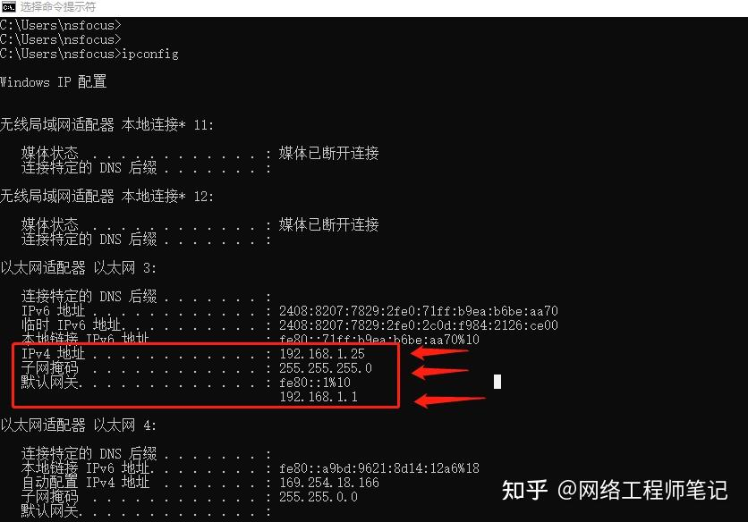

  

  

上面查询到的地址是私网地址，**那么如何查看自己的公网地址呢？**如下图，本机使用的公网地址是**114.252.113.101**，使用的是**北京联通的地址**。

  

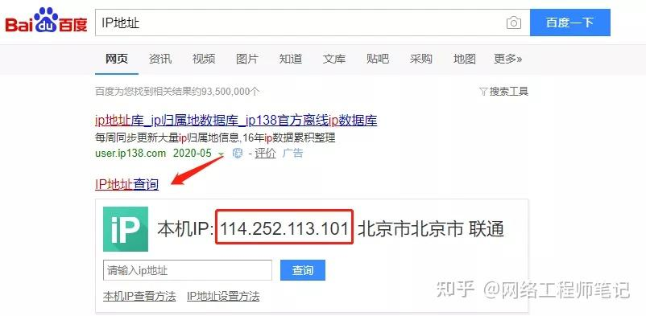

  

> 1**什么是IP地址**  
> IP地址（Internet Protocol Address）是指互联网协议地址，又叫**网际协议地址。**

IP地址是IP协议（IP协议是为计算机网络相互连接进行通信而设计的协议）提供的一种统一的地址格式，它为互联网上的每一个网络和每一台主机分配一个逻辑地址，以此来屏蔽物理MAC地址的差异。

IP地址就像是我们的家庭住址一样，如果你要写信给一个人，你就要知道他（她）的地址，这样邮递员才能把信送到。计算机发送信息就好比是邮递员，它必须知道唯一的“家庭地址”才能不至于把信送错人家。只不过我们的地址是用文字来表示的，计算机的地址用二进制数字表示。

> 2**IP地址作用**

  

IP地址用来**标识网络中的设备**，具有IP地址的设备可以在同一网段内或跨网段通信。（后续会介绍网络中的主机如何通过IP地址进行通信的）

**IP地址包括两部分**，第一部分是**网络号**，表示**IP地址所属的网段**，第二部分是**主机号**，用来**唯一标识本网段上的某台网络设备**。

> 3**IP地址表示**  
> IPv4地址为32比特的二进制数，通常用点分十进制表示

IP地址是一个**32位的二进制数**，通常被分割为4个“8位二进制数”（也就是4个字节）。

IP地址通常用“**点分十进制**”表示成（a.b.c.d）的形式，其中，a,b,c,d都是0~255之间的十进制整数。

例：点分十进IP地址（100.4.5.6），实际上是32位二进制数（01100100.00000100.00000101.00000110）。

  

**二进制和十进制转换：**

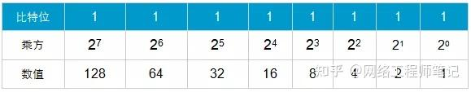

例如：100=64+32+4=**2^6+2^5+2^2** ,那么100的二进制就是 **0110 0100 。**

> 4**IP地址分类**

  

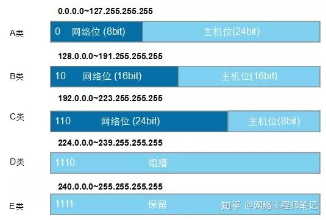

  

  

IPv4地址被划分为A、B、C、D、E五类，每类地址的网络号包含不同的字节数。

**A类，B类，和C类地址为可分配IP地址，每类地址支持的网络数和主机数不同。**

比如，**A类地址可支持126个网络**，每个网络支持2^24 （16,777,216 )个主机地址，另外每个网段中的网络地址和广播地址不能分配给主机。

**C类地址支持200多万个网络**，每个网络支持256个主机地址，其中254个地址可以分配给主机使用。

**D类地址为组播地址**。主机收到以D类地址为目的地址的报文后，且该主机是该组播组成员，就会接收并处理该报文。

  

**各类IP地址可以通过第一个字节中的比特位进行区分**。

  
如A类地址第一字节的最高位固定为0，B类地址第一字节的高两位固定为10，C类地址第一字节的高三位固定为110，D类地址第一字节的高四位固定为1110，E类地址第一字节的高四位固定为1111。

> 5**私有地址、特殊地址:**

IPv4中的部分IP地址被保留用作特殊用途。

为节省IPv4地址，A， B， C类地址段中都预留了特定范围的地址作为**私网地址**。

现在，世界上所有终端系统和网络设备需要的IP地址总数已经超过了32位IPv4地址所能支持的最大地址数4，294，967，296。**为主机分配私网地址节省了公网地址，可以用来缓解IP地址短缺的问题**。企业网络中普遍使用私网地址，不同企业网络中的私网地址可以重叠。默认情况下，网络中的主机无法使用私网地址与公网通信；当需要与公网通信时，私网地址必须转换成公网地址。

## 私有地址范围:

10.0.0.0~10.255.255.255

172.16.0.0~172.31.255.255

192.168.0.0~192.168.255.255

还有其他一些特殊IP地址，如**127.0.0.0网段中的地址为环回地址**，用于诊断网络是否正常。IPv4中的第一个地址**0.0.0.0表示任何网络**，这个地址的作用将在路由原理中详细介绍。IPv4中的最后一个地址**255.255.255.255是0.0.0.0网络中的广播地址**。

## 特殊地址

127.0.0.0 ~ 127.255.255.255

0.0.0.0

255.255.255.255

> 6**子网掩码:**

上面介绍到IP地址由网络部分和主机部分组成，那么如何区分呢？**子网掩码用于区分网络部分和主机部分。**

子网掩码与IP地址的表示方法相同。

**每个IP地址和子网掩码一起可以用来唯一的标识一个网段中的某台网络设备**。子网掩码中的1表示网络位，0表示主机位。

例如：子网掩码 255.128.0.0表示网络位为9位，主机位为23位。

## **默认子网掩码：**

每类IP地址有一个缺省子网掩码。

**A类地址的缺省子网掩码为8位**，即第一个字节表示网络位，其他三个字节表示主机位。

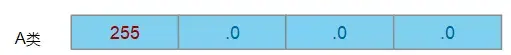

  

  

**B类地址的缺省子网掩码为16位**，因此B类地址支持更多的网络，但是主机数也相应减少。

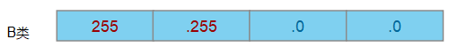

  

**C类地址的缺省子网掩码为24位**，支持的网络最多，同时也限制了单个网络中主机的数量。

  

  

### **ARP协议**

## 一台主机要发送数据给另一台主机时，必须要知道**目的主机的网络层地址**（即IP地址）。IP地址由网络层来提供，但是仅有IP地址是不够的。**IP数据报文必须封装成帧才能通过数据链路进行发送。**数据帧必须要包含目的MAC地址，因此**发送端还必须获取到目的MAC地址**。那么如何获取对方的mac地址呢？通过**ARP（Address Resolution Protocol）协议**可以**根据IP地址获取对方的MAC地址**。

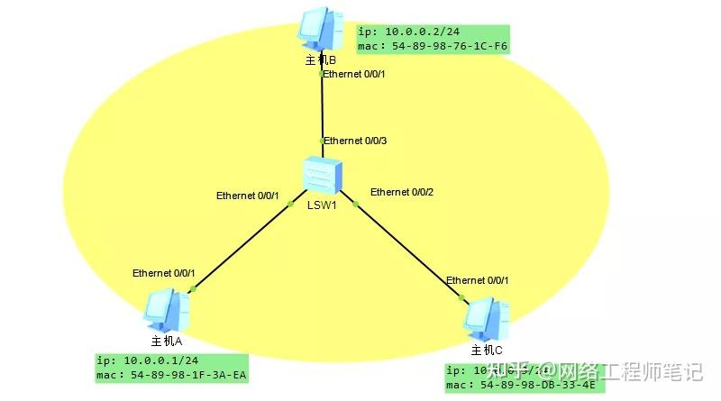

  
如上图所示：  
  
主机A（ip为10.0.0.1）要和主机C（ip为10.0.0.3）通信，数据包经过主机A的封装后发给主机C，**我们知道主机A封装数据时除了要知道对方的IP地址，还需要知道对方的MAC地址**，这时候就需要**借助ARP协议**了。  
  
下面我们看下ARP是如何获取主机C的MAC地址的？  
  
  
**1、ARP请求：**  
主机A首先会去**检查ARP缓存表**（ARP缓存用来存放IP地址和MAC地址的关联信息）中是否存在主机C的MAC地址。  
  
本例中由于是第一次通信，主机A的ARP缓存表中没有主机C的MAC地址。  
  
这时**主机A会发送ARP request报文（广播报文）**来获取主机C的MAC地址。  
  
之前已经讲过广播的概念的，广播报文只会在广播域中传播，路由器可以隔离广播域。[你知道以太网数据帧在网络中如何发送和接收的吗？一文带你搞懂它](https://link.zhihu.com/?target=http%3A//mp.weixin.qq.com/s%3F__biz%3DMzIwOTcyNjA3Mw%3D%3D%26mid%3D2247486213%26idx%3D1%26sn%3D57afe676942948f565d602d9a167d3b2%26chksm%3D976e3413a019bd055cbe2815d4065758f1db89fd74ede9801ffee886f4a4dd4766cd0f315cb6%26scene%3D21%23wechat_redirect)  
  
  

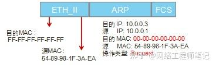

  
  
**ARP request报文**封装**在以太帧**里。  
  
**帧头**中的源MAC地址为发送端主机A的MAC地址。此时，由于主机A不知道主机C的MAC地址，所以目的MAC地址为广播地址FF-FF-FF-FF-FF-FF。  
  
**ARP request报文中包含源IP地址、目的IP地址、源MAC地址、目的MAC地址**，其中目的MAC地址的值为0。  
  
**ARP Request报文会在整个网络上传播**，该网络中所有主机包括网关都会接收到此ARP request报文。网关将会阻止该报文发送到其他网络上。  
  
本例中主机B和主机C都会收到主机A发送的ARP广播请求报文。  
  
  
**2、ARP应答：**  
主机B收到主机A发送的ARP广播请求报文，查看目的IP不是自己**会丢弃**，但是会在自己的**ARP缓存表中记录主机A的IP和MAC的映射关系**，在主机B上通过命令**arp -a** 可以查询到；  
  

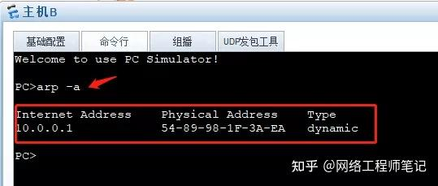

  
  
主机C发现目的IP是自己，会在自己的**ARP缓存表中记录主机A的IP和MAC的映射关系**，并会**向主机A单播回应ARP Reply报文**。  
  
主机A收到主机C的回应报文后后会在自己的**ARP缓存表中记录主机C的IP和MAC的映射关系**，下次发送数据是就可以查询到主机C的MAC。  
  

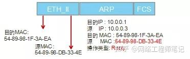

  
  
**ARP Reply报文中**的源协议地址是主机C自己的IP地址，目标协议地址是主机A的IP地址，目的MAC地址是主机A的MAC地址，源MAC地址是自己的MAC地址，同时Operation Code被设置为reply。  
  
**ARP Reply报文通过单播传送。**

### **TCP协议**

我们知道**TCP是传输层协议**，用于**为应用层提供服务**，通过**端口号**可以**唯一标识一个应用。**

> 1**什么是TCP?**

  

**TCP** 是**面向连接的,提供端到端可靠性服务**的传输层协议。

  

## **面向连接：**

  

**面向连接中通信中**，会在在**两个端点**之间建立了一条**可靠的**数据通信信道。

  

**电话**就是一种**面向连接的服务**，双方建立连接后才能够通话，可以确保对方听到你说话；而**发短信**就不是一种面向连接的服务，你随时可以发送短信，但是不能确保对方及时收到。

  

## **端到端可靠**:

  

保证从发送端发送的报文都可以被目的端收到，哪怕被丢弃，也可以让发送端重传;  

  

  

> 2**为什么需要TCP,TCP可以解决什么问题?**

  

IP 层是「**不可靠**」的，它只负责数据包的发送，但它不保证数据包能够被接收、不保证网络包的按序交付、也不保证网络包中的数据的完整性。

  

如果需要**保障网络数据包的可靠性**，那么就需要**由上层（传输层）的 TCP 协议来负责**。

  

因为 TCP 是一个工作在**传输层**的**可靠**数据传输的服务，它能确保接收端接收的网络包是**无损坏、无间隔、非冗余和按序的。后续会讲TCP协议是如何确保数据包的可靠传输的？**

  

> 3**TCP报文格式**  
> 我们知道待发送的数据是根据TCP/IP四层模型层层封装的，那么TCP协议是如何封装的？下面我们看下**TCP的报文格式。**

  

  

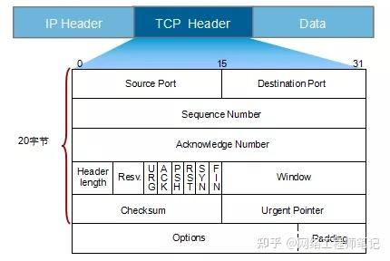

  

  

如图所示为**TCP报文头格式。**

  

TCP数据段由**TCP Header（头部）**和**TCP Data（数据）**组成。TCP最多可以有**60个字节**的头部，如果没有Options字段，正常的长度是**20字节**。

  

  

## **下面我们一起看下TCP头部的各个字段：**

  

**1、16位源端口号：**源主机的应用程序使用的端口号。

  

**2、16位目的端口号：**目的主机的应用程序使用的端口号。每个TCP头部都包含源和目的端的端口号，这两个值加上IP头部中的源IP地址和目的IP地址可以唯一确定一个TCP连接。

  

  

  

TCP允许一个主机同时运行多个应用进程。每台主机可以拥有多个应用端口，**每对端口号、源和目标IP地址的组合唯一地标识了一个会话**。  

  

  

端口分为**知名端口**和**动态端口**。

  

有些网络服务会使用固定的端口，这类端口称为**知名端口**，端口号范围为0-1023。如FTP、HTTP、Telnet、SNMP服务均使用知名端口。

  

**动态端口号**范围从1024到65535，这些端口号一般不固定分配给某个服务，也就是说许多服务都可以使用这些端口。只要运行的程序向系统提出访问网络的申请，那么系统就可以从这些端口号中分配一个供该程序使用。

  

  

  

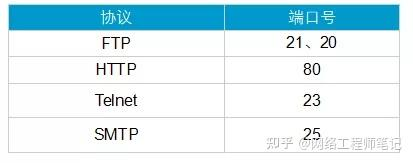

  

  

**3、32位序列号：**用于标识从**发送端**发出的不同的TCP数据段的序号。**可以解决网络包乱序问题。**

  

数据段在网络中传输时，它们的顺序可能会发生变化；接收端**依据此序列号**，便可**按照正确的顺序重组数据**。

  

假定主机A和B进行tcp通信，A传送给B一个tcp报文段中，**序号值被系统初始化为某一个随机值ISN**，那么在该传输方向上（从A到B），后续的所有tcp报文段中的序号值都会被设定为**ISN加上该报文段所携带数据的第一个字节在整个字节流中的偏移**。例如某个TCP报文段传送的数据是字节流中的第**1025**~2048字节，那么该报文段的序号值就是ISN+**1025**。

  

**4、32位确认序列号：**用于标识**接收端**确认收到的数据段。确认序列号为**成功收到的数据序列号加1**。**用来解决不丢包的问题**。

  

假定主机A和B进行tcp通信，那么A发出的tcp报文段不但带有自己的序号，也包含了对B发送来的tcp报文段的确认号。反之也一样。**若确认号=N，则表明：到序号N-1为止的所有数据都已正确收到。**

  

**5、4位头部长度：**表示头部占32bit字的数目，它能表达的TCP头部最大长度为60字节。

  

**6、6位标志位：**

  

**URG：**紧急指针是否有效。它告诉系统此报文段中有**紧急数据**，应**尽快传送**（相当于高优先级的数据），而不要按原来的排队顺序来传送。

  

例如，已经发送了很长的一个程序在远端的主机上运行。但后来发现了一些问题，需要取消该程序的运行。因此用户从键盘发出中断命令（Control+c）。如果不使用紧急数据，那么这两个字符将存储在接收TCP的缓存末尾。只有在所有的数据被处理完毕后这两个字符才被交付接收方的应用进程。这样做就浪费了许多时间。

  

当URG置为1时，发送应用进程就告诉发送方的TCP有紧急数据要传送。于是**发送方TCP就把紧急数据插入到本报文段数据的最前面**，而在紧急数据后面的数据仍时普通数据。这时要与首部中**紧急指针字段**配合使用。

  

**ACK：**表示确认号是否有效，携带ack标志的报文段也称确认报文段，**仅当ACK=1时确认号字段才有效。**当ACK=0时，确认号无效。TCP规定，在连接建立后所有的传送的报文段都必须把ACK置1。

  

**PSH：**提示**接收端**应用程序应该立即**从tcp接受缓冲区中读走数据**，为后续接收的数据让出空间。

  

当两个应用进程进行交互式的通信时，**有时在一端的应用进程希望在键入一个命令后立即就能收到对方的响应。**在这种情况下，TCP就可以使用推送操作。这时，发送方TCP把PSH置1，并立即创建一个报文段发送出去。**接收方TCP收到PSH=1的报文段，就尽快地交付接收应用进程**，而不再等到整个缓存都填满了后向上交付。虽然应用程序可以选择推送操作，但推送还很少使用。

  

**RST**：表示要求对方**重建连接**。带RST标志的tcp报文段也叫复位报文段。

  

当RST=1时，表明TCP连接中出现严重差错（如由于主机崩溃或其他原因），必须释放连接，然后再重新建立运输连接。RST置1还用来拒绝一个非法的报文段或拒绝打开一个连接。

  

**SYN：**表示建立一个连接，携带SYN的tcp报文段为**同步报文段**。在连接建立时**用来同步序号**。

  

当SYN=1而ACK=0时，表明这是一个**连接请求报文段**。对方若同意建立连接，则应在相应的报文段中使用SYN=1和ACK=1。因此，SYN置为1就表示这是一个连接请求。

  

**FIN标志：**表示告知对方本端要关闭连接了。用来释放一个连接。

  

当FIN=1时，表明此报文段的发送方的数据已发送完毕，并要求释放运输连接。

  

**7、16位窗口大小**：表示接收端期望通过单次确认而收到的数据的大小。由于该字段为16位，所以窗口大小的最大值为65535字节，该机制通常**用来进行流量控制**。

  

**窗口值**是【0，2^16-1\]之间的整数。**窗口**指的是**发送本报文段的一方的接收窗口（而不是自己的发送窗口）**。

  

**窗口值告诉对方：**从本报文段首部中的确认号算起，接收方目前允许对方发送的数据量。之所以要有这个限制，是因为接收方的数据缓存空间是有限的。

  

总之，窗口值作为接收方让发送方设置其发送窗口的依据。并且窗口值是经常在动态变化着。  

  

**8、16位校验和：**校验整个TCP报文段，包括TCP头部和TCP数据。该值由发送端计算和记录并由接收端进行验证。

  

**9、16位紧急指针：**是一个正的偏移量。它和序号字段的值相加表示最后一个紧急数据的下一字节的序号。因此这个字段是紧急指针相对当前序号的偏移量。**发送紧急数据时会用到这个。**

  

紧急指针仅在URG=1时才有意义，它指出本报文段中的紧急数据的字节数（紧急数据结束后就是普通数据）。

  

因此，紧急指针指出了紧急数据的末尾在报文段中的位置。当所有紧急数据都处理完时，TCP就告诉应用程序恢复到正常操作。值得注意的是，即使窗口为零时也可发送紧急数据。

  

**10、选项：**长度可变，最长可达40字节。当没有使用“选项”时，TCP的首部长度是20字节。

  

### **UDP协议**

> 1**什么是UDP？**

  

UDP 是**User Datagram Protocol**的简称， 中文名是**用户数据报协**议，是OSI（Open System Interconnection，开放式系统互联） 参考模型中一种**无连接的传输层协议**，**传输可靠性没有保证**。  

  

> 2**UDP报文头**

  

  

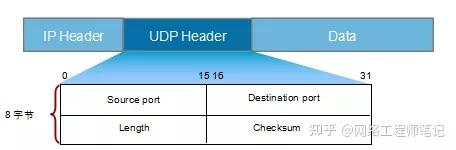

  

  

UDP报文分为**UDP报文头**和**UDP数据区域**两部分。报头由源端口、目的端口、报文长度以及校验和组成。

  

UDP头部的标识如下：

  

**16位源端口号：**源主机的应用程序使用的端口号。

  

**16位目的端口号：**目的主机的应用程序使用的端口号。

  

**16位UDP长度：**是指UDP头部和UDP数据的字节长度。因为UDP头部长度为8字节，所以该字段的最小值为8。

  

**16位UDP校验和：**该字段提供了与TCP校验字段同样的功能；该字段是可选的。

  

> 3 **为什么需要UDP？**

  

**UDP(User Datagram Protocol)传输**与**IP传输**非常类似，它的传输方式也是"**Best Effort**"的，所以**UDP协议**也是**不可靠**的。

  

我们知道TCP就是为了解决IP层不可靠的传输层协议，既然UDP是不可靠的，**为什么不直接使用IP协议而要额外增加一个UDP协议呢**？

  

1、一个重要的原因是**IP协议中并没有端口(port)**的概念。IP协议进行的是IP地址到IP地址的传输，这意味者两台计算机之间的对话。但每台计算机中需要有多个通信通道，并将多个通信通道分配给不同的进程使用。**一个端口就代表了这样的一个通信通道**。UDP协议实现了端口，从而让数据包可以在送到IP地址的基础上，进一步可以送到某个端口。

  

2、**对于一些简单的通信，我们只需要“Best Effort”式的IP传输就可以了**，而不需要TCP协议复杂的建立连接的方式(特别是在早期网络环境中，如果过多的建立TCP连接，会造成很大的网络负担，而UDP协议可以相对快速的处理这些简单通信）

  

3、在使用TCP协议传输数据时，如果一个数据段丢失或者接收端对某个数据段没有确认，发送端会重新发送该数据段。TCP重新发送数据会带来传输延迟和重复数据，降低了用户的体验。**对于迟延敏感的应用，少量的数据丢失一般可以被忽略，这时使用UDP传输将能够提升用户的体验**。

  

**更多精彩文章：**

1.从零开始学网络｜搞懂OSI参考模型和TCP/IP分层模型，看这篇文章就够了

[从零开始学网络｜搞懂OSI参考模型和TCP/IP分层模型，看这篇文章就够了](https://link.zhihu.com/?target=https%3A//mp.weixin.qq.com/s/Lb1wDrw4BtKKyQv5Ni6f6Q)

2.从零开始学网络｜一篇文章告诉你平时发送的消息是如何在网络中转发的

[从零开始学网络｜一篇文章告诉你平时发送的消息是如何在网络中转发的](https://link.zhihu.com/?target=https%3A//mp.weixin.qq.com/s/Wg4Abhi0mD4DJVjF60Z12A)

3.带你捋捋常见的传输介质，快去看看你家的入户光纤长啥样吧？

[带你捋捋常见的传输介质，快去看看你家的入户光纤长啥样吧？](https://link.zhihu.com/?target=https%3A//mp.weixin.qq.com/s/Z16JRf6g-ao6WGUEOflgow)

4.你知道以太网数据帧在网络中如何发送和接收的吗？一文带你搞懂它

[你知道以太网数据帧在网络中如何发送和接收的吗？一文带你搞懂它](https://link.zhihu.com/?target=https%3A//mp.weixin.qq.com/s/uM1cJ2SRXBzpYf9A3ux_Cw)

5.如何查询你电脑的IP地址？一文带你搞懂IP地址

[如何查询你电脑的IP地址？一文带你搞懂IP地址](https://link.zhihu.com/?target=https%3A//mp.weixin.qq.com/s/0gaxBQWap4DLDaagz11l-Q)

6.用wireshark抓包带你详解下IP报文头

[用wireshark抓包带你详解下IP报文头](https://link.zhihu.com/?target=https%3A//mp.weixin.qq.com/s/_kgc_q9YVgFa6oXIh12N6Q)

7.网络排障工具：ping 和 tracert 技术详解

[网络排障工具：ping 和 tracert 技术详解](https://link.zhihu.com/?target=https%3A//mp.weixin.qq.com/s/suR1DnAtY462Uberm1WMNA)

8.如何根据IP获取对方的MAC地址？ARP协议了解一下

[如何根据IP获取对方的MAC地址？ARP协议了解一下](https://link.zhihu.com/?target=https%3A//mp.weixin.qq.com/s/AA9HDIN_0dm4QZD0MyJgTA)

9.ARP代理技术详解｜如何实现同一网段但不在同一广播域的的两台主机通信？

[ARP代理技术详解｜如何实现同一网段但不在同一广播域的的两台主机通信？](https://link.zhihu.com/?target=https%3A//mp.weixin.qq.com/s/cfSpCE8RTo9WCIOpiGr8XA)

10.深入浅出TCP协议，为什么需要TCP协议？

[深入浅出TCP协议，为什么需要TCP协议？](https://link.zhihu.com/?target=https%3A//mp.weixin.qq.com/s/oAy1bt8NXT8rzJhm8FFknA)

11.实战 | wireshark抓包解析TCP三次握手和四次分手的过程

[实战 | wireshark抓包解析TCP三次握手和四次分手的过程](https://link.zhihu.com/?target=https%3A//mp.weixin.qq.com/s/52o8dvlnpTsDSaVP17SOGA)

12.有了TCP ，为什么还需要UDP？一文带你搞懂UDP协议

[有了TCP ，为什么还需要UDP？一文带你搞懂UDP协议](https://link.zhihu.com/?target=https%3A//mp.weixin.qq.com/s/qoS3Hr59kfAtRxxucAtniQ)

13.路由技术详解｜IP数据包是如何在网络中转发的？

[https://mp.weixin.qq.com/s/FWbhAWu\_V5bE4IZGYHON6w7](https://link.zhihu.com/?target=https%3A//mp.weixin.qq.com/s/FWbhAWu_V5bE4IZGYHON6w7)

14.如何通过静态路由实现负载分担和主备路由？｜内附知识卡片总结

[如何通过静态路由实现负载分担和主备路由？｜内附知识卡片总结](https://link.zhihu.com/?target=https%3A//mp.weixin.qq.com/s/xtj6d50sNWSHKrRkp8pymQ)

15.知识卡片｜最全RIP动态路由协议技术详解

[知识卡片｜最全RIP动态路由协议技术详解](https://link.zhihu.com/?target=https%3A//mp.weixin.qq.com/s/iTzlE_JXpGIOSfbKYKnu7w)

16.知识卡片 | 链路状态路由协议OSPF凭什么会取代RIP？

[知识卡片 | 链路状态路由协议OSPF凭什么会取代RIP？](https://link.zhihu.com/?target=https%3A//mp.weixin.qq.com/s/lYyTMkqU6lNj-xXaLI575g)

17.5种报文、8种邻居状态机详解OSPF工作原理

[5种报文、8种邻居状态机详解OSPF工作原理](https://link.zhihu.com/?target=https%3A//mp.weixin.qq.com/s/jZEeDiibWsSUjWX-ww7-pw)

18.wireshark抓取OSPF协议交互的5种报文分析OSPF路由协议建立邻接关系的过程

[wireshark抓取OSPF协议交互的5种报文分析OSPF路由协议建立邻接关系的过程](https://link.zhihu.com/?target=https%3A//mp.weixin.qq.com/s/PE97O4Y-cdfuy94E628oWg)

19.你知道上网时输入的URL是怎么解析成IP地址的吗？一文带你搞懂DNS

[你知道上网时输入的URL是怎么解析成IP地址的吗？一文带你搞懂DNS](https://link.zhihu.com/?target=https%3A//mp.weixin.qq.com/s/TQj2R9rV21l8D9N1A8RU1w)

20.如何提高网络中物理链路的可靠性——​链路聚合技术详解

[如何提高网络中物理链路的可靠性——​链路聚合技术详解](https://link.zhihu.com/?target=https%3A//mp.weixin.qq.com/s/7zbNkO-sIoZ93GDtAoAm4g)

21.你知道你的电脑IP地址是如何获取的吗？一文带你搞懂DHCP动态主机配置协议

[你知道你的电脑IP地址是如何获取的吗？一文带你搞懂DHCP动态主机配置协议](https://link.zhihu.com/?target=https%3A//mp.weixin.qq.com/s/O_OTwoKzFBXelqMCfM5C8Q)

22.交换机是如何转发带有VLAN的数据帧的？一文带你搞懂VLAN技术原理

[交换机是如何转发带有VLAN的数据帧的？一文带你搞懂VLAN技术原理](https://link.zhihu.com/?target=https%3A//mp.weixin.qq.com/s/f7LXZiQkv6m4dQTeqEHaWQ)

23.VLAN是二层隔离技术，如何实现VLAN间三层通信呢？今天教你3种方法

[VLAN是二层隔离技术，如何实现VLAN间三层通信呢？今天教你3种方法](https://link.zhihu.com/?target=https%3A//mp.weixin.qq.com/s/FFPi0cPC9r8gOwVENYCuaQ)

24.如何通过单臂路由实现VLAN间通信？（配置篇）

[如何通过单臂路由实现VLAN间通信？（配置篇）](https://link.zhihu.com/?target=https%3A//mp.weixin.qq.com/s/pG13ujqWtNHedKMNUW6VXQ)

25.10张图带你搞懂数据链路层PPP点到点协议

[10张图带你搞懂数据链路层PPP点到点协议](https://link.zhihu.com/?target=https%3A//mp.weixin.qq.com/s/uNL2O2hpF5IFkRB50LVDdQ)

27.wireshark抓取点到点PPP协议交互报文（配置篇）

[wireshark抓取点到点PPP协议交互报文（配置篇）](https://link.zhihu.com/?target=https%3A//mp.weixin.qq.com/s/HDgvVJbeB_3oSRtk-JlQSQ)

28.你知道你的PC是如何拨号上网的吗？【PPPoE拨号技术】了解一下

[你知道你的PC是如何拨号上网的吗？【PPPoE拨号技术】了解一下](https://link.zhihu.com/?target=https%3A//mp.weixin.qq.com/s/spTWXnl9VOh60GsN9limAw)

29.【干货】40张思维导图带你掌握华为数通基础(一)

[【干货】40张思维导图带你掌握华为数通基础(一)](https://link.zhihu.com/?target=https%3A//mp.weixin.qq.com/s/G-fDWxGCLyi9tk56-o1CtA)

30.【干货】40张思维导图带你掌握华为数通基础(二)

[【干货】40张思维导图带你掌握华为数通基础(二)](https://link.zhihu.com/?target=https%3A//mp.weixin.qq.com/s/odGjwxvWTdIQ8F-L6ErQHg)