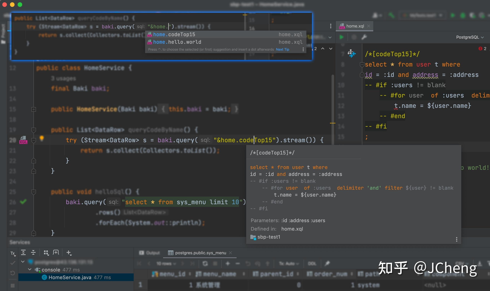
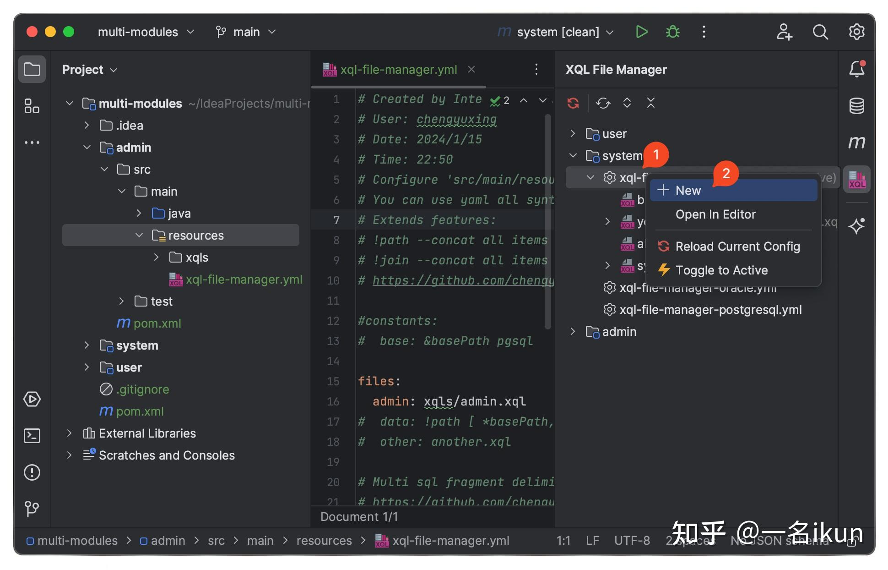
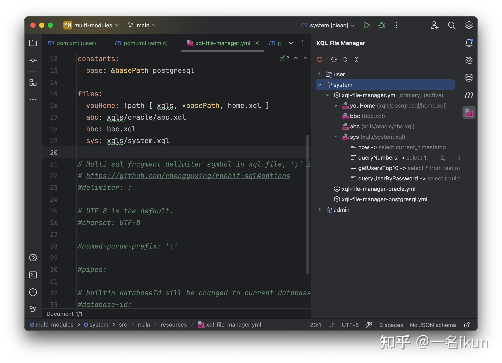
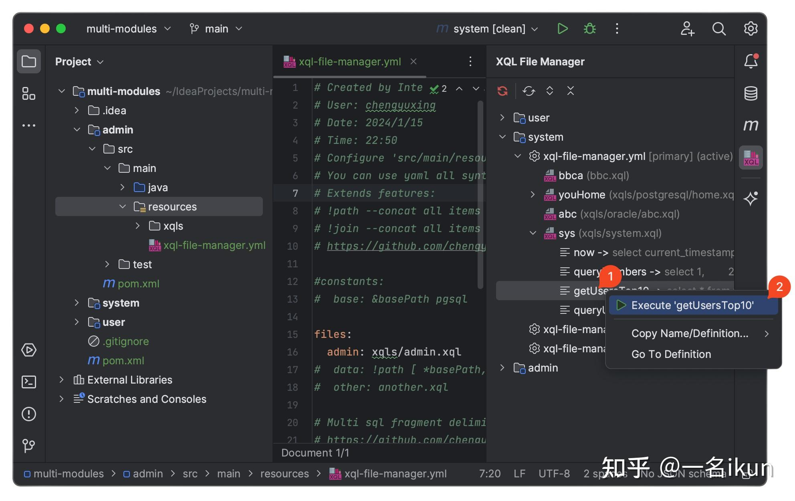
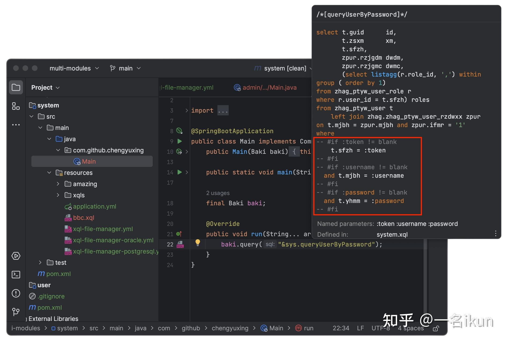
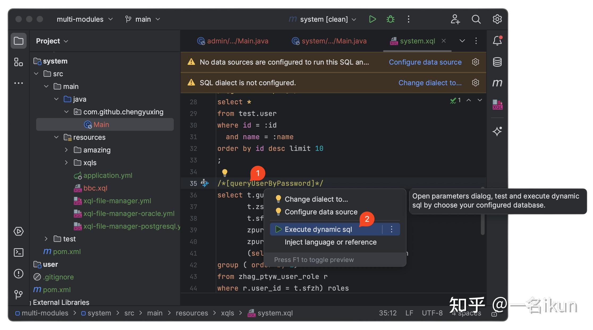
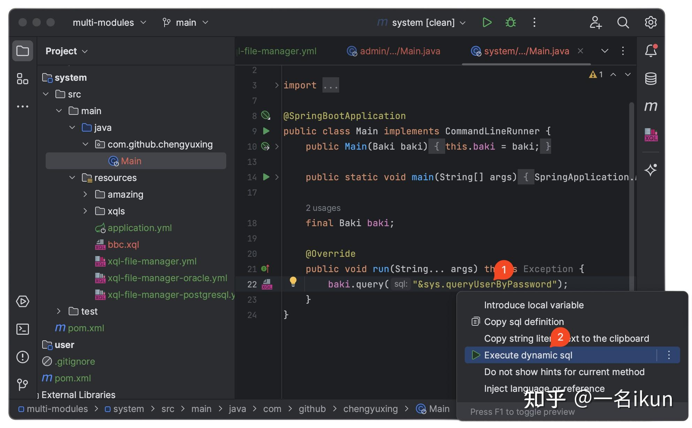
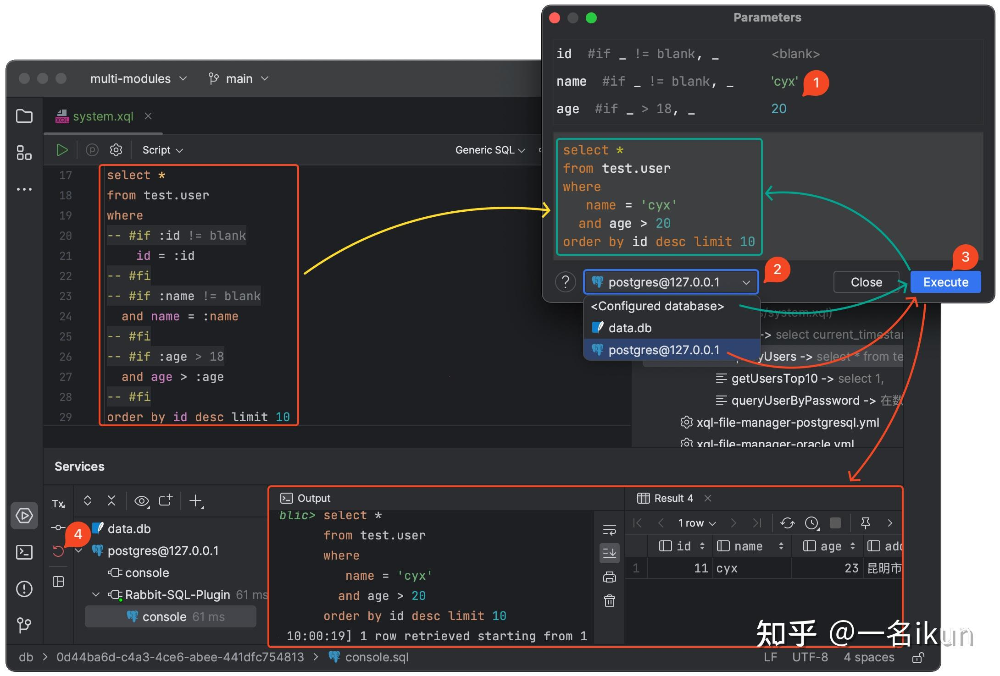
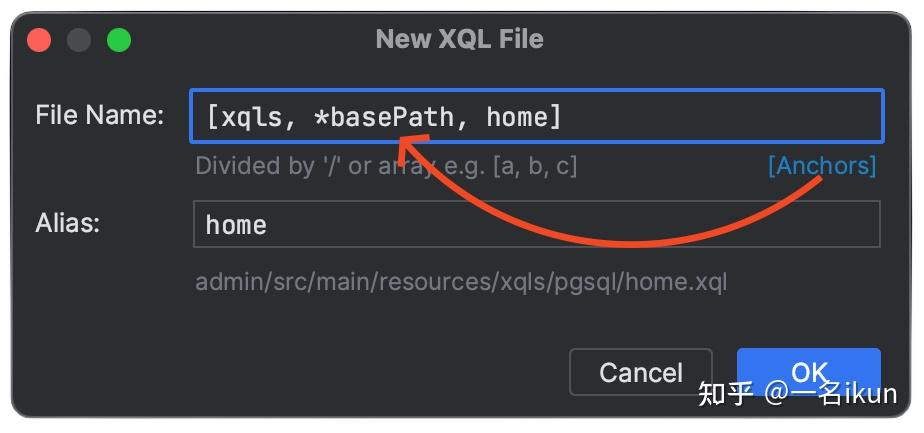
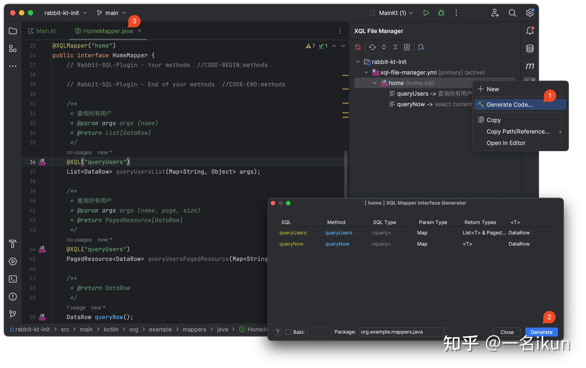

以手写sql为主的项目，不想再用Mybatis及其衍生框架了，业务逻辑没多少，代码生成文件倒是一大坨；

也不想写xml了，好繁琐，还不如直接写原生jdbc让人心情不那么沉重。

我曾经使用过C#的linq，真的是很棒的一个东西，可是java由于语言语法的限制，根本不可能做到，所以产生了一大堆用java代码模拟sql的框架，比单纯的写sql还复杂啰嗦？

```java
query(...).join().where().and(...).and(...).end()...
```

我想如果有那么一个小巧的库，对jdbc简单的封装，可以在一个地方统一管理sql，能让我最简单的执行sql，设置参数，获取结果，没有任何心智负担，我就很满足了！

幸运的是，我发现了这样一个满足我需求的库：

[https://rabbit-sql.com](https://link.zhihu.com/?target=https%3A//rabbit-sql.com)

## 第一个查询

搭配spring-boot框架，不超过1行代码，我的第一个查询就搞定了？！

`pom.xml`

```xml
<!-- java8 -->
<dependency>
    <groupId>com.github.chengyuxing</groupId>
    <artifactId>rabbit-sql-spring-boot-starter</artifactId>
    <version>5.3.14</version>
</dependency>
```

`application.yml`

```yaml
spring:
  datasource:
    url: jdbc:postgresql://127.0.0.1:5432/postgres
    username: 
    password: 
```

`myService.java`

```java
@Autowired
Baki baki;
...
baki.query("select current_timestamp").findFirst()
                                      .ifPresent(System.out::println);
```

分页查询同样如此简单，大部分情况下的分页查询可以简化到这个程度：

```java
baki.query("select ... where age > :age")
    .arg("age", 15)
    .pageable(1, 10)
    .collect();
```

研究了下，返回Stream的接口和Jpa中的是一个逻辑，都是惰性执行，这样有一个好处，进行数据的二次处理底层只执行了一次循环，这点很赞，需要注意的是，Stream用完需要关闭：

```java
try (Stream<DataRow> s = baki.query("...").stream()) {
            List<User> users = s.map(d -> d.toEntity(User.class))
                    .peek(System.out::println)
                    .filter(u -> u.getAge() > 18)
                    .filter(u -> !u.getName().equals("admin"))
                    .collect(Collectors.toList());
        }
```

传统的返回List后，如果想再对结果集进行二次处理，不得不再执行一次循环，至少就得执行2次循环。

顺便一提，我很喜欢**链式调用**风格和**java8的函数式**，这个库很符合我的口味！

## 管理sql文件

重点来了，我心心念念的**在一个地方统一管理sql**，配置和调用竟如此的简便，这也太变态（喜欢）了，什么神仙写法！！！

-   sql片段名格式以注释的方式加上方括号来定义；
-   还支持预编译参数 `:参数名`，能防止sql注入风险；
-   统一的sql管理文件：`xql-file-manager.yml`;
-   获取sql并执行竟然以前缀 `&` + `sql文件别名` + `sql片段名` 组合三部分就可以，直观明了；

`resources/someSql/myData.xql`

```sql
/*sql片段名*/
/*[queryUsers]*/
select * from users where age >= :age;
```

`resources/xql-file-manager.yml`

```yaml
# 定义sql文件别名
files:
  data: someSql/myData.xql
  ...
```

`myService.java`

```java
@Autowired
Baki baki;
...
try (Stream<DataRow> s = baki.query("&data.queryUsers").arg("age", 15).stream()) {
     s.forEach(System.out::println);
}
```

## 动态sql

更神奇的来了，动态sql，从来没有想过，竟然能写在注释里，效果和mybatis的标签差不多，但不会破坏sql的结构。

这也是我认为最好的一个地方，我几乎可以不用在java代码里拼条件了，我可以很直观的看到整个sql的全貌，在sql编辑器中也不会到处提示语法错误，因为这本来就是标准的注释！

`resources/someSql/myData.xql`

```sql
/*[queryUsers]*/
select * from users where 
-- #if :age != blank
   age >= :age
-- #fi
;
```

我感觉根本不用解释，我都知道这个逻辑，`age` 不是 `null` 或者 `""` ， 那就加上 `age >= :age` 筛选，否则就查询全部，执行一下，果然如我所想。

我个人感觉用下来，这个库整体设计思路和Mybatis很像，但配置更简单；使用上来说，像JdbcTemplate，但接口更直观，总体感觉更加轻量化。

特别说一下，其中**SQL文件管理器**是我最喜欢的。

还有很多很多细节，我这里就不多介绍了，如果你不是一个吹毛求疵的人，更详细的可以看文档。

## 插件

最后，再分享一个IDEA的插件：

[Rabbit SQL - IntelliJ IDEs Plugin | Marketplace](https://link.zhihu.com/?target=https%3A//plugins.jetbrains.com/plugin/21403-rabbit-sql)

作者很贴心，为了更方便的使用，特意开发了一个插件，有这个插件的加持，使用起来更加得心应手，idea里面直接搜索安装就行，下面是使用此插件的效果截图：



根据上图可以看出一些特性：

1.  sql名支持智能提示；
2.  鼠标经过高亮的sql名，可以显示sql字符串和预编译参数；
3.  query接口可以原生支持sql语法高亮和注入数据源获取完整的sql智能提示；
4.  xql文件中的sql和动态sql语法都支持高亮；
5.  xql文件名支持导航（有导航图标）；
6.  动态sql语法均支持**live templates**，输入 `xql` 就能获取提示。

经测试发现，后缀为 `.xql` 的文件才能支持插件完整功能，且修改文件后需要按 `Ctrl+s` 来触发更新。

插件描述中看到，作者提供了创建`xql`文件和`xql-file-manager.yml`（为什么还要手打文件名，而不是默认，可能作者有其他用意？）的菜单项来生成模版，还挺方便的。



对于我所经历过的项目使用感受来说，即使说不上完美，源代码不是那么优美，但这个库确实解决了一些痛点，让我眼前一亮。

作者独立开发免费开源分享出来，不以任何盈利为目的，作为伸手党的我，知足了，值得我说一声感谢了！

* * *

## 更新补充

### 2023-5-15

今天IDEA收到了插件更新提醒，立即更新试试。

插件`1.11`版不再支持 `xql-file-manager.properties`，而是改为`xql-file-manager.yml`。

相应的也要更新最新的`rabbit-sql-spring-boot-starter`版本到**2.8.17** 来支持 新的`yml`配置（项目运行读取 properties 依然支持，只是插件不识别），**吐槽一下插件断崖式的更新方式**。

不过总的来说，使用yml配置真的舒服太多了，真赞，大概总结下：

1.  `filenames`连着写一串真的受不了；
2.  键名更简短简洁了；
3.  还能用`yml`的**锚**来复用变量；
4.  Idea原生对`yml`文件的语法高亮支持和语法检查比`properties`好太多。



### 2024-2-9

收到了2.2.2版本的更新，看日志修复了很多细节和bug，能看得见的新增功能如下：

1\. 支持执行测试动态sql，以前用mybatis的痛点，我印象中好像没有插件来解析那些标签方便的测试，这个可以，这点确实好，整个测试所见即所得，值得表扬，还有就是如果没有配置数据源仅仅输出最终生成的sql，反之真正连库执行，默认是开启事物的，记得测试完手动点击回滚或提交，dml语句可完全放心了。



2\. 快捷新建xql文件，免去了注册和配置别名的繁琐步骤，也降低了手动配置的错误率，直接**XQL File Manager**面板右击**New。**


支持普通的路径格式，同样也兼容了yml的数组类型格式，支持锚点变量，自动补全文件后缀。



### 2024-10-6

发现XQL File Manager 右键菜单多了一个选项 **Generate Code...**，试了一下，可以生成映射接口文件，就像Mybatis一样，但更加强大和灵活，支持同一条的sql复用，支持生成注释，能根据一些方法名前缀关键字自动判断sql的类型。

作者还很贴心，在接口文件中留出了不会被重新生成覆盖的区域，可以写自己的其他接口，效果如下图：



## 参考

[rabbit-sql 文档](https://link.zhihu.com/?target=https%3A//rabbit-sql.com/)