有个超过一万Star的项目，感觉还可以拿得出手：

[易采集EasySpider：无代码可视化爬虫软件](https://link.zhihu.com/?target=http%3A//www.easyspider.cn)

## **软件介绍**

易采集EasySpider是一款完全免费和开源的可视化爬虫软件，此软件可以让大家使用图形化界面，无代码可视化的设计和执行爬虫任务。只需要在网页上选择自己想要爬的内容并根据提示框操作即可完成爬虫设计和执行。同时软件还可以直接在命令行中通过传参的方式执行，从而可以很方便的嵌入到其他系统中。

V0.3.0版本新增的功能，包括下载图片，元素截图，**执行任意JS指令和系统命令，**通过JS代码进行条件判断，OCR识别等等功能，想要的功能应有尽有，而且这些功能**完全免费！！！**

以下是示例界面：

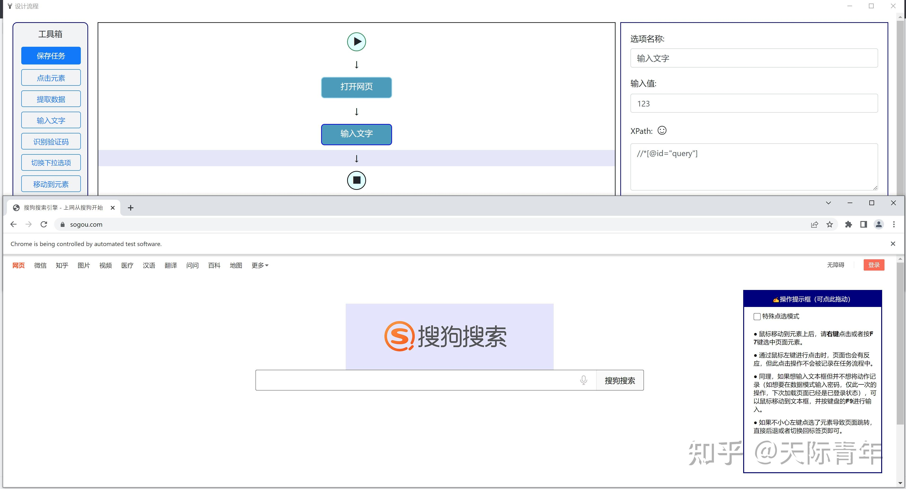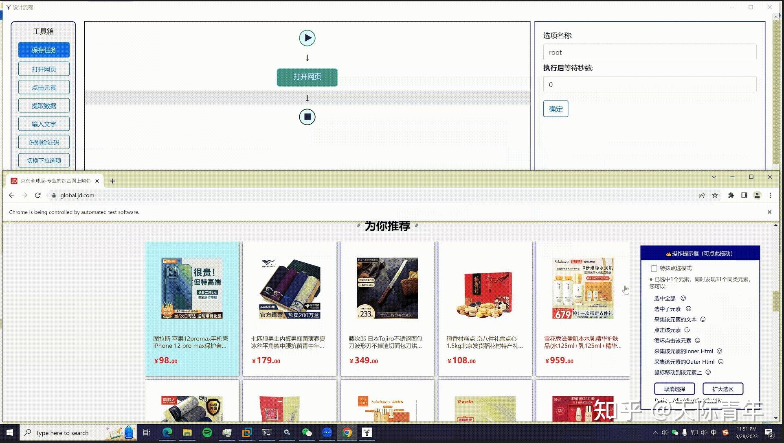

## **相关链接**

### **代码仓库**

Github仓库地址，欢迎大家Star：

[EasySpider](https://link.zhihu.com/?target=https%3A//github.com/NaiboWang/EasySpider)

### **下载易采集EasySpider**

进入Releases Page：[https://github.com/NaiboWang/EasySpider/releases](https://link.zhihu.com/?target=https%3A//github.com/NaiboWang/EasySpider/releases) 下载最新版本。

### 支持特性

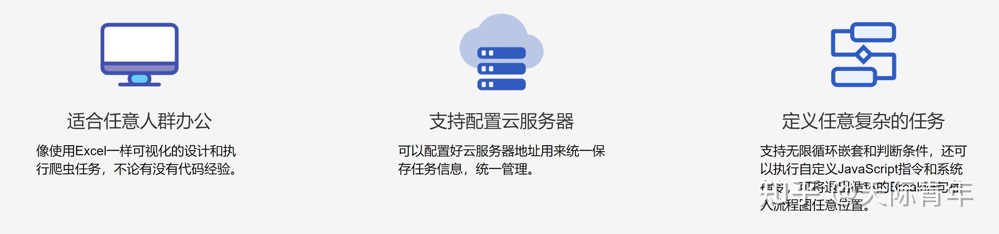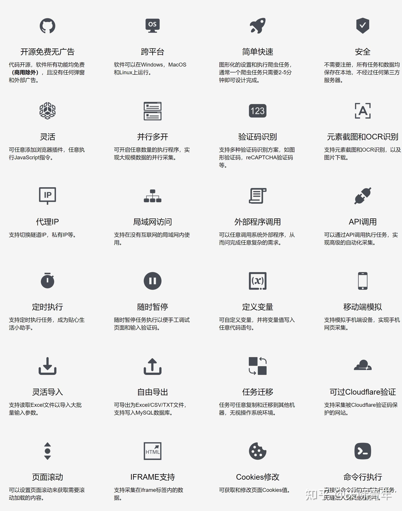

### **视频教程**

[https://www.bilibili.com/video/BV1th411A7ey/](https://link.zhihu.com/?target=https%3A//www.bilibili.com/video/BV1th411A7ey/)

**文档**

教程文档：[https://github.com/NaiboWang/EasySpider/wiki](https://link.zhihu.com/?target=https%3A//github.com/NaiboWang/EasySpider/wiki)，有英文可以暂时翻译一下，或看作者的硕士毕业论文：[https://github.com/NaiboWang/EasySpider/blob/master/Docs/](https://link.zhihu.com/?target=https%3A//github.com/NaiboWang/EasySpider/blob/master/Docs/)面向WEB应用的智能化服务封装系统设计与实现.pdf（主要看第三章和第五章）。

## **为什么要用EasySpider**

相比其他可视化爬虫软件，EasySpider有以下优势：

1\. 代码开源，因此可以进行二次开发。

2\. 完全免费，不同于八爪鱼等软件的“免费”，EasySpider是一个无需登录，无限多开，无限机器部署的软件，不需要向作者本人支付一分钱。（当然，EasySpider受到专利保护，因此如果要商用，还请联系作者本人进行商用付费）。相比之下，其他软件的免费有诸多限制，具体可以看他们的价格详情页。

3\. 安全，所有信息完全保存在用户本地，包括任务和采集的数据，不用担心数据泄露问题。

4\. 跨平台：同时支持Windows，Linux和MacOS。

5\. 速度快，通常一个爬虫任务只需要2-5分钟即可设计完成，采集速度也快，通常取决于具体机器环境。

6\. 更加灵活，保存的浏览器配置信息更多，最重要的是可扩展，自由的安装各种插件，比如验证码识别插件。

7\. 可以直接以命令行的方式执行，无限部署在任何想要部署的机器中。

8\. 可以在任务流程中**执行自定义的指令，包括JavaScript指令以及系统级别指令，**这个是目前所有的可视化爬虫软件都做不到或者不愿意做的事情。

9\. V0.3.0版本新增的功能，包括元素截图，执行任意JS指令和系统命令，OCR识别等等功能，想要的功能应有尽有，而且这些功能**完全免费！！！**

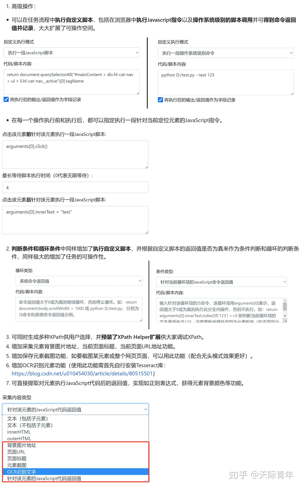

从需求导向来说，爬虫算是一项基本的需求，我们经常需要去爬一些网上的信息，比如对于科研工作者，爬取维基百科语料库进行训练是做NLP的同学经常做的事情；做社交网络分析的同学经常需要爬取Twitter和微博的信息；做推荐系统的同学会去爬购物网站的信息等等。市面上爬虫需求很多，这里就不在赘述了。有了EasySpider，不管大家之前会不会写爬虫，现在都可以不需要费心费力的写代码了。

## 赞助商

[BrightData代理](https://link.zhihu.com/?target=https%3A//get.brightdata.com/naibowang)

## **相关荣誉和出版物**

1、 作者本人通过此软件完成了浙江大学硕士论文并取得了硕士学位。

2、 获得了中国国家发明专利授权，作者是第一发明人。

3、 被CCF A顶级会议WWW 2023接收：[https://dl.acm.org/doi/abs/10.1145/3543873.3587345](https://link.zhihu.com/?target=https%3A//dl.acm.org/doi/abs/10.1145/3543873.3587345)

4、 被微博81.6万粉丝互联网大V“爱可可-爱生活”转发和宣传: [https://s.weibo.com/weibo?q=easyspider](https://link.zhihu.com/?target=https%3A//s.weibo.com/weibo%3Fq%3Deasyspider)

  

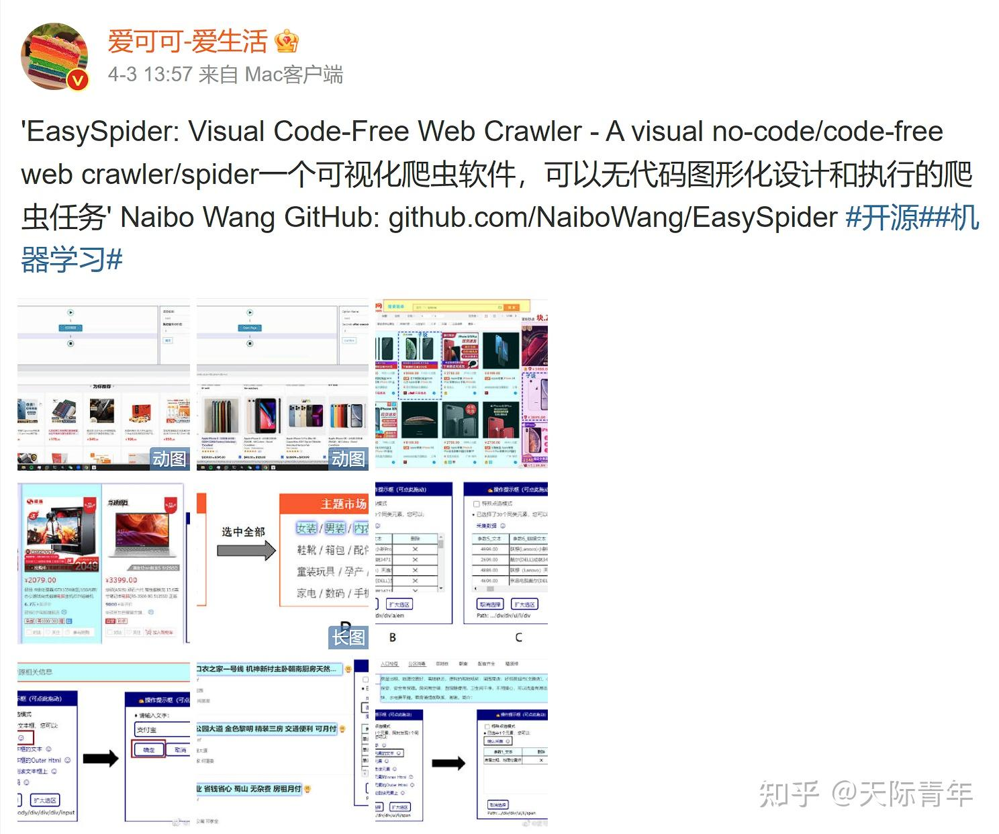

楼主刚从美国参加WWW 2023回来，当时很多人对该软件感兴趣，下面是现场海报：

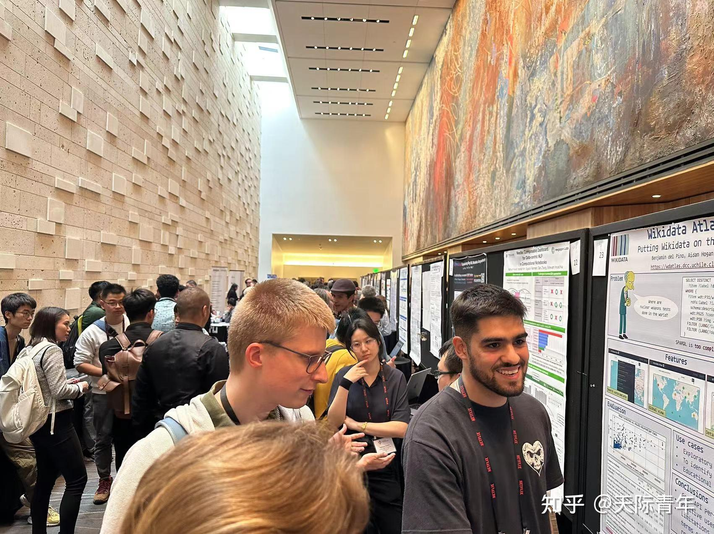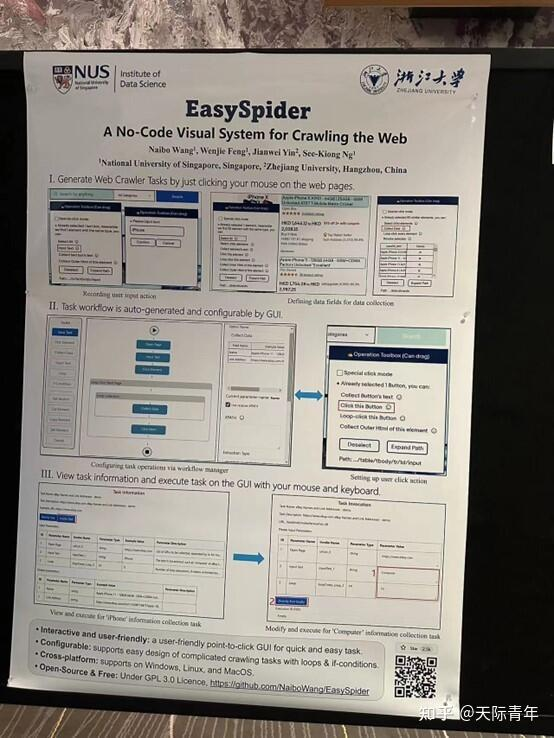

## **软件相关截图**

这些图片来自我的硕士论文，这里只放图，具体这些图是做什么的请大家去看我的硕士论文，因为太长了：

[https://github.com/NaiboWang/EasySpider/blob/master/Docs/](https://link.zhihu.com/?target=https%3A//github.com/NaiboWang/EasySpider/blob/master/Docs/)面向WEB应用的智能化服务封装系统设计与实现.pdf

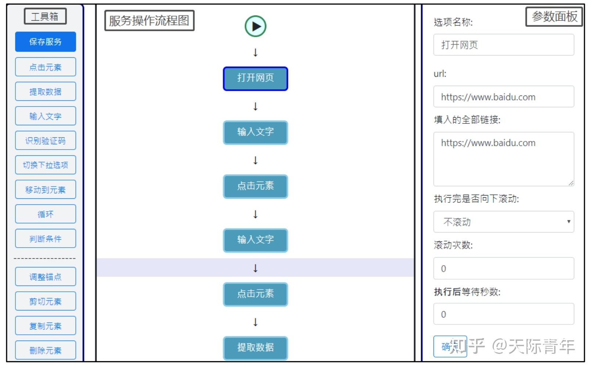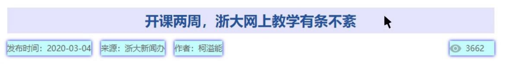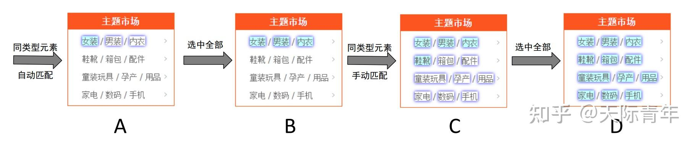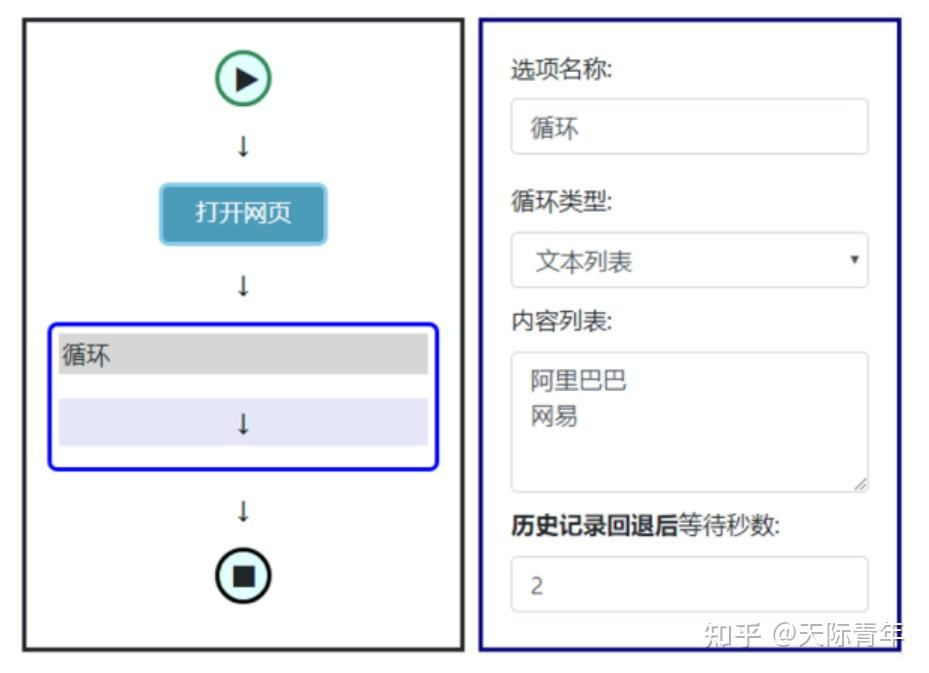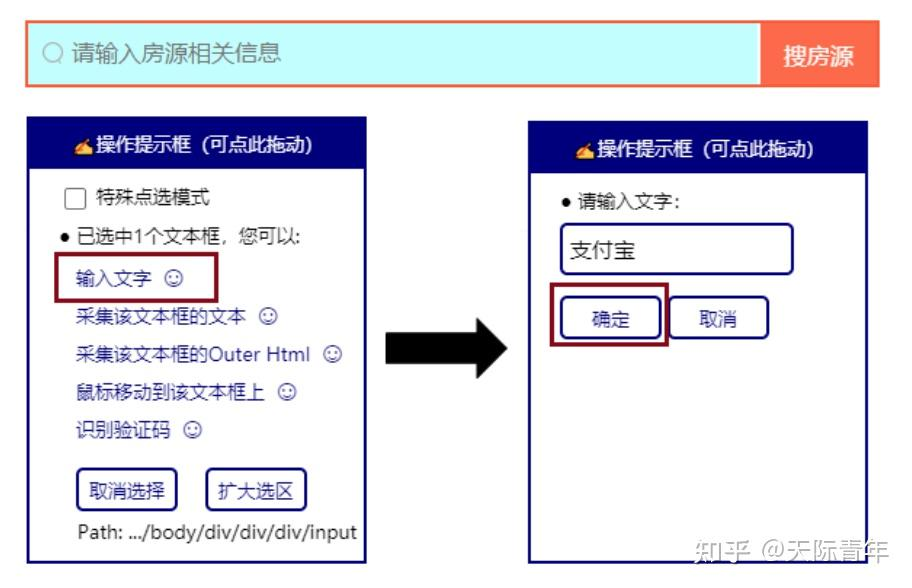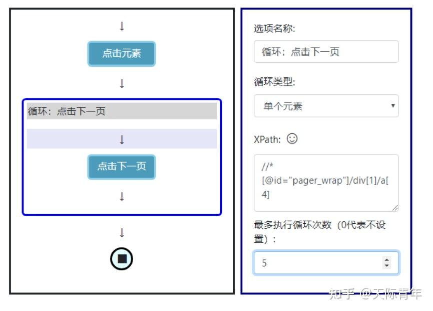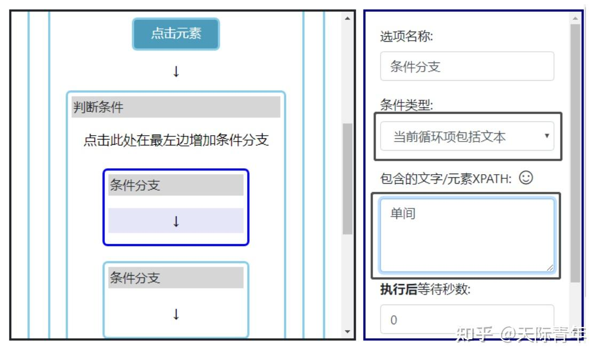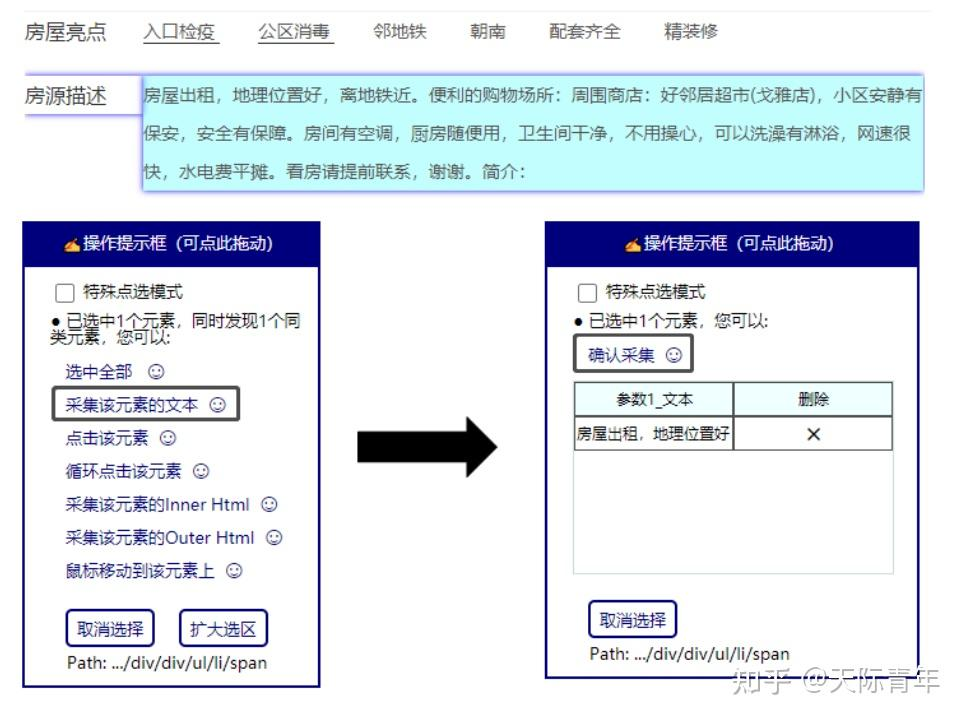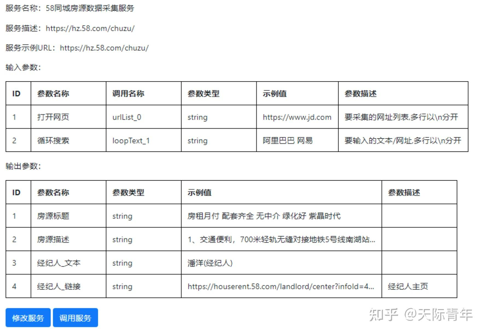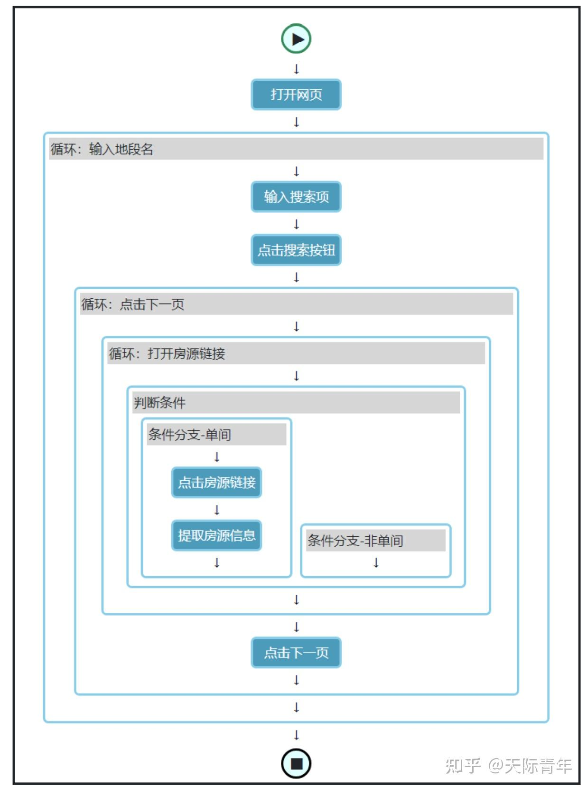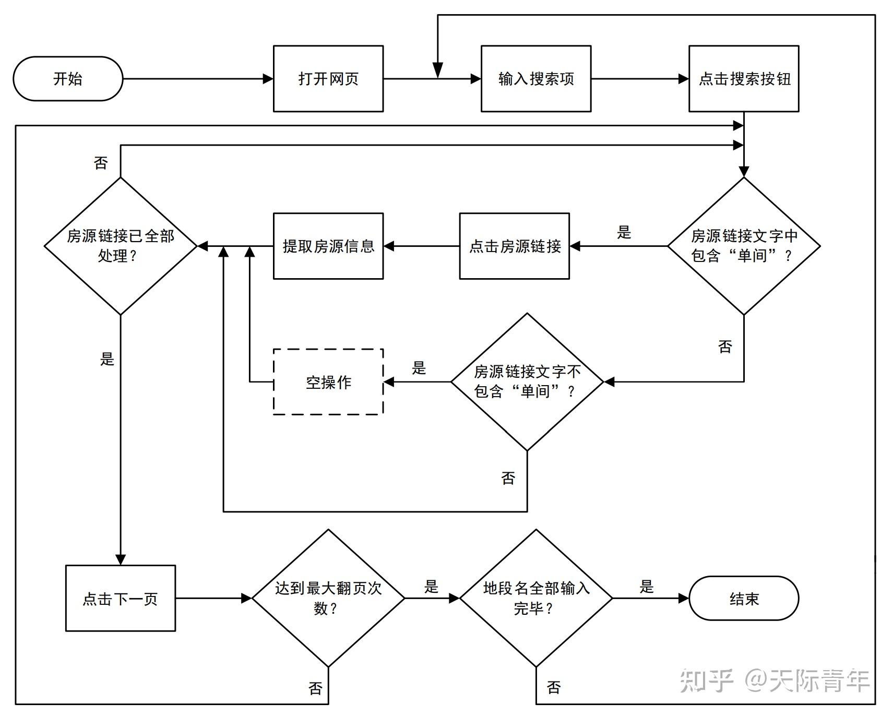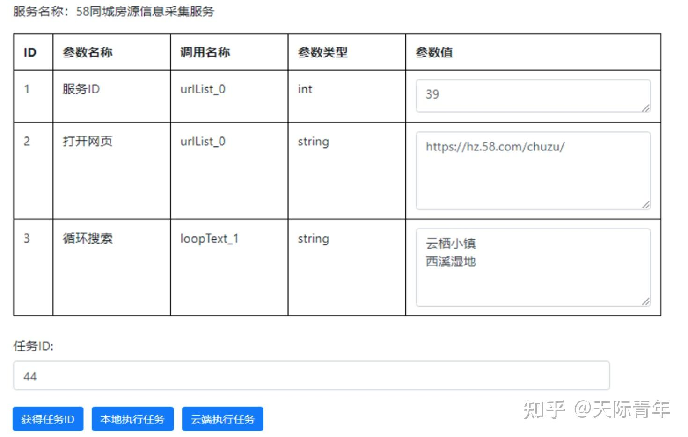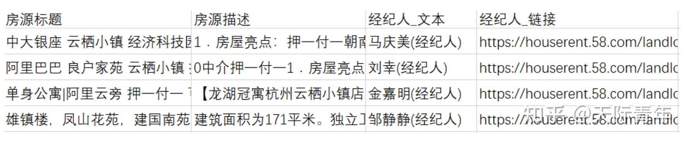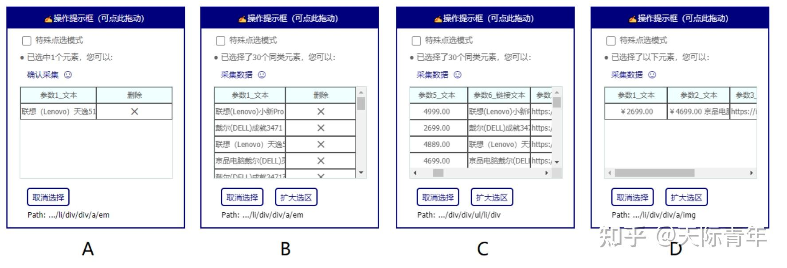

## **技术交流**

由于EasySpider所有的算法设计，代码实现以及文档编写都是我一个人完成的，所以项目肯定不如一个团队一起写那么完善，而且很多功能我想开发也是心有余而力不足，所以肯定有很多可以改进的地方。由于代码全部公开，所以大家可以自行fork之后进行修改和添加新功能，也欢迎大家提PR使得这个软件的功能更加完善，共同构建一个美好的开源社区。 对于软件中涉及到的算法细节，大家可以看楼主的硕士毕业论文，里面写的很详细： [https://github.com/NaiboWang/EasySpider/blob/master/Docs/](https://link.zhihu.com/?target=https%3A//github.com/NaiboWang/EasySpider/blob/master/Docs/)面向WEB应用的智能化服务封装系统设计与实现.pdf 对于软件开发使用到的具体技术，如chrome扩展开发，websocket的使用，ElectronJS跨平台框架等等，大家可以在下载代码之后去研究下我的写法，我相信我的代码写法绝不是最好的，甚至当时由于想赶紧毕业所以只是想写一个能用的demo出来所以可以说有些粗糙，比如耦合性太强，不够模块化等等，因此可改进空间还有很多，欢迎大家提出意见和建议。 对于初学CS的学弟学妹来说，这个项目也算是不错的样例，因为从开发角度来说，这个项目包含了前端开发，后台开发，数据库操作，浏览器扩展开发等模块；从算法角度来说，这个项目包含了如深度优先，广度优先，数据结构，图，编译原理，递归等等算法技巧。大家如果想学习，也许可以从这个项目源码里学到一些知识。 最后，真心希望软件可以帮到大家！