还不少呢~

## 分布式计算、云平台相关工具类

1.SkyWalking，作者吴晟、刘浩杨 等等

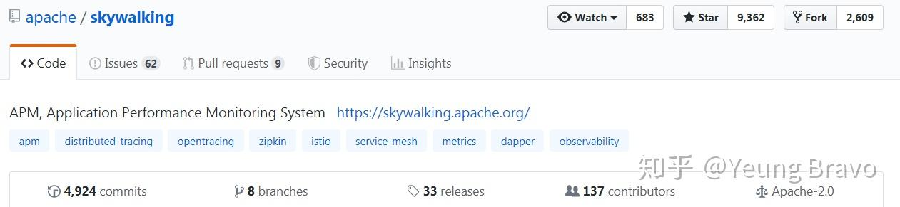

仓库地址: [apache/skywalking](https://link.zhihu.com/?target=https%3A//github.com/apache/skywalking)

更多详情请看: [SkyWalking毕业成为Apache顶级项目 - InfoQ](https://link.zhihu.com/?target=https%3A//www.infoq.cn/article/lclYRGCBXTLaM82ue-7W)

  

2.Apache ShardingSphere(Apache顶级项目 + **CNCF云原生计算基金会**全景图项目)

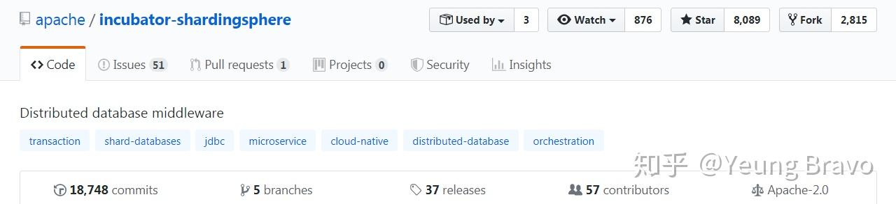

仓库地址: [apache/incubator-shardingsphere](https://link.zhihu.com/?target=https%3A//github.com/apache/incubator-shardingsphere)

更多详情请看: [快讯！Apache ShardingSphere进入CNCF全景图](https://link.zhihu.com/?target=https%3A//mp.weixin.qq.com/s/hAxON1CMYvgFf6sFIHtDHA)

  

3.TiKV, PingCap公司

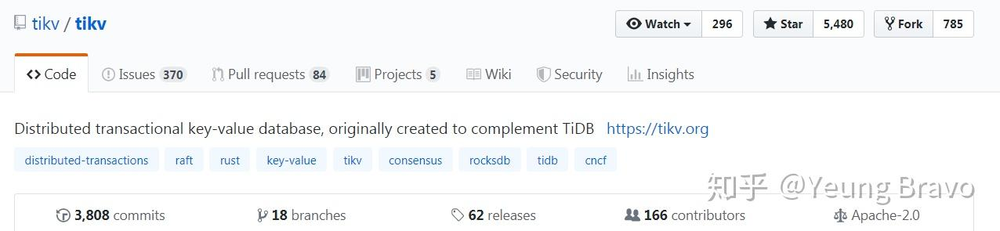

tikv/tikv: Distributed transactional key-value database, originally created to complement TiDB

[tikv/tikv](https://link.zhihu.com/?target=https%3A//github.com/tikv/tikv)

  

4\. 阿里巴巴 Dragonfly

dragonflyoss/Dragonfly: Dragonfly is an intelligent P2P based image and file distribution system.

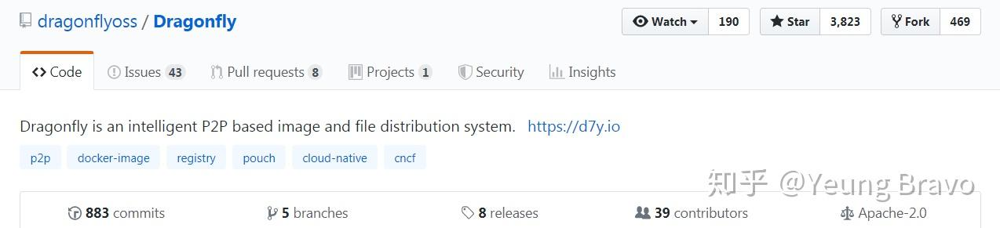

[dragonflyoss/Dragonfly](https://link.zhihu.com/?target=https%3A//github.com/dragonflyoss/Dragonfly)

  

5\. 阿里巴巴 dubbo (主要语言是Java)

apache/dubbo: Apache Dubbo is a high-performance, java based, open source RPC framework.

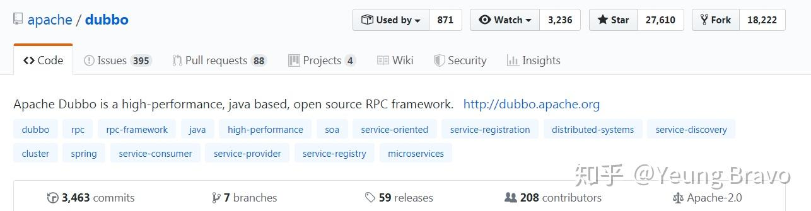

地址: [apache/dubbo](https://link.zhihu.com/?target=https%3A//github.com/apache/dubbo)

  

6.携程 阿波罗配置管理

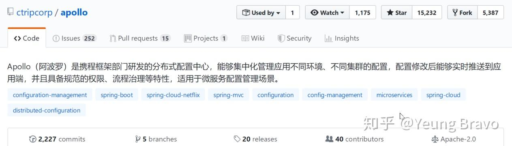

仓库: [https://github.com/ctripcorp/apollo](https://link.zhihu.com/?target=https%3A//github.com/ctripcorp/apollo)

## 面试干货类:

1.  MisterBooo/LeetCodeAnimation: 用动画的形式呈现解LeetCode题目的思路

@程序员小吴 [@力扣（LeetCode）](https://www.zhihu.com/people/0c401978091125ea41705a2ff55cca18)

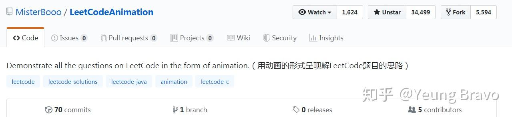

仓库地址: [MisterBooo/LeetCodeAnimation](https://link.zhihu.com/?target=https%3A//github.com/MisterBooo/LeetCodeAnimation)

  

2\. CyC2018/CS-Notes: Tech Interview Guide 技术面试必备基础知识 等，作者 郑永川

[@CyC2018](https://www.zhihu.com/people/de0dbaba77411ee53dd3207d762ad7d5)

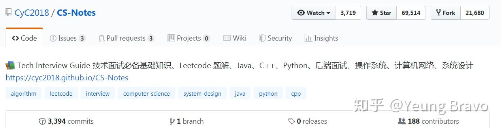

仓库地址: [CyC2018/CS-Notes](https://link.zhihu.com/?target=https%3A//github.com/CyC2018/CS-Notes)

  

## Web前端类

1.百度Echarts

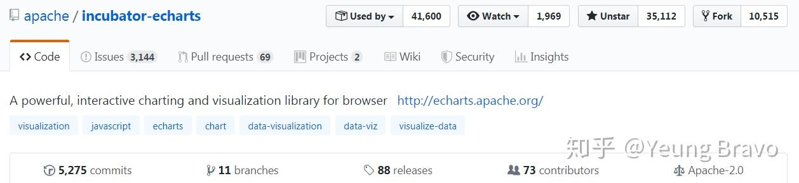

仓库地址: [apache/incubator-echarts](https://link.zhihu.com/?target=https%3A//github.com/apache/incubator-echarts)

  

2.阿里巴巴ant-design系列

ant-design/ant-design: A UI Design Language

仓库地址: [ant-design/ant-design](https://link.zhihu.com/?target=https%3A//github.com/ant-design/ant-design)

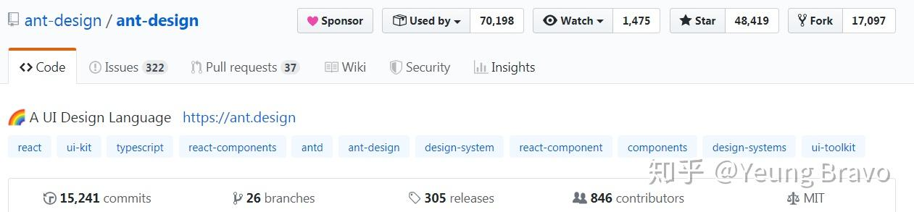

相关Repo:

Ant Design like a Pro!

[ant-design/ant-design-pro](https://link.zhihu.com/?target=https%3A//github.com/ant-design/ant-design-pro)

  

## App类

1.腾讯微信WeUI

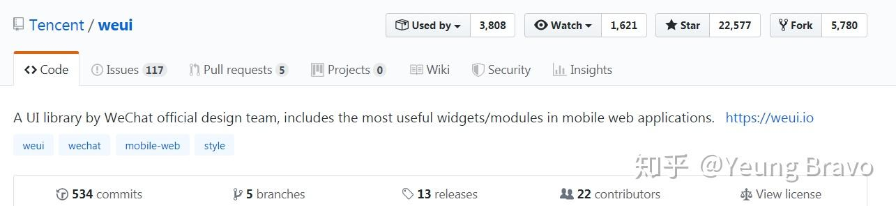

[Tencent/weui](https://link.zhihu.com/?target=https%3A//github.com/Tencent/weui)

  

2\. WeiXinMPSDK, 作者: 苏震巍Jeffrey Su

JeffreySu/WeiXinMPSDK: 微信公众平台SDK Senparc.Weixin for C#，[支持.NET](https://link.zhihu.com/?target=http%3A//xn--ruu81c.net/) [Framework及.NET](https://link.zhihu.com/?target=http%3A//xn--framework-jc8o.net/) Core。已支持微信公众号、小程序、小游戏、企业号、企业微信、开放平台、微信支付、JSSDK、微信周边等全平台。 WeChat SDK for C#.

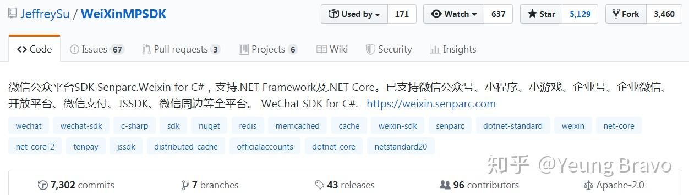

仓库地址: [https://github.com/JeffreySu/WeiXinMPSDK](https://link.zhihu.com/?target=https%3A//github.com/JeffreySu/WeiXinMPSDK)

  

3\. [@代码家](https://www.zhihu.com/people/f37021d8a7144874b70c1c78b02d6c89) Android相关

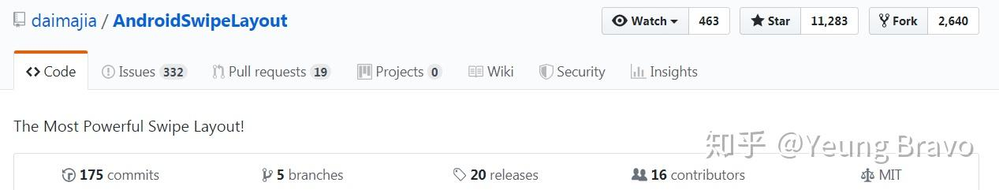

daimajia/AndroidViewAnimations: Cute view animation collection.

[daimajia/AndroidViewAnimations](https://link.zhihu.com/?target=https%3A//github.com/daimajia/AndroidViewAnimations)

  

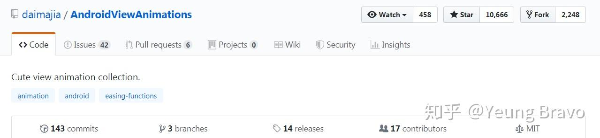

daimajia/AndroidSwipeLayout: The Most Powerful Swipe Layout!

[daimajia/AndroidSwipeLayout](https://link.zhihu.com/?target=https%3A//github.com/daimajia/AndroidSwipeLayout)

  

## 刚需工具

1.  **you-get下载器** (开发语言: Python)

soimort/you-get: Dumb downloader that scrapes the web

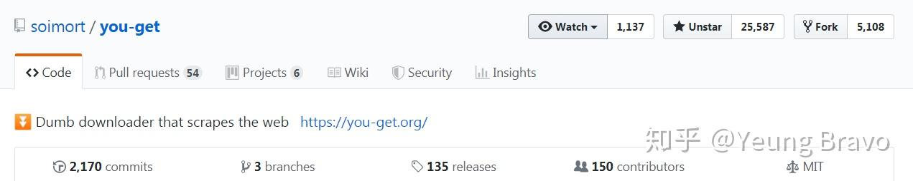

仓库地址: [https://github.com/soimort/you-get](https://link.zhihu.com/?target=https%3A//github.com/soimort/you-get)

官网: [https://you-get.org/](https://link.zhihu.com/?target=https%3A//you-get.org/)

  

## 游戏相关

cocos2d/cocos2d-x: Cocos2d-x is a suite of open-source, cross-platform, game-development tools used by millions of developers all over the world.

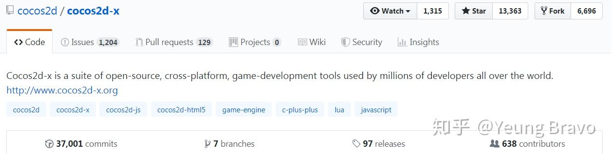

仓库地址: [cocos2d/cocos2d-x](https://link.zhihu.com/?target=https%3A//github.com/cocos2d/cocos2d-x)

## 其他工具

Wox (快速启动工具，类似于Mac中的Alfred，支持Win7, Win 8, Win10)

Wox-launcher/Wox: Launcher for Windows, an alternative to Alfred and Launchy.

仓库地址: [Wox-launcher/Wox](https://link.zhihu.com/?target=https%3A//github.com/Wox-launcher/Wox)

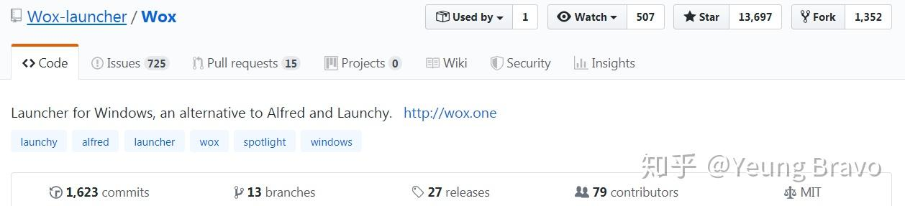

  

Chatie/wechaty: WeChat Bot SDK (主要语言是 Typescript)

[Chatie/wechaty](https://link.zhihu.com/?target=https%3A//github.com/Chatie/wechaty)

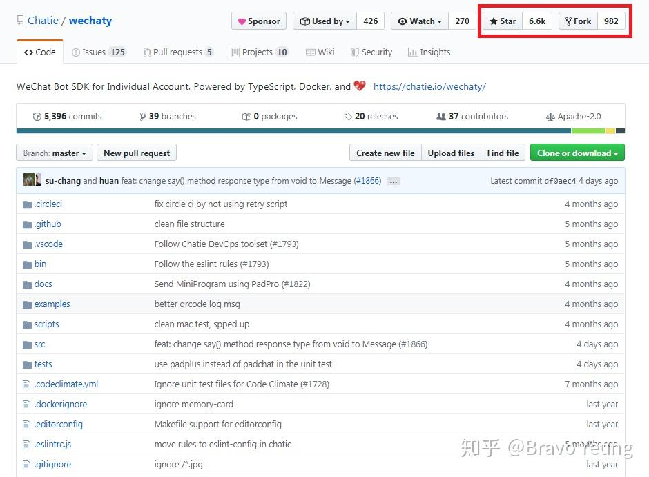