4年了，我一直坚持“抄袭”别人的代码，有时“抄”同事的，有时“抄”框架的，偶尔也“抄”网友的。

## 为什么要抄？

“抄袭”这个词听起来让人不舒服，那就换个词：造轮子。不过造轮子似乎也容易被人诟病，毕竟“大佬”一定会苦口婆心劝你：年轻人不要造轮子，你再厉害能比得过Spring？呀袭了雷！

**但我仍然鼓励大家在自己可控范围内尝试造轮子，因为造轮子对你的成长是巨大的。**

首先，造轮子的意思是，在你面前已经有一个轮子了。换句话说，你有现成可以模仿的对象，而且这个轮子一般出奇地圆，圆到你觉得它很美。这有助于培养你的**代码品味**。

其次，造轮子并不简单，它往往会用到很多高级的知识点和技巧。以Java为例，如果你要造一个Mini-MyBatis-Plus，你起码要懂得：

-   JDBC
-   反射
-   泛型
-   注解
-   动态代理
-   函数式编程
-   策略模式
-   模板方法模式
-   ....

这样一来，为了造出这样一个稍微像样点的轮子，你必须强迫自己搞懂这些高级知识点，并且结合自己的需求灵活运用。

最后，轮子造完跑起来以后，一定会遇到各种问题，解决问题的过程中你又得到了成长。

说到这，你应该明白我的意思了，抄袭是可耻的，我的本意是鼓励大家刻意练习，而且是学习优秀的代码并模仿之，找机会把它用起来。提高编码能力的方法，说穿了就一个字：PRACTICE、PRACTICE，还是TMD的PRACTICE！

## 怎么抄？

记得之前在知乎看过一个话题，问“抄代码到底有没有用”？结果题主被一群人冷嘲热讽，说抄代码一点用都没有。其实绝大部分程序员的绝大部分时候都在抄别人的代码，只不过潜意识觉得自己在原创罢了。

那么，怎么“抄”才是有效的呢？**必须结合自己的实际需求，做好“本土化”。**

## **造一个RetryUtil**

接下来，我说一个自己以前造轮子的故事。

### 发现问题

有一天，我发现项目中有一个接口很不稳定，时不时就会调用失败。经过排查，发现它调用了一个第三方SDK，但由于第三方接口不是很稳定，偶尔会出现网络错误。我想，这很简单，直接for循环多调用几次就行了：

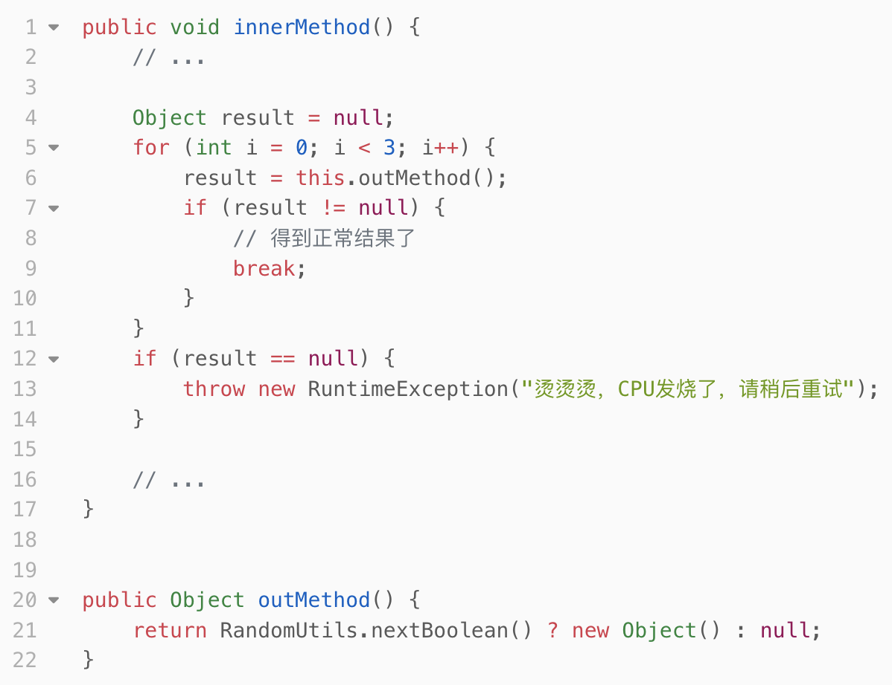

正当我准备改代码时，职业习惯促使我ctrl+shift+f全局搜了一下，发现已经有好几处类似的重试代码了。于是，我认为应该做一下方法抽取。

### 整理需求

但是把好几处类似的代码摆在一起对比后，我犯愁了：

-   有些方法**有返回值**、有些方法**没有返回值**
-   有些方法抛异常时重试
-   有些方法内部捕获了异常，通过判断Result.isSuccess()判断是否重试

于是，我觉得还是算了，看看有没有现成的工具吧。

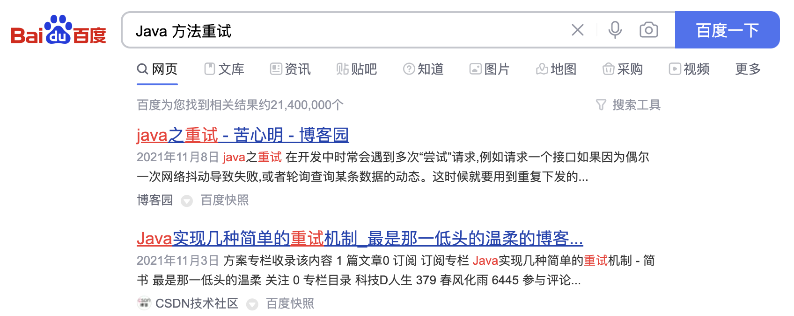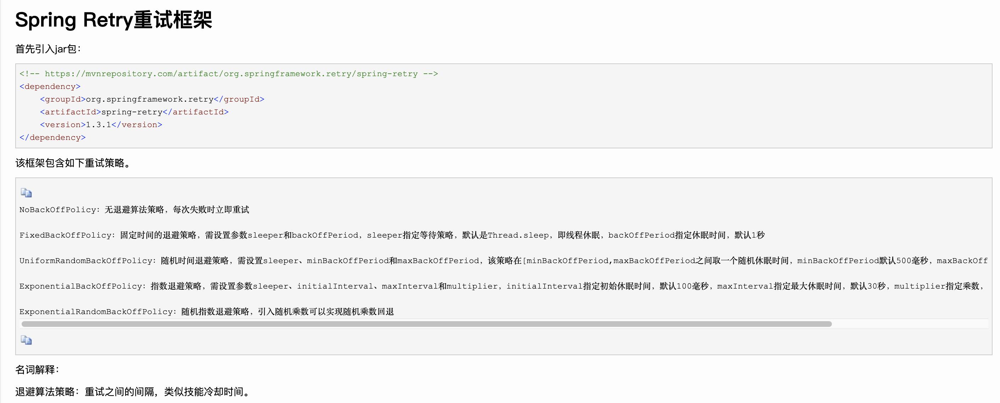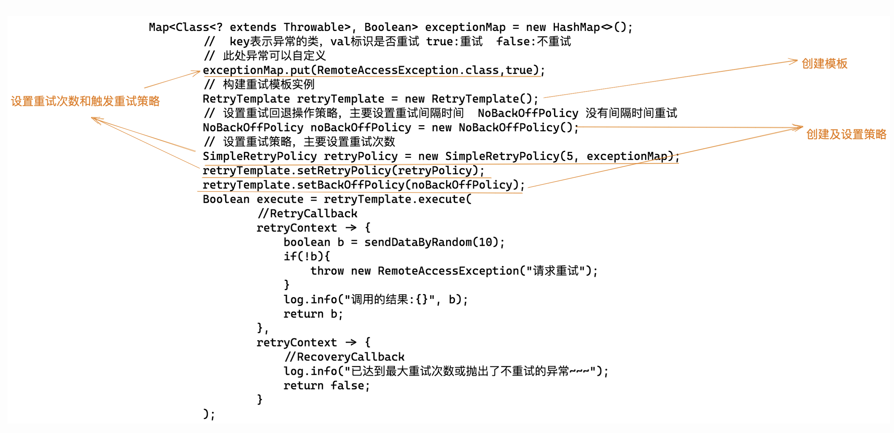

卧槽，这什么玩意啊，这么复杂。我的需求其实很简单，不需要这么复杂的API，我还是努力一下自己封装一个好了。

### 先做一个粗糙的轮子

首先，我确定了要用函数式接口+泛型。使用泛型是看重它的代码模板能力，比如重试的代码中都有个for循环，就可以**抽取为模板**。函数式接口可以很方便地**把代码中变化的部分和稳定的部分剥离开**，比如需要重试的方法都是不同的，可以通过函数式接口剥离出去。

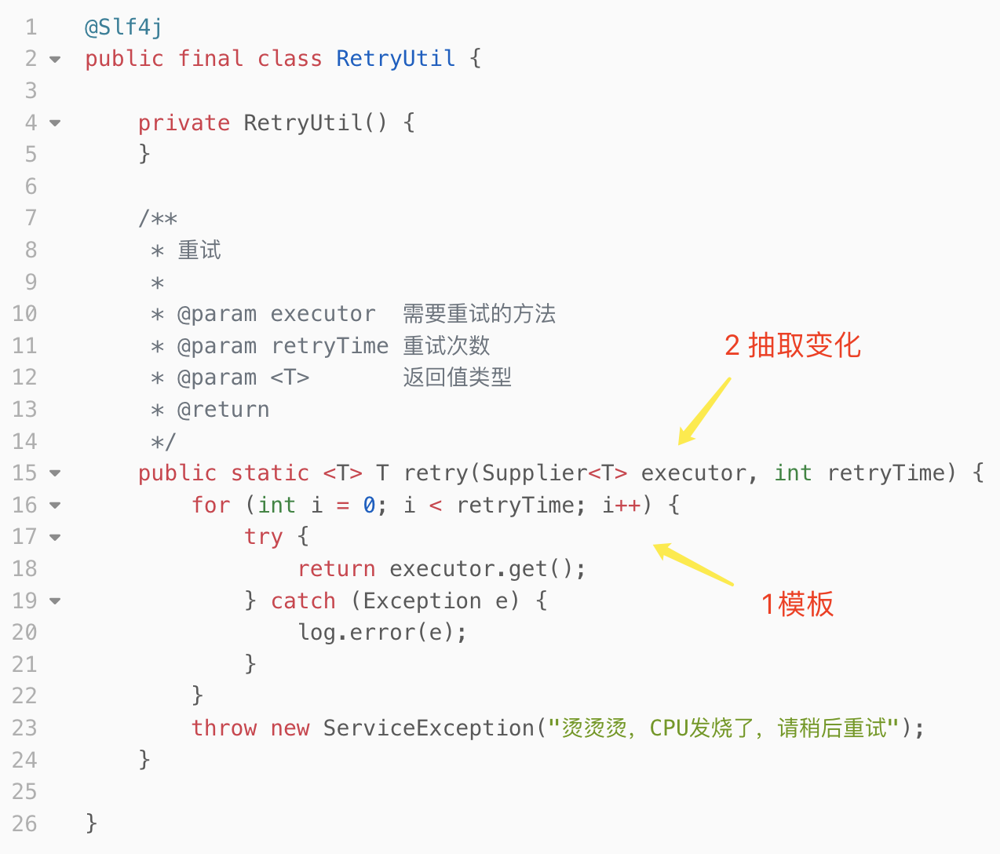

嗯，看起来还不赖嘛，有点大家风范。哦，忘了兼容没有返回值的方法了，加一个：

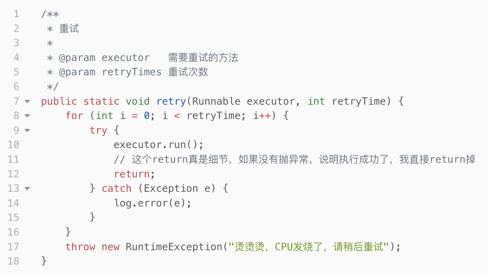

目前RetryUtil还存在比较多的问题。

### 加入重试次数、时间间隔

比如，它的重试并没有时间间隔，**一旦失败立即重试，很大概率还是失败，**甚至给下游造成更大负担。看看别人怎么处理的，比如Guava：

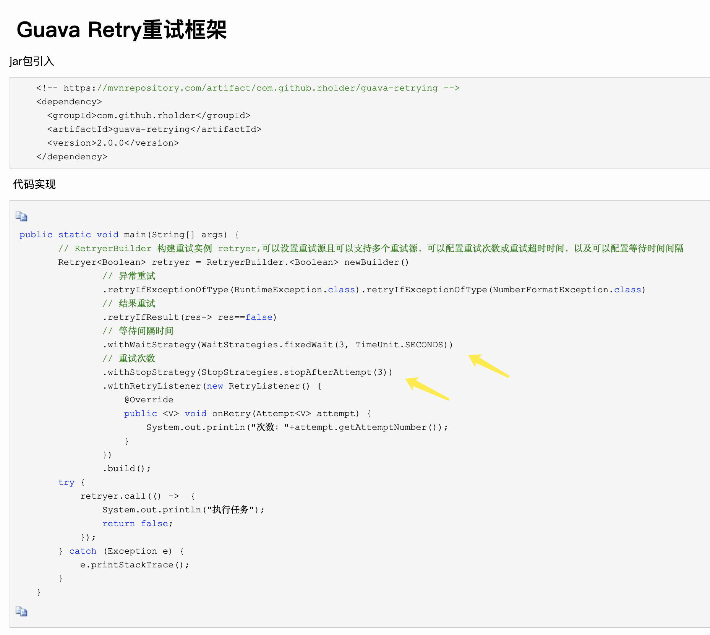

很好，“抄”过来：

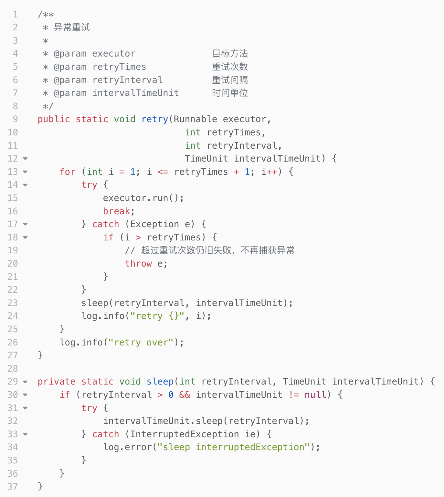

### 加入异常处理

又比如，最后一次重试仍旧失败时，我们如果还想捕获异常呢？由于目前工具里直接写死了throw e，我们只能在外部捕获：

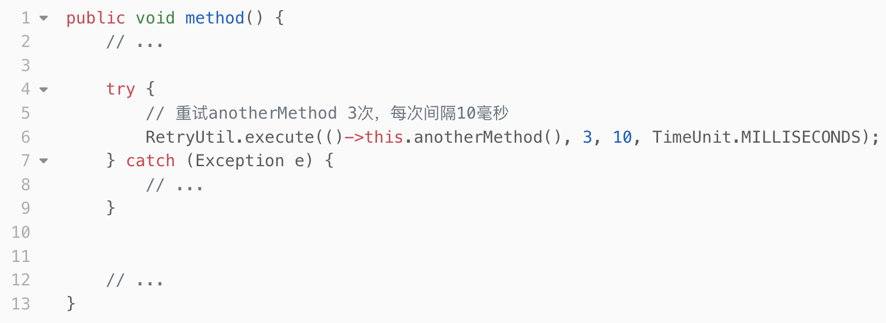

我想要优雅一点，风格统一些：

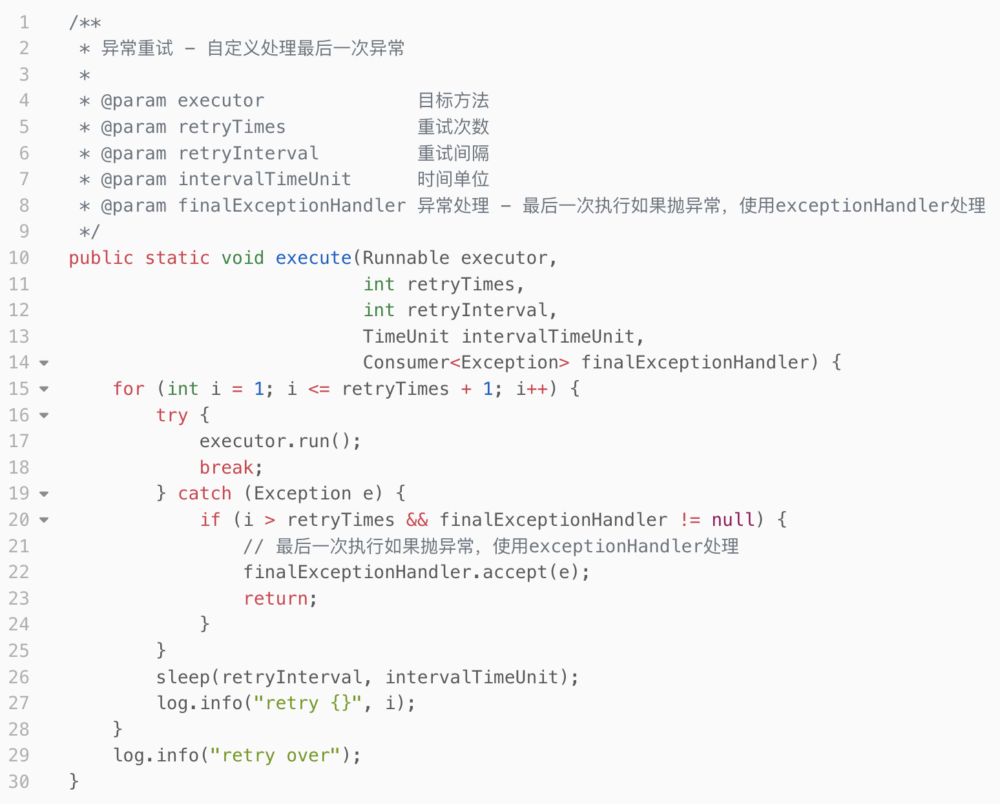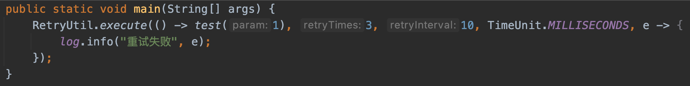

### 允许结果重试

最后一个问题，现在代码里很多重试的地方并不会抛异常，而我们上面的重试都是依赖于抛异常，只有抛异常才会重试！如果不抛异常，怎么指定重试规则呢？

学一下Guava的：

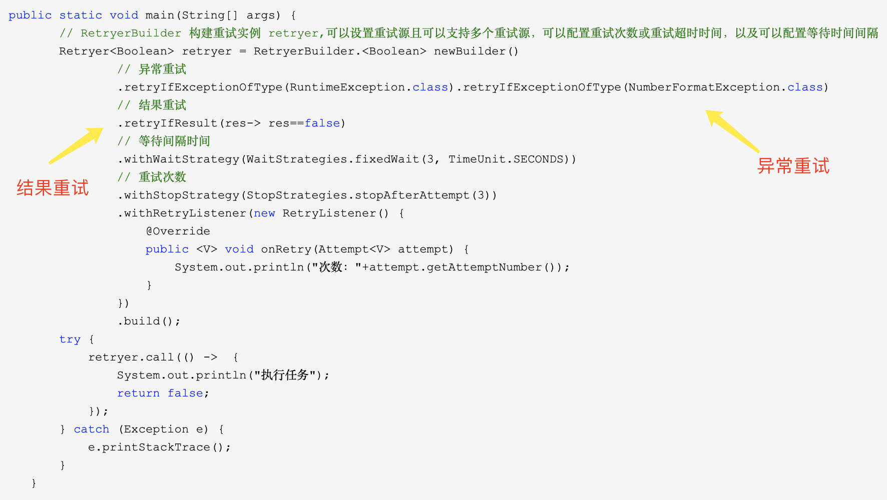

好， 继续“抄”（结果重试只针对有返回值的，上面演示的都是没返回值的方法）：

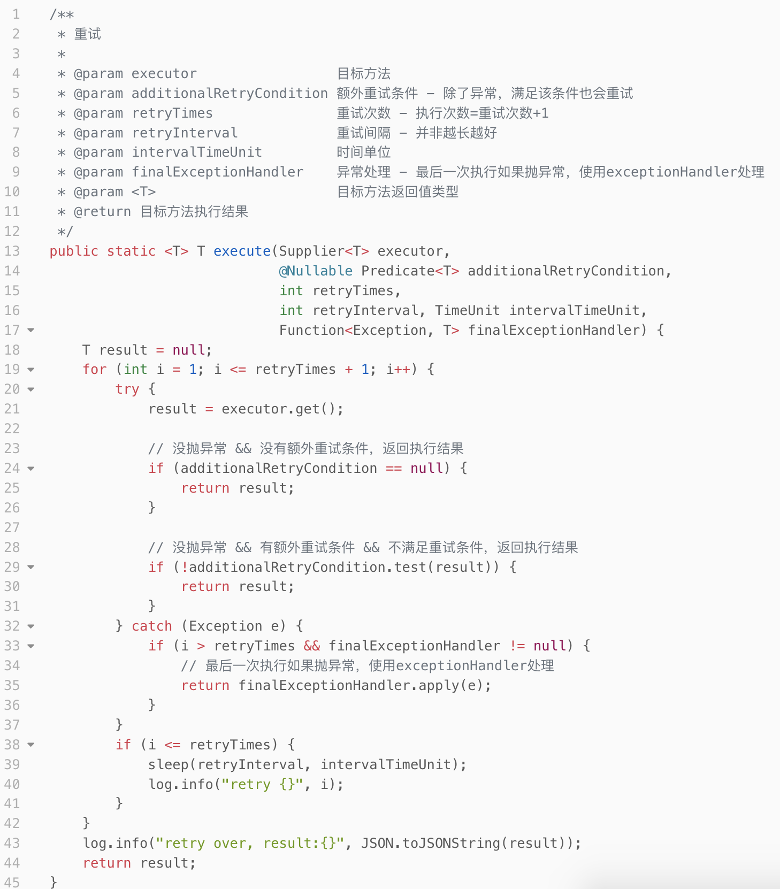

### 引入Builder，简化使用

最后，都抄到这了，不如把人家Builder模式也抄过来吧。倒不是说Builder模式好，毕竟本身一个Util能做的，原则上不需要Builder额外创建对象浪费内存。但我们上面这个方法，参数太多了！在实际项目中用起来可能会比较臃肿：

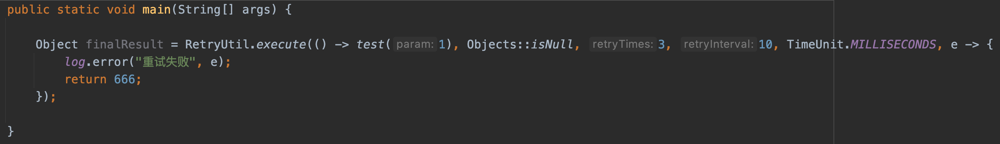

改造成Builder：

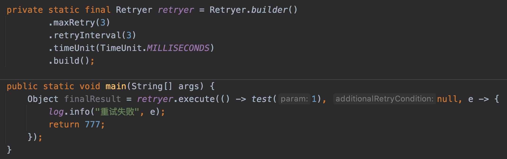

### 最后，用别人造好的轮子

好，写到这我突然发现，一开始百度时看到的是Spring-Retry，太复杂了，但Guava的其实蛮好用的，那就直接用Guava的吧。

虽然最终没用上自己的RetryUtil，但我已经具备造出Guava-Retry的能力了。生活中很多时候是这样的，群里一个BUG跑出来，虽然你也努力了很久，甚至你也发现问题所在，但同事已经解决了。但不必沮丧，你已经收获了很多。

祝大家周末遇快、阖家欢落~

更多文章请移步：

[bravo1988：Java程序员练级路线](https://zhuanlan.zhihu.com/p/686288683)