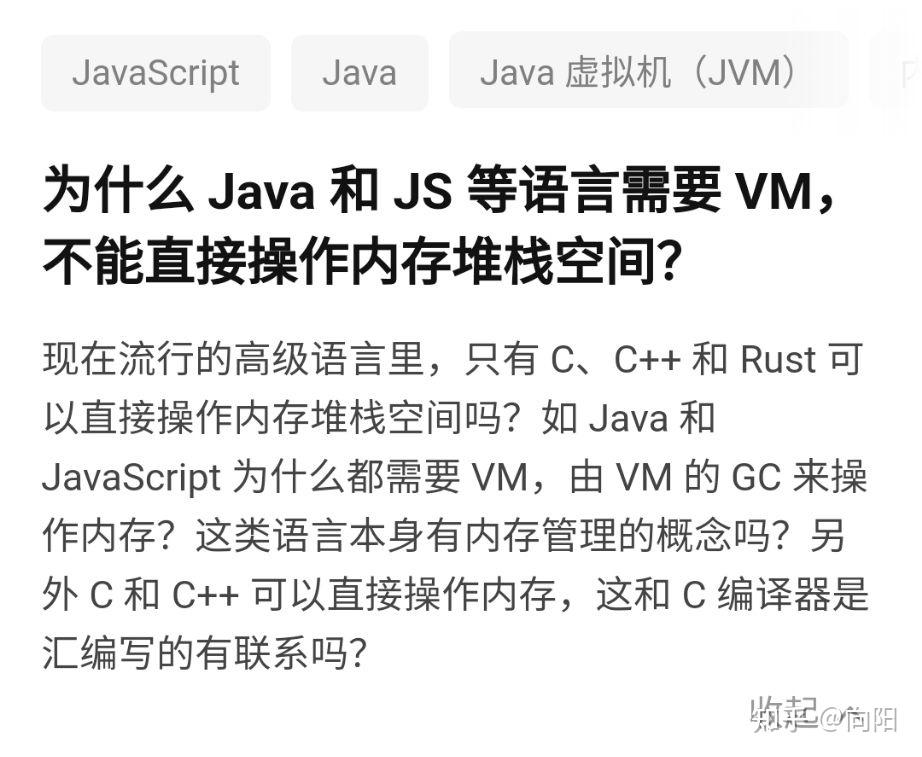
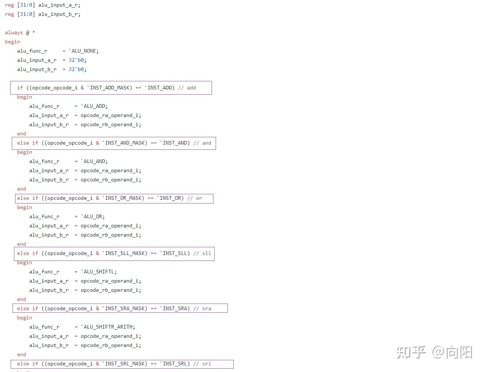
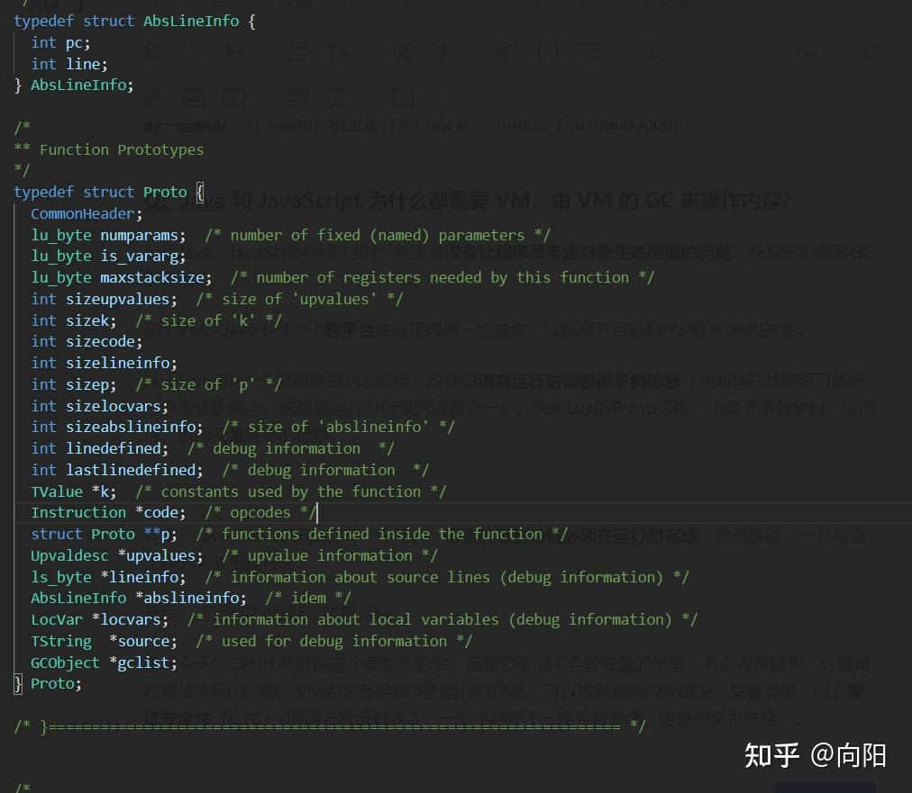

老规矩，先抄题：



## “**一个问题不好解决时，计算机科学家会选择在上面套一层**”

## WHERE VM

在开始回答之前，先铺点基础知识。一般的话，**讨论指针问题时，假设目标机没有操作系统、是纯粹的裸机会非常方便**。因此这里我也照搬这个思想，因为不想和OS打交道的缘故，毕竟OS间接允许了我们操作物理内存，也为程序制造了自己独占整个地址空间的假象。

那么，拥有VM的时候，就像：


姑且抛开这张图本身不完全正确。至少，能感受到虚拟机存在的位置。也就是说，**VM可以看作是对真实机器的一个抽象**。

## HOW CPU WORK？

下面我们来考虑为什么要做这个抽象。或者说原本的CPU怎么滴就不行了，非要抽象一把。

**考虑个最纯粹的CPU：拥有简单的指令集、拥有ALU，拥有一些寄存器**，除此之外什么都没有。

现在我的问题很简单，你猜CPU里面解析指令用了什么？我们来看一个RISC-V CPU的代码片段：



上图的代码（或者说一种描述语言）可能不一定看得明白。但是思想很明确：**if ... else来判断当前的指令操作码，以解析指令**。

也就是说，CPU的基本工作只是简单的按照操作码，进行计算、跳转而已。它**不检查程序是否正确，只要操作码ok，就会执行**。当然，**也不会管内存里面的数是什么类型**。

好，有了上面的铺垫我想应该很清楚两点了：

1.  VM可以看作对真实机器的抽象
2.  CPU的基本工作很简单，并不会记录程序运行时的绝大多数信息

下面来看题主的问题。

## Q：只有 C、C++ 和 Rust 可以直接操作内存堆栈空间吗

一般来说，**一个定位在“系统级别”的语言都可以直接操作**，C/C++自然是这样的语言，而Rust按照网上各路Ruster的说法也是。

除此之外，我随便列举个，例如GO、D，都存在着指针的概念。

最后还是要提的是，OS依旧给程序造成了假象，**因此不要忘记，所谓的直接操作，还是经过了硬件的一些映射**。并不像单片机上那样可以int x = \*((int32\_t\*)0x08000000);

## Q：Java 和 JavaScript 为什么都需要 VM，由 VM 的 GC 来操作内存？

包括Java、JavaScript等在内的一些语言**没有让程序员考虑对象生命周期的问题**。这是它们需要GC的原因。

至于VM，Java本身为了**跨平台**性肯定得做一层抽象，以脱离开目标机代码的机器相关性。

JavaScript的一个原因就是动态类型，这使得**语言运行时需要很多的信息**（可能在JS里面可能听过原型链的概念，这就是运行时记录的信息之一）。例如Lua的Proto结构，记录了函数参数、逃逸变量、该函数的代码、需要用到的常量等等的信息：



其次，Java、JavaScript都有一个特点：**语言的某些特性必须在运行时完成**，也就是说，一些检查工作必须放到运行时。

最后，还记得之前提到的CPU嘛~

虽然今天的CPU比我提的这个要复杂的多，但是它依旧不会管变量的类型、考虑内存越界、处理堆栈爆掉等等的问题。VM因为有足够多的运行时信息，可以做到跟踪内存情况、变量类型，以此**保证安全性**（C./C++的同志应该有体会，一些小越界不一定导致崩溃，但是你又很难查）。

## Q：这类语言本身有内存管理的概念吗？

本身**GC就是内存管理的概念丫**

其次，在**一些有GC的语言**，**存在着关键字或者函数，用于手动销毁变量**。

例如PHP就是这样的：

```php
unset($x);
```

## Q：C 和 C++ 可以直接操作内存，这和 C 编译器是汇编写的有联系吗？

先提一点：最早期的C编译器是不是汇编写的我不知道，但是今天的大部分编译器都不是汇编写的。

答案是**没有关系**。

从上面的小铺垫应该可以知道，Java等有GC的语言不能直接操作内存，是因为为了安全被砍掉了。但是**譬如C#之类的有GC的运行在VM上的语言**，依然可以用unsafe关键字加上FFI支持，直接操作内存。

其次，例如Lisp作为年龄很大的高级语言，例如Common-Lisp里面，却是无法直接操作内存的（那个年代C、B语言都没诞生）。

## </end>

以上。

最后附上不知名的大佬的话：“当形式化表述被大众所接受时，它才能真正的发挥出作用”

这句话是对类型系统说的。但是VM之类的，个人之见依然类似，当程序语言将小的细节隐匿起来时，程序员花在无聊错误上的时间就会更少。