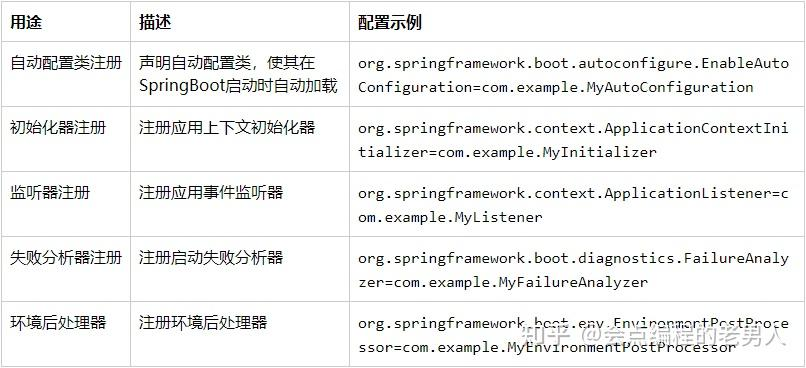
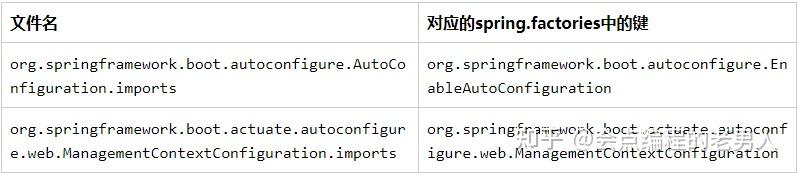
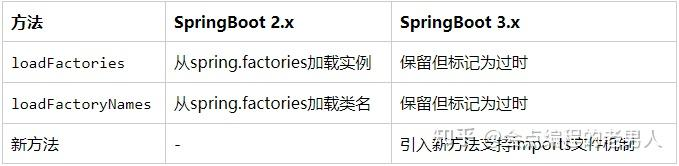
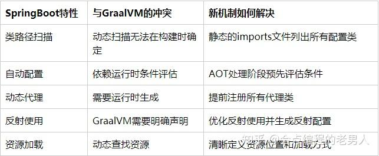

**SpringBoot 3.0之后为什么取消了`spring.factories`**

### **1\. 引言**

在SpringBoot的演进过程中，3.0版本带来了一次重大变革——取消了长期以来作为自动配置和扩展机制核心的`spring.factories`文件。这个改变对于习惯了SpringBoot旧版本开发的工程师来说，需要了解新的机制和迁移策略。

> 本文将深入探讨这一变更的原因、影响以及替代方案。

### **2\. spring.factories是什么**

在讨论它的取消之前，我们首先需要理解`spring.factories`文件在SpringBoot中扮演的角色。

### **2.1 基本概念**

`spring.factories`是一个位于`META-INF/`目录下的配置文件，它基于Java的SPI(`Service Provider Interface`)机制的变种实现。这个文件的主要功能是允许开发者声明接口的实现类，从而实现SpringBoot的自动装配和扩展点注册。

### **2.2 主要用途**

在SpringBoot 3.0之前，`spring.factories`文件有以下几个主要用途：



### **2.3 工作原理**

SpringBoot启动时，会使用`SpringFactoriesLoader`类扫描类路径下所有JAR包中的`META-INF/spring.factories`文件，读取配置信息并加载对应的类。这种机制使得SpringBoot能够以"`约定优于配置`"的方式实现自动装配。

```text
// SpringFactoriesLoader核心代码示例（SpringBoot 2.x）
publicfinalclass SpringFactoriesLoader {
    // ...
    publicstatic <T> List<T> loadFactories(Class<T> factoryType, @Nullable ClassLoader classLoader) {
        // ... 
        // 加载META-INF/spring.factories中的配置
        Map<String, List<String>> result = loadSpringFactories(classLoader);
        // ...
    }
    
    privatestatic Map<String, List<String>> loadSpringFactories(@Nullable ClassLoader classLoader) {
        // 从类路径中加载所有META-INF/spring.factories文件
        // ...
    }
    // ...
}
```

### **3\. 为什么要取消spring.factories**

SpringBoot团队决定取消`spring.factories`机制有几个关键原因：

### **3.1 性能问题**

`spring.factories`机制需要在启动时扫描所有JAR包中的配置文件，当项目依赖较多时，这个过程会消耗大量时间，影响应用启动性能。

### **3.2 缺乏模块化支持**

随着Java 9引入模块系统(JPMS)，传统的基于类路径扫描的方式与模块化设计理念存在冲突。`spring.factories`无法很好地支持Java模块系统。

### **3.3 缺乏条件加载能力**

`spring.factories`文件中的配置是静态的，无法根据条件动态决定是否加载某个实现。虽然可以在实现类上使用`@Conditional`注解，但这种方式效率较低，因为所有类都会被加载到内存中进行条件评估。

### **3.4 配置分散难以管理**

在大型项目中，`spring.factories`配置分散在多个JAR包中，难以集中管理和查看全局配置。

### **3.5 GraalVM原生镜像支持**

SpringBoot 3.0的一个重要目标是提供对GraalVM原生镜像的一流支持。而`spring.factories`基于运行时类路径扫描的机制与GraalVM的提前编译(`Ahead-of-Time Compilation`, AOT)模型存在根本性冲突。具体来说：

-   **静态分析限制：** GraalVM在构建原生镜像时需要静态分析代码，而`spring.factories`的类路径扫描是动态执行的，无法在构建时确定。
-   **反射使用问题：** `spring.factories`依赖于反射加载类，而GraalVM需要预先知道所有使用反射的类，这需要额外的配置和处理。
-   **资源访问限制：** 在GraalVM原生镜像中，资源文件的访问机制与JVM有所不同，`spring.factories`文件的扫描方式需要特殊处理。

为了更好地支持GraalVM，SpringBoot需要一种在构建时就能确定的静态配置方式，而不是运行时的动态扫描。

### **4\. 替代方案：imports文件**

### **4.1 新机制介绍**

从SpringBoot 3.0开始，引入了基于imports文件的新机制，作为`spring.factories`的替代方案。这些文件位于`META-INF/spring/`目录下，每种类型的扩展点对应一个专门的文件：



### **4.2 新机制优势**

-   **更好的性能：** 每种扩展点类型使用单独的文件，避免了加载不必要的配置
-   **支持Java模块系统：** 新机制与Java模块系统兼容
-   **简化配置：** 每行一个全限定类名，无需键值对形式，更易读易写
-   **更好的组织结构：** 配置按功能分类到不同文件，结构更清晰

### **4.3 示例对比**

旧方式（`spring.factories`）：

```text
org.springframework.boot.autoconfigure.EnableAutoConfiguration=\
com.example.FooAutoConfiguration,\
com.example.BarAutoConfiguration
```

新方式（`AutoConfiguration.imports`）：

```text
com.example.FooAutoConfiguration
com.example.BarAutoConfiguration
```

### **5\. 迁移指南**

### **5.1 自动配置类迁移**

将原来在`spring.factories`中注册的自动配置类移动到`META-INF/spring/org.springframework.boot.autoconfigure.AutoConfiguration.imports`文件中：

```text
// 原来的自动配置类
@Configuration
@ConditionalOnXxx
public class MyAutoConfiguration {
    // ...
}

// 在META-INF/spring/org.springframework.boot.autoconfigure.AutoConfiguration.imports文件中添加：
// com.example.MyAutoConfiguration
```

### **5.2 其他扩展点如何迁移**

对于其他类型的扩展点，SpringBoot 3.0保留了`spring.factories`机制，但推荐在新项目中使用新的注册方式：

```text
// 示例：注册ApplicationListener
// SpringBoot 3.0之前：在spring.factories中配置
// org.springframework.context.ApplicationListener=com.example.MyListener

// SpringBoot 3.0之后：使用@Bean方式注册
@Configuration
public class MyConfiguration {
    @Bean
    public MyListener myListener() {
        return new MyListener();
    }
}
```

### **5.3 自定义扩展点迁移**

对于自定义的扩展点，需要提供类似的imports文件机制：

```text
// 自定义扩展点加载器示例
publicclass MyExtensionLoader {
    public List<MyExtension> loadExtensions() {
        return SpringFactoriesLoader.loadFactories(MyExtension.class, null);
    }
}

// 迁移到新机制
publicclass MyExtensionLoader {
    public List<MyExtension> loadExtensions() {
        List<String> classNames = SpringFactoriesLoader.loadFactoryNames(
            MyExtension.class, null);
        // 或者实现自己的imports文件加载逻辑
        // ...
    }
}
```

### **6\. SpringFactoriesLoader的变化**

### **6.1 API变更**

在SpringBoot 3.0中，`SpringFactoriesLoader`类本身也经历了重大改变：



```text
// SpringBoot 3.x中新的SpringFactoriesLoader用法
publicfinalclass SpringFactoriesLoader {
    // 过时的方法
    @Deprecated
    publicstatic <T> List<T> loadFactories(Class<T> factoryType, @Nullable ClassLoader classLoader) {
        // ...
    }
    
    // 新方法
    public static List<String> loadFactoryNames(Class<?> factoryType, @Nullable ClassLoader classLoader) {
        // 加载对应的imports文件
        // ...
    }
    
    // ...
}
```

### **6.2 兼容性考虑**

为了保持向后兼容性，SpringBoot 3.0仍然支持通过`spring.factories`注册某些类型的扩展点，但新的项目应该优先考虑使用新机制。

### **7\. 实战示例**

### **7.1 创建自定义自动配置**

下面是一个完整的示例，展示如何在SpringBoot 3.0中创建和注册自动配置：

```text
// 1. 创建配置属性类
@ConfigurationProperties(prefix = "myapp")
publicclass MyProperties {
    privateboolean enabled = true;
    private String name = "default";
    
    // getter和setter方法
    // ...
}

// 2. 创建自动配置类
@AutoConfiguration// 注意这里使用了@AutoConfiguration而非@Configuration
@EnableConfigurationProperties(MyProperties.class)
@ConditionalOnProperty(prefix = "myapp", name = "enabled", havingValue = "true", matchIfMissing = true)
publicclass MyAutoConfiguration {
    
    privatefinal MyProperties properties;
    
    public MyAutoConfiguration(MyProperties properties) {
        this.properties = properties;
    }
    
    @Bean
    @ConditionalOnMissingBean
    public MyService myService() {
        // 根据属性创建服务
        returnnew MyServiceImpl(properties.getName());
    }
}
```

### **7.2 注册自动配置**

然后，在`META-INF/spring/`目录下创建`org.springframework.boot.autoconfigure.AutoConfiguration.imports`文件：

```text
com.example.MyAutoConfiguration
```

### **7.3 项目结构**

完整的项目结构如下：

```text
myproject/
├── src/
│   └── main/
│       ├── java/
│       │   └── com/
│       │       └── example/
│       │           ├── MyProperties.java
│       │           ├── MyService.java
│       │           ├── MyServiceImpl.java
│       │           └── MyAutoConfiguration.java
│       └── resources/
│           └── META-INF/
│               └── spring/
│                   └── org.springframework.boot.autoconfigure.AutoConfiguration.imports
└── pom.xml
```

### **8\. 性能对比**

在一个典型的中型SpringBoot应用中，使用新机制后的启动性能对比：


> 注：实际性能提升取决于项目规模和结构

### **9\. 常见问题与解决方案**

### **9.1 兼容性问题**

**问题：现有的依赖库仍使用spring.factories，会有兼容问题吗？**

解决方案：SpringBoot 3.0保留了对`spring.factories`的支持，旧的库仍然可以正常工作。但新的代码应该使用新机制。

### **9.2 迁移困难**

**问题：大型项目迁移到新机制工作量大**

解决方案：可以分阶段迁移，先迁移自动配置类，再逐步迁移其他扩展点。

### **9.3 自定义加载器**

**问题：自定义的SpringFactoriesLoader使用者如何迁移？**

解决方案：参考SpringBoot的新实现，为自定义扩展点提供类似的imports文件加载机制。

### **10\. SpringBoot 3.0与GraalVM集成**

SpringBoot 3.0对GraalVM的支持是取消`spring.factories`的主要原因之一。

### **10.1 GraalVM简介**

GraalVM是一个高性能的JDK实现，它的一个重要特性是能够将Java应用编译成独立的原生可执行文件（`Native Image`）。这些原生镜像具有以下特点：

-   **快速启动：** 启动时间通常在毫秒级，比传统JVM应用快10-100倍
-   **低内存占用：** 内存占用显著降低，适合云原生和容器环境
-   **无需JVM：** 可以独立运行，不需要Java运行时环境
-   **预先编译：** 所有代码在构建时就编译为机器码，而非运行时编译

### **10.2 SpringBoot对GraalVM的支持挑战**

SpringBoot框架面临的主要挑战是其动态特性与GraalVM静态分析模型之间的矛盾：



### **10.3 imports文件与GraalVM的兼容性**

新的imports文件机制解决了与GraalVM集成的关键问题：

-   **静态可分析性：** imports文件中明确列出所有配置类，可以在构建时静态分析
-   **路径明确性：** 每种扩展点对应特定的文件路径，减少了运行时扫描
-   **更少的反射：** imports文件的解析机制更简单，减少了对反射的依赖
-   **构建时处理：** 可以在AOT编译阶段处理imports文件并生成相应的元数据

### **10.4 SpringBoot AOT引擎**

为了更好地支持GraalVM，SpringBoot 3.0引入了一个新的AOT引擎，它在构建时执行以下操作：

```text
// SpringBoot 3.0 AOT处理示例
publicclass SpringAotProcessor {
    public void process() {
        // 1. 读取imports文件而非扫描spring.factories
        List<String> configurations = readImportsFiles();
        
        // 2. 预先评估条件而非运行时评估
        List<String> effectiveConfigurations = 
            evaluateConditions(configurations, buildTimeProperties);
        
        // 3. 生成代理类而非运行时动态生成
        generateProxies(effectiveConfigurations);
        
        // 4. 生成反射配置
        generateReflectionConfig(effectiveConfigurations);
        
        // 5. 生成资源配置
        generateResourcesConfig();
    }
}
```

### **10.5 GraalVM集成实例**

下面是一个完整的示例，展示如何在SpringBoot 3.0项目中配置和构建GraalVM原生镜像：

Maven配置

```text
<dependencies>
    <dependency>
        <groupId>org.springframework.boot</groupId>
        <artifactId>spring-boot-starter</artifactId>
    </dependency>
    <dependency>
        <groupId>org.springframework.experimental</groupId>
        <artifactId>spring-native</artifactId>
        <version>${spring-native.version}</version>
    </dependency>
</dependencies>

<build>
    <plugins>
        <plugin>
            <groupId>org.springframework.boot</groupId>
            <artifactId>spring-boot-maven-plugin</artifactId>
            <configuration>
                <image>
                    <builder>paketobuildpacks/builder:tiny</builder>
                    <env>
                        <BP_NATIVE_IMAGE>true</BP_NATIVE_IMAGE>
                    </env>
                </image>
            </configuration>
        </plugin>
        <plugin>
            <groupId>org.springframework.experimental</groupId>
            <artifactId>spring-aot-maven-plugin</artifactId>
            <executions>
                <execution>
                    <id>generate</id>
                    <goals>
                        <goal>generate</goal>
                    </goals>
                </execution>
            </executions>
        </plugin>
    </plugins>
</build>
```

自动配置迁移示例

```text
// 旧的方式 - spring.factories配置:
// META-INF/spring.factories:
// org.springframework.boot.autoconfigure.EnableAutoConfiguration=com.example.MyNativeCompatibleConfig

// 新的方式 - imports文件:
// META-INF/spring/org.springframework.boot.autoconfigure.AutoConfiguration.imports:
// com.example.MyNativeCompatibleConfig

// 自动配置类
@AutoConfiguration
@NativeHint(options = "--enable-url-protocols=http") // GraalVM特定的提示
publicclass MyNativeCompatibleConfig {
    @Bean
    public MyService myService() {
        returnnew MyNativeCompatibleService();
    }
}
```

### **10.6 性能对比：传统JVM vs GraalVM原生镜像**

使用新的imports机制后，SpringBoot应用在GraalVM原生镜像中的性能表现：


### **10.7 GraalVM集成的最佳实践**

-   **减少反射使用：** 尽量使用构造函数注入而非字段注入
-   **避免动态代理：** 减少使用需要动态代理的特性
-   **静态初始化：** 在构建时初始化静态数据而非运行时
-   **使用imports文件：** 确保所有配置类都通过imports文件注册
-   **添加必要的提示：** 使用`@NativeHint`等注解提供GraalVM所需的提示

### **10.8 GraalVM集成的限制和注意事项**

-   **动态特性受限：** 诸如运行时生成字节码、动态加载类等特性在原生镜像中受限
-   **反射使用：** 必须明确声明使用反射的类
-   **构建时间：** 原生镜像构建时间较长，需要合理规划CI/CD流程
-   **调试复杂度：** 原生镜像的调试比传统JVM更复杂
-   **第三方库兼容性：** 某些依赖可能尚未针对GraalVM优化

通过取消`spring.factories`并引入新的imports文件机制，SpringBoot 3.0显著改善了与GraalVM的集成体验，让开发者能够更容易地构建高性能、低延迟的云原生应用。