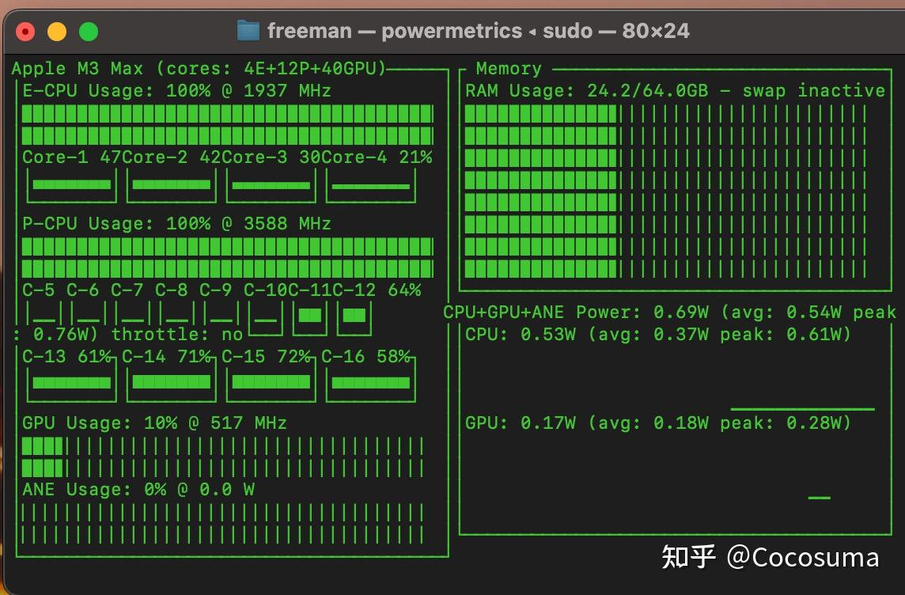
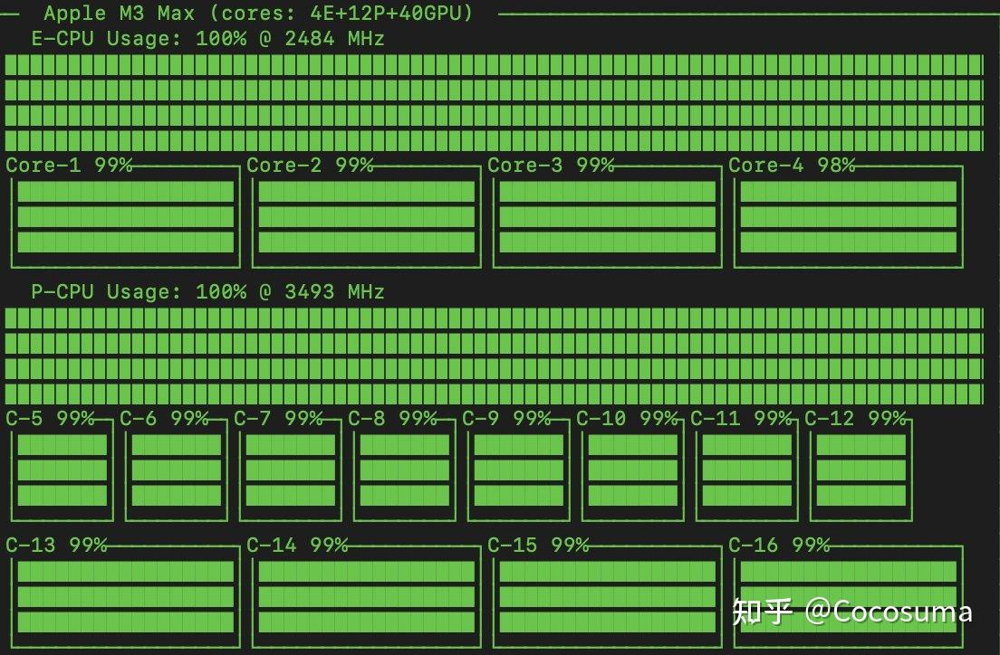

因为MacOS的大小核心调度完全是

官方：“我寻思我只要小核就行”

然后就一堆东西卡在小核上（比如appstore装个应用，或者是下载东西，或者一些通过系统api就可以完成的常见操作比如听听歌）

第三方：我服从组织安排

然后就一堆东西根据用量进行调度。另外程序自己的设计也挺关键：

  

你看这P-core，别看大核12颗，其实平常有一半根本不开的 （C5-C10）。只有高负载状态才会开。

Lightroom之类的软件，你在前台有活跃的UI操作时，会压制其后台批处理进程，而你一切到后台它就会火力全开占满CPU：

你问我怎么评价，问就是三流0️⃣之类的厂商不死是不行的