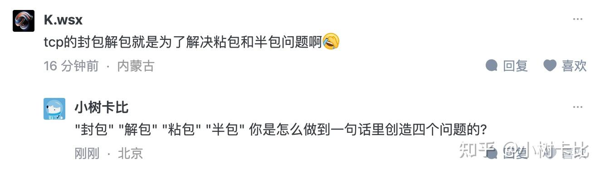

在我网络编程很多年之后才听说粘包这个词.

当时我很诧异, 以为是有我不知道的潜在问题, 而我有很多代码都没处理这个问题, 所以我赶紧去查了一下. 原来是tmd不知道协议怎么设计, 不写信息长度...

现在我已经认定了, 谁提粘包谁就是小白.

\======================================

我也不想挂别人, 但是怎么又创造了这么多不存在的问题啊? 谁tm网络编程处理过半包问题? 不完整的包别说到网卡驱动了, 硬件层就把这种包给drop了, 谁家基于tcp的application层需要解决这种问题? 一个个的都不是写代码的, 都是实现网卡硬件电路的是吧?

那么请问你如何处理灰包, 乱包, 塞包, 扰包, 锯齿包和不定包问题呢?

