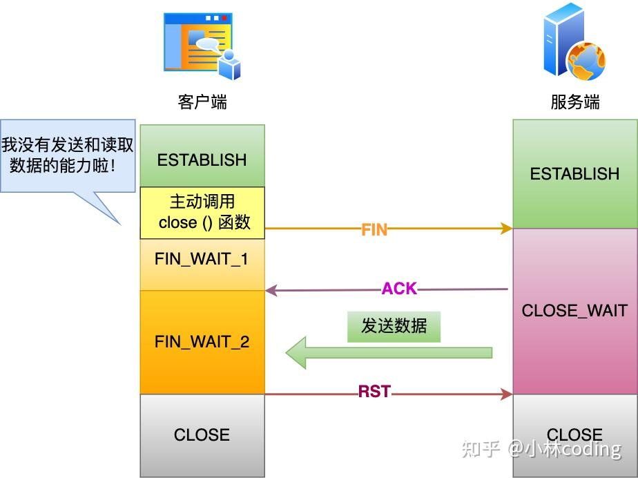
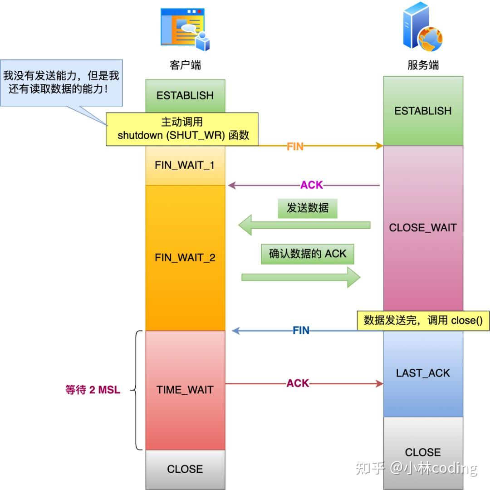

其实关闭的连接的函数有两种函数：

-   close 函数，同时 socket 关闭发送方向和读取方向，也就是 socket 不再有发送和接收数据的能力。如果有多进程/多线程共享同一个 socket，如果有一个进程调用了 close 关闭只是让 socket 引用计数 -1，并不会导致 socket 不可用，同时也不会发出 FIN 报文，其他进程还是可以正常读写该 socket，直到引用计数变为 0，才会发出 FIN 报文。
-   shutdown 函数，可以指定 socket 只关闭发送方向而不关闭读取方向，也就是 socket 不再有发送数据的能力，但是还是具有接收数据的能力。如果有多进程/多线程共享同一个 socket，shutdown 则不管引用计数，直接使得该 socket 不可用，然后发出 FIN 报文，如果有别的进程企图使用该 socket，将会受到影响。

如果客户端是用 close 函数来关闭连接，那么在 TCP 四次挥手过程中，如果收到了服务端发送的数据，由于客户端已经不再具有发送和接收数据的能力，所以客户端的内核会回 RST 报文给服务端，然后内核会释放连接，这时就不会经历完成的 TCP 四次挥手，所以我们常说，调用 close 是粗暴的关闭。

  

  

当服务端收到 RST 后，内核就会释放连接，当服务端应用程序再次发起读操作或者写操作时，就能感知到连接已经被释放了：

-   如果是读操作，则会返回 RST 的报错，也就是我们常见的Connection reset by peer。
-   如果是写操作，那么程序会产生 SIGPIPE 信号，应用层代码可以捕获并处理信号，如果不处理，则默认情况下进程会终止，异常退出。

相对的，shutdown 函数因为可以指定只关闭发送方向而不关闭读取方向，所以即使在 TCP 四次挥手过程中，如果收到了服务端发送的数据，客户端也是可以正常读取到该数据的，然后就会经历完整的 TCP 四次挥手，所以我们常说，调用 shutdown 是优雅的关闭。

  

  

但是注意，shutdown 函数也可以指定「只关闭读取方向，而不关闭发送方向」，但是这时候内核是不会发送 FIN 报文的，因为发送 FIN 报文是意味着我方将不再发送任何数据，而 shutdown 如果指定「不关闭发送方向」，就意味着 socket 还有发送数据的能力，所以内核就不会发送 FIN。