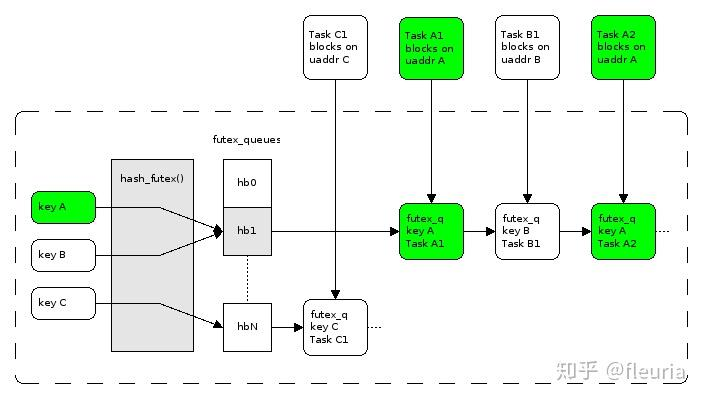

atomic 做的事情：原子指令修改内存，内存栅栏保障修改可见，必要时锁总线。

mutex 大致做的事情：

短暂原子 compare and set 自旋如果未成功上锁，futex(&lock, FUTEX\_WAIT... ) 退避进入阻塞等待直到 lock 值变化时唤醒。futex 在设计上期望做到如果无争用，则可以不进内核态，不进内核态的 fast path 的开销等价于 atomic 判断。

内核里维护按地址维护一张 wait queue 的哈希表，发现锁变量值的变化（解锁）时，唤醒对应的 wait queue 中的一个 task。wait queue 这个哈希表的槽在更新时也会遭遇争用，这时继续通过 spin lock 保护。

References：

-   [https://eli.thegreenplace.net/2018/basics-of-futexes/](https://link.zhihu.com/?target=https%3A//eli.thegreenplace.net/2018/basics-of-futexes/)
-   [https://speakerdeck.com/kavya719/lets-talk-locks](https://link.zhihu.com/?target=https%3A//speakerdeck.com/kavya719/lets-talk-locks%3Fslide%3D57)