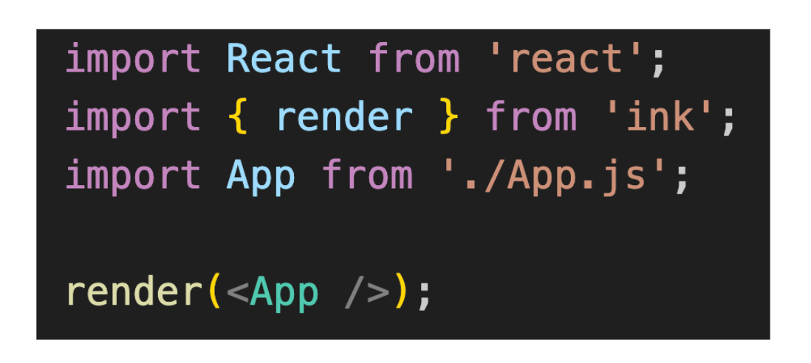
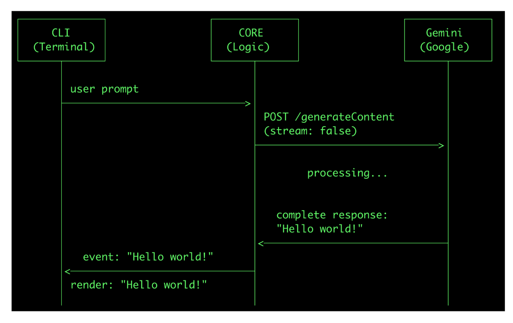

我现身说法来讲一下搞Coding Agent的心路历程。

几个月前我想自己搓了了个Coding Agent，叫做 inker [https://github.com/mocheng/inker](https://link.zhihu.com/?target=https%3A//github.com/mocheng/inker) ，最开始的时候就要面对怎么选编程语言。

先想到的是 Python，因为搞 AI 的过程就要接触 PyTorch、TensorFlow 和 numpy ，全都是 Python，熟练了。

但是，接着我就要面对问题了，从哪个 Python 版本来开发呢？

每次 Python 版本升级都大量新功能，用太老的版本，我心有不甘，用太新的版本，在新机器上还要升级 Python 版本 ......

就在犹豫之间，决定看看主流 CLI 的Coding Agent 怎么选，毕竟，到时候遇到什么坑，看其他 Coding Agent 怎么解决，也有个参考。

主流 CLI 的语言选择，差不多是这样的分布：

-   TypeScript/JavaScript 阵营有Claude Code、Gemini CLI、和老版的Codex
-   Rust 阵营 Amazon Q (现在叫kiro-cli了）、新版的Codex
-   Python，开园时间的aider
-   Go，OpenCode和Crush

我一看，走 Python 路线的其实不多，决定还是放弃这条路吧；Rust 我又不是很会，有点难为我； Go的话似乎很强，但是我真不喜欢OpenCode的TUI，算是恨屋及乌吧，放弃了 Go。

所以，还是 TypeScript/JavaScript看起来浓眉大眼，像是一个正派。

其实，当时这么选，一个主要原因，还是抱着学习的心态，认定开发过程中一定会遇到坑，有一个开源的用户量大的参照物，有坑可以过去看人家怎么解决的。

后来果然遇到了坑，这就是老程序员直觉的作用啊！

语言选的是 TypeScript，连 LLM 部分用了Google 的js-genai，因为那时候 Gemini 给的免费额度还真的挺多，前端 CLI 展示用了 ink，所以我的Coding Agent就拍脑袋叫了inker。

这个 ink 是基于 React 框架实现的 CLI 框架，虽然好多年我不碰 React 里，但是再用起来，还是感觉很亲切，React 创建之初就没有把自己限定在 Web 上，可以用于 Native App，当然也可以用于命令行 CLI 。

我有点理解其他CLI Coding Agent 选TypeScript/JavaScript的原因了，因为CLI总是要做界面的呀，TypeScript/JavaScript天生就有做界面的基础，可以直接用 React。

其实所有的CLI Coding Agent的架构都差不多，至少分成两个部分，一个是CLI Terminal部分，对我的 inker来说，就是用ink + React代码来渲染命令行，另一个是 Core 部分，就是处理和 Tool、LLM 的沟通和编排部分。

Core 部分在处理Tool和LLM都是要IO的，既然有IO，当然是异步操作最好，巧了，TypeScript/JavaScript就是擅长异步编程。

到这里，我有点为自己的技术选择沾沾自喜了，当然，不出意外的话，意外就要发生了。

ink 虽然用起来很爽，但是很快我遇到一个问题，就是当以流式方式展示LLM返回的结果时，结果超过一个屏幕，就会出现卡顿现象。

我搞了半天，没搞定，只好去 Gemini CLI 的开源库里取经，果然，他们也踩过一样的坑！

解决方法就是，只渲染屏幕内的命令行，上面超出当前命令行的部分，用 `<Static></Static>` 抱起来，避免重复渲染。

这一段连 Gemini CLI 都有很hacky的代码，唉 ，软件开发就是这样，为了呈现出丝滑顺畅的美感，其实背后全都是脏活。

就因为这样的坑，我几次想要放弃 TypeScript + ink 重头开始，我甚至还开了一个branch 让 AI 用python + Textual 重写，但是搞不定，最后还是作罢。

这可能也是大部分 Coding Agent 还在用 TypeScript/JavaScript的原因——初期的时候觉得这个选择挺正确，后期遇到了坑，想要换也来不及了:-)

像 Codex 这样船大也敢掉头用 Rust 重写的，我只能写一个大大的服字！