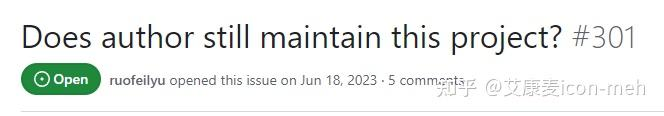
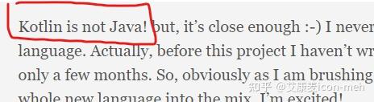
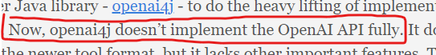

我边上的 Java 老大哥得意地说，因为我们搞 Java 的动手能力都很强，而且我们有世界上最活跃的开源社区......

然后给我转了一篇文章，[https://the-gigi.github.io/gigi\-zone/posts/2024/02/in-search-of-the-best-openai-java-client/](https://link.zhihu.com/?target=https%3A//the-gigi.github.io/gigi-zone/posts/2024/02/in-search-of-the-best-openai-java-client/)

里面列举并比较了以下几个库：

-   openai-java
-   openai-kotlin
-   langchain4j
-   simple-openai

我看完以后跟他说，这文章自己都讲了 ------ 这几个库都有各自的问题......

**#1. openai-java** 没有得到积极维护，github 上甚至有人问 “该项目是否仍在维护”?

**#2. openai-kotlin**？Kotlin 不是 Java！哈哈哈......

**#3. Langchain4J**？它使用了另一个叫 openai4j 的 Java 库，而 openai4j 并未完全实现 OpenAI API。

**#4. simple-openai**？这个质量据说不错，但问题是缺少推广，没人知道......

Java 老大哥接着说，没错，是这样的，所以我们又构建了一个自己的 Java 库......

......

你看，都不需要官方操心，多好~