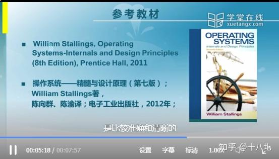
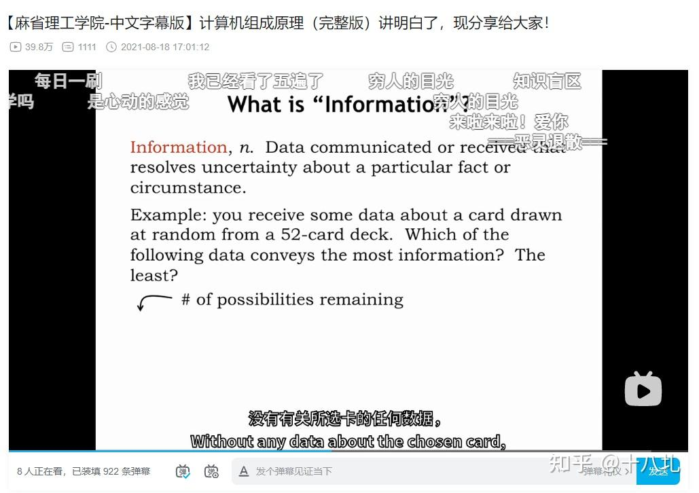
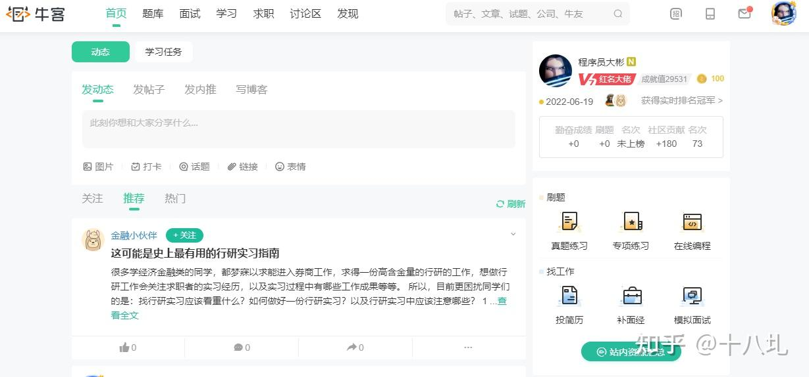
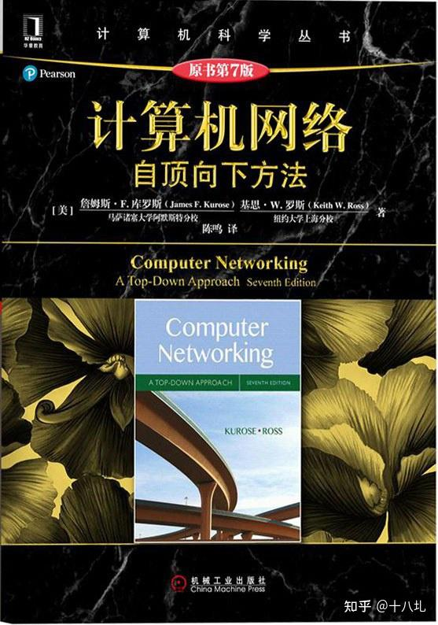
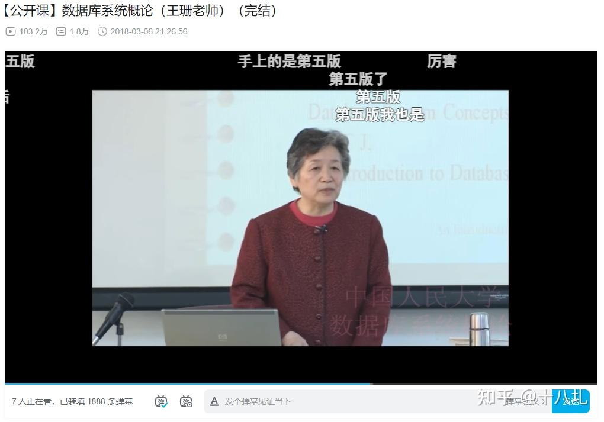
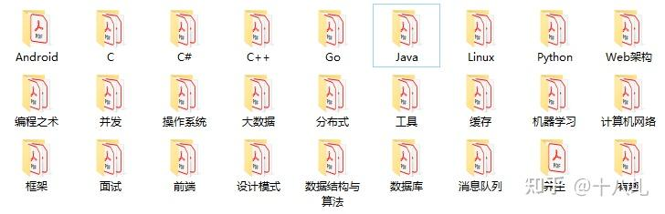

自己品吧。。。

c语言之父—谭浩强

java之父—马士兵

python之父—廖雪峰

汇编之父—王爽

linux之父—鸟哥

c++之父—轮子哥(vczh)

java继父—余胜军  
(由于国内java贡献者较多,调整余胜军与java类关系为extends)

c++继父—侯捷(c++也是面向对象语言  
允许继承(笑),继承用冒号表示)

当然上面部分老师还是很有实力的，纯属调侃。

建议大家看看**计算机科学速成课**，一门很全面的计算机原理入门课程，短短10分钟可以把大学老师十几节课讲不清楚的东西讲清楚！整个系列一共41个视频，B站上有中文字幕版。

每个视频都是一个特定的主题，例如软件工程、人工智能、操作系统等，主题之间都是紧密相连的，比国内很多大学计算机课程强太多！

这门课程通过生动形象的讲解方式，向普通人介绍了计算机科学相关的基础知识，包括**计算机的发展史、二进制、指令和程序、数据结构与算法、人工智能、计算机视觉、自然语言处理**等等。

每节课程短小精悍，只有短短十几分钟，适合平时碎片化时间观看。

课程目录如下，光看课程大纲都有学习的欲望~

1.  早期的计算
2.  电子计算
3.  布尔逻辑与逻辑电路
4.  二进制
5.  算术逻辑单元
6.  寄存器 & 内存
7.  中央处理器
8.  指令和程序
9.  高级 CPU 设计
10.  编程史话
11.  编程语言
12.  编程原理：语句和函数
13.  算法初步
14.  数据结构
15.  阿兰·图灵
16.  软件工程
17.  集成电路、摩尔定律
18.  操作系统
19.  内存 & 储存介质
20.  文件系统
21.  压缩
22.  命令行界面
23.  计算机网络
24.  互联网
25.  万维网
26.  网络安全
27.  黑客与攻击
28.  加密
29.  机器学习与人工智能
30.  计算机视觉
31.  自然语言处理
32.  机器人
33.  计算机中的心理学
34.  教育型科技
35.  奇点，天网，计算机的未来

课程地址：[https://www.bilibili.com/video/av21376839/?vd\_source=2b77c4a826e636ae19a4f75a4b2ca146](https://link.zhihu.com/?target=https%3A//www.bilibili.com/video/av21376839/%3Fvd_source%3D2b77c4a826e636ae19a4f75a4b2ca146)

建议关闭弹幕认真观看~

> 在这里给大家分享一本谷歌大佬撰写的**算法手册**，整整 **300** 道 LeetCode 题目，并且都是**最优解**，非常强！这本手册帮助不少朋友加入大厂，大家加油！

谷歌大佬撰写的算法手册：[http://mp.weixin.qq.com/s?\_\_biz=Mzg2OTY1NzY0MQ==&mid=2247485445&idx=1&sn=1c6e224b9bb3da457f5ee03894493dbc&chksm=ce98f543f9ef7c55325e3bf336607a370935a6c78dbb68cf86e59f5d68f4c51d175365a189f8#rd](https://link.zhihu.com/?target=http%3A//mp.weixin.qq.com/s%3F__biz%3DMzg2OTY1NzY0MQ%3D%3D%26mid%3D2247485445%26idx%3D1%26sn%3D1c6e224b9bb3da457f5ee03894493dbc%26chksm%3Dce98f543f9ef7c55325e3bf336607a370935a6c78dbb68cf86e59f5d68f4c51d175365a189f8%23rd)

## 操作系统

无论学习什么编程语言，和需要和操作系统打交道。如果对操作系统不熟悉，那么你在未来的学习路上将会遇到很多障碍，比如线程进程调度、内存分配、Java的虚拟机等知识，都会一头雾水。所以只有把操作系统搞明白了，才能够更好地学习计算机的其他知识。

**视频教程推荐**

Udacity的Advanced OS公开课：[https://www.classcentral.com/course/udacity-advanced-operating-systems-1016](https://link.zhihu.com/?target=https%3A//www.classcentral.com/course/udacity-advanced-operating-systems-1016)

还有国内不错的操作系统的课程，清华大学的公开课：[https://www.xuetangx.com/course/THU08091000267/5883104?channel=search\_result](https://link.zhihu.com/?target=https%3A//www.xuetangx.com/course/THU08091000267/5883104%3Fchannel%3Dsearch_result)

  

由清华大学两位老师向勇、陈渝讲授，同时配有一套完整的实验，实验内容是从无到有地建立起一个小却五脏俱全的操作系统，以主流操作系统为实例，以教学操作系统ucore为实验环境，讲授操作系统的概念、基本原理和实现技术，为学生从事操作系统软件研究和开发，以及充分利用操作系统功能进行应用软件研究和开发打下扎实的基础。

另外推荐另一门MIT操作系统课程：**MIT6.268**

课程地址：[https://pdos.csail.mit.edu/6.828/2018/schedule.html](https://link.zhihu.com/?target=https%3A//pdos.csail.mit.edu/6.828/2018/schedule.html)

  

MIT6.828 是一门非常值得学习的课程，广受好评。

只要你跟着项目一步一步走，做完 6 个实验，就能实现一个简单的操作系统内核。

每个实验都有对应的知识点，学完理论知识后会有相应的练习，学习体验非常棒！

**建议**在开始学习这门课之前先熟悉C和汇编，对计算机组成有一定了解。

**操作系统主要知识点**：

-   操作系统的基础特征
-   进程与线程的本质区别、以及各自的使用场景
-   进程的几种状态
-   进程通信方法的特点以及使用场景
-   进程任务调度算法的特点以及使用场景
-   死锁的原因、必要条件、死锁处理。手写死锁代码、Java是如何解决死锁的。
-   线程实现的方式
-   内存管理的方式
-   虚拟内存的作用，分页系统实现虚拟内存原理
-   页面置换算法的原理
-   静态链接和动态链接

## 计算机组成原理

计算机组成原理，主要学习计算机的基本组成原理和内部运行机制，并探索硬、软件之间相互作用的关系，以及如何有效利用硬件提高系统性能的。

**视频推荐**

计算机组成原理（哈工大刘宏伟）： [https://www.bilibili.com/video/BV1WW411Q7PF](https://link.zhihu.com/?target=https%3A//www.bilibili.com/video/BV1WW411Q7PF)

刘宏伟老师主讲，他的课不仅适合考研人，也非常适合初学者，初学者也听得懂。

  

【麻省理工学院-中文字幕版】计算机组成原理：[https://www.bilibili.com/video/BV1kU4y177x9](https://link.zhihu.com/?target=https%3A//www.bilibili.com/video/BV1kU4y177x9)

课程为 MIT 6.004 Computation Structures, Spring 2017，如果英文不错，可以跟着学学，课程质量很高的。

编译原理

编译原理介绍了编译程序构造的原理与实践，让你明白高级语言都是如何被转换为另外一种语言的。学完编译原理，可以尝试自己去实现一个完整的小型面向对象语言编译程序。

推荐哈工大的编译原理视频：[https://www.bilibili.com/video/BV1zW411t7YE?p=1&vd\_source=2b77c4a826e636ae19a4f75a4b2ca146](https://link.zhihu.com/?target=https%3A//www.bilibili.com/video/BV1zW411t7YE%3Fp%3D1%26vd_source%3D2b77c4a826e636ae19a4f75a4b2ca146)

  

比起很多砖头书和博客，强太多！陈鄞老师的 PPT 做的很好，讲得也很通俗易懂，课程评价也很高。推荐！

另外推荐一门课，编译原理-国防科技大学：[https://www.bilibili.com/video/BV12741147J3](https://link.zhihu.com/?target=https%3A//www.bilibili.com/video/BV12741147J3)

课程前置知识：具备计算机程序设计语言和程序设计知识，对数据结构与算法、计算机原理、离散数学等相关知识有一定了解更好。视频简洁明了，适合多刷几遍。

  

  

## 数据结构和算法

为什么学习数据结构与算法？对于计算机专业的同学来说，这门课程是必修的，考研基本也是必考科目。对于程序员来说，数据结构与算法也是面试、笔试必备的非常重要的考察点。

数据结构与算法是程序员内功体现的重要标准之一，且数据结构也应用在各个方面。数据结构也蕴含一些面向对象的思想，故学好掌握数据结构对逻辑思维处理抽象能力有很大提升。

**视频推荐**

**UCSanDiego的数据结构与算法专项课程**：[https://www.coursera.org/specializations/algorithms](https://link.zhihu.com/?target=https%3A//www.coursera.org/specializations/algorithms)

**浙大陈越姥姥的数据结构课程**：

[https://www.bilibili.com/video/BV1H4411N7oD](https://link.zhihu.com/?target=https%3A//www.bilibili.com/video/BV1H4411N7oD)

  

  

浙江大学陈越姥姥和何钦铭教授联合授课，非常经典的课程。姥姥我的偶像！

**小甲鱼的数据结构和算法课程**：[https://www.bilibili.com/video/BV1jW411K7yg](https://link.zhihu.com/?target=https%3A//www.bilibili.com/video/BV1jW411K7yg)

数据结构与算法主要学习以下内容：

-   基本数据结构（数组、链表、栈、队列等）
-   树（二叉树、avl树、b树、红黑树等）
-   堆结构
-   排序算法（冒泡排序、选择排序、插入排序、快速排序、归并排序、堆排序等及时间空间复杂度）
-   动态规划、回溯、贪心算法（多刷刷leetcode）
-   递归
-   位运算

学完感觉还很吃力？可以借助一些刷题网站巩固下。下面推荐几个刷题网站。

**牛客网**

  

  

作为牛客红名大佬，来给牛客宣传一波！（牛客打钱！）

牛客网拥有超级丰富的 IT 题库，题库+面试+学习+求职+讨论，基本涵盖所有面试笔试题型，堪称"互联网求职神器"。在这里不仅可以刷题，还可以跟其他牛友讨论交流，一起成长。牛客上还会各种的内推机会，对于求职的同学也是极其不错的。

**LeetCode**

  

  

**力扣，强推**！力扣虐我千百遍，我待力扣如初恋！

从现在开始，每天一道力扣算法题，坚持几个月的时间，你会感谢我的（傲娇脸）

我刚开始刷算法题的时候，就选择在力扣上刷。最初刷easy级别题目的时候，都感觉有点吃力，坚持半年之后，遇到中等题目甚至hard级别的题目都不慌了。

不过是熟能生巧罢了。

**LintCode**

  

  

与Leetcode类似的刷题网站。

LeetCode/LintCode的题目量差不多。LeetCode的**test case比较完备**，并且LeetCode有**讨论区**，看别人的代码还是比较有意义的。

LintCode的UI、tagging、filter更加灵活，更有优点，大家选择其中一个进行刷题即可。

## 计算机网络

计算机网络这门课需要学习计算机网络的概念、原理和体系结构，知道计算机分层结构，物理层、数据链路层、介质访问子层、网络层、传输层和应用层的基本原理和协议，掌握以 TCP/IP 协议族为主的网络协议结构，并且了解网络新技术的最新发展。

**书籍推荐**

《计算机网络自顶向下方法》

  

  

这本书是经典的计算机网络教材，采用作者独创的自顶向下方法来讲授计算机网络的原理及其协议，自第1版出版以来已经被数百所大学和学院选作教材。书中从应用层讲起，然后展开，摆脱了从物理层开始的枯燥，直接接触应用实例，更能吸引读者的兴趣。而且，书上很多例子举的很好，生动形象。

> 分享一份图解PDF系列图书，包括操作系统、网络、计算机组成原理等**计算机基础**书籍！强烈建议你**收藏**起来！  
> [https://mp.weixin.qq.com/s/CEruH9L1jJHIUcHspztn9Q](https://link.zhihu.com/?target=https%3A//mp.weixin.qq.com/s/CEruH9L1jJHIUcHspztn9Q)

**视频推荐**

视频推荐中科大郑烇、杨坚全套《计算机网络（自顶向下方法 第7版，James F.Kurose，Keith W.Ross）》课程。这门课是2020年秋科大自动化系本科课程录制版，可与中科大学生一起完成专业知识的学习。

[https://www.bilibili.com/video/BV1JV411t7ow?p=7&vd\_source=2b77c4a826e636ae19a4f75a4b2ca146](https://link.zhihu.com/?target=https%3A//www.bilibili.com/video/BV1JV411t7ow%3Fp%3D7%26vd_source%3D2b77c4a826e636ae19a4f75a4b2ca146)

  

  

另外还可以看看哈尔滨工业大学李全龙老师的计算机网络课程：[https://www.bilibili.com/video/BV1Up411Z7hC](https://link.zhihu.com/?target=https%3A//www.bilibili.com/video/BV1Up411Z7hC)

  

  

**计算机网络核心知识点**：

-   网络分层结构
-   TCP/IP
-   三次握手四次挥手
-   滑动窗口、拥塞控制
-   HTTP/HTTPS
-   网络安全问题（CSRF、XSS、SQL注入等）

## 数据库

互联网应用大多属于数据密集型应用，对于真实世界的数据密集型应用而言，除非你准备从基础组件的轮子造起，不然根本没那么多机会去摆弄花哨的数据结构和算法。

实际生产中，数据表就是数据结构，索引与查询就是算法。而应用代码往往扮演的是胶水的角色，处理IO与业务逻辑，其他大部分工作都是在数据系统之间搬运数据。在最宽泛的意义上，有状态的地方就有数据库。它无所不在，网站的背后、应用的内部，单机软件，区块链里，甚至在离数据库最远的Web浏览器中。

**书籍推荐**

-   《MySQL必知必会》
-   《高性能MySQL》

《MySQL必知必会》主要是Mysql的基础语法，很好理解。后面有了基础再看《高性能mysql》，这本书主要讲解索引、SQL优化、高级特性等，很多Mysql相关面试题出自《高性能MySQL》这本书，值得一看。

**视频推荐**

伯克利的 CS168 课程：[https://archive.org/details/UCBerkeley\_Course\_Computer\_Science\_186](https://link.zhihu.com/?target=https%3A//archive.org/details/UCBerkeley_Course_Computer_Science_186)

  

  

国内中国人民大学王珊老师的《数据库系统概论》：[https://www.bilibili.com/video/BV1pW411W7Do](https://link.zhihu.com/?target=https%3A//www.bilibili.com/video/BV1pW411W7Do)

  

  

> 最后给大家分享**200多本计算机经典书籍PDF电子书**，包括**C语言、C++、Java、Python、前端、数据库、操作系统、计算机网络、数据结构和算法、机器学习、编程人生**等，感兴趣的小伙伴自取：

  
**200多本计算机经典书籍PDF电子书**：[https://mp.weixin.qq.com/s?\_\_biz=Mzg2OTY1NzY0MQ==&mid=2247486208&idx=1&sn=dbeedf47c50b1be67b2ef31a901b8b56&chksm=ce98f646f9ef7f506a1f7d72fc9384ba1b518072b44d157f657a8d5495a1c78c3e5de0b41efd&token=1652861108&lang=zh\_CN#rd](https://link.zhihu.com/?target=https%3A//mp.weixin.qq.com/s%3F__biz%3DMzg2OTY1NzY0MQ%3D%3D%26mid%3D2247486208%26idx%3D1%26sn%3Ddbeedf47c50b1be67b2ef31a901b8b56%26chksm%3Dce98f646f9ef7f506a1f7d72fc9384ba1b518072b44d157f657a8d5495a1c78c3e5de0b41efd%26token%3D1652861108%26lang%3Dzh_CN%23rd)

  

码字不易，如果觉得对你有帮助，可以**点个赞**鼓励一下！