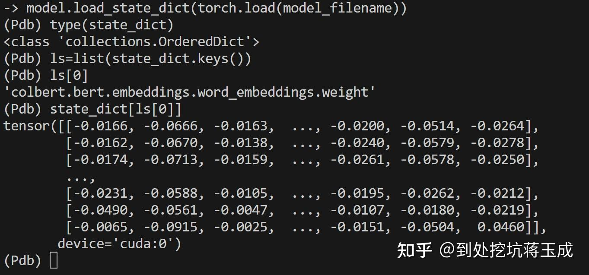
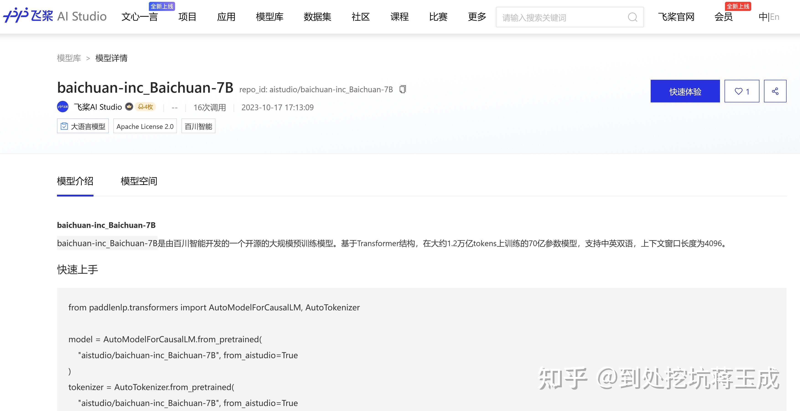
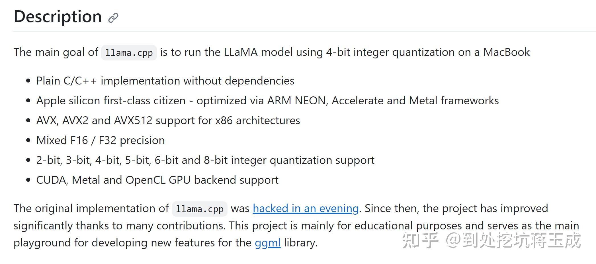
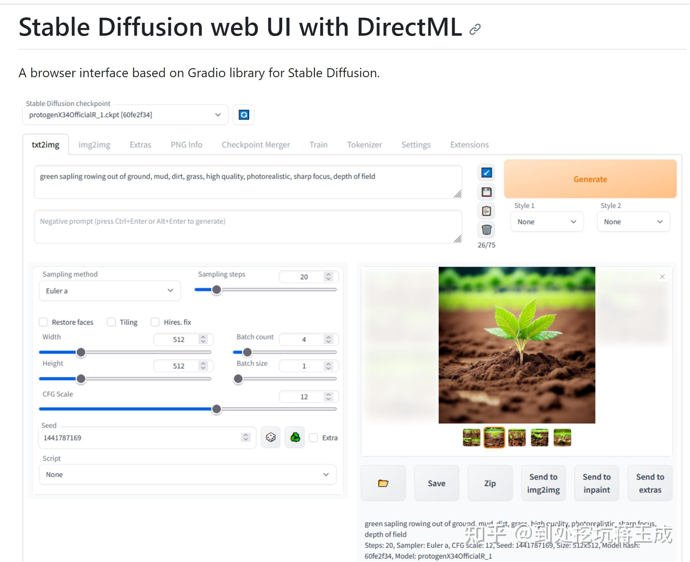
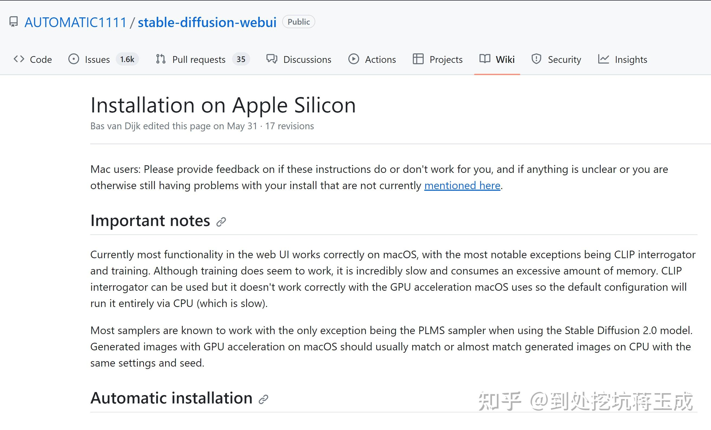
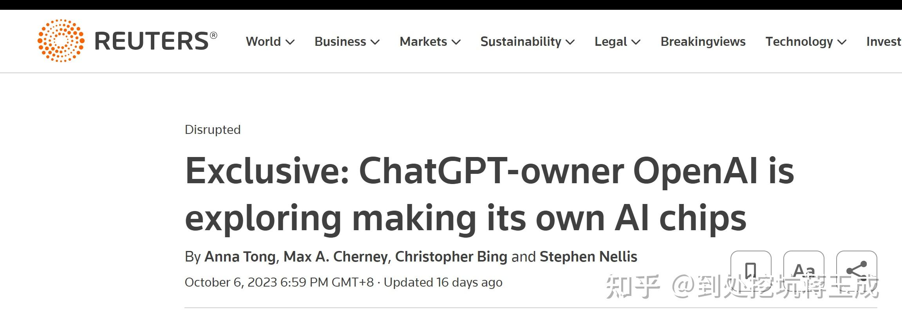
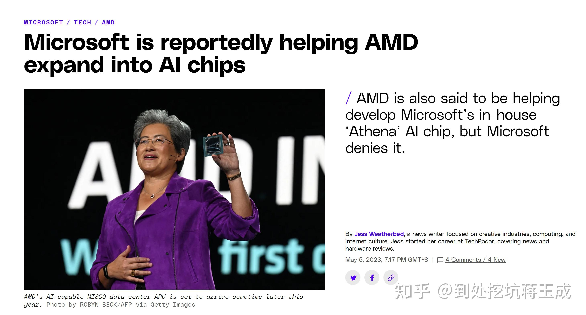
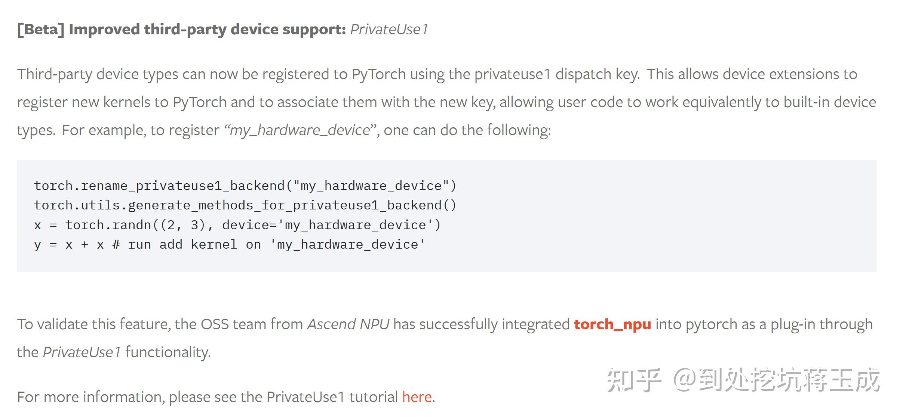
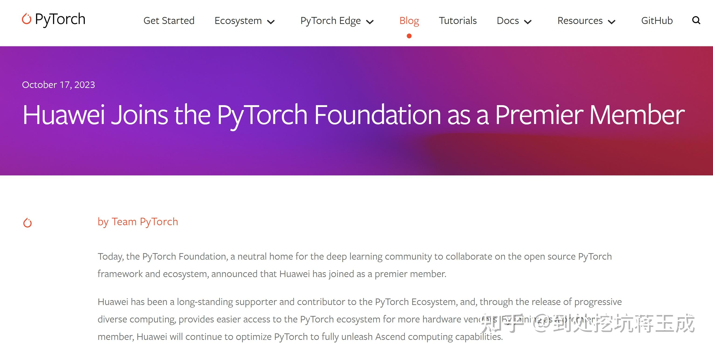

实际上很多人对“生态”存在严重的误解——深度学习模型与框架的前端生态和后端生态是两个完全不同的概念，N卡和CUDA-API作为后端，跟前端完全不耦合。

### “模型”到底是什么

首先，所谓的“模型”本质上是两个部分的合体：计算图和模型参数——神经网络的本质是一个数学定义下的函数，它自身不是一个可执行的程序。举个简单的例子，假设某个模型的函数实际上就是一个二次函数f(x)=x^2+2x+1，那它的“计算图”就是ax^2+bx+c（简写，实际要变成图结构），参数就是一个字典：{a:1,b:2,c:1}。

所以pytorch保存的模型文件实际上是一个python字典，你用pytorch载入一个保存好的模型，需要先在代码里import 模型定义，然后再load\_state\_dict。换句话说，实际发布的“模型”本身需要依附于框架而存在，**不是一个可执行文件**。

### 深度学习框架的前端与后端

然后什么是前端和后端呢？简单地说，你用pytorch定义了一个模型的class，构建了计算图，这个过程中你使用了pytorch的前端；然后你在执行训练的过程中调用了tensor.cuda()或者tensor.cpu()（后者在新建Tensor的时候已经强制隐式调用了），这个过程中使用了pytorch的后端。在此基础上，什么是前端生态和后端生态呢？开源社区发布了基于pytorch的模型，这个叫做前端生态，而pytorch可以支持CUDA后端，这个叫做后端生态。

事实上，哪怕是前端生态也不是绝对的——前面说了，模型的本质是计算图+参数，也就是说如果其他框架维护方自己照着写一个模型，然后把参数转换过来，实际上也是可以把pytorch的模型拿过来用的——当然这种操作非常麻烦就是了。

很多人误以为所谓的“CUDA护城河”指的是“开源社区发布的模型只能用N卡跑”，这个是完全不成立的——绝大多数情况下前端与后端没有任何关系。这是因为，在冯诺依曼体系结构下，所有框架都必须提供最基本的前后端分离，必须确保前端与后端不耦合——因为CPU才是冯诺依曼体系结构下计算机的中心，GPU只是附加设备而已，**无论如何你至少要提供CPU后端的支持**。

当然理论上前端模型开发者如果足够头铁的话，确实也可以自己定义一个CUDA only，其它后端完全没有替代项的算子，但大多数情况下这么做代价极高收益极低，所以实际情况极其罕见。而且实际应用中，无CUDA环境比比皆是：例如很多线上推理场景没有GPU资源，只能使用CPU，还有端侧部署场景，绝大多数情况下部署的目标设备根本就没有CUDA可用。总而言之，目前大部分主流的模型都是与具体后端无关的，不存在某某模型只有N卡能跑的情况。

所谓“CUDA护城河”的真实情况是，由于CUDA成熟时间最早，成熟度最高，在很长的时间里（差不多到2019-2020年），虽然pytorch理论上是前后端分离的，但实际上几乎只支持CUDA和CPU两种后端——由于CPU速度远远慢于GPU，因此几乎可以认为CUDA完全垄断了深度学习领域。在当时，排除端侧场景，CUDA在模型训练和推理两个方向的优势都是绝对的，除了CPU以外的其他后端甚至都不是成不成熟的问题，而是有没有的问题，当时想用A卡或者其他设备跑模型（尤其是训练），那根本就是想都不用想。

### 近年来的后端多样化趋势

但最近两年这一情况有了巨大的改观：以pytorch为例，现在pytorch官方已经支持了四种后端：CPU、CUDA、ROCm（AMD显卡）和MPS（苹果Metal系列平台）。我自己之前试用过MPS，在M1 Max上可以正常执行BERT模型的Fine-tune，虽然速度仍然比不上最新的N卡，但也比CPU快很多。另外哪怕是同一种硬件，也可能对应多种后端——比如微软自己维护了pytorch-DirectML后端，可以在Windows上调用任何支持DX12的显卡。随着“全民AI”时代的到来，算子的单位算力密度有了巨大的提升，这也给后来者极大地降低了难度——因为你不需要把所有算子都优化好，完全可以优先处理热门应用（例如SD或大模型）需要的那些算子，因为你的用户往往也不会拿来干别的。

例如对于大模型，目前大多数开源大模型（包括典型的LLama家族和ChatGLM）都至少可以使用CPU进行推理，在此基础上著名的开源项目llama.cpp支持多种LLama结构的模型，并且支持很多不同的后端——甚至可以使用苹果M系列的GPU和NPU。

[https://github.com/ggerganov/llama.cpp](https://link.zhihu.com/?target=https%3A//github.com/ggerganov/llama.cpp)

再比如更早的AI绘画应用，B站上现在已经有很多A卡和Mac绘图的教程了，使用的就是pytorch的MPS或DirectML后端——当然目前性能和稳定性跟CUDA比起来还有很大的差距，但比起几年前完全不可用的状态已经有了质的飞跃。要知道，19-20年AMD还稍微好一点，不支持N卡之后的苹果还是跟AI几乎完全绝缘的存在呢，**谁能想到短短两三年之后你甚至都可以在M系列平台上调用GPU了**？

[GitHub - lshqqytiger/stable-diffusion-webui-directml: Stable Diffusion web UI](https://link.zhihu.com/?target=https%3A//github.com/lshqqytiger/stable-diffusion-webui-directml)

[Installation on Apple Silicon](https://link.zhihu.com/?target=https%3A//github.com/AUTOMATIC1111/stable-diffusion-webui/wiki/Installation-on-Apple-Silicon)

所以对于后来者来说，如果你的目标是AI，而不是更加底层的科学计算程序的话，那你其实完全没必要考虑兼容CUDA，只要你自己给pytorch做好后端，实现算子兼容和调优就可以了。虽然后端的实现依然难度巨大，依然要花费大量精力去调优，但比起兼容CUDA已经容易多了，可行性也高得多。

### 整个业界的“去CUDA化”趋势

大模型对算力的巨额需求，使得老黄的话语权暴涨，但这并不是好事——因为老黄在不做人这件事情上一直都是不会让人失望的，整个业界都完全无法接受老黄的话语权在目前已经非常高的基础上进一步暴涨。于是“去CUDA化”一夜之间成了整个业界（而非单纯国内）的刚需。

在最新发布的pytorch2.1中，有媒体热炒所谓“pytorch官方支持华为NPU”，但实际上这一消息并不完全属实。实际的情况是，pytorch官方实装了dispatch\_key注册功能：

以前的时候，pytorch官方只支持内建的几个device，第三方如果想添加自己设备的支持的话就必须自己维护一个完整的pytorch fork，成本非常高。而现在pytorch官方实装了dispatch\_key注册功能，那么第三方就可以自己维护一个插件，直接注册到官方版pytorch就可以用了，比起直接自己维护一整个pytorch简单多了——同时pytorch自身的前后端分离程度也必然会得到进一步提升，适配的时候更不容易出问题。这里pytorch官方使用了华为的torch\_npu项目作为测试。也许今后openai的自研芯片或者微软维护的directml后端也会基于同样的方法实现pytorch的接入。

事实上，就在不久前，华为自己也加入了pytorch基金会，也许后面的版本中，device="npu"可能就要成为了pytorch官方维护的后端了。

总的来说，对于后来者而言，近年来AI大环境的发展已经给非CUDA生态创造了前所未有的好环境。NV的优势依然巨大，但早已经不是之前那样绝对而不可动摇了。