> 文章来源 ｜ 图解计算机基础网站：[xiaolincoding.com](https://link.zhihu.com/?target=https%3A//xiaolincoding.com/)

我记得之前在群里看到，有位读者字节一面的时候被问到：「**如何基于 UDP 协议实现可靠传输？**」

很多同学第一反应就会说把 TCP 可靠传输的特性（序列号、确认应答、超时重传、流量控制、拥塞控制）在应用层实现一遍。

实现的思路确实这样没错，但是有没有想过，**既然 TCP 天然支持可靠传输，为什么还需要基于 UDP 实现可靠传输呢？这不是重复造轮子吗？**

所以，我们要先弄清楚 TCP 协议有哪些痛点？而这些痛点是否可以在基于 UDP 协议实现的可靠传输协议中得到改进？

在之前这篇文章：[TCP 就没什么缺陷吗？](https://link.zhihu.com/?target=https%3A//mp.weixin.qq.com/s/9kHoRk6QIYOFUR_PCmHY6g)，我已经说了 TCP 协议四个方面的缺陷：

-   升级 TCP 的工作很困难；
-   TCP 建立连接的延迟；
-   TCP 存在队头阻塞问题；
-   网络迁移需要重新建立 TCP 连接；

现在市面上已经有基于 UDP 协议实现的可靠传输协议的成熟方案了，那就是 QUIC 协议，已经应用在了 HTTP/3。

这次，**聊聊 QUIC 是如何实现可靠传输的？又是如何解决上面 TCP 协议四个方面的缺陷**？

  

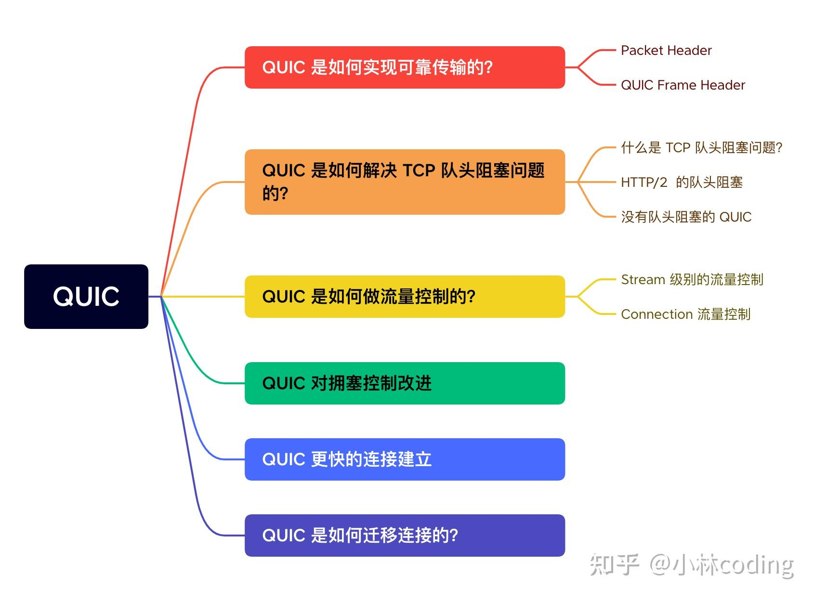

  

## [#](https://link.zhihu.com/?target=https%3A//xiaolincoding.com/network/3_tcp/quic.html%23quic-%25E6%2598%25AF%25E5%25A6%2582%25E4%25BD%2595%25E5%25AE%259E%25E7%258E%25B0%25E5%258F%25AF%25E9%259D%25A0%25E4%25BC%25A0%25E8%25BE%2593%25E7%259A%2584)QUIC 是如何实现可靠传输的？

要基于 UDP 实现的可靠传输协议，那么就要在应用层下功夫，也就是要设计好协议的头部字段。

拿 HTTP/3 举例子，在 UDP 报文头部与 HTTP 消息之间，共有 3 层头部：

  

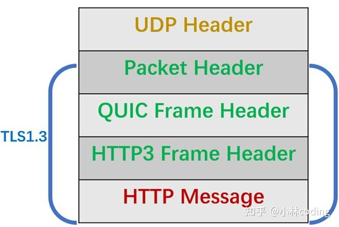

  

整体看的视角是这样的：

  

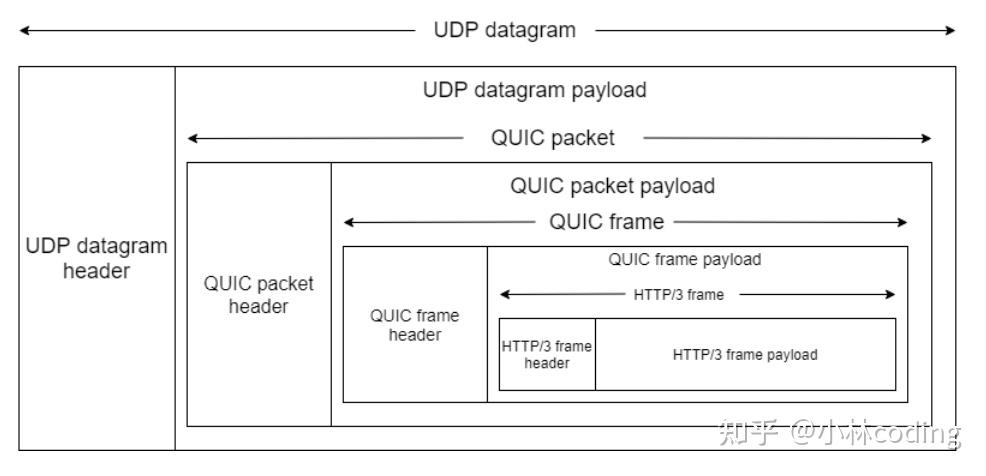

  

接下来，分别对每一个 Header 做个介绍。

### [#](https://link.zhihu.com/?target=https%3A//xiaolincoding.com/network/3_tcp/quic.html%23packet-header)Packet Header

Packet Header 首次建立连接时和日常传输数据时使用的 Header 是不同的。如下图（*注意我没有把 Header 所有字段都画出来，只是画出了重要的字段*）：

  

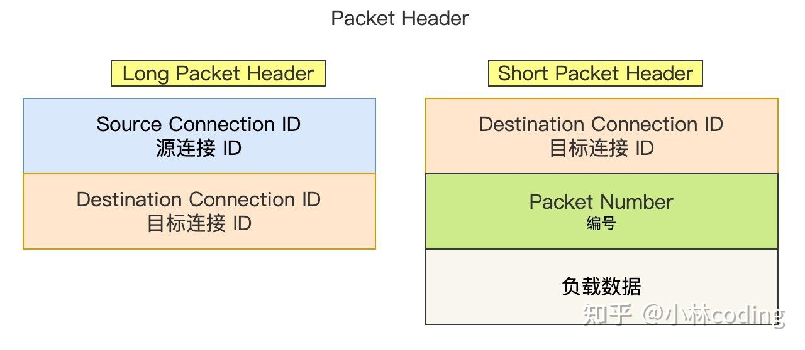

  

Packet Header 细分这两种：

-   Long Packet Header 用于首次建立连接。
-   Short Packet Header 用于日常传输数据。

QUIC 也是需要三次握手来建立连接的，主要目的是为了协商连接 ID。协商出连接 ID 后，后续传输时，双方只需要固定住连接 ID，从而实现连接迁移功能。所以，你可以看到日常传输数据的 Short Packet Header 不需要在传输 Source Connection ID 字段了，只需要传输 Destination Connection ID。

Short Packet Header 中的 `Packet Number` 是每个报文独一无二的编号，它是**严格递增**的，也就是说就算 Packet N 丢失了，重传的 Packet N 的 Packet Number 已经不是 N，而是一个比 N 大的值。

  

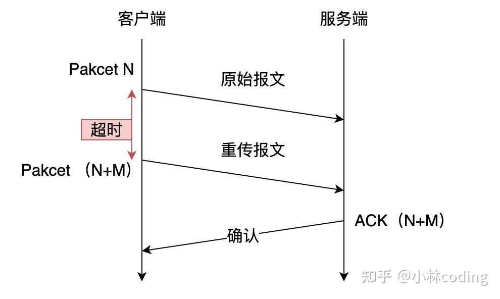

  

> 为什么要这么设计呢？

我们先来看看 TCP 的问题，TCP 在重传报文时的序列号和原始报文的序列号是一样的，也正是由于这个特性，引入了 TCP 重传的歧义问题。

  

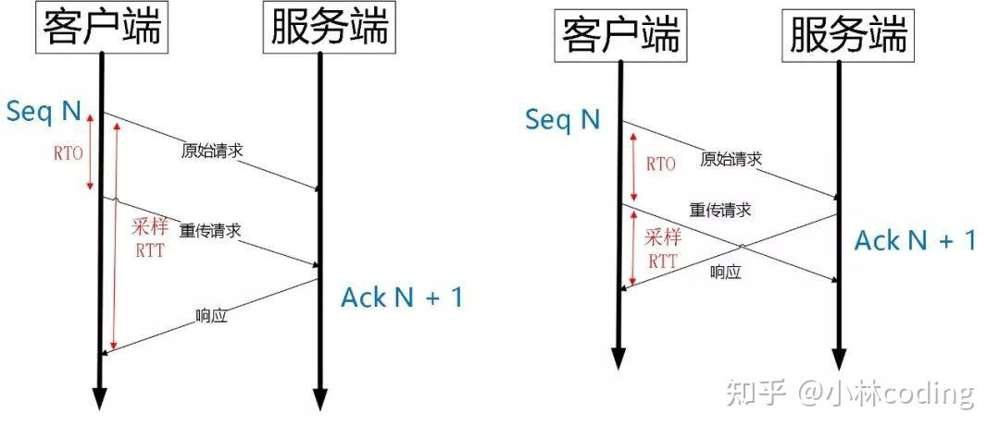

  

比如上图，当 TCP 发生超时重传后，客户端发起重传，然后接收到了服务端确认 ACK 。由于客户端原始报文和重传报文序列号都是一样的，那么服务端针对这两个报文回复的都是相同的 ACK。

这样的话，客户端就无法判断出是「原始报文的响应」还是「重传报文的响应」，这样在计算 RTT（往返时间） 时应该选择从发送原始报文开始计算，还是重传原始报文开始计算呢？

-   如果算成原始请求的响应，但实际上是重传请求的响应（上图左），会导致采样 RTT 变大。
-   如果算成重传请求的响应，但实际上是原始请求的响应（上图右），又很容易导致采样 RTT 过小。

RTO （超时时间）是基于 RTT 来计算的，那么如果 RTT 计算不精准，那么 RTO （超时时间）也会不精确，这样可能导致重传的概率事件增大。

QUIC 报文中的 Pakcet Number 是严格递增的， 即使是重传报文，它的 Pakcet Number 也是递增的，这样就能更加精确计算出报文的 RTT。

  

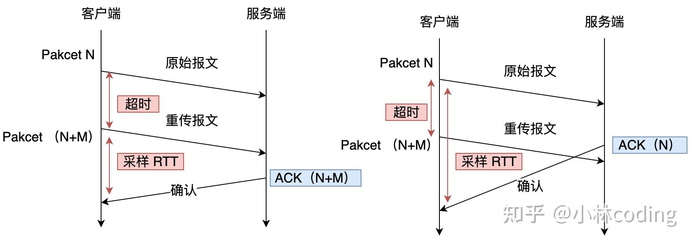

  

如果 ACK 的 Packet Number 是 N+M，就根据重传报文计算采样 RTT。如果 ACK 的 Pakcet Number 是 N，就根据原始报文的时间计算采样 RTT，没有歧义性的问题。

另外，还有一个好处，**QUIC 使用的 Packet Number 单调递增的设计，可以让数据包不再像 TCP 那样必须有序确认，QUIC 支持乱序确认，当数据包Packet N 丢失后，只要有新的已接收数据包确认，当前窗口就会继续向右滑动**（后面讲流量控制的时候，会举例子）。

待发送端获知数据包Packet N 丢失后，会将需要重传的数据包放到待发送队列，重新编号比如数据包Packet N+M 后重新发送给接收端，对重传数据包的处理跟发送新的数据包类似，这样就不会因为丢包重传将当前窗口阻塞在原地，从而解决了队头阻塞问题。

所以，Packet Number 单调递增的两个好处：

-   可以更加精确计算 RTT，没有 TCP 重传的歧义性问题；
-   可以支持乱序确认，因为丢包重传将当前窗口阻塞在原地，而 TCP 必须是顺序确认的，丢包时会导致窗口不滑动；

### [#](https://link.zhihu.com/?target=https%3A//xiaolincoding.com/network/3_tcp/quic.html%23quic-frame-header)QUIC Frame Header

一个 Packet 报文中可以存放多个 QUIC Frame。

  

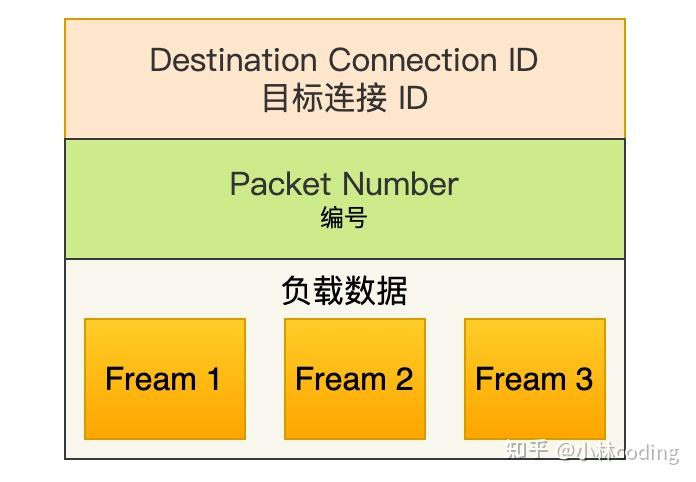

  

每一个 Frame 都有明确的类型，针对类型的不同，功能也不同，自然格式也不同。

我这里只举例 Stream 类型的 Frame 格式，Stream 可以认为就是一条 HTTP 请求，它长这样：

  

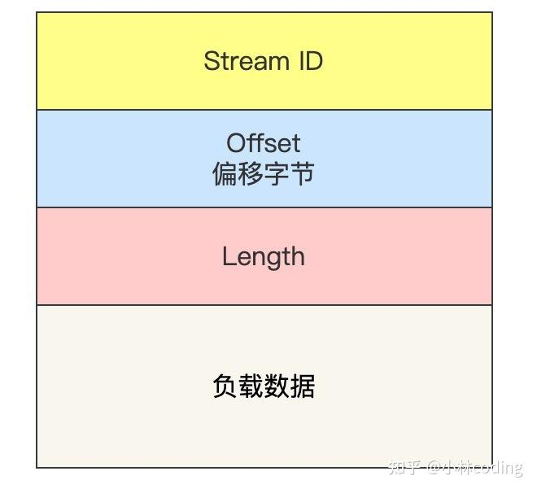

  

-   Stream ID 作用：多个并发传输的 HTTP 消息，通过不同的 Stream ID 加以区别，类似于 HTTP2 的 Stream ID；
-   Offset 作用：类似于 TCP 协议中的 Seq 序号，**保证数据的顺序性和可靠性**；
-   Length 作用：指明了 Frame 数据的长度。

在前面介绍 Packet Header 时，说到 Packet Number 是严格递增，即使重传报文的 Packet Number 也是递增的，既然重传数据包的 Packet N+M 与丢失数据包的 Packet N 编号并不一致，我们怎么确定这两个数据包的内容一样呢？

所以引入 Frame Header 这一层，**通过 Stream ID + Offset 字段信息实现数据的有序性**，通过比较两个数据包的 Stream ID 与 Stream Offset ，如果都是一致，就说明这两个数据包的内容一致。

举个例子，下图中，数据包 Packet N 丢失了，后面重传该数据包的编号为 Packet N+2，**丢失的数据包和重传的数据包 Stream ID 与 Offset 都一致，说明这两个数据包的内容一致**。这些数据包传输到接收端后，接收端能根据 Stream ID 与 Offset 字段信息将 Stream x 和 Stream x+y 按照顺序组织起来，然后交给应用程序处理。

  

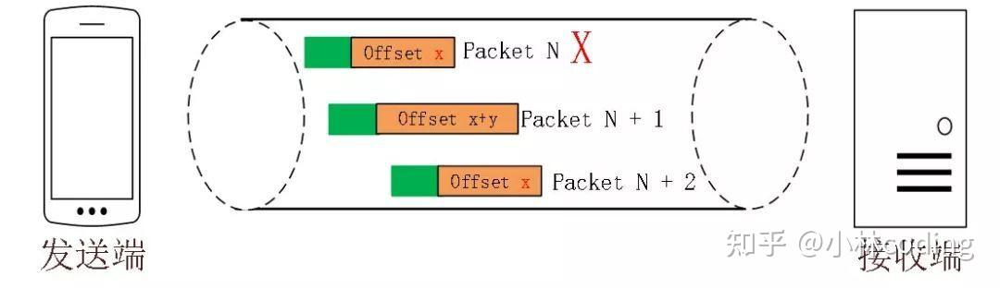

  

总的来说，**QUIC 通过单向递增的 Packet Number，配合 Stream ID 与 Offset 字段信息，可以支持乱序确认而不影响数据包的正确组装**，摆脱了TCP 必须按顺序确认应答 ACK 的限制，解决了 TCP 因某个数据包重传而阻塞后续所有待发送数据包的问题。

## [#](https://link.zhihu.com/?target=https%3A//xiaolincoding.com/network/3_tcp/quic.html%23quic-%25E6%2598%25AF%25E5%25A6%2582%25E4%25BD%2595%25E8%25A7%25A3%25E5%2586%25B3-tcp-%25E9%2598%259F%25E5%25A4%25B4%25E9%2598%25BB%25E5%25A1%259E%25E9%2597%25AE%25E9%25A2%2598%25E7%259A%2584)QUIC 是如何解决 TCP 队头阻塞问题的？

### [#](https://link.zhihu.com/?target=https%3A//xiaolincoding.com/network/3_tcp/quic.html%23%25E4%25BB%2580%25E4%25B9%2588%25E6%2598%25AF-tcp-%25E9%2598%259F%25E5%25A4%25B4%25E9%2598%25BB%25E5%25A1%259E%25E9%2597%25AE%25E9%25A2%2598)什么是 TCP 队头阻塞问题？

TCP 队头阻塞的问题，其实就是**接收窗口的队头阻塞问题**。

接收方收到的数据范围必须在接收窗口范围内，如果收到超过接收窗口范围的数据，就会丢弃该数据，比如下图接收窗口的范围是 32 ～ 51 字节，如果收到第 52 字节以上数据都会被丢弃。

  

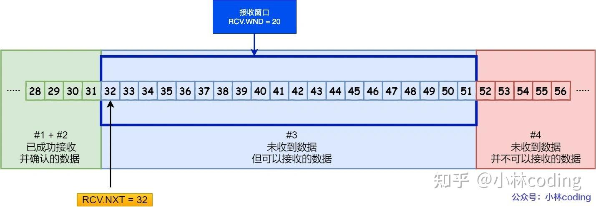

  

接收窗口什么时候才能滑动？当接收窗口收到有序数据时，接收窗口才能往前滑动，然后那些已经接收并且被确认的「有序」数据就可以被应用层读取。

但是，**当接收窗口收到的数据不是有序的，比如收到第 33～40 字节的数据，由于第 32 字节数据没有收到， 接收窗口无法向前滑动，那么即使先收到第 33～40 字节的数据，这些数据也无法被应用层读取的**。只有当发送方重传了第 32 字节数据并且被接收方收到后，接收窗口才会往前滑动，然后应用层才能从内核读取第 32～40 字节的数据。

导致接收窗口的队头阻塞问题，是因为 **TCP 必须按序处理数据，也就是 TCP 层为了保证数据的有序性，只有在处理完有序的数据后，滑动窗口才能往前滑动，否则就停留**，停留「接收窗口」会使得应用层无法读取新的数据。

其实也不能怪 TCP 协议，它本来设计目的就是为了保证数据的有序性。

### [#](https://link.zhihu.com/?target=https%3A//xiaolincoding.com/network/3_tcp/quic.html%23http-2-%25E7%259A%2584%25E9%2598%259F%25E5%25A4%25B4%25E9%2598%25BB%25E5%25A1%259E)HTTP/2 的队头阻塞

HTTP/2 通过抽象出 Stream 的概念，实现了 HTTP 并发传输，一个 Stream 就代表 HTTP/1.1 里的请求和响应。

  

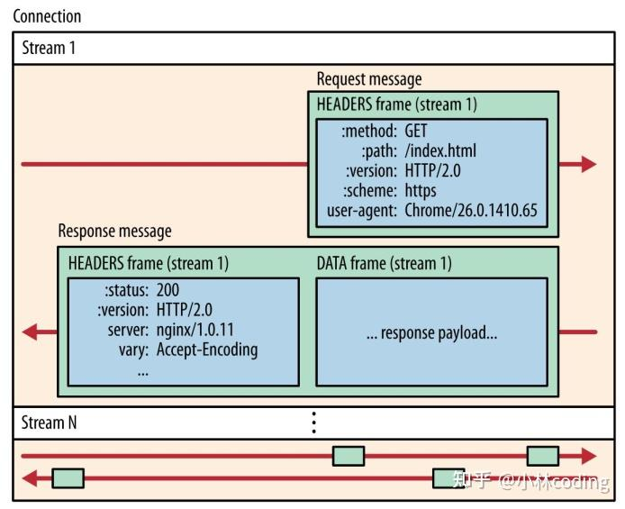

  

在 HTTP/2 连接上，不同 Stream 的帧是可以乱序发送的（因此可以并发不同的 Stream ），因为每个帧的头部会携带 Stream ID 信息，所以接收端可以通过 Stream ID 有序组装成 HTTP 消息，而同一 Stream 内部的帧必须是严格有序的。

**但是 HTTP/2 多个 Stream 请求都是在一条 TCP 连接上传输，这意味着多个 Stream 共用同一个 TCP 滑动窗口，那么当发生数据丢失，滑动窗口是无法往前移动的，此时就会阻塞住所有的 HTTP 请求，这属于 TCP 层队头阻塞**。

  

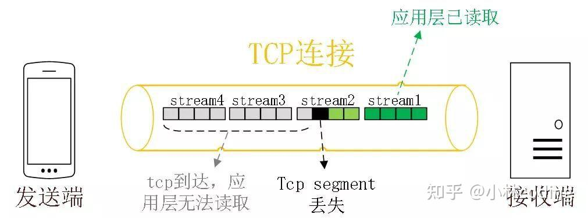

  

### [#](https://link.zhihu.com/?target=https%3A//xiaolincoding.com/network/3_tcp/quic.html%23%25E6%25B2%25A1%25E6%259C%2589%25E9%2598%259F%25E5%25A4%25B4%25E9%2598%25BB%25E5%25A1%259E%25E7%259A%2584-quic)没有队头阻塞的 QUIC

QUIC 也借鉴 HTTP/2 里的 Stream 的概念，在一条 QUIC 连接上可以并发发送多个 HTTP 请求 (Stream)。

但是 **QUIC 给每一个 Stream 都分配了一个独立的滑动窗口，这样使得一个连接上的多个 Stream 之间没有依赖关系，都是相互独立的，各自控制的滑动窗口**。

假如 Stream2 丢了一个 UDP 包，也只会影响 Stream2 的处理，不会影响其他 Stream，与 HTTP/2 不同，HTTP/2 只要某个流中的数据包丢失了，其他流也会因此受影响。

  

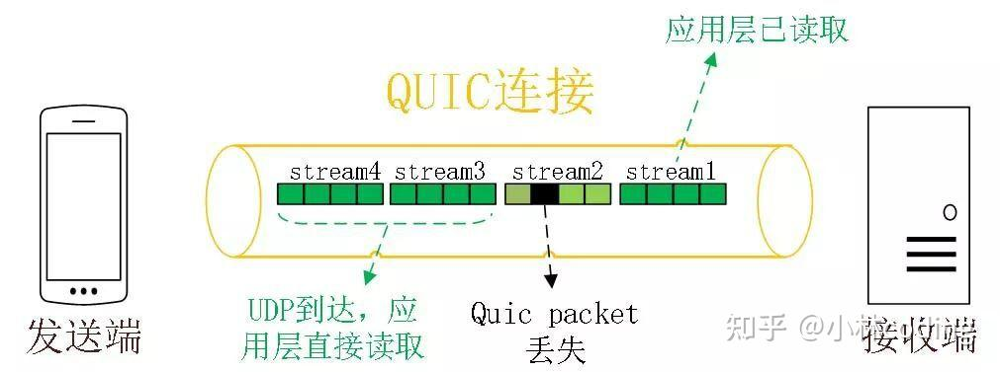

  

## [#](https://link.zhihu.com/?target=https%3A//xiaolincoding.com/network/3_tcp/quic.html%23quic-%25E6%2598%25AF%25E5%25A6%2582%25E4%25BD%2595%25E5%2581%259A%25E6%25B5%2581%25E9%2587%258F%25E6%258E%25A7%25E5%2588%25B6%25E7%259A%2584)QUIC 是如何做流量控制的？

TCP 流量控制是通过让「接收方」告诉「发送方」，它（接收方）的接收窗口有多大，从而让「发送方」根据「接收方」的实际接收能力控制发送的数据量。

QUIC 实现流量控制的方式：

-   通过 window\_update 帧告诉对端自己可以接收的字节数，这样发送方就不会发送超过这个数量的数据。
-   通过 BlockFrame 告诉对端由于流量控制被阻塞了，无法发送数据。

在前面说到，TCP 的接收窗口在收到有序的数据后，接收窗口才能往前滑动，否则停止滑动。

QUIC 是基于 UDP 传输的，而 UDP 没有流量控制，因此 QUIC 实现了自己的流量控制机制，QUIC 的滑动窗口滑动的条件跟 TCP 有一点差别，但是同一个 Stream 的数据也是要保证顺序的，不然无法实现可靠传输，因此同一个 Stream 的数据包丢失了，也会造成窗口无法滑动。

**QUIC 的 每个 Stream 都有各自的滑动窗口，不同 Stream 互相独立，队头的 Stream A 被阻塞后，不妨碍 StreamB、C的读取**。而对于 HTTP/2 而言，所有的 Stream 都跑在一条 TCP 连接上，而这些 Stream 共享一个滑动窗口，因此同一个Connection内，Stream A 被阻塞后，StreamB、C 必须等待。

QUIC 实现了两种级别的流量控制，分别为 Stream 和 Connection 两种级别：

-   **Stream 级别的流量控制**：Stream 可以认为就是一条 HTTP 请求，每个 Stream 都有独立的滑动窗口，所以每个 Stream 都可以做流量控制，防止单个 Stream 消耗连接（Connection）的全部接收缓冲。
-   **Connection 流量控制**：限制连接中所有 Stream 相加起来的总字节数，防止发送方超过连接的缓冲容量。

### [#](https://link.zhihu.com/?target=https%3A//xiaolincoding.com/network/3_tcp/quic.html%23stream-%25E7%25BA%25A7%25E5%2588%25AB%25E7%259A%2584%25E6%25B5%2581%25E9%2587%258F%25E6%258E%25A7%25E5%2588%25B6)Stream 级别的流量控制

最开始，接收方的接收窗口初始状态如下（网上的讲 QUIC 流量控制的资料太少了，下面的例子我是参考 google 文档的：[Flow control in QUIC (opens new window)](https://link.zhihu.com/?target=https%3A//docs.google.com/document/d/1F2YfdDXKpy20WVKJueEf4abn_LVZHhMUMS5gX6Pgjl4/mobilebasic)）：

  

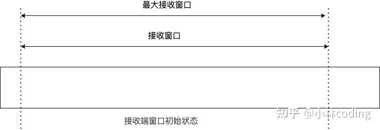

  

接着，接收方收到了发送方发送过来的数据，有的数据被上层读取了，有的数据丢包了，此时的接收窗口状况如下：

  

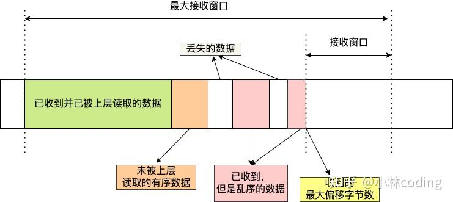

  

可以看到，**接收窗口的左边界取决于接收到的最大偏移字节数**，此时的`接收窗口 = 最大窗口数 - 接收到的最大偏移数`。

这里就可以看出 QUIC 的流量控制和 TCP 有点区别了：

-   TCP 的接收窗口只有在前面所有的 Segment 都接收的情况下才会移动左边界，当在前面还有字节未接收但收到后面字节的情况下，窗口也不会移动。
-   QUIC 的接收窗口的左边界滑动条件取决于接收到的最大偏移字节数。

*PS：但是你要问我这么设计有什么好处？我也暂时没想到，因为资料太少了，至今没找到一个合理的说明，如果你知道，欢迎告诉我啊！*

那接收窗口右边界触发的滑动条件是什么呢？看下图：

  

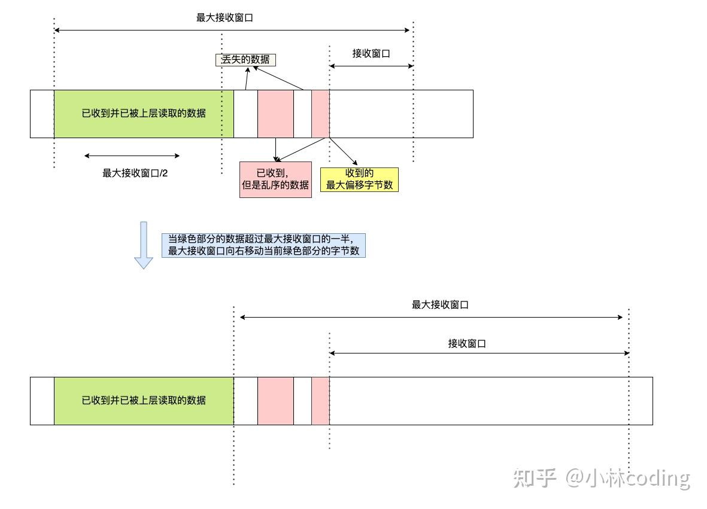

  

当图中的绿色部分数据超过最大接收窗口的一半后，最大接收窗口向右移动，接收窗口的右边界也向右扩展，同时给对端发送「窗口更新帧」，当发送方收到接收方的窗口更新帧后，发送窗口的右边界也会往右扩展，以此达到窗口滑动的效果。

绿色部分的数据是已收到的顺序的数据，**如果中途丢失了数据包，导致绿色部分的数据没有超过最大接收窗口的一半，那接收窗口就无法滑动了**，这个只影响同一个 Stream，其他 Stream 是不会影响的，因为每个 Stream 都有各自的滑动窗口。

在前面我们说过 QUIC 支持乱序确认，具体是怎么做到的呢？

接下来，举个例子（下面的例子来源于：[QUIC——快速UDP网络连接协议 (opens new window)](https://link.zhihu.com/?target=https%3A//juejin.cn/post/7066993430102016037)）：

如图所示，当前发送方的缓冲区大小为8，发送方 QUIC 按序（offset顺序）发送 29-36 的数据包：

  

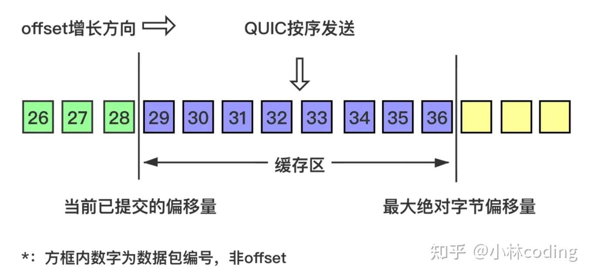

  

31、32、34数据包先到达，基于 offset 被优先乱序确认，但 30 数据包没有确认，所以当前已提交的字节偏移量不变，发送方的缓存区不变。

  

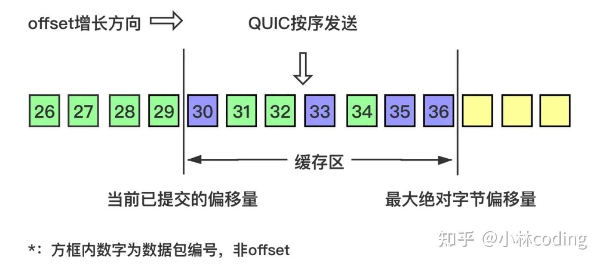

  

30 到达并确认，发送方的缓存区收缩到阈值，接收方发送 MAX\_STREAM\_DATA Frame（协商缓存大小的特定帧）给发送方，请求增长最大绝对字节偏移量。

  

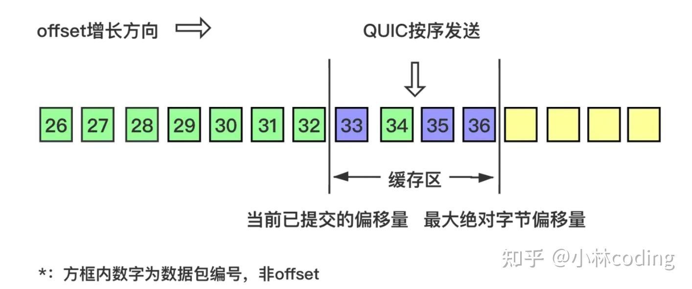

  

协商完毕后最大绝对字节偏移量右移，发送方的缓存区变大，同时发送方发现数据包33超时

  

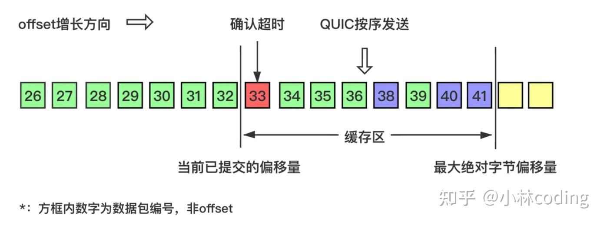

  

发送方将超时数据包重新编号为 42 继续发送

  

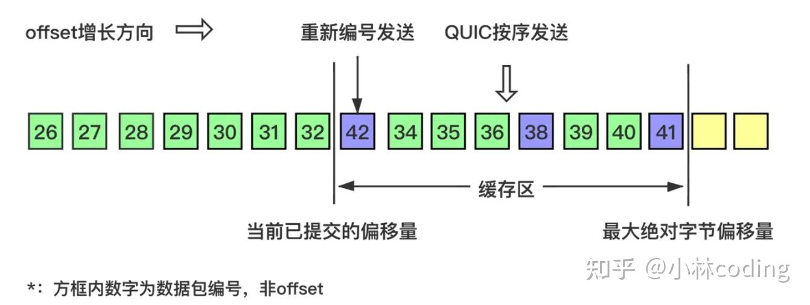

  

以上就是最基本的数据包发送-接收过程，控制数据发送的唯一限制就是最大绝对字节偏移量，该值是接收方基于当前已经提交的偏移量（连续已确认并向上层应用提交的数据包offset）和发送方协商得出。

### [#](https://link.zhihu.com/?target=https%3A//xiaolincoding.com/network/3_tcp/quic.html%23connection-%25E6%25B5%2581%25E9%2587%258F%25E6%258E%25A7%25E5%2588%25B6)Connection 流量控制

而对于 Connection 级别的流量窗口，其接收窗口大小就是各个 Stream 接收窗口大小之和。

  

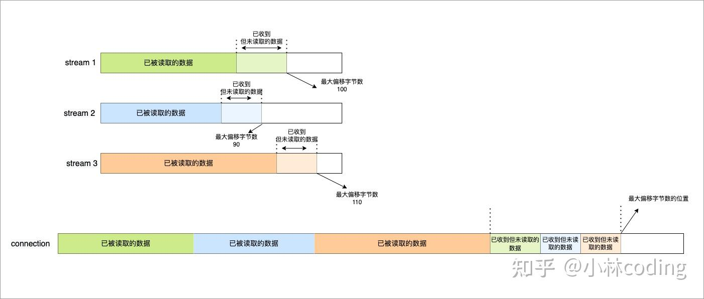

  

上图所示的例子，所有 Streams 的最大窗口数为 120，其中：

-   Stream 1 的最大接收偏移为 100，可用窗口 = 120 - 100 = 20
-   Stream 2 的最大接收偏移为 90，可用窗口 = 120 - 90 = 30
-   Stream 3 的最大接收偏移为 110，可用窗口 = 120 - 110 = 10

那么整个 Connection 的可用窗口 = 20 + 30 + 10 = 60

可用窗口 = Stream 1 可用窗口 + Stream 2 可用窗口 + Stream 3 可用窗口

## [#](https://link.zhihu.com/?target=https%3A//xiaolincoding.com/network/3_tcp/quic.html%23quic-%25E5%25AF%25B9%25E6%258B%25A5%25E5%25A1%259E%25E6%258E%25A7%25E5%2588%25B6%25E6%2594%25B9%25E8%25BF%259B)QUIC 对拥塞控制改进

QUIC 协议当前默认使用了 TCP 的 Cubic 拥塞控制算法（我们熟知的慢开始、拥塞避免、快重传、快恢复策略），同时也支持 CubicBytes、Reno、RenoBytes、BBR、PCC 等拥塞控制算法，相当于将 TCP 的拥塞控制算法照搬过来了。

QUIC 是如何改进 TCP 的拥塞控制算法的呢？

QUIC 是处于应用层的，应用程序层面就能实现不同的拥塞控制算法，不需要操作系统，不需要内核支持。这是一个飞跃，因为传统的 TCP 拥塞控制，必须要端到端的网络协议栈支持，才能实现控制效果。而内核和操作系统的部署成本非常高，升级周期很长，所以 TCP 拥塞控制算法迭代速度是很慢的。而 **QUIC 可以随浏览器更新，QUIC 的拥塞控制算法就可以有较快的迭代速度**。

TCP 更改拥塞控制算法是对系统中所有应用都生效，无法根据不同应用设定不同的拥塞控制策略。但是因为 QUIC 处于应用层，所以就**可以针对不同的应用设置不同的拥塞控制算法**，这样灵活性就很高了。

## [#](https://link.zhihu.com/?target=https%3A//xiaolincoding.com/network/3_tcp/quic.html%23quic-%25E6%259B%25B4%25E5%25BF%25AB%25E7%259A%2584%25E8%25BF%259E%25E6%258E%25A5%25E5%25BB%25BA%25E7%25AB%258B)QUIC 更快的连接建立

对于 HTTP/1 和 HTTP/2 协议，TCP 和 TLS 是分层的，分别属于内核实现的传输层、openssl 库实现的表示层，因此它们难以合并在一起，需要分批次来握手，先 TCP 握手（1RTT），再 TLS 握手（2RTT），所以需要 3RTT 的延迟才能传输数据，就算 Session 会话服用，也需要至少 2 个 RTT。

HTTP/3 在传输数据前虽然需要 QUIC 协议握手，这个握手过程只需要 1 RTT，握手的目的是为确认双方的「连接 ID」，连接迁移就是基于连接 ID 实现的。

但是 HTTP/3 的 QUIC 协议并不是与 TLS 分层，而是**QUIC 内部包含了 TLS，它在自己的帧会携带 TLS 里的“记录”，再加上 QUIC 使用的是 TLS1.3，因此仅需 1 个 RTT 就可以「同时」完成建立连接与密钥协商，甚至在第二次连接的时候，应用数据包可以和 QUIC 握手信息（连接信息 + TLS 信息）一起发送，达到 0-RTT 的效果**。

如下图右边部分，HTTP/3 当会话恢复时，有效负载数据与第一个数据包一起发送，可以做到 0-RTT（下图的右下角）：

  

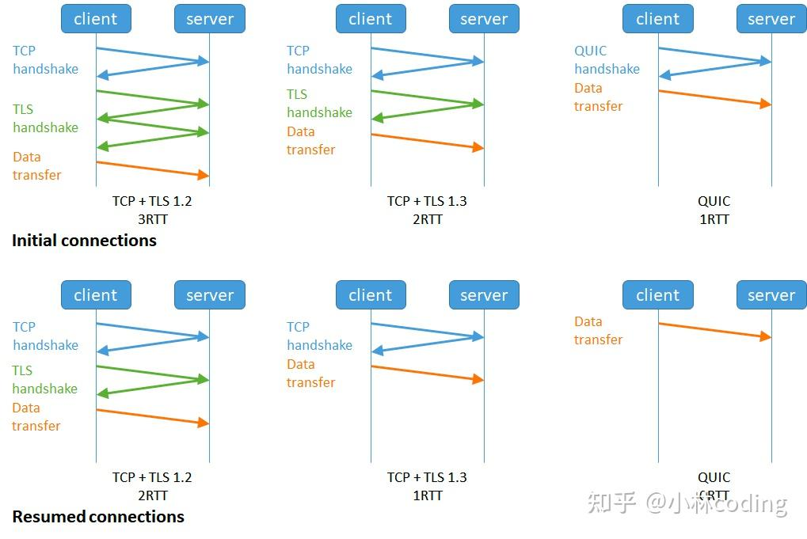

  

## [#](https://link.zhihu.com/?target=https%3A//xiaolincoding.com/network/3_tcp/quic.html%23quic-%25E6%2598%25AF%25E5%25A6%2582%25E4%25BD%2595%25E8%25BF%2581%25E7%25A7%25BB%25E8%25BF%259E%25E6%258E%25A5%25E7%259A%2584)QUIC 是如何迁移连接的？

基于 TCP 传输协议的 HTTP 协议，由于是通过四元组（源 IP、源端口、目的 IP、目的端口）确定一条 TCP 连接。

  

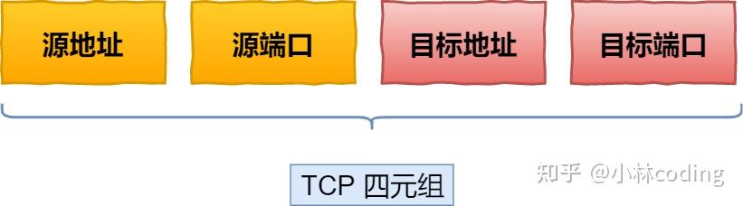

  

那么**当移动设备的网络从 4G 切换到 WIFI 时，意味着 IP 地址变化了，那么就必须要断开连接，然后重新建立 TCP 连接**。

而建立连接的过程包含 TCP 三次握手和 TLS 四次握手的时延，以及 TCP 慢启动的减速过程，给用户的感觉就是网络突然卡顿了一下，因此连接的迁移成本是很高的。

QUIC 协议没有用四元组的方式来“绑定”连接，而是通过**连接 ID**来标记通信的两个端点，客户端和服务器可以各自选择一组 ID 来标记自己，因此即使移动设备的网络变化后，导致 IP 地址变化了，只要仍保有上下文信息（比如连接 ID、TLS 密钥等），就可以“无缝”地复用原连接，消除重连的成本，没有丝毫卡顿感，达到了**连接迁移**的功能。

## 更多图解网络文章

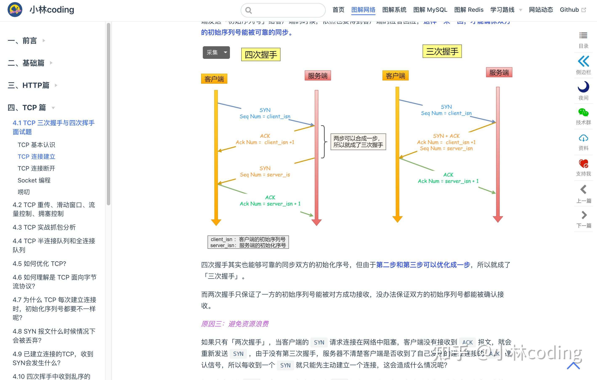

-   **网络基础篇**

-   [TCP/IP 网络模型有哪几层？](https://link.zhihu.com/?target=https%3A//xiaolincoding.com/network/1_base/tcp_ip_model.html)
-   [键入网址到网页显示，期间发生了什么？](https://link.zhihu.com/?target=https%3A//xiaolincoding.com/network/1_base/what_happen_url.html)
-   [Linux 系统是如何收发网络包的？](https://link.zhihu.com/?target=https%3A//xiaolincoding.com/network/1_base/how_os_deal_network_package.html)

-   **HTTP 篇**

-   [HTTP 常见面试题](https://link.zhihu.com/?target=https%3A//xiaolincoding.com/network/2_http/http_interview.html)
-   [HTTP/1.1如何优化？](https://link.zhihu.com/?target=https%3A//xiaolincoding.com/network/2_http/http_optimize.html)
-   [HTTPS RSA 握手解析](https://link.zhihu.com/?target=https%3A//xiaolincoding.com/network/2_http/https_rsa.html)
-   [HTTPS ECDHE 握手解析](https://link.zhihu.com/?target=https%3A//xiaolincoding.com/network/2_http/https_ecdhe.html)
-   [HTTPS 如何优化？](https://link.zhihu.com/?target=https%3A//xiaolincoding.com/network/2_http/https_optimize.html)
-   [HTTP/2 牛逼在哪？](https://link.zhihu.com/?target=https%3A//xiaolincoding.com/network/2_http/http2.html)
-   [HTTP/3 强势来袭](https://link.zhihu.com/?target=https%3A//xiaolincoding.com/network/2_http/http3.html)
-   [既然有 HTTP 协议，为什么还要有 RPC？](https://link.zhihu.com/?target=https%3A//xiaolincoding.com/network/2_http/http_rpc.html)

-   **TCP 篇**

-   [TCP 三次握手与四次挥手面试题](https://link.zhihu.com/?target=https%3A//xiaolincoding.com/network/3_tcp/tcp_interview.html)
-   [TCP 重传、滑动窗口、流量控制、拥塞控制](https://link.zhihu.com/?target=https%3A//xiaolincoding.com/network/3_tcp/tcp_feature.html)
-   [TCP 实战抓包分析](https://link.zhihu.com/?target=https%3A//xiaolincoding.com/network/3_tcp/tcp_tcpdump.html)
-   [TCP 半连接队列和全连接队列](https://link.zhihu.com/?target=https%3A//xiaolincoding.com/network/3_tcp/tcp_queue.html)
-   [如何优化 TCP?](https://link.zhihu.com/?target=https%3A//xiaolincoding.com/network/3_tcp/tcp_optimize.html)
-   [如何理解是 TCP 面向字节流协议？](https://link.zhihu.com/?target=https%3A//xiaolincoding.com/network/3_tcp/tcp_stream.html)
-   [为什么 TCP 每次建立连接时，初始化序列号都要不一样呢？](https://link.zhihu.com/?target=https%3A//xiaolincoding.com/network/3_tcp/isn_deff.html)
-   [SYN 报文什么时候情况下会被丢弃？](https://link.zhihu.com/?target=https%3A//xiaolincoding.com/network/3_tcp/syn_drop.html)
-   [四次挥手中收到乱序的 FIN 包会如何处理？](https://link.zhihu.com/?target=https%3A//xiaolincoding.com/network/3_tcp/out_of_order_fin.html)
-   [在 TIME\_WAIT 状态的 TCP 连接，收到 SYN 后会发生什么？](https://link.zhihu.com/?target=https%3A//xiaolincoding.com/network/3_tcp/time_wait_recv_syn.html)
-   [TCP 连接，一端断电和进程崩溃有什么区别？](https://link.zhihu.com/?target=https%3A//xiaolincoding.com/network/3_tcp/tcp_down_and_crash.html)
-   [拔掉网线后， 原本的 TCP 连接还存在吗？](https://link.zhihu.com/?target=https%3A//xiaolincoding.com/network/3_tcp/tcp_unplug_the_network_cable.html)
-   [tcp\_tw\_reuse 为什么默认是关闭的？](https://link.zhihu.com/?target=https%3A//xiaolincoding.com/network/3_tcp/tcp_tw_reuse_close.html)
-   [HTTPS 中 TLS 和 TCP 能同时握手吗？](https://link.zhihu.com/?target=https%3A//xiaolincoding.com/network/3_tcp/tcp_tls.html)
-   [TCP Keepalive 和 HTTP Keep-Alive 是一个东西吗？](https://link.zhihu.com/?target=https%3A//xiaolincoding.com/network/3_tcp/tcp_http_keepalive.html)
-   [TCP 有什么缺陷？](https://link.zhihu.com/?target=https%3A//xiaolincoding.com/network/3_tcp/tcp_problem.html)
-   [如何基于 UDP 协议实现可靠传输？](https://link.zhihu.com/?target=https%3A//xiaolincoding.com/network/3_tcp/quic.html)
-   [TCP 和 UDP 可以使用同一个端口吗？](https://link.zhihu.com/?target=https%3A//xiaolincoding.com/network/3_tcp/port.html)
-   [服务端没有 listen，客户端发起连接建立，会发生什么？](https://link.zhihu.com/?target=https%3A//xiaolincoding.com/network/3_tcp/tcp_no_listen.html)
-   [没有 accpet，可以建立 TCP 连接吗？](https://link.zhihu.com/?target=https%3A//xiaolincoding.com/network/3_tcp/tcp_no_accpet.html)
-   [用了 TCP 协议，数据一定不会丢吗？](https://link.zhihu.com/?target=https%3A//xiaolincoding.com/network/3_tcp/tcp_drop.html)

-   **IP 篇**

-   [IP 基础知识全家桶](https://link.zhihu.com/?target=https%3A//xiaolincoding.com/network/4_ip/ip_base.html)
-   [ping 的工作原理](https://link.zhihu.com/?target=https%3A//xiaolincoding.com/network/4_ip/ping.html)

-   **学习心得**

-   [计算机网络怎么学？](https://link.zhihu.com/?target=https%3A//xiaolincoding.com/network/5_learn/learn_network.html)
-   [画图经验分享](https://link.zhihu.com/?target=https%3A//xiaolincoding.com/network/5_learn/draw.html)