> **简介：**作为一个初创公司的研发团队，我们的资源少，人手少，经验少，面对稳定性，安全性和业务的压力真的是非常痛苦。将我们的 SpringBoot 迁移到函数计算以后我们的团队幸福感得到了大幅提升

### 为什么要迁移？

我们的业务有很多对外提供服务的 RESTful API，并且要执行很多不同的任务，例如同步连锁 ERP 中的商品信息到美团/饿了么等平台，在线开发票等。由于各种 API 和 任务执行的不确定性，经常会因为资源不足导致服务不可用，但是盲目的扩容又很烧钱。**整个团队每天都陷在不停的扩容，缩容之中**。关键是有时候稍稍慢了一些，就会对业务照成影响，导致被投诉。每天还要被其他业务部门催着做新功能。更难的是，因为我们没有运维经验，**多次被黑客把我们本来就不多的机器用来挖矿**。**作为一个初创公司的研发团队，我们的资源少，人手少，经验少，面对稳定性，安全性和业务的压力真的是非常痛苦。**

在被前同事安利了函数计算以后，我发现这太有用了！迁移的过程非常顺滑，迁移的效果也大大超出了我的预期。下面是我觉得函数计算非常适合我们的理由：

-   **默认弹性，可以轻松应对大量 API 请求和任务，不会再因为扩容不及时导致资源耗尽引起的业务不可用了！**
-   **无流量时支持缩容到 0，省钱神器，再也不用买虚拟机和负载均衡了，对我们来说降本效果杠杠滴！**
-   **免运维，免去了虚拟机的运维成本！**
-   **更安全，它不能被 SSH 登陆，而且也不会像虚拟机一样一直开着，等着被人扫描和攻破！**
-   **零改造，无需修改代码，之前虚拟机上的 JAR 包直接就可以跑在函数计算上！**

### 迁移步骤

有三种使用方式，这里我具体讲一下怎么在控制台上操作。

-   **使用函数计算控制台进行迁移。**
-   使用函数计算提供的 S 工具，通过命令行 + YAML 的方式进行部署。[查看详情](https://link.zhihu.com/?target=https%3A//github.com/devsapp/start-web-framework/tree/master/web-framework/java/springboot)
-   使用函数计算控制台上的应用中心，从 GitHub 等源代码库中自动构建并部署。CICD/GitOps 直接就有了，太香了！[查看详情](https://link.zhihu.com/?target=https%3A//fcnext.console.aliyun.com/applications/create%3Ftemplate%3Dstart-springboot)

  

#### 1\. 开通函数计算

访问 [https://fcnext.console.aliyun.com/](https://link.zhihu.com/?target=https%3A//fcnext.console.aliyun.com/) 控制台，点击“免费开通”将跳转到开通页面。

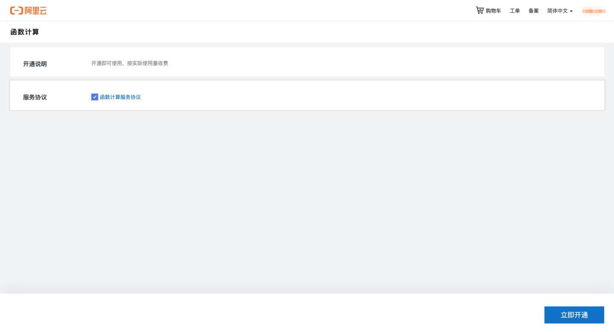

#### 2\. 创建服务

点击“服务及函数”，“创建服务”，输入“名称”后点击“确定”。

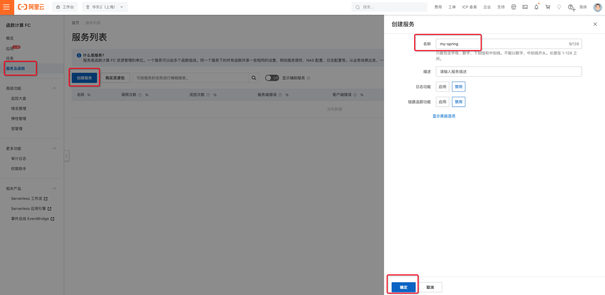

#### 3\. 对 JAR 包进行压缩，得到 ZIP 文件

注意！！！这里要对打包好的 JAR 包进行压缩，然后上传 ZIP 包！！！

备注：其实也可以直接上传 JAR 包，但是启动命令要写为 java org.springframework.boot.loader.JarLauncher 我个人不是很喜欢这种写法。我还是喜欢 java -jar gs-rest-service-0.1.0.jar 的写法。

  

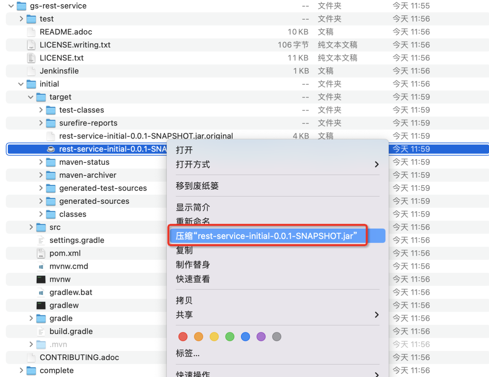

  

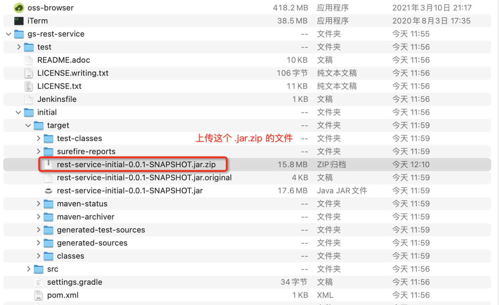

  

如果你还没有可用的 JAR 包，请参考 [SpringBoot 官方快速开始文档](https://link.zhihu.com/?target=https%3A//spring.io/guides/gs/rest-service/%23initial)进行构建。

#### 4\. 创建函数

-   在“函数管理”页面，点击“创建函数”，
-   选择**“使用自定义运行时平滑迁移 Web Server”**
-   **“运行环境”**选择您需要的 Java 版本
-   选择**“通过 ZIP 包上传代码”**
-   **“启动命令”**为您在虚拟机上启动 JAR 包的命令，例如： java -jar rest-service-initial-0.0.1-SNAPSHOT.jar.zip
-   **“监听端口”**为您的 JAVA 程序在虚拟机上监听的端口，例如：8080
-   **“请求处理程序类型”**选择**“处理 HTTP 请求”**
-   点击“创建”

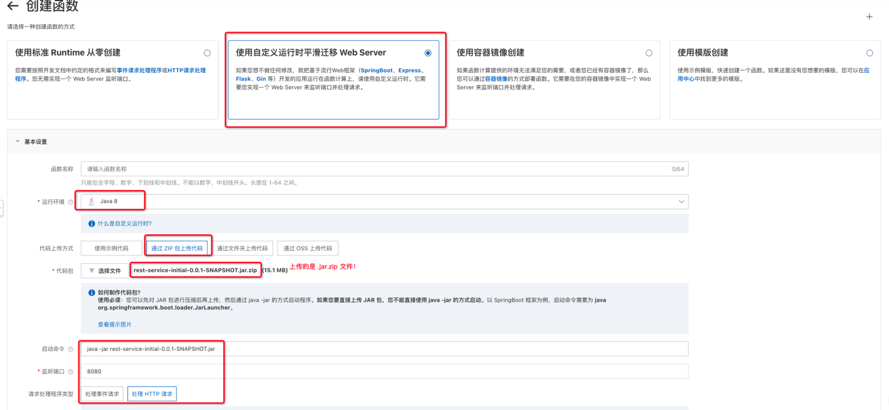

#### 5\. 测试函数

在函数详情页面的触发器列表中找到“公网访问地址”。注意：因为相关规定，不能直接在浏览器中打开这个 URL，需要配置自己的域名才能在浏览器中访问。

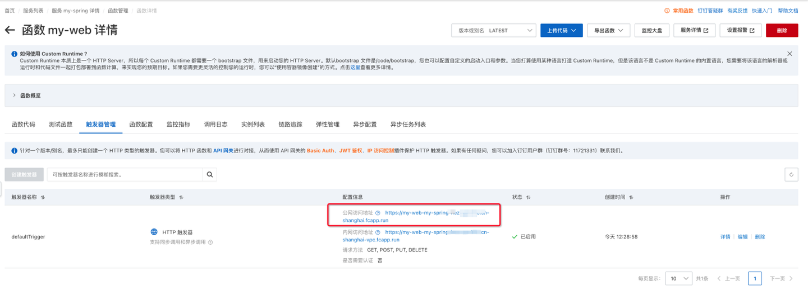

你可以通过 curl 命令进行测试。

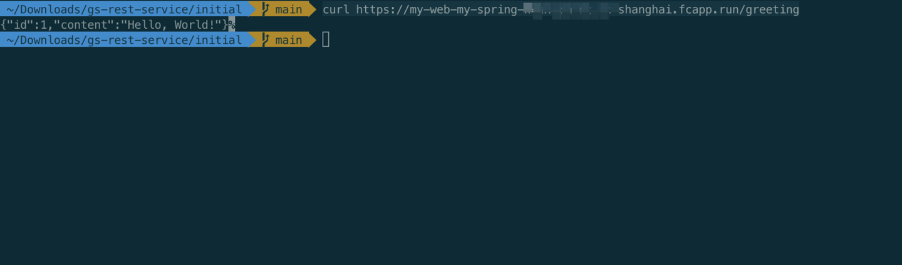

你也可以通过函数详情也中的“测试函数”页签直接进行测试。

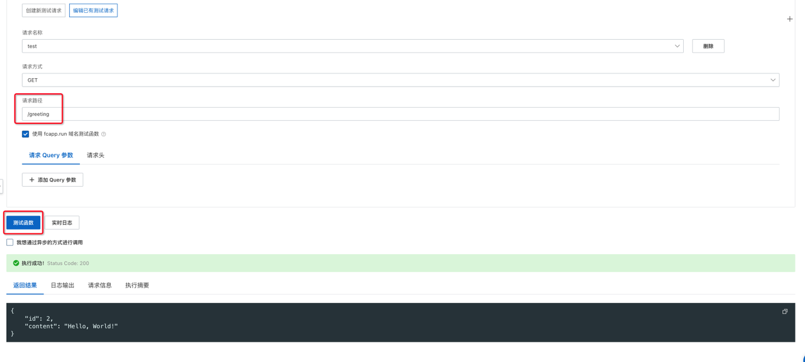

#### 6\. 使用自己的域名访问函数

-   点击“首页”，“域名管理”，“创建域名”，“添加自定义域名”
-   复制页面中的“公网 CNAME”，在[云解析 DNS 控制台](https://link.zhihu.com/?target=https%3A//dns.console.aliyun.com/)上为你的域名添加 CNAME 记录
-   在路由配置中选择您刚建好的服务和函数
-   点击“创建”
-   完成！现在可以通过自己的域名访问服务了！

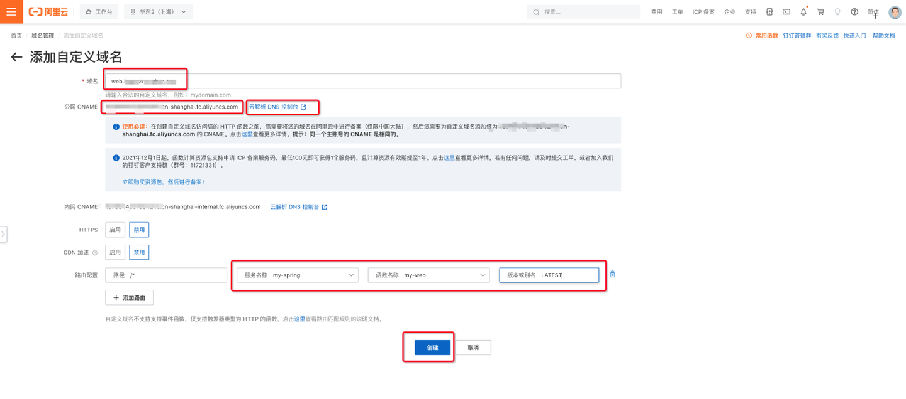

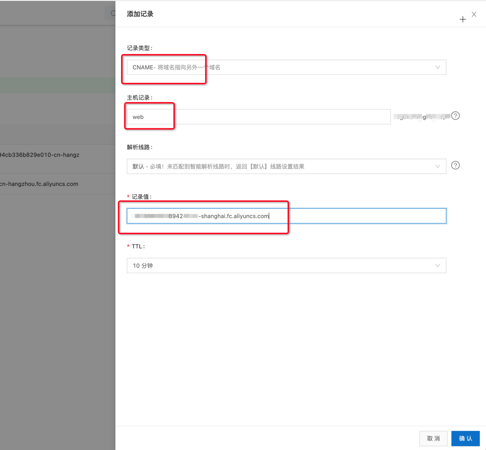

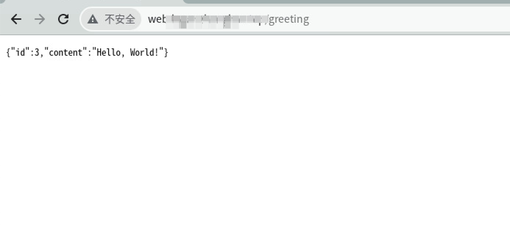

#### 7\. 更多进阶文档

[配置 NAS 文件系统](https://link.zhihu.com/?target=https%3A//help.aliyun.com/document_detail/87401.html)

[配置 HTTPS](https://link.zhihu.com/?target=https%3A//help.aliyun.com/document_detail/90763.html%23section-4yb-ztm-q9v)

[授权函数访问其他服务](https://link.zhihu.com/?target=https%3A//help.aliyun.com/document_detail/181589.html)

[访问 VPC 内的资源](https://link.zhihu.com/?target=https%3A//help.aliyun.com/document_detail/72959.html%23section-a2w-ren-6tq)

[访问 RDS 数据库](https://link.zhihu.com/?target=https%3A//help.aliyun.com/document_detail/84514.html)

[访问 Redis 缓存](https://link.zhihu.com/?target=https%3A//help.aliyun.com/document_detail/148798.html)

[更多快速入门文档](https://link.zhihu.com/?target=https%3A//fcnext.console.aliyun.com/overview%3Ftab%3Dquick-start)

### 迁移后的效果

面对流量洪峰，我们再也不会手忙脚乱了，函数计算自动会帮我们扩容！很好的解决了我们的 API 场景和不定时执行各种不同任务的场景。对我们这种不懂 Docker，不懂 Kubernetes，没有运维人员，虚拟机扩容缩容对我们来说都很难的小团队来说真是一大福利。同时，我们再也不用买虚拟机和负载均衡了！缩容到 0 和按量付费的方式也极大的降低了我们的成本！还有，我们再也没有被黑客攻破，用我们的钱来挖矿了！整体来说就两个字！真香！

  

> **版权声明：**本文内容由阿里云实名注册用户自发贡献，版权归原作者所有，阿里云开发者社区不拥有其著作权，亦不承担相应法律责任。具体规则请查看《阿里云开发者社区用户服务协议》和《阿里云开发者社区知识产权保护指引》。如果您发现本社区中有涉嫌抄袭的内容，填写侵权投诉表单进行举报，一经查实，本社区将立刻删除涉嫌侵权内容。