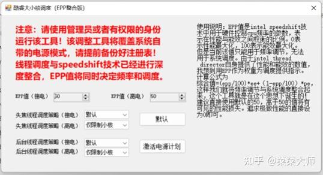
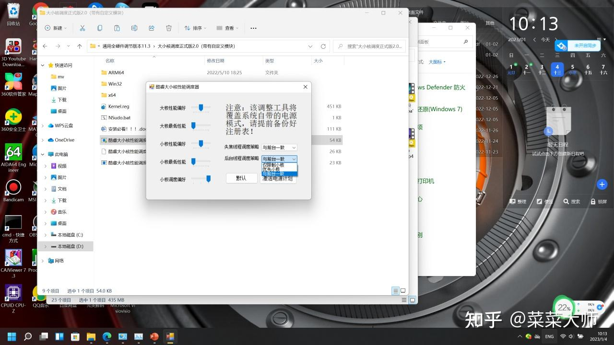
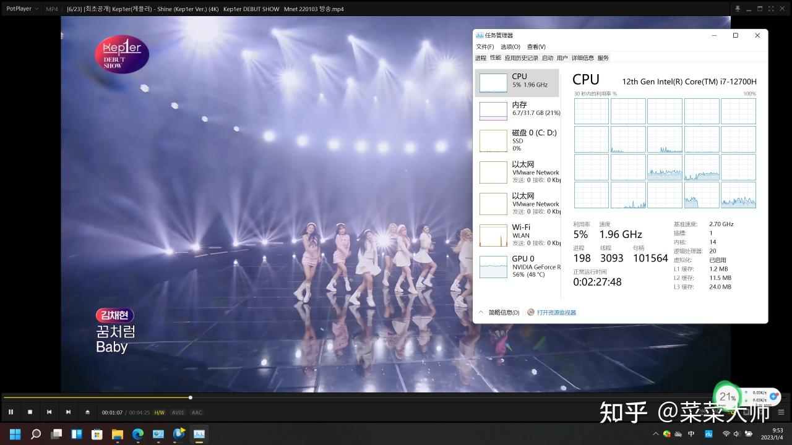
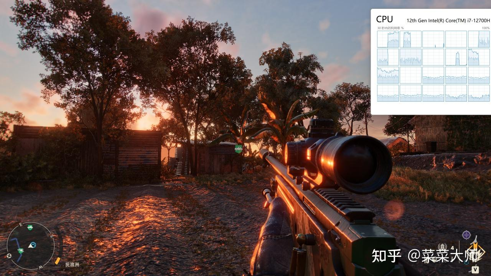
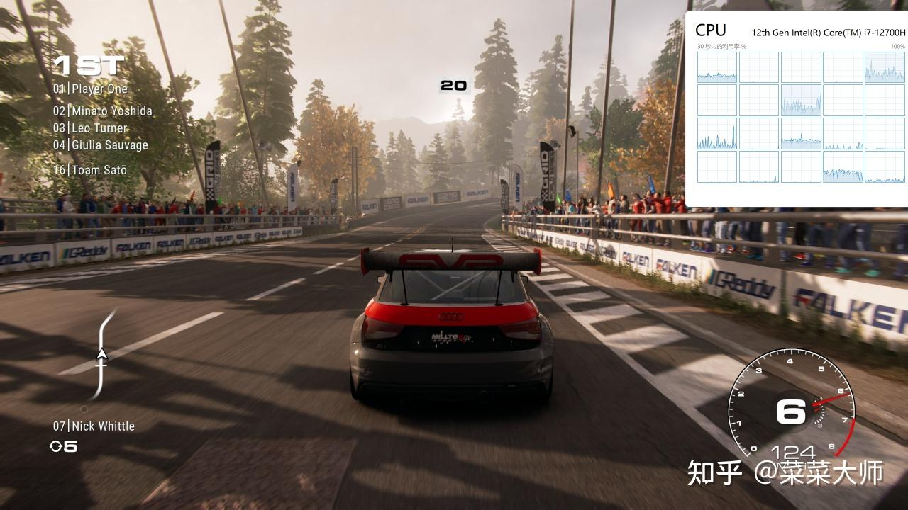
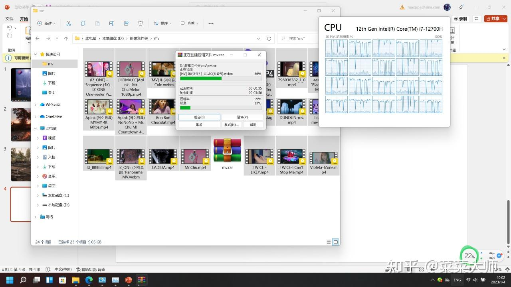

2023.1.26更新

现在推出调度器3.1版，已经将硬件频率调节speedshift技术与线程调度进行整合。直接通过EPP值同时控制频率和线程调度，完全傻瓜化。

* * *

没什么不好的，相反，在我手中是完全媲美m1的存在，不过前提是用上我自己捣鼓出来的工具。上图

这个工具完全满足所有人的需求，包括对后台任务的调度都可以自定义，还有分别对大小核性能的调整。当然最重要的是全局设置“小核调度偏好”。默认是拉到最右边，此时cpu化身m1，调度逻辑照搬mac。轻负载下使用小核，重负载启用大核，两不误。上图

而且完美解决了超线程的干扰问题。可以看到，物理核心用完前超线程是不会使用的。当然在转码和解压缩下所有线程都是能使用的包括超线程

如果滑条拉到最左边，就是经典的大——小——超调度模式，中间则是大小核一起使用的混合模式。

这个问题已经可以终结了，不是吗？

* * *

下载地址：[https://pan.baidu.com/s/1WvQ3bm8rnN3SsDFa8BuUFw?pwd=qmgg](https://link.zhihu.com/?target=https%3A//pan.baidu.com/s/1WvQ3bm8rnN3SsDFa8BuUFw%3Fpwd%3Dqmgg)