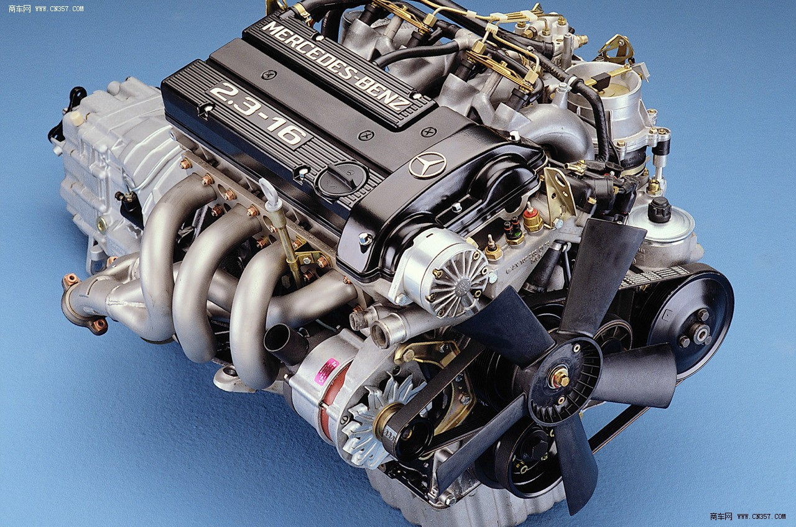
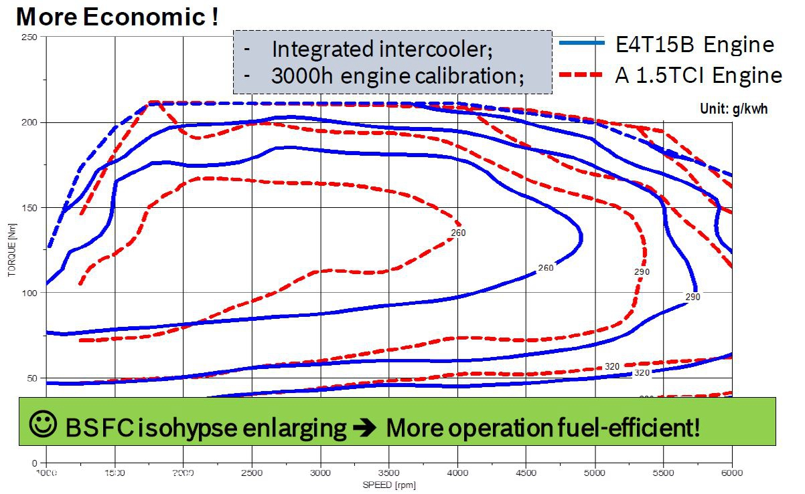
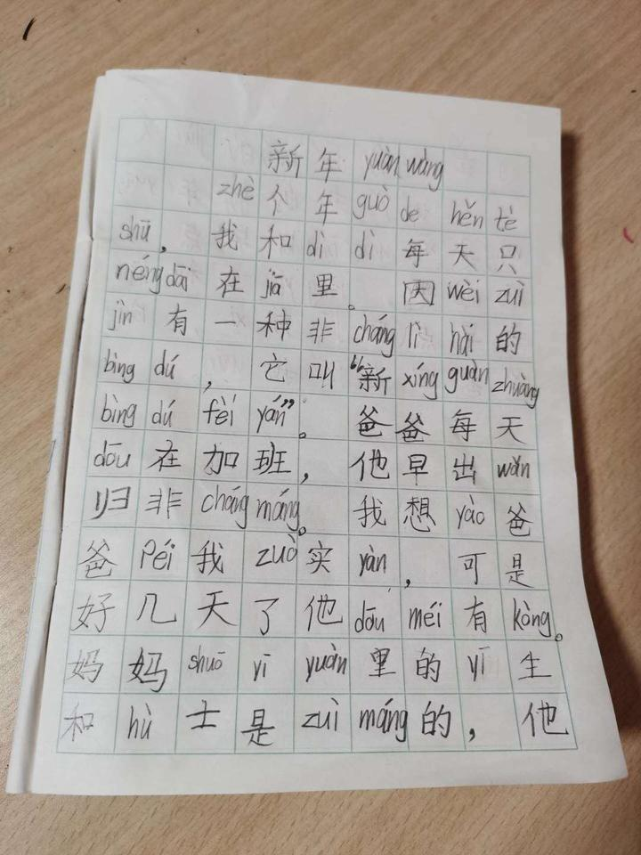
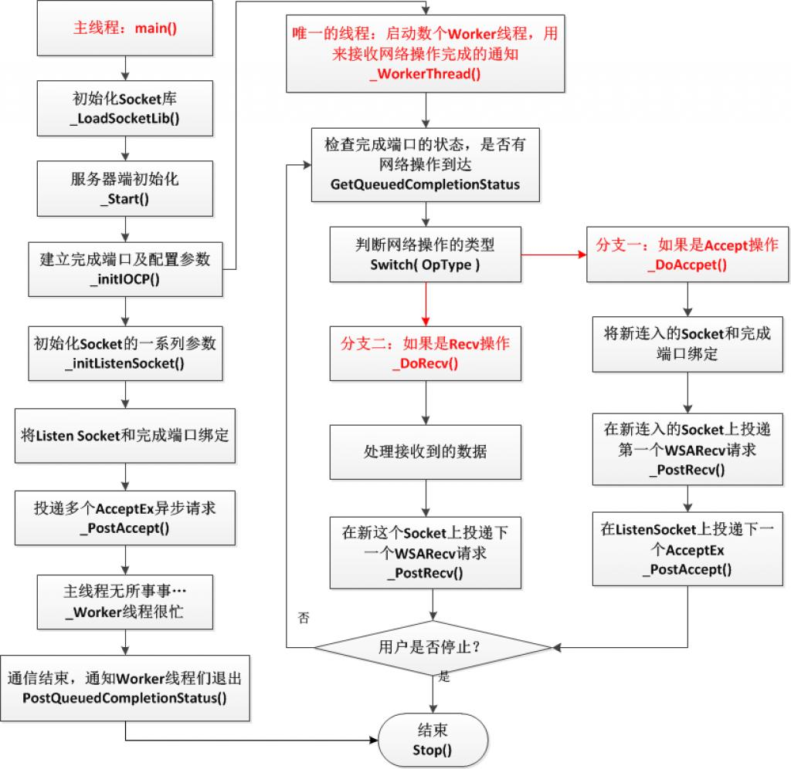
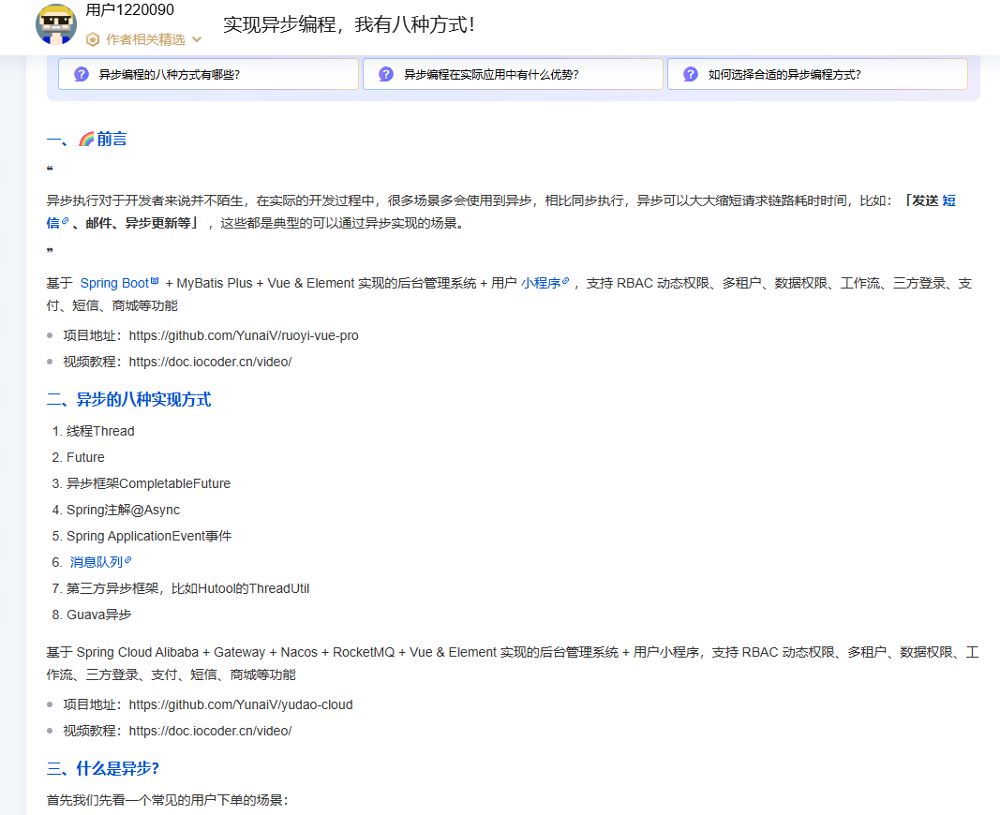
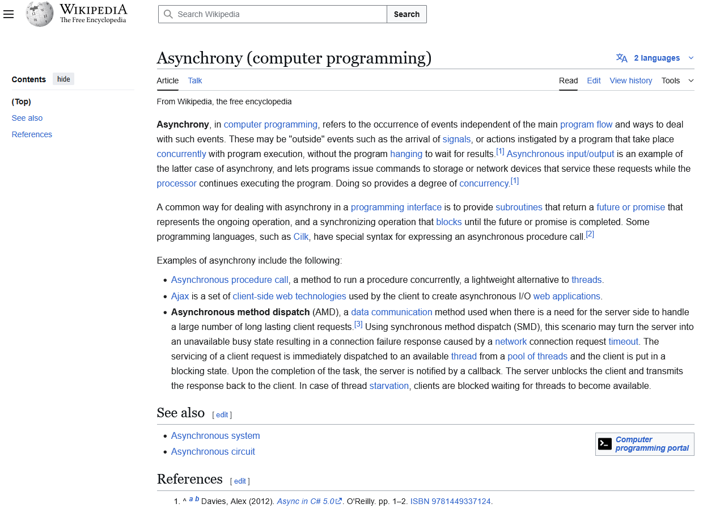

因为异步编程必需“先设计后编码”。

  

单线程代码，现在稀屎一样淌哪算哪、好不容易凑合能跑了就“千万不要再碰”的稀屎流编程是主流——他们还自豪的称其为“敏捷”开发。

但是异步代码——哪怕别人包装好不需要你自己管多线程的——这样做就是找死了。

-   有一组变量需要跨线程访问，不加锁就脏读脏写你死不死
-   声明个int array\[100\]是栈上的，跨线程栈失效了就是野指针就会随机崩溃你死不死
-   一件事在另一个线程做完了，主线程怎么知道？不会搞消息通知不会正确检查状态你死不死
-   线程A需要等线程B完成某事才能继续；结果线程B依赖于线程C依赖于线程D然后又依赖于线程A

-   循环等待出死锁了你死不死
-   一分析28个线程等成了一张网压根看不出依赖关系你死不死
-   再一分析线程是随意开的其实有31个线程相互等待、跨线程访问的资源超过54个你死不死

你看，这玩意儿怎么写、怎么调？

单线程你都搞不定、程序莫名其妙跑起来你就不敢再动它了；多线程这么复杂这么随意你怎么给它debug？

  

算了，就这么搅成一团赶紧找上面请功，大红横幅一拉庆功会一开尽快了解掉算他娘的了……

反正上面也不懂，一看界面像回事一点头就算过了明路，以后谁都别再提，大家都好——不然上面恼羞成怒先要你的脑袋！

——哪壶不开提哪壶是重罪。

* * *

想要玩转异步编程，你就必须先设计、后编码。

  

先设计，先把整个需求分析透彻；然后理清楚哪里需要异步、异步解决什么问题……

-   对于界面

-   异步是为了防止业务流程卡死界面流程
-   因此重点是设计好消息-通知机制

-   这种情况下，数据共享极少，甚至可以通过设计压缩到零
-   消息-通知机制可以利用GUI程序原有的消息派发系统

-   比如Qt的signal-slot-bind机制
-   比如Windows的sendmessage/postmessage
-   比如标准通讯原语里面的event

-   不仅界面，比如socket等也都有类似“防卡死”的设计

-   当然这个设计更多还是为了性能

-   对于性能

-   异步可能是为了尽可能同时调动更多硬件

-   硬件有自己的处理器

-   比如网卡可以绕过CPU、通过DMA自动维护内存缓冲区
-   比如硬盘内部有很大的缓存、也可以通过DMA自动维护缓冲区

-   异步也可能是为了同时利用更多CPU核心
-   必须事先确定哪里可以并行、并行什么时候发生在什么硬件上、如何发生

-   比如，声卡播放音频

-   当缓冲区即将播放完时声卡会产生中断，提示程序员给它更多音频数据
-   声卡自身一直在利用缓冲区音频运行，并行永远在
-   网卡类似

-   这类提示可能有现成的框架；但框架的提示方式多种多样

-   socket是用select阻塞等待

-   有socket文件可读/可写就不再阻塞
-   可抽象为文件读写的东西都可以利用select机制

-   有些框架要求程序员传入回调函数，它们来决定什么时候调用你的处理代码

-   把回调函数写的干净些，自己管理好内存，该加锁加锁

-   关于锁

-   尽量压缩锁粒度

-   大粒度的锁容易导致假死锁
-   因为解开锁的时间太短，其它线程很难“抓住机会”

-   除非你安排了消息通知机制——但这又会导致程序无限复杂化

-   压缩锁粒度的前提就是彻底搞明白哪些数据必需共享

-   一块100M的共享内存，其实并不是必须一次锁定这100M空间的

-   完全可以搞成链表形式
-   只有从链表末端取一块数据/加一个节点时需要锁定
-   锁定时间仅需“操作末端next指针”的一瞬间

-   极限就是所谓的“无锁编程”，也就是把锁粒度压缩到一条CPU指令

-   事先确定共享资源，才有可能分析和规避死锁问题

-   银行家算法

  

你看，你不事先做好设计，而是搞“稀屎流开发”，以上我这简单展开一下就这么大一坨，你怎么分析？

里面的每一条的每一个细节，展开来都能写一本书；其中的大多数字句都可能索你的命！

  

别再自欺欺人的把“稀屎流开发”叫敏捷了。敏捷不是你们配提的。

敏捷的基本要求是：程序员把程序整体设计、模块设计玩到炉火纯青的地步，随手一敲就是库代码水准！

——只有到了这个水准，才可能拿重构不当回事：写一个原型给客户提意见提完回家马上重构、一大坨代码揉面团一样想怎么揉怎么揉……

  

我就很奇怪，那些“程序莫名其妙跑起来就千万不要再碰它了”的傻X，是怎么有脸提敏捷的？

* * *

评论区有人想要“友好讨论”，刚好俺怼人瘾犯了，刚好就来教教你，什么叫“友好讨论”。

  

友好讨论的前提是你要有能力“讨论”。

别一群内燃机工程师开会呢，你一个就隔着100米远远看过一眼这个的外行跳出来，叉着腰想要纠正他们的用词——不好意思，这不叫友好讨论。

  

这叫**癞蛤蟆跳脚背**上：

还请好自为之。

* * *

当然，或许你们不明白为什么我会怒怼这些人。原因很简单：因为绝大多数的公司高层是不懂技术的！

  

哪怕皮毛的不能再皮毛的“同步/异步”这个编程书上的简单内容，只要你像她一样，气势汹汹的说出来，不要怕丢人——那么，你就“炫技”成功了。

因为，在老板眼里，就是一个技术很强、天天给管理层甚至给老板脸色的人吃瘪了——你看，人家能掉书袋，掉完一翻书，真有！

啊哈哈哈，我让你们能！

  

这些瘌蛤蟆，就是这样爬到技术人员头上、变成所谓的“领导”的。

而我，把这些癞蛤蟆的真面目揭出来、公开处刑，恰恰是为了教你们这些拙嘴笨舌的技术人——遇到这种垃圾，请学我这样怼。

或者，请把它转到公司内网，正一正风气。

* * *

好了，接着往下谈。

  

和汽车发动机一样，异步编程也分“远远看过发动机盖”“打开发动机盖加过机油冷却水”以及“深入拆解过发动机”以及“我就是设计发动机的”“我参与设计过最先进发动机的某种特性”乃至“我主导了某种发动机技术的难题攻关”等不同水平。

在初学者眼里，异步编程可能是这样的：

上图中，红区是异步区，黄区是同步区；远远看过发动机的大概知道那条蓝线——如你所见，为了照顾你的情绪，我把这条线画的很粗。

  

在他们看来，这条蓝线就是异步编程的一切。

  

但是，很遗憾，不是这样。

如果你只有这样的技术水平，请离开第一排，往后退。再往后退。继续。继续。好，向左转，开门，齐步~走！

请关上门。

你并不适合出现在这样的会议室。上图这个姿势，这个位置，才是属于你的。

无论你钻营到了多高的职位，请门外站着。

**我们讨论的内容，你连做会议纪要的资格都没有**。因为你听不懂，记不下。勉强记下也全都是同音错别字甚至直接写拼音：

不要勉强自己，更不要来膈应我们——做人要有点素质，谢谢。

* * *

如果你曾经做过那么一两个hello world性质的、关于异步的大作业题，那么你就会知道——异步编程，绝对不是蓝线上有几个异步接口、调了它们就是异步编程否则就不是……

  

哪有那么简单。

恰恰相反，正如上图所示，来自蓝色部分的接口调用（包括但不限于回调、协程、事件等等模型），都会对“美好”的线性区造成严重污染。

**异步编程，恰恰就是讨论这些污染带来的种种棘手问题应该如何对付的学问**。

  

举例来说，完成端口就是典型的异步通讯模型，它内部维护一个线程池；你只需给它传入一些回调，完事……

有这么简单？

你想屁吃。

[https://blog.csdn.net/PiggyXP/article/details/6922277](https://link.zhihu.com/?target=https%3A//blog.csdn.net/PiggyXP/article/details/6922277)[完成端口(CompletionPort)详解 - 手把手教你玩转网络编程系列之三](https://link.zhihu.com/?target=https%3A//blog.csdn.net/PiggyXP/article/details/6922277)

当然，虽然这只能算是一个玩具性质的简单示例；但这个示例的难度和复杂程度也是远超清华计算机系本科专业大作业水平的——只有极个别学有余力的“妖孽”同学能独立完成它。

  

事实上，公司内部经常搞的“员工培训”活动，如果我要讲这个水准的课题，那么下发的通知会是这个样子：

> 时间：年月日X时-X时  
> 地点：X楼X号会议室  
> 主题：异步编程初步-以完成端口为例  
> 面向人群：有一定异步编程经验，想要学习提高的同事

  

没错，哪怕如此初级的培训，那位只看见过蓝线的迎宾小姐都不适合进来浪费时间——**事实上，我有十成把握，迎宾小姐连蓝线都没见过。她仅仅是背过书上关于异步的那行黑体字罢了**。

如果它真的见过蓝线——就不用完成端口这么“高级”的东西了，哪怕仅仅是见过UI线程、处理过耗时的计算造成的UI卡死问题，它就知道“异步”对程序的污染有多严重、多棘手——就会知道关于信号、锁、数据完整性等方面的讨论是异步这个课题的必然延申而不是不相干的东西。

——就不会白痴到敢于跳出来cosplay癞蛤蟆。

  

当然，有兴趣、并且真的写过一点hello world的话，还是可以来接受接受惊吓的。这能有效治疗你不管合不合适都想凑上来“讨论”的贱毛病。

但连hello world都不会的话，还是请你有多远站多远的好。这不是你该来的地方——如果硬要来，请端端正正站在门外，笑出八颗牙齿。这是基本的职业道德。

也是你唯一的价值。

* * *

现在你知道了“异步编程绝不仅仅是那条蓝线”，你知道自蓝线泄露来的各种细节会“污染”你那美好的、纯洁的黄色区域……

  

但这远远不够。

因为，它在我原来的回答里，仅仅能覆盖我罗列出的那个“庞大”而粗疏的列表里的第一项……的一小半。

  

原因其实我在原始答案里已经讲过了——当然，身为迎宾小姐却钻营了个不适合你的职位的你理所当然是看不懂的：这就是我安排你站到门外摆好姿势笑出八颗牙齿的原因。

**知人善任是我最大的长处。不用谢**。

  

在计算机里面，一切都是混沌的——混沌，但又清晰。

比如，各种硬件，从南北桥到显卡网卡声卡raid卡乃至硬盘、打印机，它们实质上都是一台独立的微型计算机系统——也就是可以看作主CPU的下位机。

它们各自独立的运行着，随时可能有情况要求主CPU——那个端坐在宝座上、顶着一个大大的散热器充当皇冠的家伙——帮它们处理各种疑难杂症。

这个请求就是所谓的“中断”，更严格的说是硬中断——顾名思义的，也有软件产生的“软中断”，如除零错、访问违例、低权限程序试图执行特权指令等等，都可能触发软中断。

  

这些复杂的、混沌的东西，必须有人把它们理清楚了、抽象成更简单更清晰的接口——也就是那条蓝线——提供给只会写大作业或者只会就着现成的完成端口写点外围代码的人使用。

  

当我们高级程序员谈论异步模型时，我们绝不会满足于当一个调包侠，对着别人抽象好的iocp（完成端口）之类东西忙忙碌碌、疲于奔命……

恰恰相反，我们反而会深入iocp本身，学习它是怎么设计的、这个模型的抽象好不好、能不能做出更漂亮更简洁的抽象——而这，才是异步程序设计的本体。

  

这就是上面那一片红色区域。

不仅如此，红色区域的抽象可不是那么简单的一层；相反，它起码包括：

-   Bios层抽象（参阅smbios标准）
-   PCI-E、usb总线相关协议
-   固件层
-   各种外设会话协议（如打印机协议就有EPSON的ESC/page，佳能的CaPSYL，施乐的XES、JDL，IBM的IPDS，DEC的ANSI/Sixel等；这还不包括网络打印协议）
-   操作系统层（最厚实的一层）
-   驱动层
-   各种底层库（如libevent）

  

如果说蓝色线是皮、蓝色线对黄色区的污染是毛的话，红色区域的内容——也就是我在原贴中重点罗列的部分——才是骨肉。

  

讲皮毛知识你都只能当迎宾小姐，进会议室都是浪费时间；那么，我讲骨肉知识时，究竟是什么给了你勇气，觉得你有资格闯进来、拿着你死记硬背下来的只有6个bit信息量的皮毛，气势汹汹的和我“讨论”的？

还要给我正本清源，想要把线程、锁踢出异步编程技能库——真是癞蛤蟆打呵欠，好大的口气。

* * *

我这人不喜欢扯大旗做虎皮。另外说难听点，很多所谓的资料——尤其中文互联网的资料——需要我去纠正而不是做我的参考。

如果不信我、觉得异步编程就应该是async/await两个关键字和线程什么没关系……那我也不可能说服你。

要不，你去说服说服他们？

[实现异步编程，我有八种方式！-腾讯云开发者社区-腾讯云](https://link.zhihu.com/?target=https%3A//cloud.tencent.com/developer/article/2513593)

  

[https://www.indeed.com/career-advice/career-development/asynchronous-programming](https://link.zhihu.com/?target=https%3A//www.indeed.com/career-advice/career-development/asynchronous-programming)[https://en.wikipedia.org/wiki/Asynchrony\_(computer\_programming)](https://link.zhihu.com/?target=https%3A//en.wikipedia.org/wiki/Asynchrony_%28computer_programming%29)[https://medium.com/@codingmatheus/understanding-async-programming-abdc0a980e2b](https://link.zhihu.com/?target=https%3A//medium.com/%40codingmatheus/understanding-async-programming-abdc0a980e2b)

或者，先去竞选个地球球长，然后下一纸红头文件，把这些都改了？

* * *

> 我当矿工那会儿是不懂。我当基层干部时也不懂。在我逐步升迁的每一台阶上我都不懂。可我现在是部长会议主席和党的领袖了，难道我还不懂吗？  
> ——赫鲁晓夫

[赫鲁晓夫乱评艺术的奇葩往事](https://link.zhihu.com/?target=https%3A//www.sohu.com/a/116781895_232289)

在你成为部长会议主席和党的领袖之前，请在门外站好你的每一班岗，笑出八颗牙齿。

谢谢。