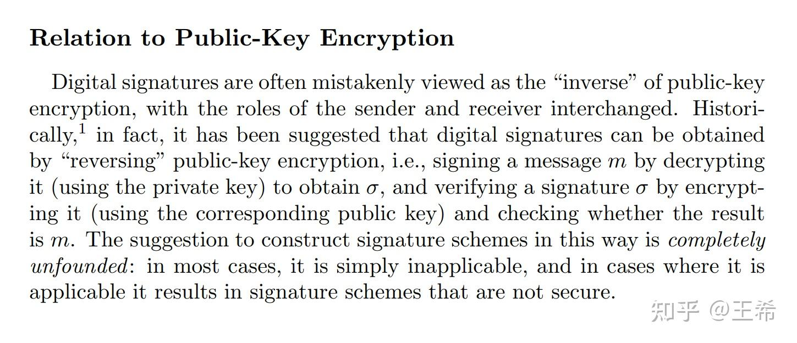
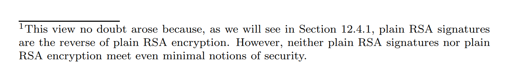

很遗憾， [@Serendipity](https://www.zhihu.com/people/09733810a89d25118c12b0514939747f) 的回答是错误的，**任何时候都是用公钥加密，用私钥解密**。

为什么呢？因为我们说的是加密和解密，而不是其他的。

加解密的目的是保证信息的私密性，而不是其他的。也就是说，只要我有一个消息 $m$ ，我用一个密钥 $K_1$ 把它变成了 $c$ ，你从 $c$ 里得不到 $m$ 的任何信息，然后我通过 $K_2$ 和 $c$ 能把 $m$ 恢复出来就皆大欢喜了。老早的时候 $K_1=K_2$ ，叫对称加密；现在 $K_1$ 和 $K_2$ 可以不相等，就叫非对称加密。

在非对称加密中， $K_1$ 和 $K_2$ 必然是成对出现的。我生成了一对之后，会公开 $K_1$ ,自己留着 $K_2$ .这样别人给我发的消息用 $K_1$ 加密，只有我能用 $K_2$ 解密，很完美。

在任何时候，我都不会用 $K_2$ 去加密，让别人用 $K_1$ 解密，因为这毫无意义。

有人会说，这可以证明你是你啊，别人没有私钥，就无法加密，你证明了你有私钥。

这种说法，从原则上说是对的，**但现实中没有这么用的**。同样的功能，我们用一个叫作“**数字签名**”的密码原语来实现。

数字签名是建立在非对称的基础上的。也就是说每个使用者都会有一对密钥，它会公开公钥，自己保存私钥。当他需要证明他认可一个消息 $m$ 时，他会用签名算法和自己的私钥 $sk$ 对 $m$ 进行签名，得到签名结果 $sig$ 。而其他人则根据消息 $m$ ，签名 $sig$ 和公钥 $pk$ 来验证，得到一比特信息（也就是1或0，代表验证成功或失败）。

（在这里有必要强调一下，**签名无法恢复出任何关于消息的信息**，即使你通过hash操作把消息映射成了一个很短的字符串，你也无法恢复这段字符串——或至少，签名算法不保证你能恢复）

注意，验证签名的算法是需要原始的消息作为输入的，它的输出只包含1比特。数字签名 $sig$ 无法恢复消息 $m$ ，只有 $sig,m,pk$ 作为一个三元组输入时，我们才知道它们是不是匹配的。

注意到我们也可以用非对称加密方案设计一个签名方案：签名过程是用私钥加密，验证过程则是用公钥对签名解密，再和消息作对比。若相等则输出1，否则输出0。这说明用私钥加密比数字签名范围更小，它是一种特殊的签名构造方式。当我们面对“验证身份”这类问题时，我们求助的是数字签名方案，而非私钥加密。就好像张三胃病犯了，他求助的可以是任何一个医院的肠胃科大夫，而不一定是XX医院那个叫罗翔的肠胃科大夫，他也可以求助YY医院的李四。

而在实际中，常用的签名方案没有任何一种是通过用私钥加密这种方式实现的（RSA可以算是，但不完全是），所以你可以认为，任何情况下都不会用私钥加密。（其实Full Domain Hash的签名是这样的，但其Hash函数属于签名的一部分，因此也很难说是在用私钥加密）

* * *

这里随便举一个常用的数字签名：Schnor签名。

密钥生成就是找一个群，然后生成群元素 $a$ ,正整数 $n$ ，计算 $y=a^n$ . $a,y$ 以及群是公钥， $n$ 是私钥。

对于一个消息 $m$ ，随机生成一个正整数 $k$ ，计算 $I=a^k$ ，然后再计算 $r=H(I||m)$ 。其中 $H$ 是个哈希算法， $m$ 是消息，两个竖线代表拼接。再算出 $s=rn+k$ 。签名就是三元组 $H(I||m),r,s$

验证时，只需要先算出 $I'=a^sy^{-r}$ ,再验证 $H(I'||m)=r$ 是否成立即可。

注意这里的验签虽然是在比较两个哈希值，但这个哈希算法不是对消息的那个哈希，而是签名算法的一部分。换句话说，即使把上述所有的消息换成消息的哈希 $h'(m)$ ，上述签名算法同样不是恢复出 $h'(m)$ 再进行比较的。

最后一部分清楚地解释了这个问题。

* * *

突然发现Katz的名著《Introduction to Modern Cryptography》里解释得很清楚：

