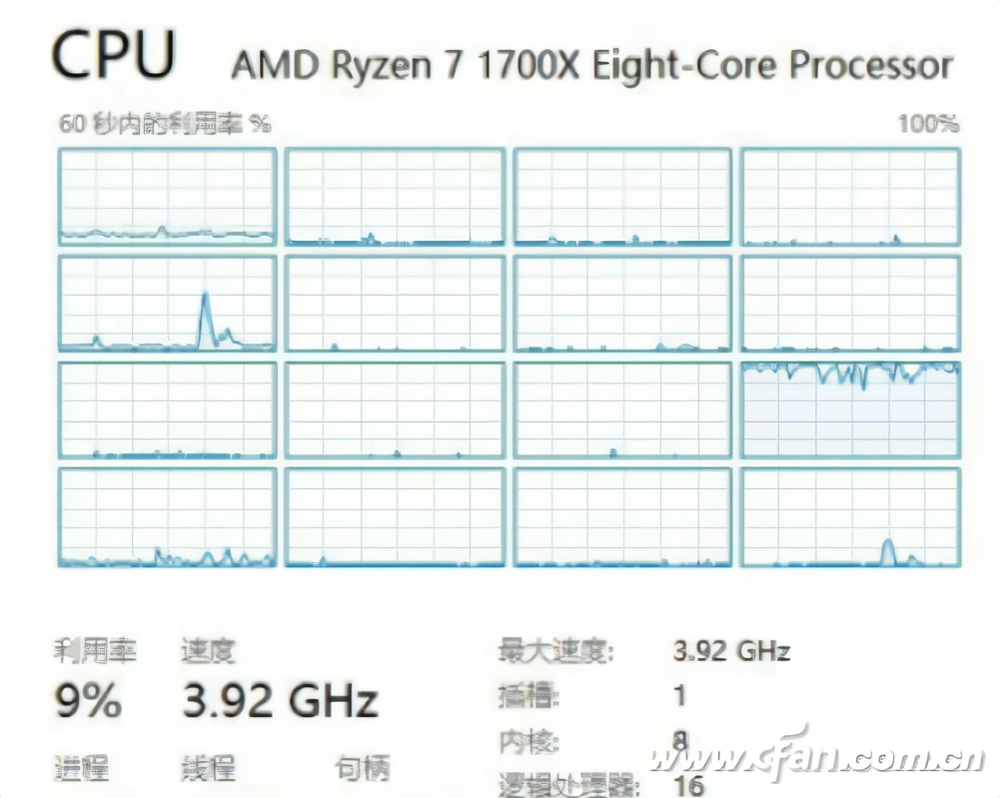

简单说：如果你玩多线程老老实实对共享资源加锁，甚至如果你不玩多线程，那你完全可以忘掉内存屏障这回事。它和你无关。

  

随便你开O1O2O3优化，这玩意儿都和你无关。

能优化出错的编译器是垃圾，是重大事故，哪个团队也不敢把这种demo水平的编译器推出来给你用。

* * *

想要接触到内存屏障，你的技术必须达到一定的深度……

  

举例来说，你是个编程初哥，但你学习很认真，信号量PV操作你都学通了……

现在，你遇到了这么一个任务：

1、内存里有若干G的数据

2、你需要对这些数据排序

  

如果你没什么追求，那么……嗯，很简单，调用C库函数qsort或者使用c++的sort就行了。

* * *

但，如果你稍微有点追求，你就会发现，无论是C的qsort还是c++的sort，它们都是单线程操作；那么，当你打开任务管理器时，你看到了：

没错，经典名场面：一核有难，众核围观。

  

你是有追求的人，可丢不起这个人。

怎么办呢？

  

你一查资料，对，多线程！核心数目二倍！

于是你开了16个线程，同时对这块数据排序……

  

然后，完蛋了。数据被破坏了。程序崩溃。

你继续查资料，哦，需要加锁！不能脏读脏写！

  

现在，你用一个锁保护起了这块内存；这16个线程想要访问它，就必须先申请锁；排序4K字节后，它要主动释放锁，自己退居二线，让别的线程接着干！

  

搞完，你再打开任务管理器一看……

所有核心都是轻负荷……

  

你不死心，又测量了一番执行时间，幸福的发现……多线程版反而更慢了。

* * *

问题出在哪里呢？

  

你纠结了八年，薅光了头顶的头发后，终于醒悟过来了……

锁的粒度太大了。

  

线程1工作期间，它一下子锁住了整块数据，使得剩下15个线程只能一旁围观；只要线程1不释放锁，剩下15个线程就没事干！

  

多大点事儿啊。太简单了。

你搞了个链表，把数据每4k一块的存在链表节点上；16个线程各自找链表申请一块数据，拿回去自己排序；排完，再挂到另一个“已排序”链表上；然后到“待排序”链表申请第二块数据。

  

你看，这块数据，是不是终于可以并行访问了？只有存取链表时需要锁一下，剩下的时间，所有线程可以一起开工！

换句话说，你把锁的粒度压缩到“一次链表操作”级别，从而提高了并行度。

* * *

然而性能似乎并没有提升。

  

这事好办。你八年的修炼可不是假的。

当你使用锁的时候，你实际上发起了一个系统调用；这就出现了用户态到系统态的切换。这个切换是很耗时的。

  

常言道“欲练此功，必先自宫”……哦不，必先干掉OS！

你决定，不再给链表上锁了。

  

但不上锁，就可能出现数据脏读脏写，会导致数据被破坏、甚至程序都会崩溃的！

  

“不”，你推了推眼镜，侃侃而谈：“我们深入考察链表，可以发现，其实我们对每个链表节点是独占使用的，只有挂接链表时，才需要读写共享的链表指针；特别的，当我们总是从末端访问时，我们只需处理倒数第二个链表节点的next指针就够了。而对于我们这个任务，我们对链表A总是取它的末节点，而对链表B则总是把节点挂在它的末尾，这就给了我们优化它的可能。同时，CPU提供了一个test-and-set指令，这是个原子操作。我们可以用这个指令处理倒数第二个链表节点的next指针，比如，对链表A，我们检查其有效性并置空；对于链表B，我们检查其是否为空、再挂接完成后的节点——再说一遍：我们利用的test-and-set指令是原子的！所以，我们不需要使用操作系统的锁！”

  

“是啊是啊，这下我们把锁粒度压缩到了单条指令，太厉害了”，大家纷纷附和。

“可是，这么复杂的指令，它怎么可能是原子的呢？”

你不屑一顾：“因为它会设置内存屏障！确保期间只有当前核心可以操作内存！”

  

你得意的敲出了“无锁版”的新·超级·并行排序算法，并细心的解决了ABBA问题……

  

看到了吗？

只有当你玩到这个程度时，你才需要知道内存屏障。

* * *

然而性能仍然没有提升。

  

你冥思苦想许久，仍然不得要领。

最终，你决定梭哈。

  

这次，你去掉了链表，让16个线程自由的飞翔……

啊？这？之前这样搞，程序不是崩掉了吗？

  

“此一时，彼一时也”，你坐着轮椅，摇着鸡毛扇，“排序嘛，只有最后交换两个逆序数字时才需要写入内存，之前阶段只有读，没有写。所以，现在我的新算法只会在交换数字时设置内存屏障，其他时候所有核心其实是同步访问内存的！啊，注意了，C++有6种内存可见性模型，我们必须搞明白它们之间的微妙差别……”

  

嗯，你看，只有玩到了这个程度，你才需要深入理解不同内存屏障的微妙差异……

* * *

然而性能仍然没有改观。

  

冥思苦想十六年，你终于一咬牙，从牙缝里挤出几个字：“脸，我是不打算要了！来，给我上profile！”

小弟们眼泪都流出来了：“老大！不要啊！那玩意儿只有小白才玩！掉逼格啊！”

你无力的挥挥手：“上吧……”

“鲊！”

  

profile一跑，你终于发现，原来瓶颈在内存上。

  

排序这玩意儿，CPU要做的事情实在太简单了，单个CPU核心都绰绰有余。

唯一制约它的，就是内存访问速度！

你玩再多花样，也改变不了内存带宽不足的现实。

  

你吐了一口血，删除了自己用一头秀发以及三十年光阴换来的“新·究极·魔道·并行排序算法”，悲愤的用颤抖的手指敲出了几个字符：std::sort(

小弟：“老大！”

你：“能……返璞……归真……我……无憾…………”

小弟：“呜呜呜呜呜啊啊啊……”

* * *

这个故事告诉我们，profile是好东西，千万不要提前优化！