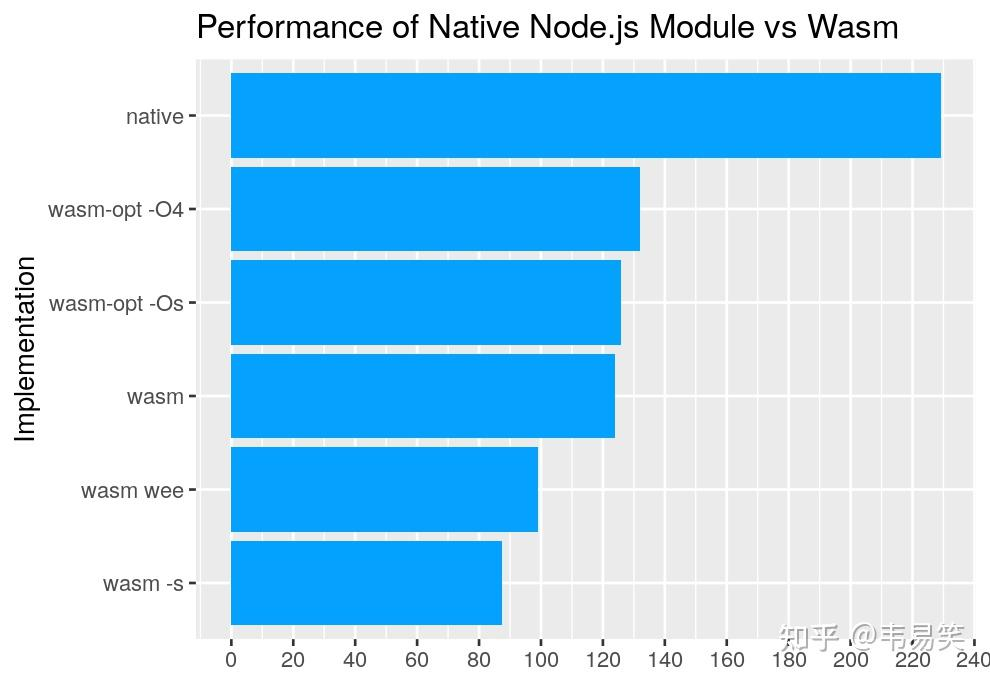
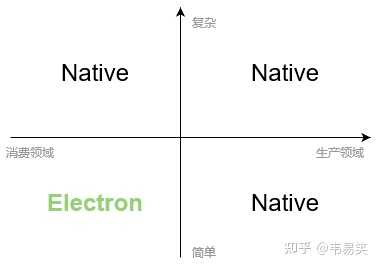
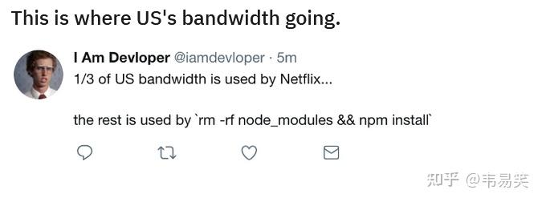

很多年以前，我是推荐过 Electron 的，但现在似乎有点过热了，所有桌面开发话题下都会看到 Electron 来凑热闹，你在一边安静的对比着 MFC 和 Qt 的优劣，或者你在讨论 c# 的 WinUI / maui 的话题，没有涉及到任何 Web 技术，也会有一堆 Electron Boy 们来话题下面找存在，跟你说你们说的都是垃圾，不如用 Electron，这就有点烦人了。

凡事过犹不及，你用 Electron 解决一类需求很爽没问题，但是一厢情愿的希望希望用它解决任何问题是不可能的，技术选型得清楚各项技术的边界在哪里，所以咱们分析下 Electron 有哪些问题。

很多人搞混淆了 “**内容消费**”和 “**内容创作**”了，现在电子设备分工越来越明确，随着移动应用的兴起，内容消费的功能都在往移动设备上迁移。PC 已经是越来越存粹的效率工具了。两个有本质的区别：移动界面是消费级应用，界面要好看，要容易操作，比如方便触屏的大按钮；而桌面软件会越来越朝向生产力方向发展，强调的是专业和效率。

你要做娱乐或者社交，这类轻交互的内容消费类应用，那么用 Electron 没问题，但如果要开发生产力工具，请使用 Native 技术，继续用 Electron 这种消费领域的技术来开发生产力工具，是不行的。

说到这里，很多 js boy 们又要把 vscode 抬出来说了：“你看 vscode 也是创作工具，做的多成功”，vscode 成功不代表它不卡，不代表它臃肿，这还是微软百人团队优化了 5 年以后的效果，你个普通公司，普通团队，靠 Electron 做出来的编辑器，上限也就是 github 的 atom 编辑器了，github 的开发能力做出来一团翔的编辑器，你在的公司技术能力比 github 如何呢？

微软百人团队大量性能相关模块改用 C++ 重写，搞了这么多年，最后性能还不如一个个人开发者用 C++ 开发出来的 Notepad++ 那么快，普通团队何德何能玩得转呢？

不要以为 wasm 是你的救命稻草，wasm 的性能只有 native 的一半：

这就是为啥 vscode 的语法高亮/正则表达式用 wasm 编译以后还是慢的原因。

如果用到 SIMD 指令集的项目，用 wasm 编译出来性能还会比 native 慢个四五倍，比如 ffmpeg 这类项目，在 wasm 上跑起来，实测就是四倍的性能差距，还特别占内存。

随着今后 PC 越来越往生产力工具上靠拢，你要开发成熟的内容生成型的应用，请选择 native 语言。

而娱乐社交类复杂了以后，Electron 也不行了，甭跟我说什么 slack，钉钉，他们做的并不好，要学的话学点好的，IM 领域技术做的最好的，telegram，人家是 Qt 开发的。

即便是简单的应用 Web 技术开发出来的东西，用起来总有种软绵绵的感觉，没有 native 语言做出来的那种专业和硬朗的体验。

最后补张图：

  

Electron 能覆盖桌面开发的一个角落，但是远远不是桌面开发的全貌，它和 Native 的区别，就像网页游戏和端游一样，有本质区别。

\--

你在 2022 年新配一台电脑，CPU 不快也不慢，内存不多也不少，开个 JetBrain 内存少 4G，开个 Chrome 内存又少 4G，再开个 vscode 内存少 2G，然后钉钉，飞书，微信，网易云音乐，每个占 2G，什么事情都没干呢，18GB 内存就没了。

真是一个赛着一个臃肿，是要梦回唐朝以胖为美吗？

最后再配一张图：

不过瘾，再来一张：

哈哈，每次看这张图都笑死我了，再来一张：

哈哈。

当年页游火的时候，不少公司都开新项目蹭过热度，页游开发者们成天秒天秒地秒空气，而今何在呢？所以说，历史总是在螺旋上升的。

  

\--