## 前言

  

在 JDK 9 之前，Java 基本上平均每三年出一个版本。但是自从 2017 年 9 月份推出 JDK9 到现在，Java 开始了疯狂更新的模式，基本上保持了每年两个大版本的节奏。从 2017 年至今，已经发布了一个版本到了 JDK 19。其中包括了两个 LTS 版本（JDK11 与 JDK17）。除了版本更新节奏明显加快之外，JDK 也围绕着云原生场景的能力，推出并增强了一系列诸如容器内资源动态感知、无停顿GC（ZGC、Shenandoah）、运维等等云原生场景方面的能力。这篇文章是 EDAS 团队的同学在服务客户的过程中，从云原生的角度将相关的功能进行整理和提炼而来。希望能和大家一起认识一个新的 Java 形态。

  

上一篇 (《 从 JDK 9 到 19，我们帮您提炼了和云原生场景有关的能力列表（上） 》)我们讲了在整个演进过程中针对运行时模型和运维能力的一些重要变化，这一节我们主要是来讲讲内存相关的变化。

  

## JVM GC 发展回顾

  

JVM 自从诞生以来，以 “内存自动管理” 和 “一次编译到处运行” 两个杀手锏能力，外加 Spring 这个超级生态，在企业应用开发领域中一直处于“人人模仿，从未超越”的江湖地位。内存的自动管理从技术角度，用一句通俗的语言进行简述就是：“根据设计好的堆内存布局模型，采用一定的跟踪识别与清理的算法，达到内存自动整理及回收的效果”。而一代代内存管理技术不断演进的目标，就是在不断提升并发与降低延时的同时，寻找资源利用最优的方案，从某种意义上说，如果我们不带来一些突破性的算法，这个三者的关系如同分布式中的 CAP 定理一样，很难兼得。如下图所示：

  

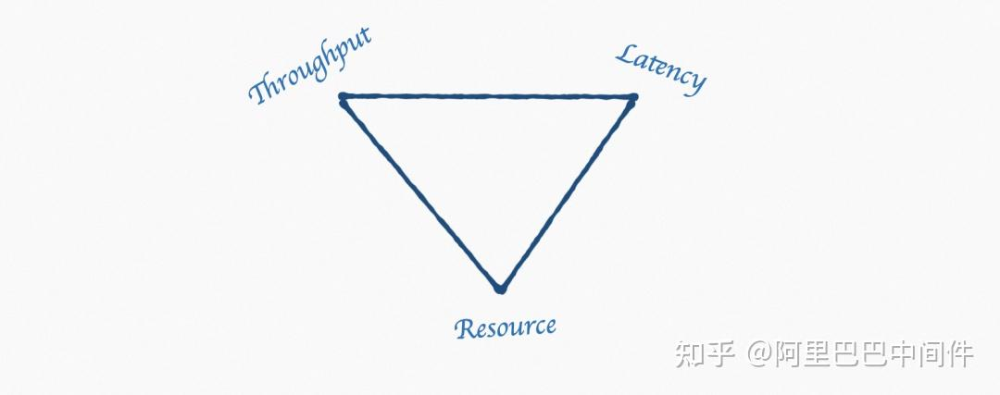

  

在 JVM 中，内存管理 趋近等同于 GC，GC 也是 Java 程序员获得一份工作时必考的知识点。其中 CMS 从 1.4 版本(2002年)开始引入，一度成为最为经典的 GC 算法。然而从 JDK9 开始发起弃用 CMS 的 JEP 提案，到 2020 年初发布的 JDK14 完全从代码中抹除，意味着在他成年之际正式宣告了他历史使命的结束。那么到现在我们又应该从什么角度上去理解这一技术领域的发展方向，今后面试官又会从哪些方面对我们发起提问，是不管技术如何演进，能确定的是变化主线是围绕着三个方向进行，分别是：堆内存布局、线程模型、收集行为。EDAS 团队经过一段时间整理出来了这篇文章，我们也将从三个点出发进行分享，希望能给大家一些启发。

  

## 堆内存布局的变化

  

JVM 堆内存布局最为经典的是分代模型，即年轻代和老年代进行区分，不同的区域采用的回收算法和策略也完全不一样。在一个在线应用（如微服务形态）的 request <-> response 模型中，所产生的对象(Object)绝大多数是瞬时存活的对象，所以大部分的对象在年轻代就会被相对简单、轻量、且高频的 Minor GC 所回收。在年轻代中经过几次 Minor GC 若依然存活则会将其晋升到老年代。在老年代中，相比较而言由于对象存活多、内存容量大，所以所需要的 GC 时间相对也会很长，同时由于每一次的回收会伴随着长时间的 Stop-The-World (简称STW)出现。在内存需求比较大且对于时延和吞吐要求很高的应用中，其老年代的表现就会显得捉襟见肘。而且由于不同的分代所采用的回收算法一般都不一样，随着业务复杂度的增加，GC 行为变得越来越难以理解，调优处理也就愈发的复杂 。

  

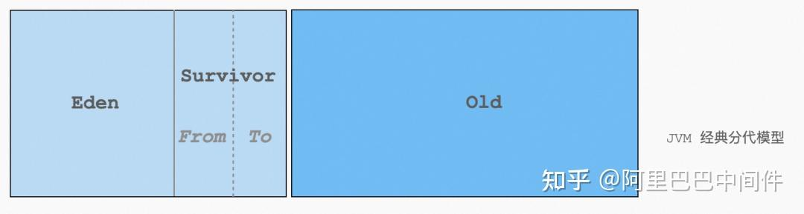

  

单纯从堆内存布局来理解，一个简单的逻辑是**内存区域越小，回收效率越高**，经典分代模型中的 Young 区已经印证了这一点。为了解决上述问题，G1 算法横空出世，引出基于区域（Region）的布局模型，带来的变化是内存在物理上不再根据对象的“年龄”来划分布局，而是默认全部划分成等大小的 Region 和专门用来管理超级大对象的独占 Region，年轻代和老年代不再是一个物理划分，只是一个 Region 的一个属性。直观理解上，除了能管理的内存更大（G1 理论值 64G）之外，这样带来一个显而易见的好处就是可以预控制一次 FullGC 的 STW 的时间，因为 Region 大小一致，则可以根据停顿时间来推算这次 GC 需要回收的 Region 个数，而没有必要每次都将所有的 Region 全部清理完毕。

  

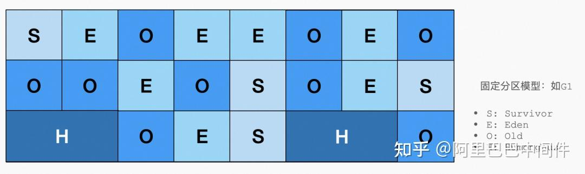

  

随着这项技术的进一步发展，到了现代化的 Pauseless(ZGC) 的算法场景中，有些算法暂时没有了分代的概念，同时 Region 按照大小划分了 Small/Medium/Large 三个等级，更精细的 Region 管理，也进一步来更少的内存碎片和内存利用率的提升、及其 STW 停顿时间更精准的预测与管理。

  

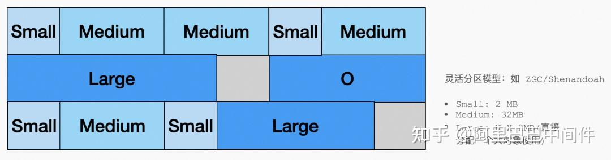

  

## 线程模型变化

  

说线程模型之前，先简单提一下 GC 线程与业务线程，GC 线程是指 JVM 专门用来处理 GC 相关任务的线程，这在 JVM 启动时就已经决定。在传统的串行算法中，是指只有一个 GC 线程在工作。在并行(Parallel)的算法中，存在多个 GC 线程一起工作的情况（CMS 中 GC 线程个数默认是 CPU 的核数）。同时一些算法的某些阶段中(如：CMS 的并发标记阶段)，GC 线程也可以和业务线程一起工作；这个机制就缩短了整体 STW 的时间，这也是我们所说的并发(Concurrent) 模式。

  

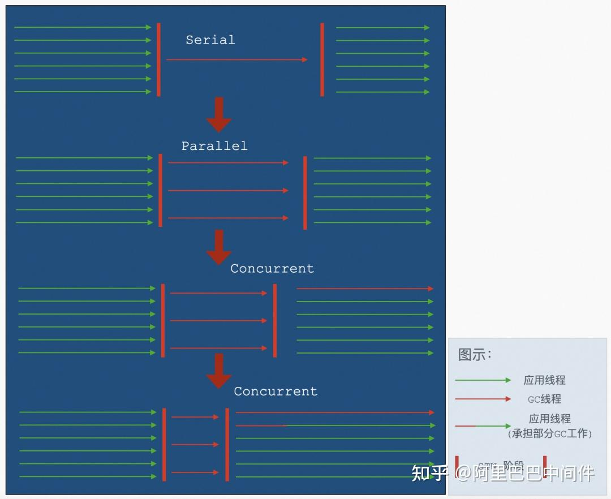

  

在现代化的 GC 算法中，并不是所有和 GC 相关的任务都只能由 GC 线程完成，如 ZGC 中的 Remap 阶段，业务线程可以通过内存读屏障(Read Barrier)，来矫正对象在此阶段因为被重新分配到新区域后的指针变化，进而进一步减少 STW 的时间。

  

## 收集行为变化

  

收集行为是指的在识别出需要被收集的对象之后，JVM 对于对象和所在内存区域如何进行处理的行为。从早期版本至今，大致分为以下几个阶段：

  

1.  Mark Copy：是指直接将存活对象从原来的区域拷贝至另外一个区域。这是一种典型的空间换时间的策略，好处显而易见：算法简单、停顿时间短、且调参优化容易；但同时也带来了近乎一倍的空间闲置。在早期的 GC 算法使用的是经典的分代模型。其中对于年轻代 Survivor 区的收集行为便是这种策略。

  

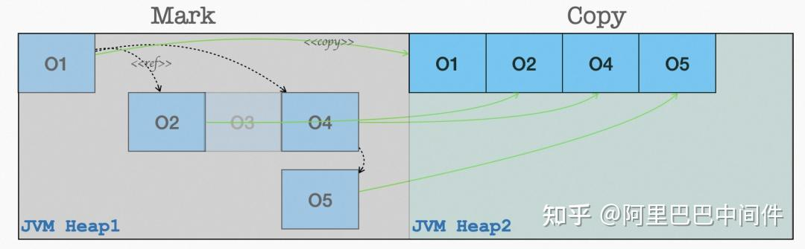

  

1.  Mark Sweep：为了减少空间成倍的浪费，其中一个策略就是在原有的区域直接对对象 Mark 后进行擦除。但由于是在原来的内存区域直接进行对象的擦除，应用进程运行久了之后，会带来很多的内存碎片，其结果是内存持续增长，但真实利用率趋低。

  

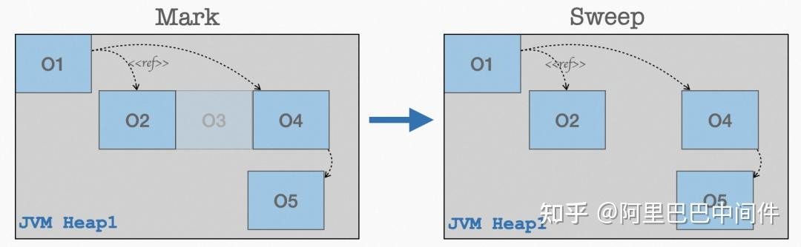

  

1.  Mark Sweep-Compact: 这是对于 Mark Sweep 的一个改良行为，即擦除之后会对内存进行重新的压缩整理，用以减少碎片从而提升内存利用率。但是如果每次都进行整理，就会延长每次 FullGC 后的 STW 时间。所以 CMS 的策略是通过一个开关(-XX:+UseCMSCompactAtFullCollection默认开) 和一个计数器(-XX:CMSFullGCsBeforeCompaction默认值为 0) 进行控制，表示 FullGC 是否需要做压缩，以及在多少次 FullGC 之后再做压缩。这个两个配置配合业务形态去做调优能起到很好的效果。

  

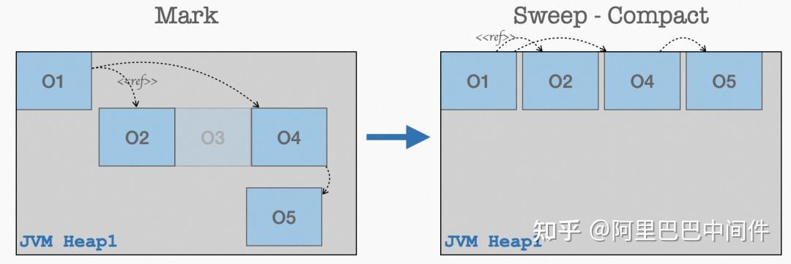

  

1.  Mark Sweep-Compact-Free: JVM 的应用有一个“内存吞噬器”的恶名，原因之一就是在进程运行起来之后，他只会向操作系统要内存从来不会归还(典型只借不还的渣男)。不过这些在现代化的分区模型算法中开始有了改善，这些算法在 FullGC 之后，可以将整理之后的内存以区域(Region)为粒度归还给操作系统，从而降低这一个进程的资源水位，以此来提升整个宿主机的资源利用率。

  

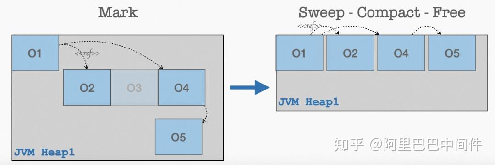

  

  

## 云原生相关的重点能力

  

对于云原生场景云原生的内在推动力之一是让我们的业务工作负载最大化的利用云所带来的技术红利，云带来最大的技术红利就是通过弹性等相关技术，带来我们资源的高效交付和利用，从而降低最终的经济成本。所以如何最大化的利用资源的弹性能力是很多技术产品所追求的其中一个目标。

  

这一小节，我们抽取了 JDK9 - JDK 19 中内存相关的代表性能力，分别是：G1 NUMA-Aware、Elastic Metaspace、ZGC Uncommit Unused Memory。和大家一起感受一下 JVM 在新的技术趋势下如何拥抱和改变。

  

## JEP 345: G1 NUMA-Aware

  

现代化的服务器大多是属于多 Node 的架构，下图表示有 4 个 Node，每一个 Node 内部都会有相应的 CPU(有的架构会有多个 CPU) 和对应的物理内存条。当 CPU 访问访问本 Node 内部的物理内存进行“本地访问”时，其速度是通过 QPI 访问其他节点内存时的速度接近两倍，同时不同远近 Node 的访问速度也都不一样。在开启 NUMA 的情况下，每个 Node 内的 CPU 将优先使用同 Node 内的“本地”内存，否则系统将所有 Node 内的内存统一对待进行随机分配和访问。

  

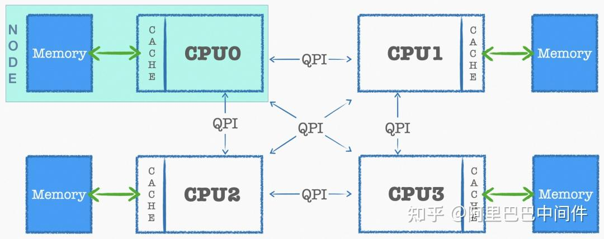

  

既然 Numa 的作用是 CPU 将尽量访问“本地”内存以加速内存访问速度，常规场景下如果我们需要使用这个能力，在系统开启 Numa 的前提下，我们还需要对运行的程序进行绑核调优等操作，以将应用程序运行的进程和CPU有一个绑定关系。要达到这一效果，除了系统提供了一些运维管理工具(如 linux 中的 taskset 命令)之外，程序也可以通过调用系统 API (如 linux 中的 pthread\_setaffinity)。在 JVM 多线程的模型中，如果想要通过自动编程的方式来进行 CPU 绑定，当下只能选择带有特定能力的商业版本，在 OpenJDK 中还不能很方便的完成这一能力。

  

那 JVM 内对于 Numa 能做什么呢？这里有一个假设，在一个线程内运行的对象大部分都是瞬时的（即这个对象的作用域跟随创建它的线程(或 Runnable)的运行结束而消亡），原因和我们在上面介绍堆内存布局模型时的新生代的选择是一样逻辑。基于这个假设，JVM 主要聚焦在了解决新生代的内存分配和访问的 Numa 感知上。其实 JVM 对于 Numa 的支持很多年前就开始了，在 YoungGC 的并行(Parrallel)收集器（通过-XX:+UseParallelGC开启）中。开启 Numa 之后，JVM 优先选择 Node 内部的“本地”内存进行新对象的创建。

  

在云原生场景下，一个 Kubernetes 集群通常托管高规格的机器、同时高密的部署的小规格的工作负载，这个场景下，一个工作负载一直运行在同一个 CPU 或固定几个 CPU 的场景会变得越来越普遍。如果 JVM 再把整个 Worker 的内存不加区分的对待并进行分配，我们的内存访问性能势必会急剧下跌。如下图所示：

  

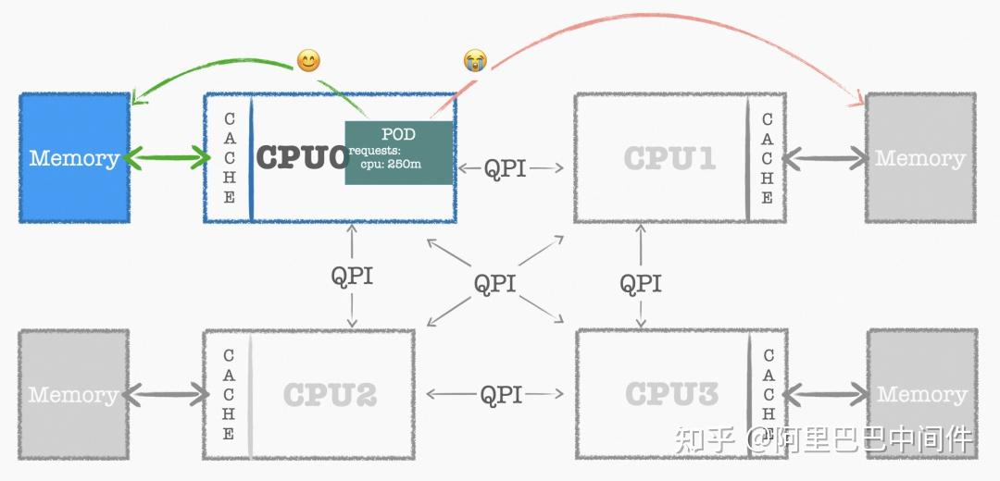

  

G1 算法通过 JEP 345 在 JDK 14 中得到了这一能力的支持，可通过参数 -XX:+UseNUMA开启，开启之后，G1 会尽量将固定大小的各个 Region 均摊在所有能分配的 CPU Node 中，在分配新对象时，将优先使用同一 Node 内的“本地”内存的 Region，如果“本地”内存 Region 不够时，将对此 Region 触发一次 GC；如果还不够，再按照 CPU 的远近尽量获取相邻 Node 的 Region。此策略只针对 G1 中新生代的内存区域生效。老年代区域和大对象区域还是沿用默认的策略。

  

## JEP 387: Elastic Metaspace

  

Metaspace 是用来存储 JVM 中类的元数据信息，包括类中的运行时数据结构、类中使用到的成员以及方法信息。他的前身是永久代，也就是 PermGen。这一变化是 JDK 8 中重要的一个升级的能力之一。从 JEP 122 中提议并落地。这个 JEP 带来的具体的变化可以参考下图：

  

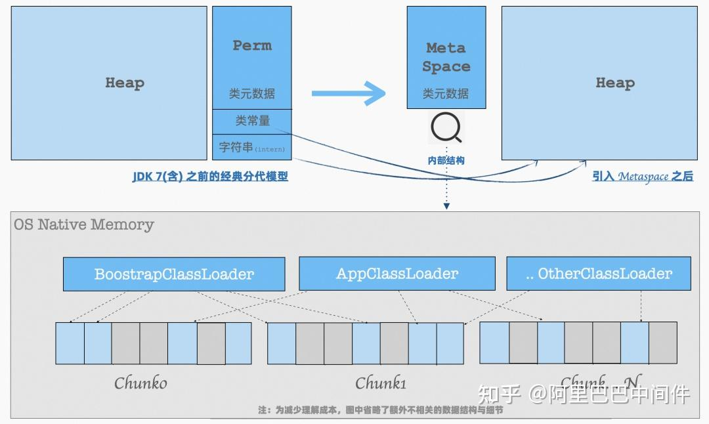

  

取消了永久代之后，带来两个变化如下：

1.  只存储类元数据信息，即：a) Klass 信息，描述类的基础属性和类的继承关系等；b）NonKlass 信息，包含方法、内部类信息、成员变量定义等。  
      
    
2.  **内存布局调整：**与之前在堆中开辟一块区域相比，Metaspace 是直接使用操作系统的本地内存进行分配，本地内存划分成多个 Chunk，以 ClassLoader 为维度进行分配和管理。

> 当一个 ClassLoader 加载一个对象时，所需要的空间从空闲的 Chunk 中分配一个或多个固定大小的块，如未找到则向操作系统重新申请一个 Chunk。当某一个 ClassLoader 中所有的类都被卸载的时候，就可以将它所引用的内存块都归还给 Chunk。等到对应 Chunk 完全处于“空闲”状态的时候，这个 Chunk 也就就可以被操作系统回收。

  

看到这里我们先暂停一下，思考两个问题：

1.  合，而 JRockit 的设计中并没有永久代。而从时间上看，正好是发生在 Oracle 收购 Sun 之后。所以一个猜想就是这个变化的根因应该是组织推动大于技术驱动。当然从技术上这样带来的好处也很显而易见：不再有负载的 Perm 设置；元空间和堆空间完全隔离后，两边的 GC 不会相互影响；单次 FullGC 因为扫描区域更小而使得 STW 时间更短；按照 Chunk 设计的构想，在类被卸载时，有助于 JVM 释放一些内存给操作系统等等。  
      
    
2.  **有没有带来新问题？**有，就是在一些应用程序中会出现多种类频繁的 加载/卸载 的场景下， 导致 Metaspace 所管理的 Chunk 会不停的更新和释放而造成很严重的**内存碎片**，碎片整理机制的缺失导致理想中的效果并未达到。最终造成了更多的内存浪费。

  

在 JDK 16 中发布的 JEP 387 中，专门针对带来的新问题做了一些改进:

-   首先：减少碎片，内存管理从内置的 Arena Chunk 内存管理算法，改为了简单且经典的伙伴算法，对，Linux 操作系统的内存管理就是基于伙伴算法的。

> 伙伴系统把所有的空闲页框分组为固定个数的块链表，每个块链表分别包含固定大小为 1K, 2K, 4K, .... 4M 大小的块。当应用程序向系统申请对应的内存大小时，系统将从最接近所需大小的链表中进行分配。

  

-   其次：按需使用，等到真正使用内存的时候才向操作系统发起内存申请，而不是一开始就申请出来一块很大的空间。

> 有一些 ClassLoader（如：BoostrapClassLoader）往往需要很多的空间，但是他真正使用并不是从一开始启动就需要，而且甚至是永远都不需要。

  

-   第三：增加策略，为了防止频繁的向操作系统 申请/释放 内存带来额外的系统开销，新引入了一个命令行参数 -XX:MetaspaceReclaimPolicy=(balanced|aggressive|none)来进行调整。

> 其中 balance 是默认选项，会在系统回收和时间消耗之间做平衡，更多是兼容之前的行为。aggressive 是一种最为 “激进” 的回收策略，通过在回收时降低对应页框大小至 16K（默认64K），使回收内存粒度更细来降低碎片。而 none 则是关闭回收行为。

  

## JEP 351: ZGC Uncommit Unused Memory

  

ZGC 在 JDK 11 时被引入，它是一款基于内存区域(Region) 布局的垃圾回收器，我们可以通过 -XX:+UseZGC进行开启。作为一款主打 Pauseless 的现代化的收集器，ZGC 相比于 G1 除了提供了三个不同大小的 Region (2M/4M/8M，而 G1 为一个固定大小的值)进行管理之外，还因为在 GC 整理阶段提供了内存读屏障来矫正对象指针的技术使得最终的 STW 时间更短。但是在 JDK 14 之前，被清理的 Region 还是无法归还给操作系统，相比 G1 在 JDK9 中就提供了类似的能力滞后了两年多。

  

简单概述一下，这个 JEP 指的是每次 GC 结束，JVM 都会尝试将释放一部分内存归还给操作系统。但是如上一章节介绍 Elastic Metaspace 章节一样，频繁的向操作系统 申请/归还 只能带来更多的系统开销，如何取舍是一门艺术。那么该如何选择是否有操作手段呢？请先看下面这张图：

  

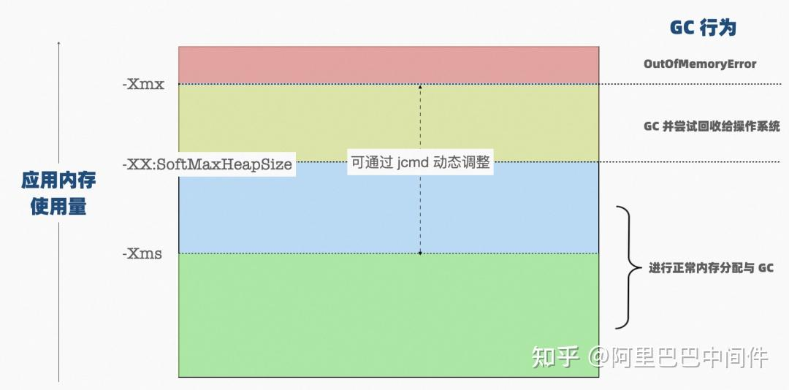

  

首先，系统提供了一个额外的 JVM 的调整参数(SoftMaxHeapSize)来控制回收的行为，这个值应该在 -Xms 和 -Xmx 之间，当系统使用的内存低于这个值时，就是正常的收集行为，即只会进行清理和压缩。而大于这个值但是小于 -Xmx 时，FullGC 结束之后就会尝试回收空闲的内存区域(Region) 归还给操作系统。达到的效果是 ZGC 将尽量保证整体堆内存水位处于这个值之下。默认情况下这个值和 -Xmx 的大小是一致的。同时由于这个值是一个可动态调整(managable)的变量，随着系统的运行，当我们发现需要进行调整的时，在认真评估之后，可以通过 jcmd VM.set\_flag SoftMaxHeapSize 命令动态进行调整。

  

其次，上述方案虽然很完美的将选择权交给了应用管理人员，但是运行的过程中也会出来一种情况：如果应用真实的使用量如果恰好在 SoftMaxHeapSize上下徘徊的时候，会造成很频繁的系统内存的申请和释放。这个时候提供了另外一个策略，就是可以通过 -XX:ZUncommitDelay 来设置一个回收之前的延时，即不在 GC 结束马上进行尝试回收，而是等一段时间(默认 5 分钟)后再进行回收，以免造成误伤。

  

## 结语

  

到这里，所有相关的云原生场景解读就完了；整个读下来，自己的感觉是 JVM 在这个场景下除了更好的去融入到这个场景之外，而且还不断的摒弃自己原有的即使是很成熟经典的设计，层层蜕变，在云原生场景下不断的将技术价值释放出来。云原生潮涌来，我借用孙子兵法中的一句话与各位共勉：“故善战人之势，如转圆石于千仞之山者，势也。”。回到我们的场景通俗理解就是你会看到你的合作伙伴、你的客户、你所使用的工具链、甚至你找的下一份工作时面试官的问题，都在受到这一理念与技术的影响而做出改变，这是技术浪潮中的大势。

  

如对上述话题感兴趣想深入探讨，欢迎留言或加入钉群：21958624 与我们（ EDAS 团队）进行沟通与交流，云原生微服务应用平台 EDAS 始终致力于应用架构云原生化，2023 春季新推采购活动，新客户头两月不限量使用，助力大家缩短转型过程中的路径。