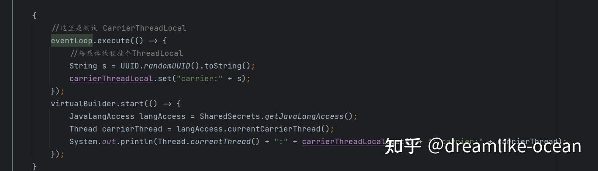
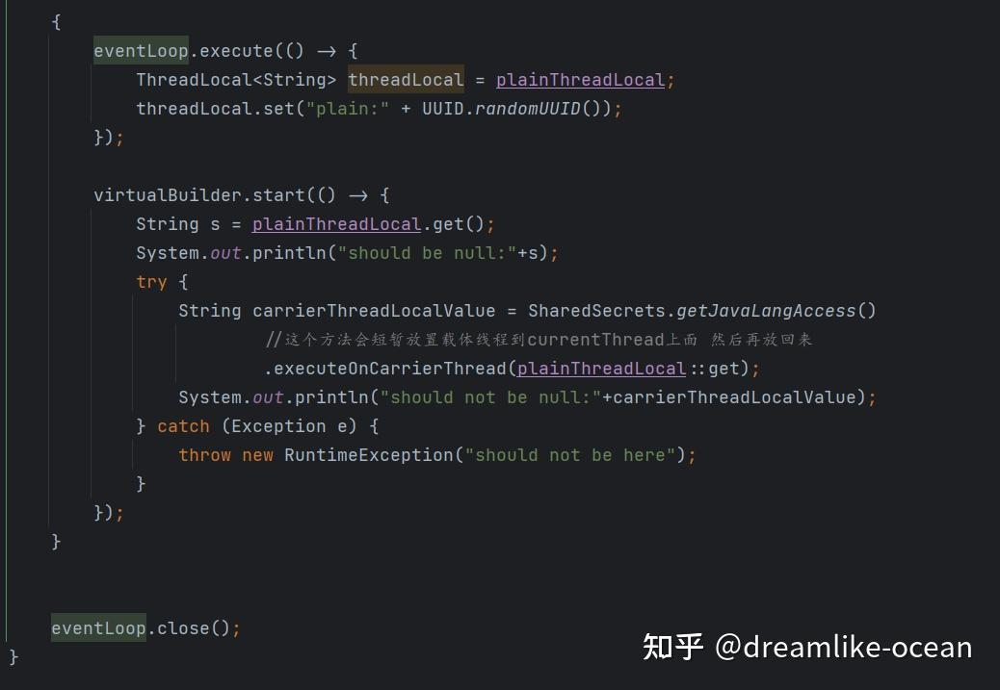
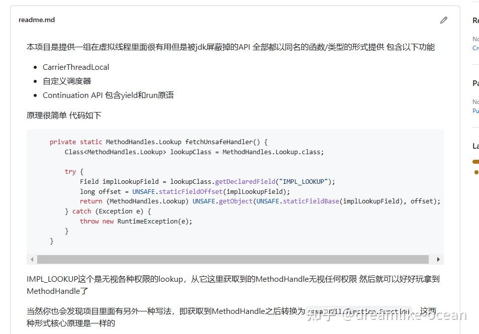

java根本不信任开发者 什么不安全但是很有用的api都藏着掖着

第三次更新

\*\*请各位下载比较新jdk(>19)打开 sun.nio. fs.NativeBuffers这个类体会一下为什么它这个threadlocal与众不同 再来看我的答案\*\*

扯ScopeValue和老ThreadLocal的都偏题了

举个例子 池化的玩意我们往往会搞个threadlocal级别的cache作为一级，因为我们往往认为thread是稀缺资源认为其数量不多，但是virtual thread出现了 打破了这个脆弱的假设

所以现在我在想能不能直接拿到载体线程然后绑定到这个线程上面做threadlocal的cache，我翻了半天jdk源码，才从内部的nativebytebuffer的cache翻出来一小段实现

如下图 有个CarrierThreadLocal的类可以完成我的需求 但是他的全限定名为jdk.internal.misc.CarrierThreadLocal这玩意它根本妹导出，我就不得不加add-export参数强制open

这种需求是客观存在的 如果这个是个公开api，这样做我们的适配成本是最小的 只要换一个类即可 但是他就是不给

其实还有个做法 是这样的 也可以 但是就是不给你用

另外一提还有个特殊的ThreadLocal的子类叫, TerminalThreadLocal,当thread生命周期结束时由jvm回调Thread的exit方法可以再回调这个threadlocal执行清理工作，比如说nativebytebuffer的清理，很可惜，这个api也没给

再谈谈virtualthread的核心类jdk.internal.vm.Continuation,这玩意我可以自己拿来做各种好玩的调度实现，在jdk17ea版本的loom里面这个还是公开api 现在不公开了

去maillist问 他说怕你们乱用导致c2激进编译导致crash(准确来说是单线程假设的优化)，我就拿来在eventloop里面用其实也影响不到我

就这样jdk组也不愿意放出来这个api

现在搞得各种api都是要自己手动加参数才能用，也算是一种免责声明。。。

  

再来更新一点内容

我自己写了个库帮我不加参数来调用这几个api

[https://github.com/dreamlike-ocean/UnsafeVirtualThread](https://link.zhihu.com/?target=https%3A//github.com/dreamlike-ocean/UnsafeVirtualThread)

\---------------分割线

我这里根本没有提到unsafe类，也不是为了解决malloc堆外内存的问题 是为了强调需要绑定到载体线程上的问题

看到大家都在提unsafe 我只能说 题目真合适