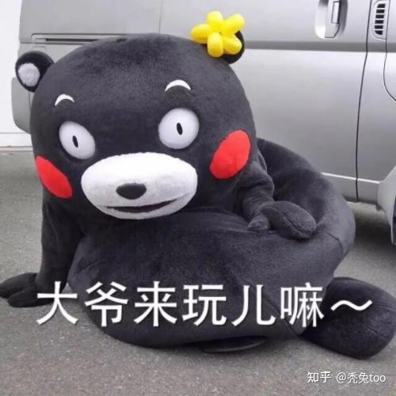

在地图上随便选出一个小县城，然后在各个网站上搜索资料研究分析这个县城是靠什么产业起家 发展 存活 创收 壮大起来的，又是出于什么原因导致衰败 没落 流失人才 最终隐入尘埃的！

如果有人想赚钱但是不知道怎么赚的，可以试着玩一下这个小游戏，能让你更了解钱这个东西是怎么运转的，在赚钱的过程中需要规避哪些自然的或者人为的风险~

对地理不感兴趣的，可以挑选任意一个曾经辉煌过的品牌，各个行业都行，摸清楚它是怎么兴起，又是怎么衰落的，它的产品存在什么样的问题导致它一步步走向下坡路，是时代抛弃了它，还是它生错了时代！比如我认识一个开纸品厂的老板，年纪比我父母还大，五零后，他有个小厂子，他们厂生产的卷纸早些年很不错，但是他管理工厂采用的还是“大锅饭”模式，工人干多干少都一个样，工资和待遇差不多，久而久之，工人就消极怠工，生产出的东西品质参差不齐，慢慢的淡出了大众视野，这种就属于时代抛弃了它 … 生错了时代，就比如我爸吧，我爸会写毛笔字，会中国画，还特别懂什么修行啊打坐冥想那一套，但是早些年他跟别人讲这些，人家都骂他精神病，他一气之下就把很多书都撕了烧了，其中还有古书和经书，没想到这几年这些又兴起来了，这就叫生不逢时！

为什么要这么玩呢，因为咱们普通人的试错机会有限，理清楚规则和玩法总比盲目下场要好一些，你我这辈子可能都无法成为制定规则的人，咱们能做的，只能是跟着规则跑，跟着大的趋势走，参考前人的路线自己一点一点在黑暗中摸索，尤其是失败过的经验，更为宝贵！我们要在这个过程里默默积攒着属于自己的力量，比如我在研究某家钢铁企业时发现它的核心领导前前后后创业失败过十多次，就成功过一次，也正是这次的成功，成就了他的事业，那年他都快五十岁了，在此之前他甚至还干过煎饼摊

当然，可能有点跑题，不过我确实是个挺无趣的人，我没什么爱好，我生活中的所有事都跟赚钱有关

非要说低成本爱好，不知道洗浴算不算，不过这成本可不低啊，我在洗浴中心办的卡也不少钱了！

关于具体例子，那我聊一个很普通的吧，因为我住在西安回民街附近嘛，经常去买腊牛肉，家人也很爱吃，我就发现两家相隔不远的店居然是两种不同的经营思路！

A店想走高级路线，它家老板前些年当上了市政协伟园，至于怎么当上的，那我不知道~它家的肉都是供给各大酒店的，本地稍微上点档次的酒店，你去包席，菜品里包含的酱牛肉都是它家的，所以哪怕它家店铺一天到晚就没几个人买，依然能够存活下去，还常年占据着地段最好位置！因为人家压根就不想挣普通老百姓的钱

B店正相反，老板很亲民，接地气，连我这个小顾客都知道他家有几口人，分别都叫啥名儿，可想而知有多能聊了，这家店只跟普通民众打交道，并且不接受加盟，坚决不开分店，给多少钱都不谈，老板从前是打杂小学徒出身，这一辈子把牌子看得很重，他不放心把毕生心血交给别人胡来！这家店生意巨好，甭管啥时候去，门口都有人排队，逢年过节更甚，能排出蛇形长队… 老板认为老百姓喜欢的就是最好的！

两家牛肉都挺好的，各有各的特色，A店由于常年给酒店饭店供货，所以善于创新，研究出来很多新口味和新吃法，B店较为保守，几十年都是同样的味道，当然，顾客也是同一批人，这家店的牛肉我爷爷奶奶吃了半辈子

关于赚钱，俩店都在赚钱，都存活着，占据着属于自己的经营地盘，有各自的销售网络，所以你看，牛肉都能有不同的卖法，其他东西也是一样的，任何一种交易，虽然本质上都是买进卖出，但其中的门道可不少，多琢磨点东西没错的，干吆喝只会累人，先了解钱，才能搞来钱！

有朋友问为什么不让AI分析，潜伏里站长说过，没有人情的政治是短命的！我国的人情世故连人都玩不转，更别说AI了，科技再发达，它的内核永远是冰冷无情的，AI能帮到人类，但永远无法取代人类！比如我特别爱吃的本土挂面突然在某个时间点从市面上销声匿迹了，但是我去实地看时发现他们的厂房仍然在生产运转，说明生产线没有停，那为什么不卖了呢，我分析要么是换了品牌名要么是换了渠道，后来在半年后我才了解清楚是因为他们单位被上头查出来贪腐事件，也不知道具体是怎么解决的，总之他们后续生产出的产品直接供给另一个圈层，不在市面上卖了，像这样的信息AI能分析出来吗，它只会告诉你挂面不好吃所以下架了… 名字是秦打头的，这块不多说，至于我为啥能了解到这些，我的专业是财会，这个单位的小出纳和我是同校校友，但不是同一届，我也是好不容易才加上的好友，到现在她还在我的好友列表里

有朋友说中国的很多县城根本就没辉煌过，怎么说呢，在我看来，存活即是希望，不死就是新生！不只是县城，或许很多人这一生都没干过一件像样的大事，但这不代表他就渺小卑微了，活下去，让日子一天天变好，这就是成功！是值得称赞的！

还有说我要割韭菜的。。。我的知乎只用来叨叨啦，以前聊的也都是家里的事和我爸的事，朕已经财富自由了，不差钱，笑:-D

老早之前我爸对我说过一句话，钱是赚不完的，大家都赚钱的日子才是好日子！所以我是真的希望能帮到别人，哪怕只是一句话，一段文字，能带给别人正向的力量也是很好的！

我对赚钱很有兴趣，总觉得人活着得干点什么，我曾经负债过将近七位数，后来也是一点点还清上岸的，现在还能攒下养老钱，知足了，正在努力培养一些兴趣爱好，比如养花种菜，看书，争取将来再写本书吧！总之，把生活过好，不给社会和家人增添负担，就行了！

最后，我是女生啦，一个孤独的富姐~嘿嘿嘿！女生咋就不能去洗浴了，不要性别歧视哦

我在国企里当过出纳，是家人花钱给我弄进去的，后来没玩过那些老油子，每天都被排挤、压榨，就辞职了，还在比亚迪当过销售，业绩不好就自己出来倒腾二手车，现在主要做汽修保养，开了几家连锁店，还搞过养殖，养了几窝兔子，是真的兔子（别多想）！算是经历过一些事儿吧，我就是觉得，无论干什么行当，一定要保护自己和了解规则，千万不要莽，不要盲目蛮干，这个社会说简单也简单，说复杂也复杂，尤其是年轻人，多了解一些东西总能用上的！

总之，加油吧！

至于研究分析的思路，我通常是本着靠山吃山靠水吃水原则，先从大的行业开始，比如这个地方是搞粮业重工业轻工业制造业，还是旅游业零售业出口进口。。。？再具体去细分，就说种地，种小麦还是种高粱？种瓜果还是蔬菜？中国每一寸土地都有它固有的生存逻辑，哪怕是抱大腿，也是有选择的抱，就像那些热梗，什么山河四省，西北五省，江苏十三太保，抛开地理因素，其中也包含着经济效应和时代变迁！

似乎扯的太远了…………

其实我的意思是培养锻炼自己的思维，有主人翁意识的去生活 做事情，不是让你照猫画虎，去烧钱投资啊，有些人咋就跟听不懂人话似的！！！我发在个人爱好的问题下面，代表这只是爱好，我可以爱好抽烟喝酒烫头，也可以爱好搞钱，任何一种爱好只要存在就是合理，只要不违法乱纪就值得被理解和尊重~！

关于权力，嗯，这块较为敏感，也确实了解不多，加上我个人对地方产业架构更感兴趣一些，只能说政治和金钱是两种交叉玩法，爱钱的人未必贪权，但有权的人一定知道在哪儿找钱！权力是太阳也是黑洞，就比如我上面提到的A店牛肉店，老板看似挣得不少，可他家利润蛋糕要瓜分给多少人你想过吗，B店每天十块二十块的挣，人家可是实实在在挣到自己口袋里啊，苍蝇再小也是肉

水至清则无鱼，水一浑人人都是鱼，有很多小地方发展不起来就是因为水太浑，搅吧搅吧成水泥了，土重埋金啊！还是那句话，理解规则，顺应规则，用规则保全自己，做到这步就已经超级厉害啦

关于信息准确性，这一点很难，获取信息的过程很烦躁也很繁琐，其中还充斥着大量垃圾信息，需要你独立去思考和鉴别，哪些东西对你有用！每个地方都有烂账，一方水土能养一方人，自然也能毁一方人，不要把自己想象成海瑞，圣人不是那么容易当的，话又说回来，一个遍地圣人的地方往往是最恐怖的，阴阳调和才是真理，有黑有白才是世界！

但愿这篇对大家有用吧 ~ 不更新啦

今天刚好是2026年1月1日，新年伊始，祝朋友们新的一年平平安安顺顺利利！

