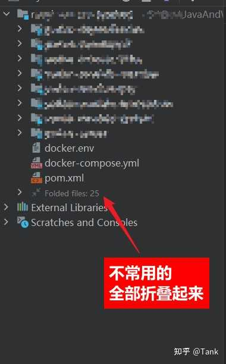
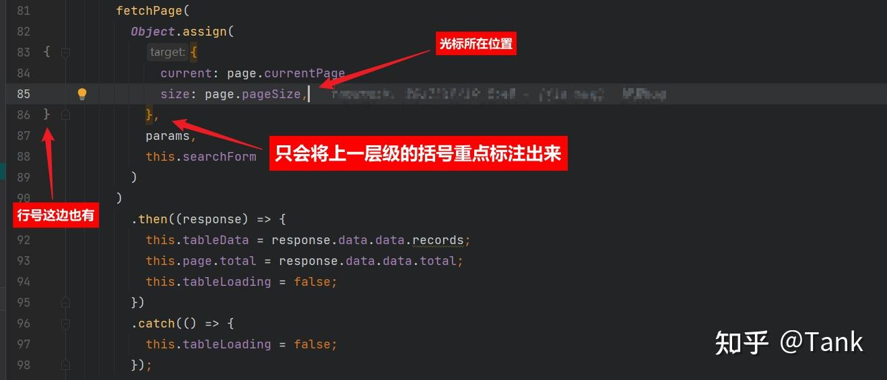
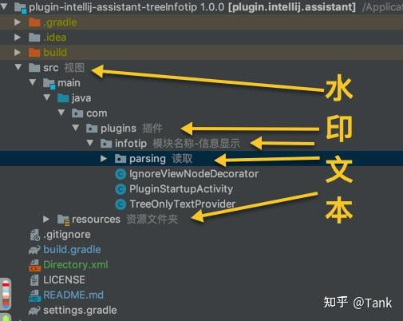

大家说了很多了，再补充3个常用的插件，非常好用。

**1\. Foldable ProjectView —— 眼不见心不烦**  
针对一些存在大量配置文件、缓存文件的项目来说，这个插件可以让目录结构变得清晰、简洁，将那些万年不动的文件全部折叠起来，眼不见心不烦。

  

[Foldable ProjectView - IntelliJ IDEs Plugin | Marketplace](https://link.zhihu.com/?target=https%3A//plugins.jetbrains.com/plugin/17288-foldable-projectview)

  
**2\. HighlightBracketPair —— 专注当下**  
这个插件类似于彩虹括号，但是感觉更好用一些，只专注当前光标所在的括号范围，别花里胡哨的，专注当下。

  

[HighlightBracketPair - IntelliJ IDEs Plugin | Marketplace](https://link.zhihu.com/?target=https%3A//plugins.jetbrains.com/plugin/17320-highlightbracketpair)

**  
3\. TreeInfotip —— 让屎山代码有点可读性**  
目录水印插件，针对一些命名不规范、结构杂乱的项目，可以对每个文件或者文件夹添加一个水印，让你更直观查看项目结构。当然你也可以用自带的书签来做这个事，但是谁会拒绝能够更直观的查看呢。

作者制作插件的初衷：

> **为什么要这个插件?  
> **  
> 1、用来对付一些火葬场项目用的。第一目录命名的问题，见名知其意，难度不小。英文啊！都是泥腿子。翻译器翻译的，人都闷逼了。只有求理解万岁了。  
>   
> 2、方便小白同学，我看到过些同学，入手项目看到目录就一个头大。好记忆不如烂笔头，充分发挥了知识分子的优良传统。手动写本本。

[TreeInfotip - IntelliJ IDEs Plugin | Marketplace (jetbrains.com)](https://link.zhihu.com/?target=https%3A//plugins.jetbrains.com/plugin/12994-treeinfotip)