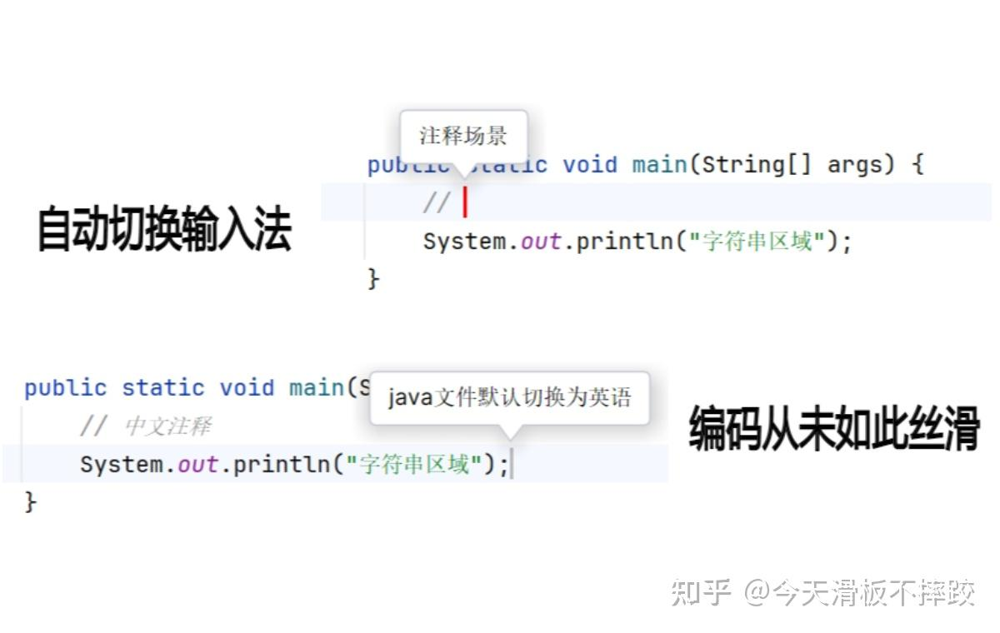

没想到不经意间推荐的一个我喜欢的插件受到这么多赞同，我也持续使用了一年多的时间，依然感叹真是神级插件。看到插件有了大升级，我再重新认真编辑下吧，下面大部分内容来自官方文档：

[Smart Input Pro​](https://link.zhihu.com/?target=https%3A//xiaolvpuzi.cn/docs/smart-input-pro-doc.html%3Ffrom%3Dzhihuquestion-391670848%23/)

## Smart Input Pro插件解决了什么问题

对于母语为中文的开发者，写代码过程中经常需要在中/英输入法之间进行切换，而且由于不清楚当前处于哪种输入状态，有时输入到一半发现输入法错了，删除后重新输入，严重影响了编码效率。

其实，在很多特定场景需要使用哪种输入法是可以明确的，比如写注释用中文、写代码用英文、IdeaVim NORMAL模式下必须用英文、Git提交写注释时用中文等等，既然这样那就可以让IDE帮助我们自动切换输入法，而且还可以通过光标的颜色来提醒用户当前是什么输入法以及大小写状态。**Smart Input Pro**就是要帮助程序员提升编码效率，其核心功能是在确定的场景帮助您自动切换到你想要的输入法。

## 关于付费

很早我就开始使用了，之前还是Smart Input 社区版，后面出来了Pro版本，增加了很多功能，同时作者也开启了增值收费模式，部分功能是免费的。不过作者送了老用户一个福利，之前使用过社区版的PC都可以永久免费使用pro版高级功能，为了支持作者也同时为了以后新电脑也能用永久使用，我还是买了一个永久版66块，绑定我的微信，即使以后换电脑也能换绑了。

花两杯咖啡钱解决我的痛点还是挺值的，不想花钱的也可以使用基础功能，包括光标颜色表示当前输入法、写代码的时候自动切换成英文，感觉基础功能也能解决大部分痛点了。

  

  

  

\-----------------------------------下面就直接照搬官方文档了---------------------------------

## 插件特性

**Smart Input Pro**通过插件的方式集成到IDE中，可以根据输入位置的上下文智能分析当前处于什么场景应该使用哪种输入法并自动切换，而且还可以通过光标的颜色来提醒用户当前是什么输入法以及大小写状态。以下列举IntelliJ平台IDE的几个核心场景。

-   **默认场景：** 大部分主流编程语言在默认区域（除注释区域和字符串区域之外的区域）只能输入ASCII，因此只需要英文输入法，插件识别到您在默认场景时自动帮您切换为英文输入法 [详情](https://link.zhihu.com/?target=https%3A//xiaolvpuzi.cn/docs/smart-input-pro-doc.html%23/scene/default)。
-   **注释场景：** 中文母语用户在注释时大概率使用中文输入法，即使需要输入简单的英文也能通过中文输入法输入，插件识别到您在注释场景时自动帮您切换为中文输入法 [详情](https://link.zhihu.com/?target=https%3A//xiaolvpuzi.cn/docs/smart-input-pro-doc.html%23/scene/comment)。
-   **Git提交场景：** 中文母语用户在Git提交输入备注信息时大概率使用中文输入法，即使需要输入简单的英文也能通过中文输入法输入，插件识别到您在Git提交场景时自动帮您切换为中文输入法 [详情](https://link.zhihu.com/?target=https%3A//xiaolvpuzi.cn/docs/smart-input-pro-doc.html%23/scene/commit)。
-   **工具窗口场景：** 很多工具窗口内都需要特定的输入法，比如Project、Terminal等都需要英文输入法，插件识别到您在特定工具窗口时切换为特定的输入法 [详情](https://link.zhihu.com/?target=https%3A//xiaolvpuzi.cn/docs/smart-input-pro-doc.html%23/scene/toolwindow)。
-   **IdeaVim场景：** Vim在NORMAL模式时需要使用英文输入法，否则输入不生效，插件在识别到您进入NORMAL模式时切换为英文输入法，进入INSERT模式时根据光标具体所处的场景切换输入法 [详情](https://link.zhihu.com/?target=https%3A//xiaolvpuzi.cn/docs/smart-input-pro-doc.html%23/scene/idea-vim)。
-   **字符串场景：** 字符串字面量可能根据定义名称不同而需要使用不同输入法，插件可以记录您的习惯，为不同名称的字符串字面量切换到您常用的输入法 [详情](https://link.zhihu.com/?target=https%3A//xiaolvpuzi.cn/docs/smart-input-pro-doc.html%23/scene/string)。
-   **自定义事件场景：** IDE中发生某件事件时切换成自定义输入法，比如：Translation插件的翻译窗口打开时自动切换为中文输入法，这样您就可以直接输入中文翻译成英文 [详情](https://link.zhihu.com/?target=https%3A//xiaolvpuzi.cn/docs/smart-input-pro-doc.html%23/scene/event)。
-   **自定义规则场景：** 在输入字符串等不确定输入法的场景，可以通过自定义正则匹配规则，符合特定规则时切换为特定输入法，比如：光标处于中文文字之间时切换为中文输入法 [详情](https://link.zhihu.com/?target=https%3A//xiaolvpuzi.cn/docs/smart-input-pro-doc.html%23/scene/regular)。
-   **离开IDE场景：** Windows系统每个APP的输入法状态是独立的，切换到某个APP恢复内部的输入法状态，MAC系统没有这个功能，因此插件可以实现离开IDE时切换输入法为进入IDE之前的状态 [详情](https://link.zhihu.com/?target=https%3A//xiaolvpuzi.cn/docs/smart-input-pro-doc.html%23/scene/leave)。

## 支持的IDE

目前**Smart Input Pro**支持IntelliJ平台的所有IDE，如IDEA、PyCharm、WebStorm、GoLand、PhpStorm、DataGrip等等，Android Studio 和 DevEco Studio也是基于IntelliJ平台，所以也是支持的。其他平台的IDE插件正在开发中。每种IDE都可能支持多种编程语言，我们无法完全覆盖测试所有场景，所以当您遇到不好的体验，可以反馈给我们，我们会一一优化。

## 支持的编程语言

理论上只要IDE支持的编程语言都支持，但是不同编程语言体验可能不太一样，因为不同编程语言特点不一样。比如，对于`Java`、`Kotlin`、`C`、`C++`、`Python`、`Php`、`Golang`、`JavaScript`、`TypeScript`、`Scala`、`Groovy`等，它们只有在注释区域和字符串字面量中才会使用中文，其他区域都可以肯定要使用英文；对于HTML、Markdown等标记语言，他们没有非常明确的一定使用某种输入法的区域，因此暂时不支持自动切换，但是支持使用光标颜色表示输入法状态。

## 关于付费

**Smart Input Pro**采用增值付费模式，其中基础功能永久免费，高级功能需要付费使用，支持按月/年/永久付费订阅，仅需约两杯星巴克咖啡的价格就可以永久使用，越早越优惠，关于定价详情请查看 [功能&定价](https://link.zhihu.com/?target=https%3A//xiaolvpuzi.cn/docs/smart-input-pro-doc.html%23/start/plans-pricing)。

**Smart Input Pro**目前支持微信登录授权，可随时解换绑定设备，订阅时可选择同时登录的设备数量。即将支持通过IntelliJ官方插件市场订阅和授权的方式，IntelliJ官方插件市场需要支付增值税，因此价格稍高于微信授权方式，建议优先通过微信授权方式。如何微信订阅以及获取授权请查看 [授权说明](https://link.zhihu.com/?target=https%3A//xiaolvpuzi.cn/docs/smart-input-pro-doc.html%23/start/authorize)。

## 下载安装

如果您已经熟悉如何下载安装IntelliJ插件，您可以直接在IntelliJ IDE插件市场搜索安装[Smart Input Pro (Chinese)](https://link.zhihu.com/?target=https%3A//plugins.jetbrains.com/plugin/25280)。您也可以查看详细说明 [下载安装](https://link.zhihu.com/?target=https%3A//xiaolvpuzi.cn/docs/smart-input-pro-doc.html%23/start/download)。

## 技术支持

我们为**Smart Input Pro**写了详细的[介绍文档](https://link.zhihu.com/?target=https%3A//xiaolvpuzi.cn/docs/smart-input-pro-doc.html%3Ffrom%3Dzhihuquestion-391670848%23/)，阅读介绍文档可以解决大部分问题，[常见问题](https://link.zhihu.com/?target=https%3A//xiaolvpuzi.cn/docs/smart-input-pro-doc.html%23/other/problem)列举了用户经常遇到的问题。如果您需要技术支持，您可以通过关注微信公众号获取技术支持。我们会不断倾听用户的需求去优化产品，非常欢迎您向我们提产品需求。