介绍 10 多个最好的 IntelliJ IDEA 插件，以提高工作效率并在更短的时间内完成更多工作。如果将这些插件合并到您的工作流程中，您将能够更有效地应对开发挑战。

## **1、TabNine**

TabNine 是一个 IntelliJ IDEA 插件，可以为 Java 和 JavaScript 开发人员的代码提供 AI 建议。它分析来自数百万个开源项目的代码，并提供相关且准确的代码片段，以帮助开发人员更快、更准确地编写代码。

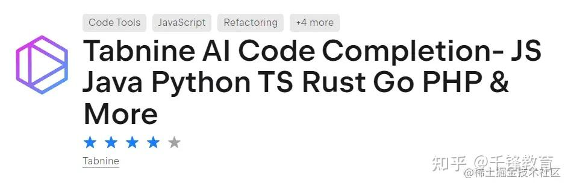

使用 TabNine 的众多优势包括：

1.  有效的代码提示。
2.  支持大量编程语言。
3.  为主流编辑器和IDE提供帮助。
4.  使用机器学习，记住你经常写的代码，并提供极其详细的提示。

地址：[plugins.jetbrains.com/plugin/1279…](https://link.zhihu.com/?target=https%3A//link.juejin.cn/%3Ftarget%3Dhttps%253A%252F%252Fplugins.jetbrains.com%252Fplugin%252F12798-tabnine-ai-code-completion-js-java-python-ts-rust-go-php--more)  

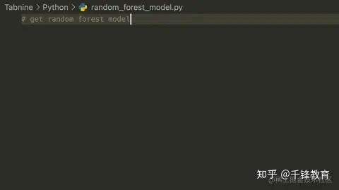

## 2、RestfulToolkit

RestfulToolkit 提供了与 RESTful API 交互的有用工具。开发人员可以使用此插件直接从 IDE 轻松测试、调试和管理 RESTful API 请求，从而提高他们的整体效率和生产力。

该插件与 HTTP Client、REST Assured 等流行工具集成，使其成为 RESTful API 开发的完整解决方案。

地址：[plugins.jetbrains.com/plugin/1029…](https://link.zhihu.com/?target=https%3A//link.juejin.cn/%3Ftarget%3Dhttps%253A%252F%252Fplugins.jetbrains.com%252Fplugin%252F10292-restfultoolkit)

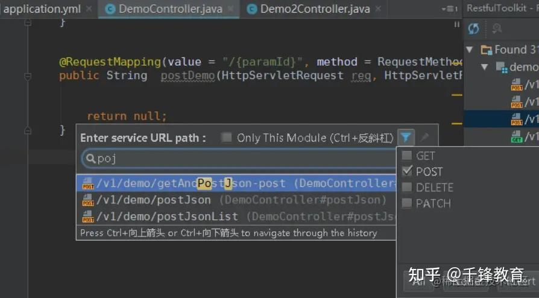

## 3、MyBatisCodeHelperPro

MyBatisCodeHelperPro 在使用 MyBatis 框架时提高了开发人员的工作效率。它包括代码生成和实时模板，使编写和管理 MyBatis 代码更加容易，节省时间和精力。

此外，该插件支持数据库架构同步和 SQL 文件生成，提高开发效率。

地址：[plugins.jetbrains.com/plugin/9837…](https://link.zhihu.com/?target=https%3A//link.juejin.cn/%3Ftarget%3Dhttps%253A%252F%252Fplugins.jetbrains.com%252Fplugin%252F9837-mybatisco) dehelperpro

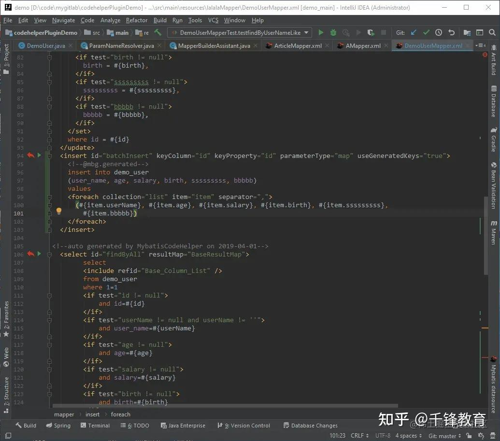

## 4、CodeGlance

CodeGlance 为开发人员提供了代码右侧添加了简明概览，使他们更容易浏览和理解代码。

地址：[plugins.jetbrains.com/plugin/7275…](https://link.zhihu.com/?target=https%3A//link.juejin.cn/%3Ftarget%3Dhttps%253A%252F%252Fplugins.jetbrains.com%252Fplugin%252F7275-codeglance%252F)  

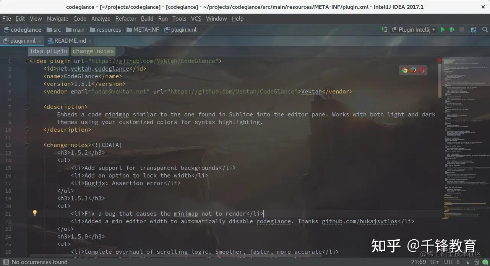

可以看到在上图右侧区域有一个代码概览区域，并且可以上下滑动。

## 5、GenerateAllSetter

GenerateAllSetter 有助于为类中的所有属性生成 setter 方法。这可以在编写代码时节省时间和精力，同时也降低了出错的可能性。  

  
地址：[plugins.jetbrains.com/plugin/9360…](https://link.zhihu.com/?target=https%3A//link.juejin.cn/%3Ftarget%3Dhttps%253A%252F%252Fplugins.jetbrains.com%252Fplugin%252F9360-generateallsetter)  

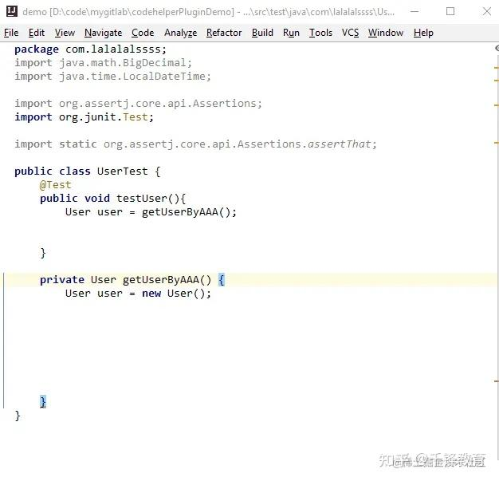

## 6、Lombok

Lombok：一个自动生成样板代码的 Java 库。

Project Lombok 是一个 java 库，可自动插入您的编辑器和构建工具，为您的 java 增添趣味。永远不要再写另一个 getter 或 equals 方法，通过一个注解，您的类就有一个功能齐全的构建器，自动化您的日志变量，等等。

地址：[projectlombok.org/](https://link.zhihu.com/?target=https%3A//link.juejin.cn/%3Ftarget%3Dhttps%253A%252F%252Fprojectlombok.org%252F)

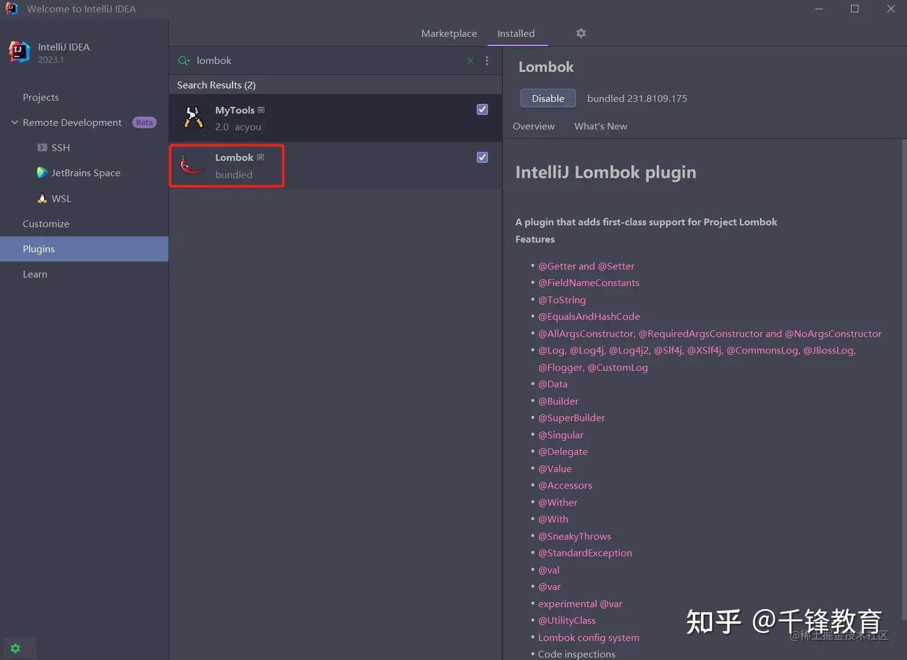

需要注意的就是在使用了在 IDEA 中使用 Lombok 插件记得启用 `Enable annotation processing`

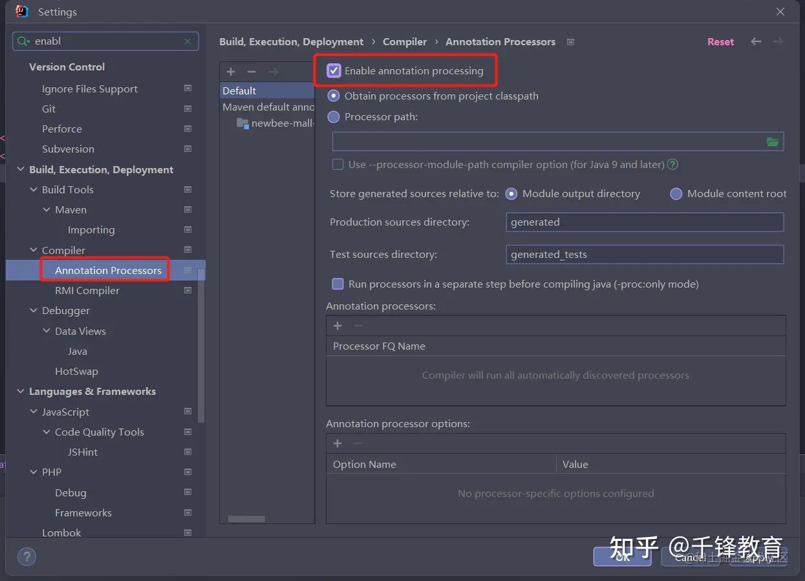

## 7、Rainbow Brackets

该插件为代码的方括号和圆括号着色，从而更容易区分不同级别的代码块。

地址：[plugins.jetbrains.com/plugin/1008…](https://link.zhihu.com/?target=https%3A//link.juejin.cn/%3Ftarget%3Dhttps%253A%252F%252Fplugins.jetbrains.com%252Fplugin%252F10080-rainbow-brackets)

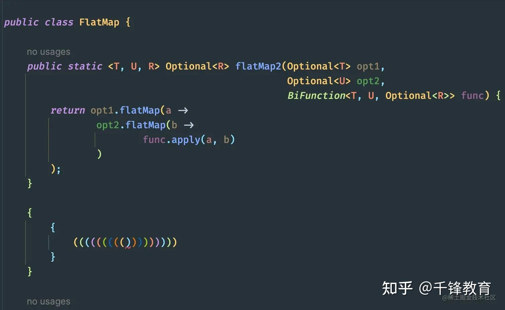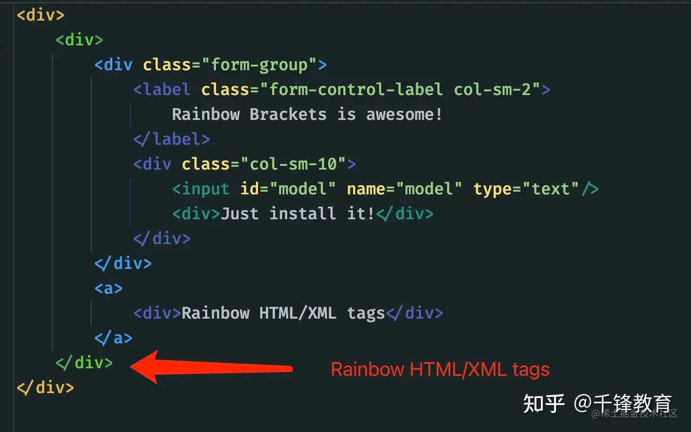

可以看到添加彩色方括号后，代码可读性有所提高。

## 8、GitToolBox

它包括许多额外的功能和快捷方式，使开发人员更容易使用 Git。使用 GitToolBox 的众多优点包括：

1.  GitToolBox 在 IntelliJ IDEA 上下文菜单中添加了几个快速操作，允许您在不离开 IDE 的情况下执行常见的 Git 任务。
2.  Git 控制台：该插件向 IntelliJ IDEA 添加了一个 Git 控制台，允许您在 IDE 中使用 Git。
3.  GitToolBox包含了几个解决合并冲突的工具，可以更容易地解决冲突并保持你的代码库是最新的。
4.  Git stash management：该插件添加了几个用于管理Git stashes的工具，使保存和重新应用代码更改变得更加容易。

地址：[plugins.jetbrains.com/plugin/7499…](https://link.zhihu.com/?target=https%3A//link.juejin.cn/%3Ftarget%3Dhttps%253A%252F%252Fplugins.jetbrains.com%252Fplugin%252F7499-gittoolbox)

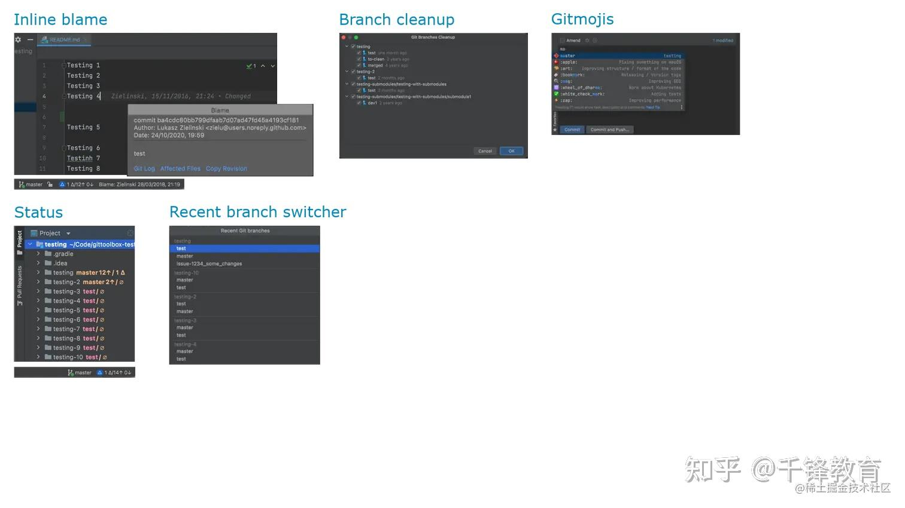

## 9、Maven Helper

Maven Helper 提供了一种更方便的方式来处理 Maven 项目。

Maven Helper 是一个帮助开发人员完成 Maven 构建过程的工具。该插件包括用于管理依赖项、插件和配置文件的功能，例如查看、分析和解决冲突以及运行和调试特定 Maven 目标的能力。  
这可以通过减少花在手动配置和故障排除任务上的时间，使开发人员有时间进行编码和创新，从而提高生产力。

地址：[plugins.jetbrains.com/plugin/7179…](https://link.zhihu.com/?target=https%3A//link.juejin.cn/%3Ftarget%3Dhttps%253A%252F%252Fplugins.jetbrains.com%252Fplugin%252F7179-maven-helper)

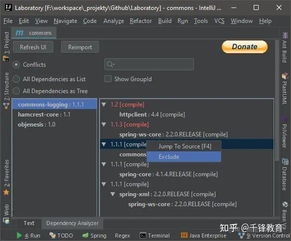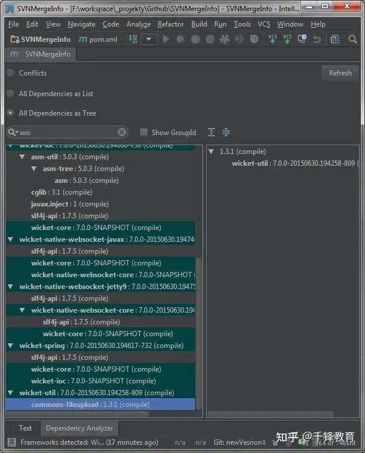

## 10、Sonarlint

Sonarlint 是一个代码质量检测工具，集成了 SonarQube 以动态检测和修复代码质量问题。  
Sonarlint 提供实时反馈和建议，帮助开发人员提高代码质量。它集成了 SonarQube 代码分析平台，允许开发人员直接在他们的 IDE 中查看代码质量问题。

这通过在潜在问题到达构建和测试阶段之前检测它们来节省时间并提高效率。 Sonarlint 还可以帮助开发人员遵守最佳实践和编码标准，从而生成更易于维护和更健壮的代码。

地址：[plugins.jetbrains.com/plugin/7973…](https://link.zhihu.com/?target=https%3A//link.juejin.cn/%3Ftarget%3Dhttps%253A%252F%252Fplugins.jetbrains.com%252Fplugin%252F7973-sonarlint)  

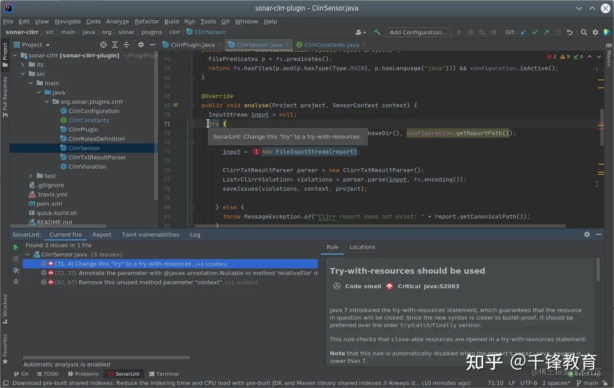

## 11、Vuesion Theme

颜值是生产力的第一要素，IDE 整好看了，每天对着它也是神清气爽，有木有？就 Intellij IDEA 提供的暗黑和亮白主色，虽然说已经非常清爽了，但时间久了总觉得需要再来点新鲜感？  
Vuesion Theme 这个主题装上后，你会感觉整个 Intellij IDEA 更高级了。  

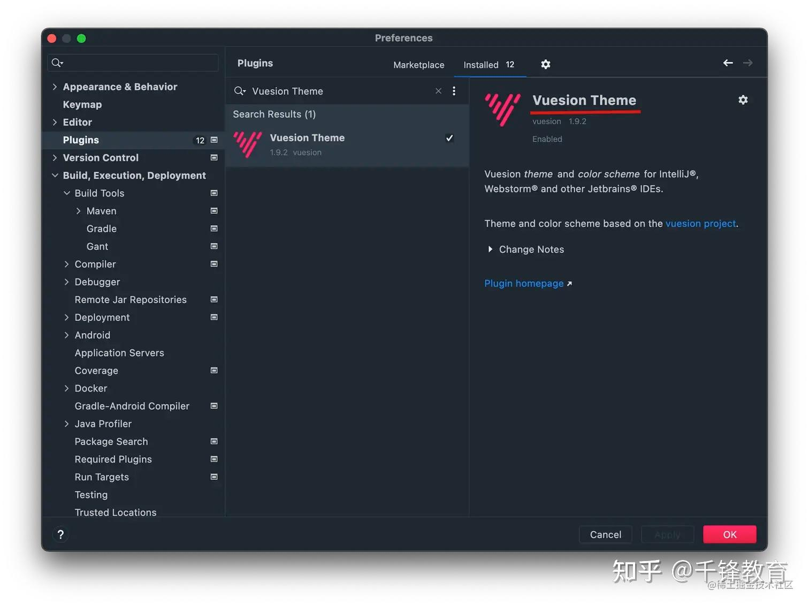

  
安装完插件就立马生效了，瞧这该死的漂亮，整个代码着色，以及文件的图标，都更炫酷了：  

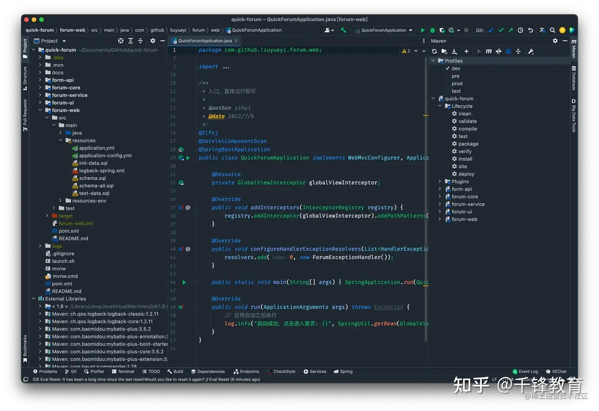

  
当然了，主题这事，萝卜白菜各有所爱，就像玩 dota，我就喜欢露娜。

## 12.Translation

对于英文能力差的同学来说，这个翻译插件简直神了，它支持 Google 翻译、有道翻译、百度翻译、Alibaba 翻译。  

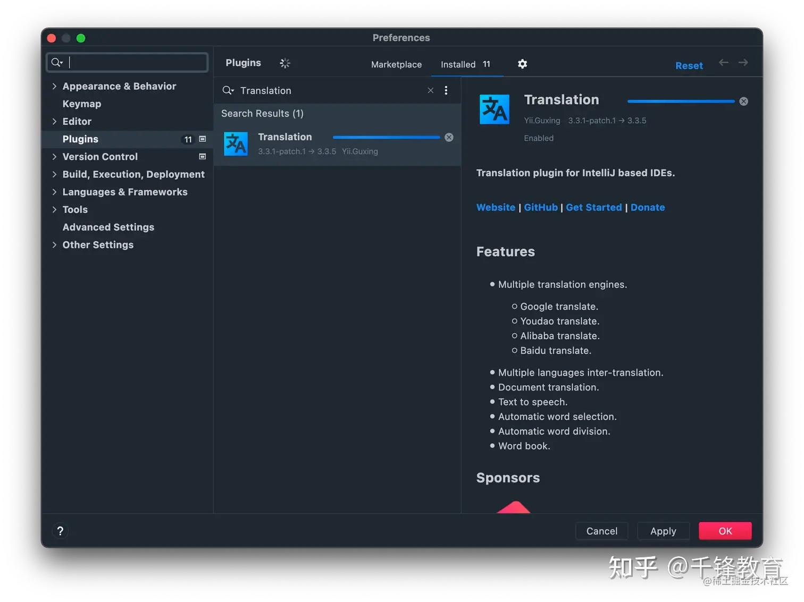

  
刚好写这篇内容的时候，发现最新的版本是 3.3.5，趁机升级一波。有了这款翻译插件，看源码绝对是爽歪歪。以前遇到不认识的单词，真的是好烦，还要切到翻译软件那里查，现在可好，单词翻译、文档翻译、注释翻译，都有了。  

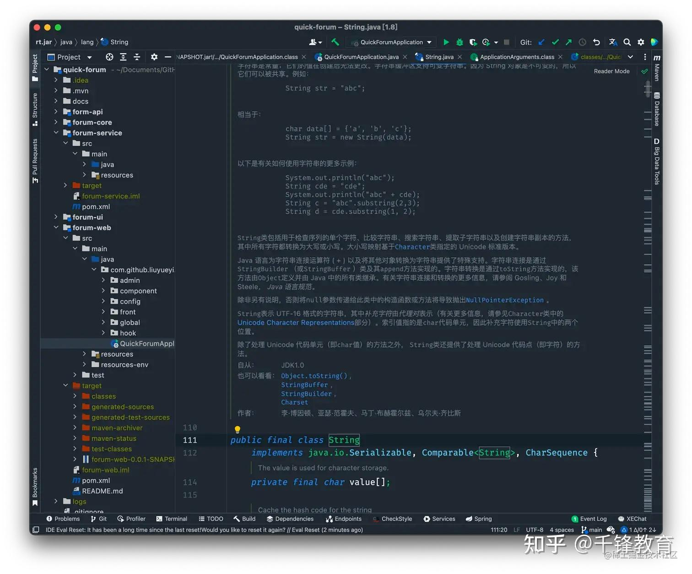

## 13、Arthas idea

Arthas 应该大家都很熟悉了，阿里开源的一款强大的 java 在线诊断工具。

但如果每次都要你输入一长串命令的话，相信你也会很崩溃，尤其是很多时候我还记忆模糊，很多记不住。这款插件刚好解决了我这个烦恼，极大地提高了生产力  

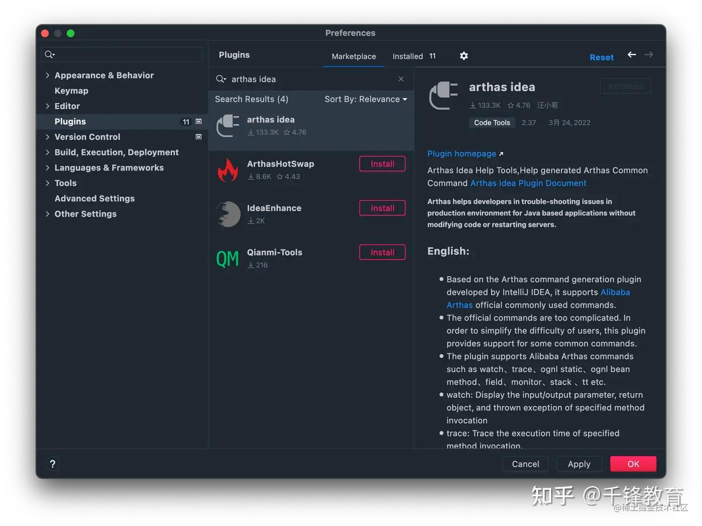

  
使用起来也非常方便，直接进入你要诊断的方法和类，右键选择对应的命令，就会自动帮你生成了。  

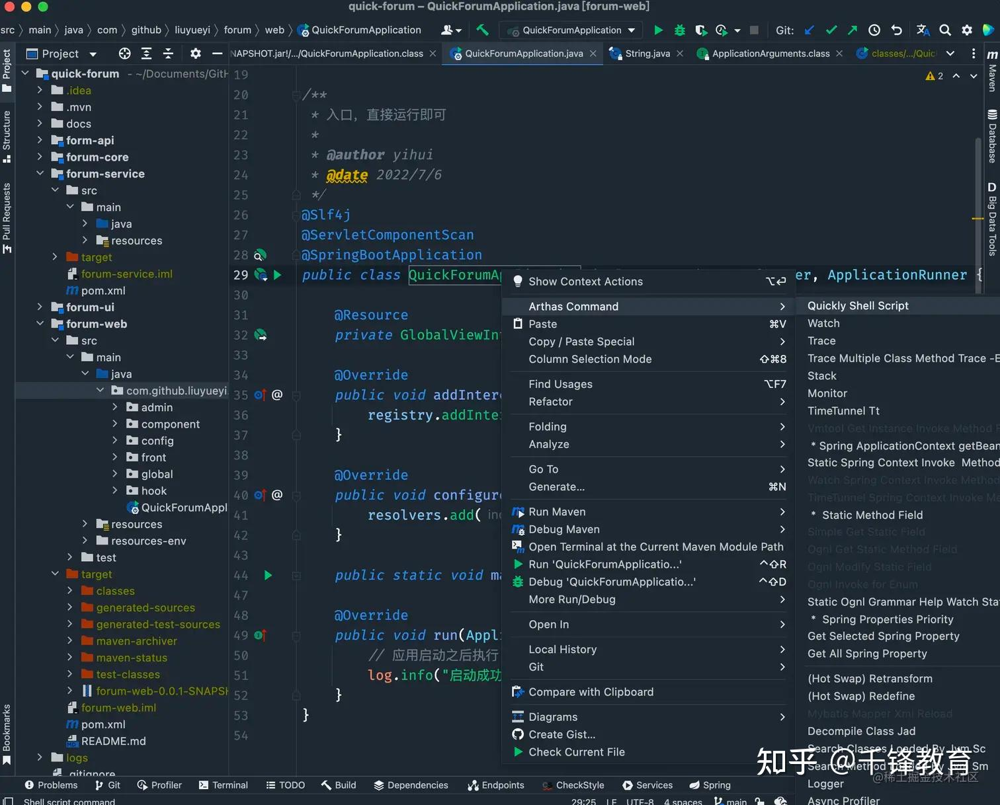

## 14、VisualGC

这里给大家推荐一个 JVM 堆栈可视化工具，可以和 Intellij IDEA 深度集成——VisualGC。  

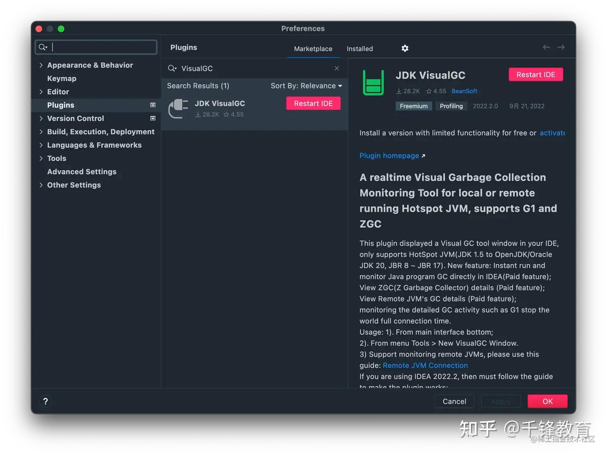

  
当我们需要监控一个进程的时候，直接打开 VisualGC面板，就可以查看到堆栈和垃圾收集情况，可以说是一目了然。  

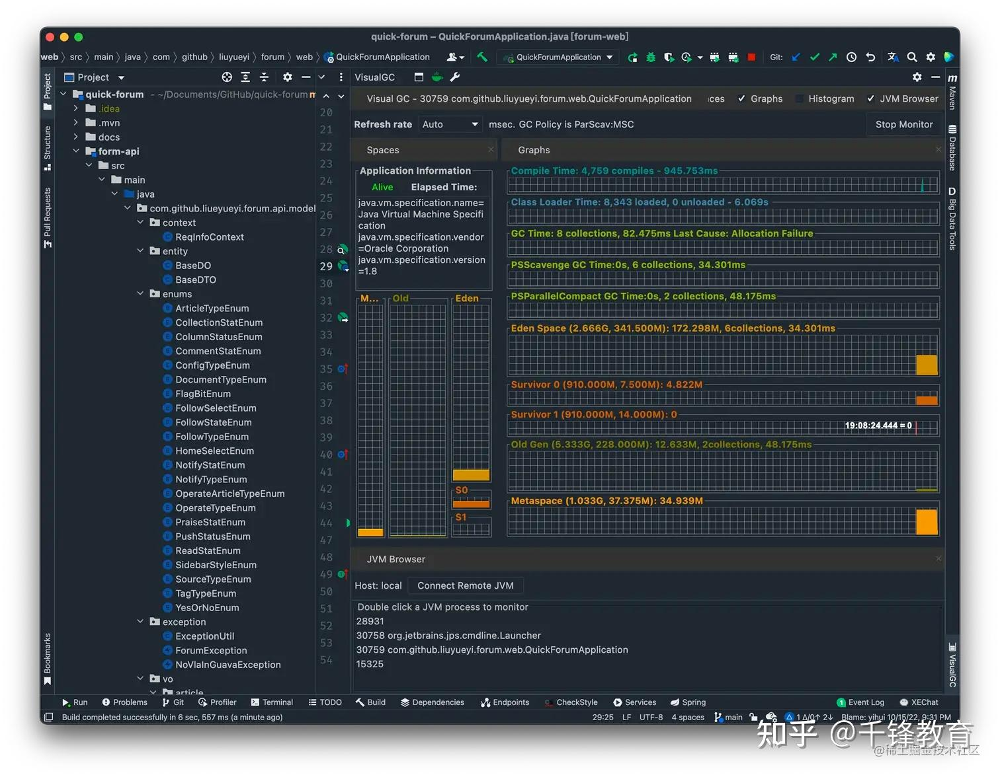

## 15、CheckStyle-IDEA

如果你比较追求代码规范的话，可以安装这个插件，它会提醒你注意无用导入、注释、语法错误❎、代码冗余等等。  

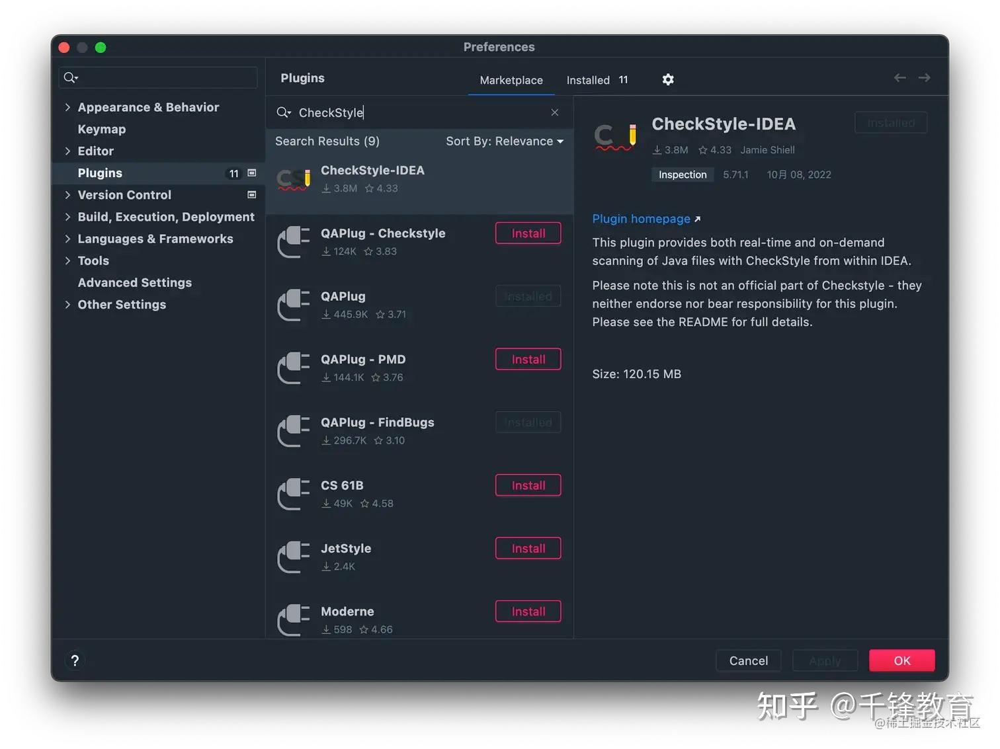

  
在 CheckStyle 面板中，你可以选择 Google 代码规范或者 sun 的代码规范，跑一遍检查，就可以看到所有的修改建议了。  

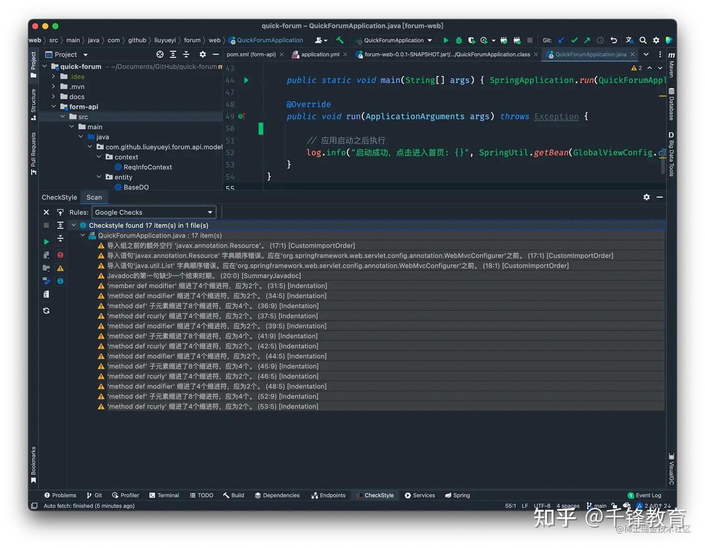

  
  
如果大家有更好更效率的插件，也可以评论里留言。