来跟大家拆解一波美团大厂Java 后端的面经，主要是考察了Java、MySQL、Redis、网络、操作系统这五大块知识，可以说是必须掌握的五件套知识了。

我只能说，不愧是大厂面试，强度是很大，光是写面经都快 2 万字了

  


  

  

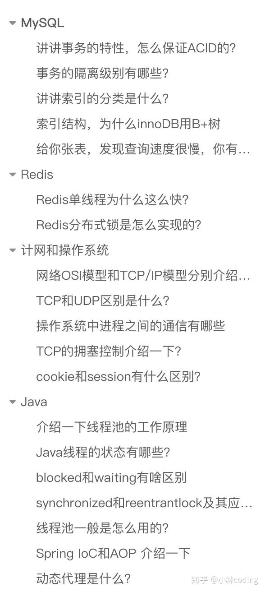

考察的知识点，我给大家罗列了一下：

-   Java：**线程池、线程状态、线程同步和锁、Srping AOP、IoC、动态代理**
-   MySQL：**索引、事务、性能优化**
-   Redis: **线程模式、分布式锁**
-   计网和操作系统：**网络模型、TCP和UDP的区别、进程通信、拥塞控制**

## **MySQL**

### **讲讲事务的特性，怎么保证ACID的？**

-   **原子性（Atomicity）**：一个事务中的所有操作，要么全部完成，要么全部不完成，不会结束在中间某个环节，而且事务在执行过程中发生错误，会被回滚到事务开始前的状态，就像这个事务从来没有执行过一样，就好比买一件商品，购买成功时，则给商家付了钱，商品到手；购买失败时，则商品在商家手中，消费者的钱也没花出去。
-   **一致性（Consistency）**：是指事务操作前和操作后，数据满足完整性约束，数据库保持一致性状态。比如，用户 A 和用户 B 在银行分别有 800 元和 600 元，总共 1400 元，用户 A 给用户 B 转账 200 元，分为两个步骤，从 A 的账户扣除 200 元和对 B 的账户增加 200 元。一致性就是要求上述步骤操作后，最后的结果是用户 A 还有 600 元，用户 B 有 800 元，总共 1400 元，而不会出现用户 A 扣除了 200 元，但用户 B 未增加的情况（该情况，用户 A 和 B 均为 600 元，总共 1200 元）。
-   **隔离性（Isolation）**：数据库允许多个并发事务同时对其数据进行读写和修改的能力，隔离性可以防止多个事务并发执行时由于交叉执行而导致数据的不一致，因为多个事务同时使用相同的数据时，不会相互干扰，每个事务都有一个完整的数据空间，对其他并发事务是隔离的。也就是说，消费者购买商品这个事务，是不影响其他消费者购买的。
-   **持久性（Durability）**：事务处理结束后，对数据的修改就是永久的，即便系统故障也不会丢失。

MySQL InnoDB 引擎通过什么技术来保证事务的这四个特性的呢？

-   持久性是通过 redo log （重做日志）来保证的；
-   原子性是通过 undo log（回滚日志） 来保证的；
-   隔离性是通过 MVCC（多版本并发控制） 或锁机制来保证的；
-   一致性则是通过持久性+原子性+隔离性来保证；

### **事务的隔离级别有哪些？**

-   **读未提交（read uncommitted）**，指一个事务还没提交时，它做的变更就能被其他事务看到；
-   **读提交（read committed）**，指一个事务提交之后，它做的变更才能被其他事务看到；
-   **可重复读（repeatable read）**，指一个事务执行过程中看到的数据，一直跟这个事务启动时看到的数据是一致的，**MySQL InnoDB 引擎的默认隔离级别**；
-   **串行化（serializable）**；会对记录加上读写锁，在多个事务对这条记录进行读写操作时，如果发生了读写冲突的时候，后访问的事务必须等前一个事务执行完成，才能继续执行；

按隔离水平高低排序如下：


针对不同的隔离级别，并发事务时可能发生的现象也会不同。

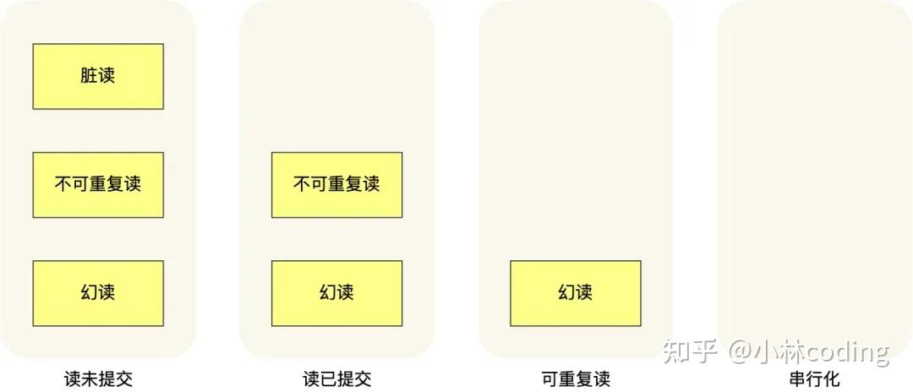

也就是说：

-   在「读未提交」隔离级别下，可能发生脏读、不可重复读和幻读现象；
-   在「读提交」隔离级别下，可能发生不可重复读和幻读现象，但是不可能发生脏读现象；
-   在「可重复读」隔离级别下，可能发生幻读现象，但是不可能脏读和不可重复读现象；
-   在「串行化」隔离级别下，脏读、不可重复读和幻读现象都不可能会发生。

### **讲讲索引的分类是什么？**

MySQL可以按照四个角度来分类索引。

-   按「数据结构」分类：**B+tree索引、Hash索引、Full-text索引**。
-   按「物理存储」分类：**聚簇索引（主键索引）、二级索引（辅助索引）**。
-   按「字段特性」分类：**主键索引、唯一索引、普通索引、前缀索引**。
-   按「字段个数」分类：**单列索引、联合索引**。

接下来，按照这些角度来说说各类索引的特点。

> 按数据结构分类

从数据结构的角度来看，MySQL 常见索引有 B+Tree 索引、HASH 索引、Full-Text 索引。每一种存储引擎支持的索引类型不一定相同，我在表中总结了 MySQL 常见的存储引擎 InnoDB、MyISAM 和 Memory 分别支持的索引类型。

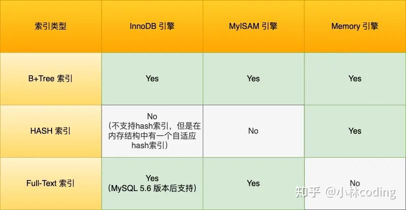

InnoDB 是在 MySQL 5.5 之后成为默认的 MySQL 存储引擎，B+Tree 索引类型也是 MySQL 存储引擎采用最多的索引类型。在创建表时，InnoDB 存储引擎会根据不同的场景选择不同的列作为索引：

-   如果有主键，默认会使用主键作为聚簇索引的索引键（key）；
-   如果没有主键，就选择第一个不包含 NULL 值的唯一列作为聚簇索引的索引键（key）；
-   在上面两个都没有的情况下，InnoDB 将自动生成一个隐式自增 id 列作为聚簇索引的索引键（key）；

其它索引都属于辅助索引（Secondary Index），也被称为二级索引或非聚簇索引。**创建的主键索引和二级索引默认使用的是 B+Tree 索引**。

> 按物理存储分类

从物理存储的角度来看，索引分为聚簇索引（主键索引）、二级索引（辅助索引）。这两个区别在前面也提到了：

-   主键索引的 B+Tree 的叶子节点存放的是实际数据，所有完整的用户记录都存放在主键索引的 B+Tree 的叶子节点里；
-   二级索引的 B+Tree 的叶子节点存放的是主键值，而不是实际数据。

所以，在查询时使用了二级索引，如果查询的数据能在二级索引里查询的到，那么就不需要回表，这个过程就是覆盖索引。如果查询的数据不在二级索引里，就会先检索二级索引，找到对应的叶子节点，获取到主键值后，然后再检索主键索引，就能查询到数据了，这个过程就是回表。

> 按字段特性分类

从字段特性的角度来看，索引分为主键索引、唯一索引、普通索引、前缀索引。

-   主键索引

主键索引就是建立在主键字段上的索引，通常在创建表的时候一起创建，一张表最多只有一个主键索引，索引列的值不允许有空值。在创建表时，创建主键索引的方式如下：

```text
CREATE TABLE table_name  (
  ....
  PRIMARY KEY (index_column_1) USING BTREE
);
```

-   唯一索引

唯一索引建立在 UNIQUE 字段上的索引，一张表可以有多个唯一索引，索引列的值必须唯一，但是允许有空值。在创建表时，创建唯一索引的方式如下：

```text
CREATE TABLE table_name  (
  ....
  UNIQUE KEY(index_column_1,index_column_2,...) 
);
```

建表后，如果要创建唯一索引，可以使用这面这条命令：

```text
CREATE UNIQUE INDEX index_name
ON table_name(index_column_1,index_column_2,...);
```

-   普通索引

普通索引就是建立在普通字段上的索引，既不要求字段为主键，也不要求字段为 UNIQUE。在创建表时，创建普通索引的方式如下：

```text
CREATE TABLE table_name  (
  ....
  INDEX(index_column_1,index_column_2,...) 
);
```

建表后，如果要创建普通索引，可以使用这面这条命令：

```text
CREATE INDEX index_name
ON table_name(index_column_1,index_column_2,...);
```

-   前缀索引

前缀索引是指对字符类型字段的前几个字符建立的索引，而不是在整个字段上建立的索引，前缀索引可以建立在字段类型为 char、 varchar、binary、varbinary 的列上。使用前缀索引的目的是为了减少索引占用的存储空间，提升查询效率。在创建表时，创建前缀索引的方式如下：

```text
CREATE TABLE table_name(
    column_list,
    INDEX(column_name(length))
);
```

建表后，如果要创建前缀索引，可以使用这面这条命令：

```text
CREATE INDEX index_name
ON table_name(column_name(length));
```

> 按字段个数分类

从字段个数的角度来看，索引分为单列索引、联合索引（复合索引）。

-   建立在单列上的索引称为单列索引，比如主键索引；
-   建立在多列上的索引称为联合索引；

通过将多个字段组合成一个索引，该索引就被称为联合索引。比如，将商品表中的 product\_no 和 name 字段组合成联合索引(product\_no, name)，创建联合索引的方式如下：

```text
CREATE INDEX index_product_no_name ON product(product_no, name);
```

联合索引(product\_no, name) 的 B+Tree 示意图如下（图中叶子节点之间我画了单向链表，但是实际上是双向链表，原图我找不到了，修改不了，偷个懒我不重画了，大家脑补成双向链表就行）。

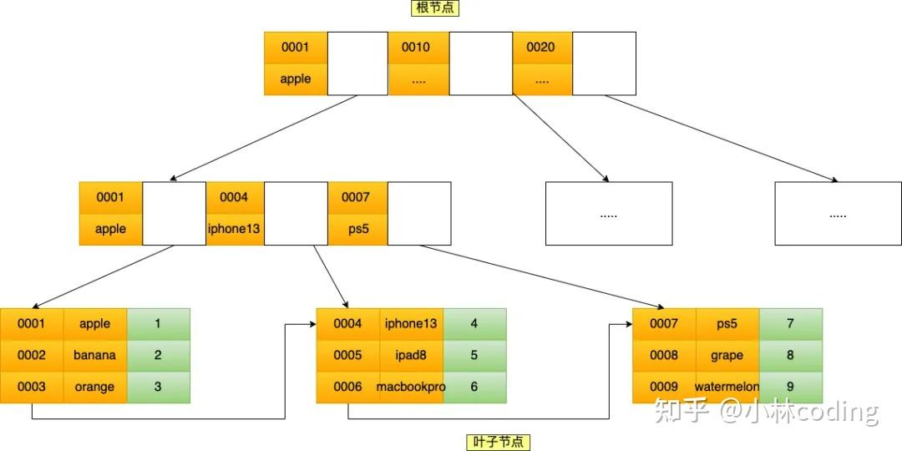

可以看到，联合索引的非叶子节点用两个字段的值作为 B+Tree 的 key 值。当在联合索引查询数据时，先按 product\_no 字段比较，在 product\_no 相同的情况下再按 name 字段比较。也就是说，联合索引查询的 B+Tree 是先按 product\_no 进行排序，然后再 product\_no 相同的情况再按 name 字段排序。因此，使用联合索引时，存在**最左匹配原则**，也就是按照最左优先的方式进行索引的匹配。在使用联合索引进行查询的时候，如果不遵循「最左匹配原则」，联合索引会失效，这样就无法利用到索引快速查询的特性了。比如，如果创建了一个 (a, b, c) 联合索引，如果查询条件是以下这几种，就可以匹配上联合索引：

-   where a=1；
-   where a=1 and b=2 and c=3；
-   where a=1 and b=2；

需要注意的是，因为有查询优化器，所以 a 字段在 where 子句的顺序并不重要。但是，如果查询条件是以下这几种，因为不符合最左匹配原则，所以就无法匹配上联合索引，联合索引就会失效:

-   where b=2；
-   where c=3；
-   where b=2 and c=3；

上面这些查询条件之所以会失效，是因为(a, b, c) 联合索引，是先按 a 排序，在 a 相同的情况再按 b 排序，在 b 相同的情况再按 c 排序。所以，**b 和 c 是全局无序，局部相对有序的**，这样在没有遵循最左匹配原则的情况下，是无法利用到索引的。联合索引有一些特殊情况，**并不是查询过程使用了联合索引查询，就代表联合索引中的所有字段都用到了联合索引进行索引查询**，也就是可能存在部分字段用到联合索引的 B+Tree，部分字段没有用到联合索引的 B+Tree 的情况。这种特殊情况就发生在范围查询。联合索引的最左匹配原则会一直向右匹配直到遇到「范围查询」就会停止匹配。**也就是范围查询的字段可以用到联合索引，但是在范围查询字段的后面的字段无法用到联合索引**。

### **索引结构，为什么innoDB用B+树**

  

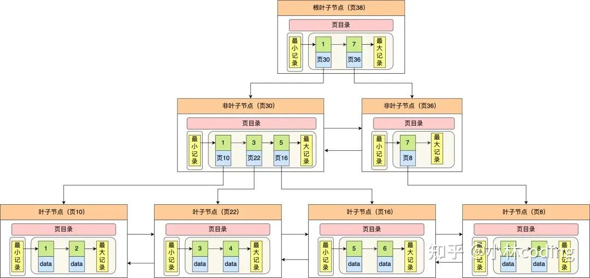

MySQL 是会将数据持久化在硬盘，而存储功能是由 MySQL 存储引擎实现的，所以讨论 MySQL 使用哪种数据结构作为索引，实际上是在讨论存储引使用哪种数据结构作为索引，InnoDB 是 MySQL 默认的存储引擎，它就是采用了 B+ 树作为索引的数据结构。

要设计一个 MySQL 的索引数据结构，不仅仅考虑数据结构增删改的时间复杂度，更重要的是要考虑磁盘 I/0 的操作次数。因为索引和记录都是存放在硬盘，硬盘是一个非常慢的存储设备，我们在查询数据的时候，最好能在尽可能少的磁盘 I/0 的操作次数内完成。

二分查找树虽然是一个天然的二分结构，能很好的利用二分查找快速定位数据，但是它存在一种极端的情况，每当插入的元素都是树内最大的元素，就会导致二分查找树退化成一个链表，此时查询复杂度就会从 O(logn)降低为 O(n)。

为了解决二分查找树退化成链表的问题，就出现了自平衡二叉树，保证了查询操作的时间复杂度就会一直维持在 O(logn) 。但是它本质上还是一个二叉树，每个节点只能有 2 个子节点，随着元素的增多，树的高度会越来越高。

而树的高度决定于磁盘 I/O 操作的次数，因为树是存储在磁盘中的，访问每个节点，都对应一次磁盘 I/O 操作，也就是说树的高度就等于每次查询数据时磁盘 IO 操作的次数，所以树的高度越高，就会影响查询性能。

B 树和 B+ 都是通过多叉树的方式，会将树的高度变矮，所以这两个数据结构非常适合检索存于磁盘中的数据。

-   **B+Tree vs B Tree：**B+Tree 只在叶子节点存储数据，而 B 树 的非叶子节点也要存储数据，所以 B+Tree 的单个节点的数据量更小，在相同的磁盘 I/O 次数下，就能查询更多的节点。另外，B+Tree 叶子节点采用的是双链表连接，适合 MySQL 中常见的基于范围的顺序查找，而 B 树无法做到这一点。
-   **B+Tree vs 二叉树：**对于有 N 个叶子节点的 B+Tree，其搜索复杂度为O(logdN)，其中 d 表示节点允许的最大子节点个数为 d 个。在实际的应用当中， d 值是大于100的，这样就保证了，即使数据达到千万级别时，B+Tree 的高度依然维持在 3~4 层左右，也就是说一次数据查询操作只需要做 3~4 次的磁盘 I/O 操作就能查询到目标数据。而二叉树的每个父节点的儿子节点个数只能是 2 个，意味着其搜索复杂度为 O(logN)，这已经比 B+Tree 高出不少，因此二叉树检索到目标数据所经历的磁盘 I/O 次数要更多。
-   **B+Tree vs Hash：**Hash 在做等值查询的时候效率贼快，搜索复杂度为 O(1)。但是 Hash 表不适合做范围查询，它更适合做等值的查询，这也是 B+Tree 索引要比 Hash 表索引有着更广泛的适用场景的原因

### **给你张表，发现查询速度很慢，你有那些解决方案**

-   **分析查询语句**：使用EXPLAIN命令分析SQL执行计划，找出慢查询的原因，比如是否使用了全表扫描，是否存在索引未被利用的情况等，并根据相应情况对索引进行适当修改。
-   **创建或优化索引**：根据查询条件创建合适的索引，特别是经常用于WHERE子句的字段、Orderby 排序的字段、Join 连表查询的字典、 group by的字段，并且如果查询中经常涉及多个字段，考虑创建联合索引，使用联合索引要符合最左匹配原则，不然会索引失效
-   **避免索引失效：**比如不要用左模糊匹配、函数计算、表达式计算等等。
-   **查询优化**：避免使用SELECT \*，只查询真正需要的列；使用覆盖索引，即索引包含所有查询的字段；联表查询最好要以小表驱动大表，并且被驱动表的字段要有索引，当然最好通过冗余字段的设计，避免联表查询。
-   **分页优化：**针对 limit n,y 深分页的查询优化，可以把Limit查询转换成某个位置的查询：select \* from tb\_sku where id>20000 limit 10，该方案适用于主键自增的表，
-   **优化数据库表**：如果单表的数据超过了千万级别，考虑是否需要将大表拆分为小表，减轻单个表的查询压力。也可以将字段多的表分解成多个表，有些字段使用频率高，有些低，数据量大时，会由于使用频率低的存在而变慢，可以考虑分开。
-   **使用缓存技术**：引入缓存层，如Redis，存储热点数据和频繁查询的结果，但是要考虑缓存一致性的问题，对于读请求会选择旁路缓存策略，对于写请求会选择先更新 db，再删除缓存的策略。

## **Redis**

### **Redis单线程为什么这么快？**

官方使用基准测试的结果是，**单线程的 Redis 吞吐量可以达到 10W/每秒**，如下图所示：

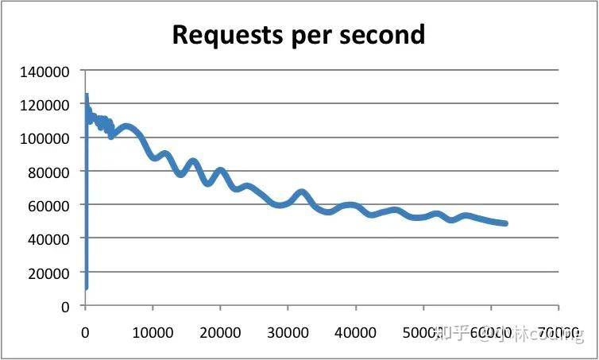

img 之所以 Redis 采用单线程（网络 I/O 和执行命令）那么快，有如下几个原因：

-   Redis 的大部分操作**都在内存中完成**，并且采用了高效的数据结构，因此 Redis 瓶颈可能是机器的内存或者网络带宽，而并非 CPU，既然 CPU 不是瓶颈，那么自然就采用单线程的解决方案了；
-   Redis 采用单线程模型可以**避免了多线程之间的竞争**，省去了多线程切换带来的时间和性能上的开销，而且也不会导致死锁问题。
-   Redis 采用了 **I/O 多路复用机制**处理大量的客户端 Socket 请求，IO 多路复用机制是指一个线程处理多个 IO 流，就是我们经常听到的 select/epoll 机制。简单来说，在 Redis 只运行单线程的情况下，该机制允许内核中，同时存在多个监听 Socket 和已连接 Socket。内核会一直监听这些 Socket 上的连接请求或数据请求。一旦有请求到达，就会交给 Redis 线程处理，这就实现了一个 Redis 线程处理多个 IO 流的效果。

### **Redis分布式锁是怎么实现的？**

**分布式锁是用于分布式环境下并发控制的一种机制，用于控制某个资源在同一时刻只能被一个应用所使用**。如下图所示：

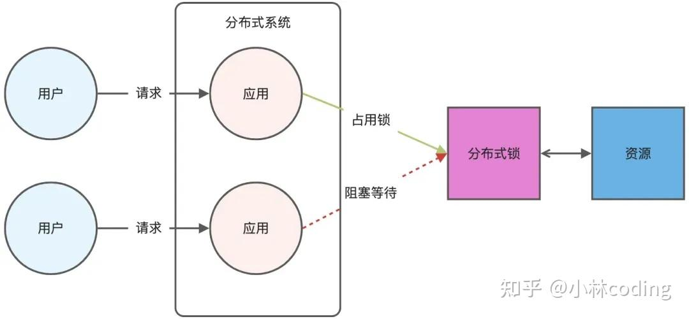

Redis 本身可以被多个客户端共享访问，正好就是一个共享存储系统，可以用来保存分布式锁，而且 Redis 的读写性能高，可以应对高并发的锁操作场景。Redis 的 SET 命令有个 NX 参数可以实现「key不存在才插入」，所以可以用它来实现分布式锁：

-   如果 key 不存在，则显示插入成功，可以用来表示加锁成功；
-   如果 key 存在，则会显示插入失败，可以用来表示加锁失败。

基于 Redis 节点实现分布式锁时，对于加锁操作，我们需要满足三个条件。

-   加锁包括了读取锁变量、检查锁变量值和设置锁变量值三个操作，但需要以原子操作的方式完成，所以，我们使用 SET 命令带上 NX 选项来实现加锁；
-   锁变量需要设置过期时间，以免客户端拿到锁后发生异常，导致锁一直无法释放，所以，我们在 SET 命令执行时加上 EX/PX 选项，设置其过期时间；
-   锁变量的值需要能区分来自不同客户端的加锁操作，以免在释放锁时，出现误释放操作，所以，我们使用 SET 命令设置锁变量值时，每个客户端设置的值是一个唯一值，用于标识客户端；

满足这三个条件的分布式命令如下：

```text
SET lock_key unique_value NX PX 10000
```

-   lock\_key 就是 key 键；
-   unique\_value 是客户端生成的唯一的标识，区分来自不同客户端的锁操作；
-   NX 代表只在 lock\_key 不存在时，才对 lock\_key 进行设置操作；
-   PX 10000 表示设置 lock\_key 的过期时间为 10s，这是为了避免客户端发生异常而无法释放锁。

而解锁的过程就是将 lock\_key 键删除（del lock\_key），但不能乱删，要保证执行操作的客户端就是加锁的客户端。所以，解锁的时候，我们要先判断锁的 unique\_value 是否为加锁客户端，是的话，才将 lock\_key 键删除。可以看到，解锁是有两个操作，这时就需要 Lua 脚本来保证解锁的原子性，因为 Redis 在执行 Lua 脚本时，可以以原子性的方式执行，保证了锁释放操作的原子性。

```text
// 释放锁时，先比较 unique_value 是否相等，避免锁的误释放
if redis.call("get",KEYS[1]) == ARGV[1] then
    return redis.call("del",KEYS[1])
else
    return 0
end
```

这样一来，就通过使用 SET 命令和 Lua 脚本在 Redis 单节点上完成了分布式锁的加锁和解锁。

## **计网和操作系统**

### **网络OSI模型和TCP/IP模型分别介绍一下**

> OSI七层模型

为了使得多种设备能通过网络相互通信，和为了解决各种不同设备在网络互联中的兼容性问题，国际标准化组织制定了开放式系统互联通信参考模型，也就是 OSI 网络模型，该模型主要有 7 层，分别是应用层、表示层、会话层、传输层、网络层、数据链路层以及物理层。

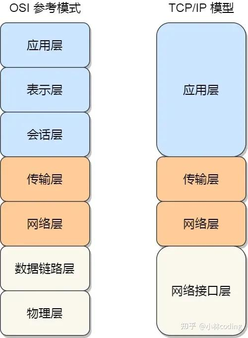

每一层负责的职能都不同，如下：

-   应用层，负责给应用程序提供统一的接口；
-   表示层，负责把数据转换成兼容另一个系统能识别的格式；
-   会话层，负责建立、管理和终止表示层实体之间的通信会话；
-   传输层，负责端到端的数据传输；
-   网络层，负责数据的路由、转发、分片；
-   数据链路层，负责数据的封帧和差错检测，以及 MAC 寻址；
-   物理层，负责在物理网络中传输数据帧；

由于 OSI 模型实在太复杂，提出的也只是概念理论上的分层，并没有提供具体的实现方案。事实上，我们比较常见，也比较实用的是四层模型，即 TCP/IP 网络模型，Linux 系统正是按照这套网络模型来实现网络协议栈的。

> TCP/IP模型

TCP/IP协议被组织成四个概念层，其中有三层对应于ISO参考模型中的相应层。ICP/IP协议族并不包含物理层和数据链路层，因此它不能独立完成整个计算机网络系统的功能，必须与许多其他的协议协同工作。TCP/IP 网络通常是由上到下分成 4 层，分别是**应用层，传输层，网络层和网络接口层**。

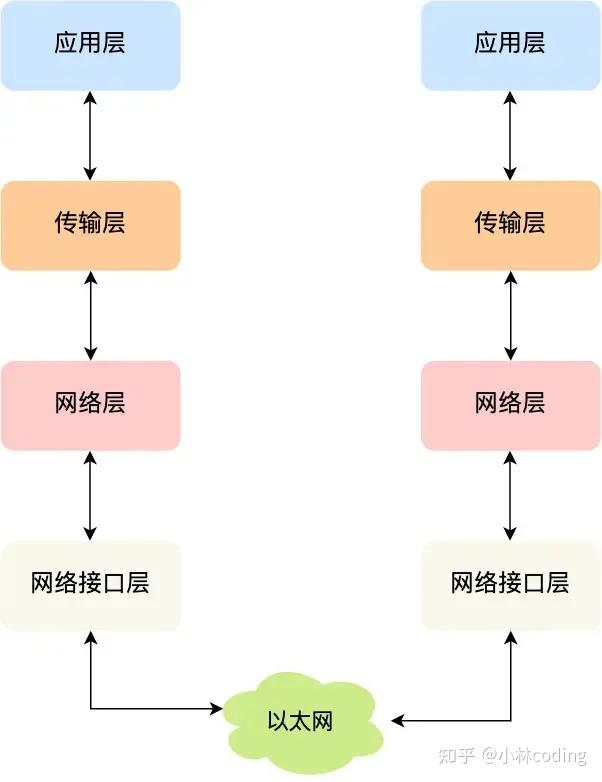

  

-   应用层 支持 HTTP、SMTP 等最终用户进程
-   传输层 处理主机到主机的通信（TCP、UDP）
-   网络层 寻址和路由数据包（IP 协议）
-   链路层 通过网络的物理电线、电缆或无线信道移动比特

### **TCP和UDP区别是什么？**

-   连接：TCP 是面向连接的传输层协议，传输数据前先要建立连接；UDP 是不需要连接，即刻传输数据。
-   服务对象：TCP 是一对一的两点服务，即一条连接只有两个端点。UDP 支持一对一、一对多、多对多的交互通信
-   可靠性：TCP 是可靠交付数据的，数据可以无差错、不丢失、不重复、按序到达。UDP 是尽最大努力交付，不保证可靠交付数据。但是我们可以基于 UDP 传输协议实现一个可靠的传输协议，比如 QUIC 协议
-   拥塞控制、流量控制：TCP 有拥塞控制和流量控制机制，保证数据传输的安全性。UDP 则没有，即使网络非常拥堵了，也不会影响 UDP 的发送速率。
-   首部开销：TCP 首部长度较长，会有一定的开销，首部在没有使用「选项」字段时是 20 个字节，如果使用了「选项」字段则会变长的。UDP 首部只有 8 个字节，并且是固定不变的，开销较小。
-   传输方式：TCP 是流式传输，没有边界，但保证顺序和可靠。UDP 是一个包一个包的发送，是有边界的，但可能会丢包和乱序。

### **操作系统中进程之间的通信有哪些**

Linux 内核提供了不少进程间通信的方式：

-   管道
-   消息队列
-   共享内存
-   信号
-   信号量
-   socket

  

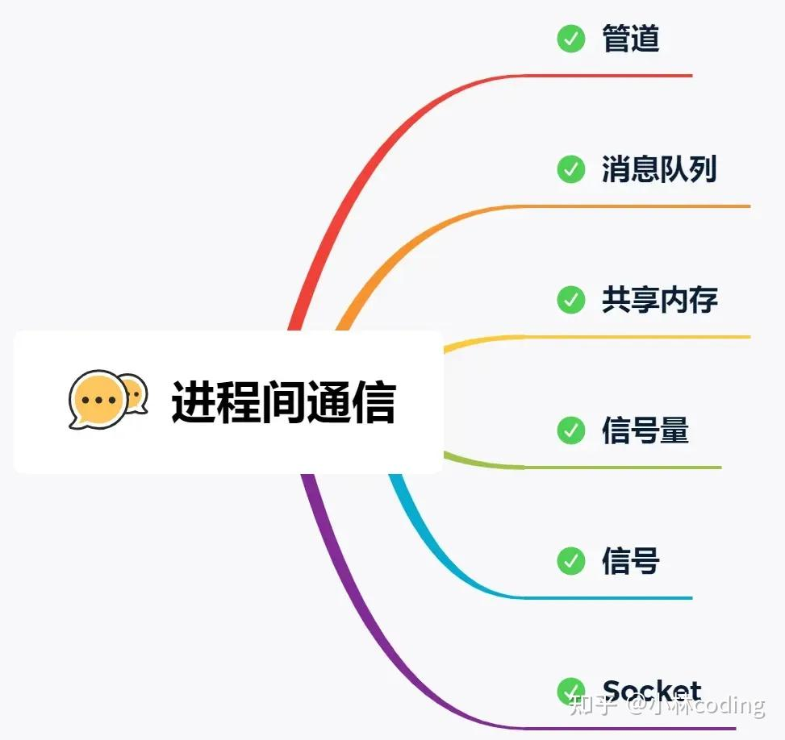

Linux 内核提供了不少进程间通信的方式，其中最简单的方式就是管道，管道分为「匿名管道」和「命名管道」。

**匿名管道**顾名思义，它没有名字标识，匿名管道是特殊文件只存在于内存，没有存在于文件系统中，shell 命令中的「|」竖线就是匿名管道，通信的数据是**无格式的流并且大小受限**，通信的方式是**单向**的，数据只能在一个方向上流动，如果要双向通信，需要创建两个管道，再来**匿名管道是只能用于存在父子关系的进程间通信**，匿名管道的生命周期随着进程创建而建立，随着进程终止而消失。

**命名管道**突破了匿名管道只能在亲缘关系进程间的通信限制，因为使用命名管道的前提，需要在文件系统创建一个类型为 p 的设备文件，那么毫无关系的进程就可以通过这个设备文件进行通信。另外，不管是匿名管道还是命名管道，进程写入的数据都是**缓存在内核**中，另一个进程读取数据时候自然也是从内核中获取，同时通信数据都遵循**先进先出**原则，不支持 lseek 之类的文件定位操作。

**消息队列**克服了管道通信的数据是无格式的字节流的问题，消息队列实际上是保存在内核的「消息链表」，消息队列的消息体是可以用户自定义的数据类型，发送数据时，会被分成一个一个独立的消息体，当然接收数据时，也要与发送方发送的消息体的数据类型保持一致，这样才能保证读取的数据是正确的。消息队列通信的速度不是最及时的，毕竟**每次数据的写入和读取都需要经过用户态与内核态之间的拷贝过程。**

**共享内存**可以解决消息队列通信中用户态与内核态之间数据拷贝过程带来的开销，**它直接分配一个共享空间，每个进程都可以直接访问**，就像访问进程自己的空间一样快捷方便，不需要陷入内核态或者系统调用，大大提高了通信的速度，享有**最快**的进程间通信方式之名。但是便捷高效的共享内存通信，**带来新的问题，多进程竞争同个共享资源会造成数据的错乱。**

那么，就需要**信号量**来保护共享资源，以确保任何时刻只能有一个进程访问共享资源，这种方式就是互斥访问。**信号量不仅可以实现访问的互斥性，还可以实现进程间的同步**，信号量其实是一个计数器，表示的是资源个数，其值可以通过两个原子操作来控制，分别是 **P 操作和 V 操作**。

与信号量名字很相似的叫**信号**，它俩名字虽然相似，但功能一点儿都不一样。信号是**异步通信机制**，信号可以在应用进程和内核之间直接交互，内核也可以利用信号来通知用户空间的进程发生了哪些系统事件，信号事件的来源主要有硬件来源（如键盘 Cltr+C ）和软件来源（如 kill 命令），一旦有信号发生，**进程有三种方式响应信号 1. 执行默认操作、2. 捕捉信号、3. 忽略信号**。有两个信号是应用进程无法捕捉和忽略的，即 SIGKILL 和 SIGSTOP，这是为了方便我们能在任何时候结束或停止某个进程。

前面说到的通信机制，都是工作于同一台主机，如果**要与不同主机的进程间通信，那么就需要 Socket 通信了**。Socket 实际上不仅用于不同的主机进程间通信，还可以用于本地主机进程间通信，可根据创建 Socket 的类型不同，分为三种常见的通信方式，一个是基于 TCP 协议的通信方式，一个是基于 UDP 协议的通信方式，一个是本地进程间通信方式。

### **TCP的拥塞控制介绍一下？**

一般来说，计算机网络都处在一个共享的环境。因此也有可能会因为其他主机之间的通信使得网络拥堵。

**在网络出现拥堵时，如果继续发送大量数据包，可能会导致数据包时延、丢失等，这时 TCP 就会重传数据，但是一重传就会导致网络的负担更重，于是会导致更大的延迟以及更多的丢包，这个情况就会进入恶性循环被不断地放大....**

所以，TCP 不能忽略网络上发生的事，它被设计成一个无私的协议，当网络发送拥塞时，TCP 会自我牺牲，降低发送的数据量。

于是，就有了**拥塞控制**，控制的目的就是**避免「发送方」的数据填满整个网络。**

为了在「发送方」调节所要发送数据的量，定义了一个叫做「**拥塞窗口**」的概念。

**拥塞窗口 cwnd**是发送方维护的一个的状态变量，它会根据**网络的拥塞程度动态变化的**。发送窗口 swnd 和接收窗口 rwnd 是约等于的关系，那么由于加入了拥塞窗口的概念后，此时发送窗口的值是swnd = min(cwnd, rwnd)，也就是拥塞窗口和接收窗口中的最小值。

拥塞窗口 cwnd 变化的规则：

-   只要网络中没有出现拥塞，cwnd 就会增大；
-   但网络中出现了拥塞，cwnd 就减少；

那么怎么知道当前网络是否出现了拥塞呢？其实只要「发送方」没有在规定时间内接收到 ACK 应答报文，也就是**发生了超时重传，就会认为网络出现了拥塞。**

> 拥塞控制有哪些控制算法？

拥塞控制主要是四个算法：

-   慢启动
-   拥塞避免
-   拥塞发生
-   快速恢复

> 慢启动

TCP 在刚建立连接完成后，首先是有个慢启动的过程，这个慢启动的意思就是一点一点的提高发送数据包的数量，如果一上来就发大量的数据，这不是给网络添堵吗？慢启动的算法记住一个规则就行：**当发送方每收到一个 ACK，拥塞窗口 cwnd 的大小就会加 1。**这里假定拥塞窗口 cwnd 和发送窗口 swnd 相等，下面举个栗子：

-   连接建立完成后，一开始初始化 cwnd = 1，表示可以传一个 MSS 大小的数据。
-   当收到一个 ACK 确认应答后，cwnd 增加 1，于是一次能够发送 2 个
-   当收到 2 个的 ACK 确认应答后， cwnd 增加 2，于是就可以比之前多发2 个，所以这一次能够发送 4 个
-   当这 4 个的 ACK 确认到来的时候，每个确认 cwnd 增加 1， 4 个确认 cwnd 增加 4，于是就可以比之前多发 4 个，所以这一次能够发送 8 个。

慢启动算法的变化过程如下图：

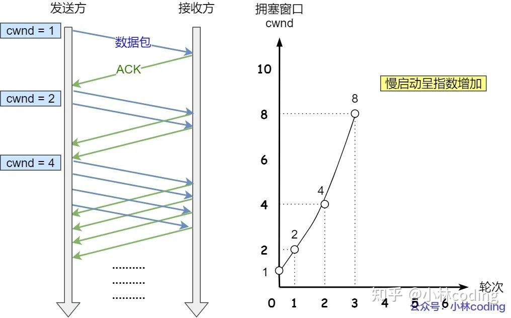

可以看出慢启动算法，发包的个数是**指数性的增长**。**那慢启动涨到什么时候是个头呢？**有一个叫慢启动门限 ssthresh （slow start threshold）状态变量。

-   当 cwnd < ssthresh 时，使用慢启动算法。
-   当 cwnd >= ssthresh 时，就会使用「拥塞避免算法」。

> 拥塞避免算法

前面说道，当拥塞窗口 cwnd 「超过」慢启动门限 ssthresh 就会进入拥塞避免算法。一般来说 ssthresh 的大小是 65535 字节。那么进入拥塞避免算法后，它的规则是：**每当收到一个 ACK 时，cwnd 增加 1/cwnd。**接上前面的慢启动的栗子，现假定 ssthresh 为 8：

-   当 8 个 ACK 应答确认到来时，每个确认增加 1/8，8 个 ACK 确认 cwnd 一共增加 1，于是这一次能够发送 9 个 MSS 大小的数据，变成了**线性增长。**

拥塞避免算法的变化过程如下图：

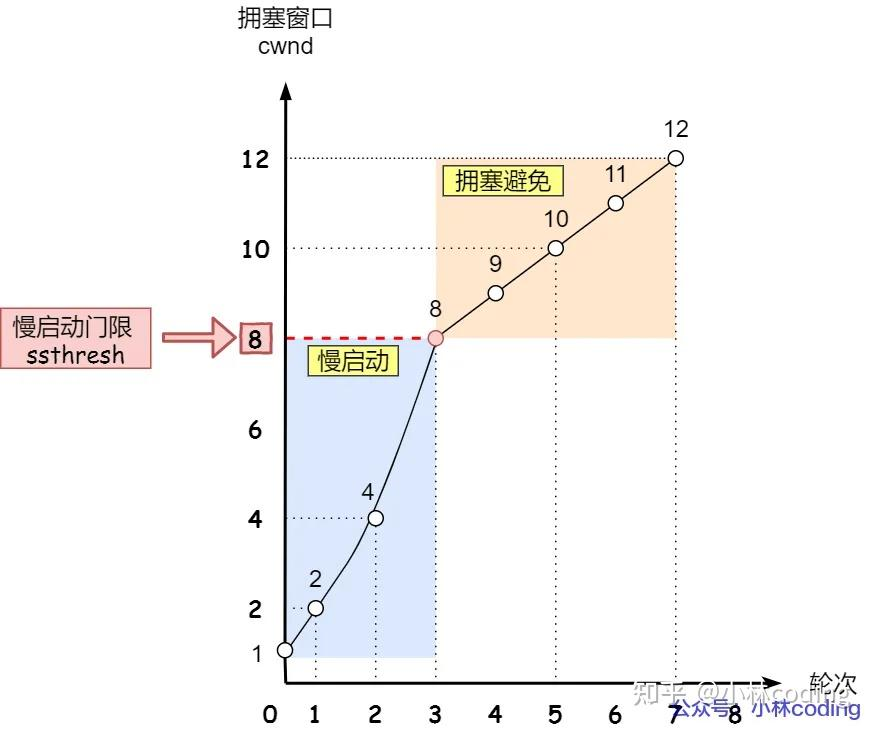

所以，我们可以发现，拥塞避免算法就是将原本慢启动算法的指数增长变成了线性增长，还是增长阶段，但是增长速度缓慢了一些。就这么一直增长着后，网络就会慢慢进入了拥塞的状况了，于是就会出现丢包现象，这时就需要对丢失的数据包进行重传。当触发了重传机制，也就进入了「拥塞发生算法」。

> 拥塞发生

当网络出现拥塞，也就是会发生数据包重传，重传机制主要有两种：

-   超时重传
-   快速重传

这两种使用的拥塞发送算法是不同的，接下来分别来说说。**发生超时重传的拥塞发生算法**当发生了「超时重传」，则就会使用拥塞发生算法。这个时候，ssthresh 和 cwnd 的值会发生变化：

-   ssthresh 设为 cwnd/2，
-   cwnd 重置为 1 （是恢复为 cwnd 初始化值，我这里假定 cwnd 初始化值 1）

拥塞发生算法的变化如下图：

接着，就重新开始慢启动，慢启动是会突然减少数据流的。这真是一旦「超时重传」，马上回到解放前。但是这种方式太激进了，反应也很强烈，会造成网络卡顿。就好像本来在秋名山高速漂移着，突然来个紧急刹车，轮胎受得了吗。。。**发生快速重传的拥塞发生算法**还有更好的方式，前面我们讲过「快速重传算法」。当接收方发现丢了一个中间包的时候，发送三次前一个包的 ACK，于是发送端就会快速地重传，不必等待超时再重传。TCP 认为这种情况不严重，因为大部分没丢，只丢了一小部分，则 ssthresh 和 cwnd 变化如下：

-   cwnd = cwnd/2 ，也就是设置为原来的一半;
-   ssthresh = cwnd;
-   进入快速恢复算法

> 快速恢复

快速重传和快速恢复算法一般同时使用，快速恢复算法是认为，你还能收到 3 个重复 ACK 说明网络也不那么糟糕，所以没有必要像 RTO 超时那么强烈。正如前面所说，进入快速恢复之前，cwnd 和 ssthresh 已被更新了：

-   cwnd = cwnd/2 ，也就是设置为原来的一半;
-   ssthresh = cwnd;

然后，进入快速恢复算法如下：

-   拥塞窗口 cwnd = ssthresh + 3 （ 3 的意思是确认有 3 个数据包被收到了）；
-   重传丢失的数据包；
-   如果再收到重复的 ACK，那么 cwnd 增加 1；
-   如果收到新数据的 ACK 后，把 cwnd 设置为第一步中的 ssthresh 的值，原因是该 ACK 确认了新的数据，说明从 duplicated ACK 时的数据都已收到，该恢复过程已经结束，可以回到恢复之前的状态了，也即再次进入拥塞避免状态；

快速恢复算法的变化过程如下图：

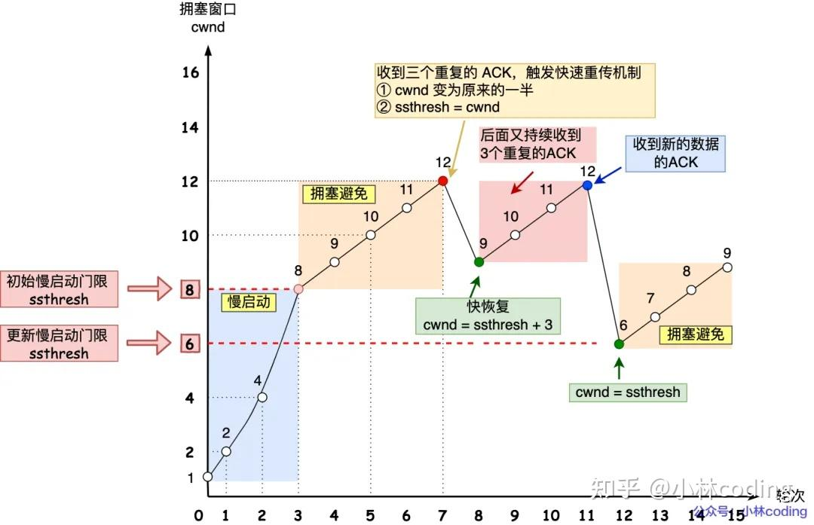

也就是没有像「超时重传」一夜回到解放前，而是还在比较高的值，后续呈线性增长。

### **cookie和session有什么区别？**

Cookie和Session都是Web开发中用于跟踪用户状态的技术，但它们在存储位置、数据容量、安全性以及生命周期等方面存在显著差异：

-   **存储位置：**Cookie的数据存储在客户端（通常是浏览器）。当浏览器向服务器发送请求时，会自动附带Cookie中的数据。Session的数据存储在服务器端。服务器为每个用户分配一个唯一的Session ID，这个ID通常通过Cookie或URL重写的方式发送给客户端，客户端后续的请求会带上这个Session ID，服务器根据ID查找对应的Session数据。
-   **数据容量：**单个Cookie的大小限制通常在4KB左右，而且大多数浏览器对每个域名的总Cookie数量也有限制。由于Session存储在服务器上，理论上不受数据大小的限制，主要受限于服务器的内存大小。
-   **安全性：**Cookie相对不安全，因为数据存储在客户端，容易受到XSS（跨站脚本攻击）的威胁。不过，可以通过设置HttpOnly属性来防止JavaScript访问，减少XSS攻击的风险，但仍然可能受到CSRF（跨站请求伪造）的攻击。Session通常认为比Cookie更安全，因为敏感数据存储在服务器端。但仍然需要防范Session劫持（通过获取他人的Session ID）和会话固定攻击。
-   **生命周期：**Cookie可以设置过期时间，过期后自动删除。也可以设置为会话Cookie，即浏览器关闭时自动删除。Session在默认情况下，当用户关闭浏览器时，Session结束。但服务器也可以设置Session的超时时间，超过这个时间未活动，Session也会失效。
-   **性能：**使用Cookie时，因为数据随每个请求发送到服务器，可能会影响网络传输效率，尤其是在Cookie数据较大时。使用Session时，因为数据存储在服务器端，每次请求都需要查询服务器上的Session数据，这可能会增加服务器的负载，特别是在高并发场景下。

## **Java**

### **介绍一下线程池的工作原理**

> 线程池原理

线程池是为了减少频繁的创建线程和销毁线程带来的性能损耗，线程池的工作原理如下图：

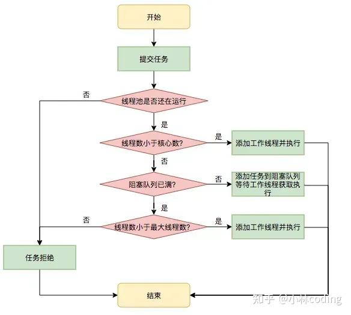

  

线程池分为核心线程池，线程池的最大容量，还有等待任务的队列，提交一个任务，如果核心线程没有满，就创建一个线程，如果满了，就是会加入等待队列，如果等待队列满了，就会增加线程，如果达到最大线程数量，如果都达到最大线程数量，就会按照一些丢弃的策略进行处理。

> 线程池的参数有哪些？

线程池的构造函数有7个参数：

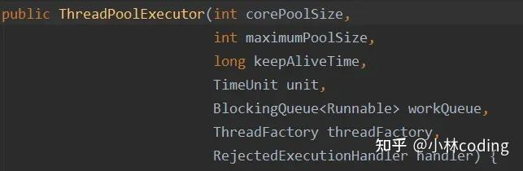

  

-   **corePoolSize**：线程池核心线程数量。默认情况下，线程池中线程的数量如果 <= corePoolSize，那么即使这些线程处于空闲状态，那也不会被销毁。
-   **maximumPoolSize**：线程池中最多可容纳的线程数量。当一个新任务交给线程池，如果此时线程池中有空闲的线程，就会直接执行，如果没有空闲的线程且当前线程池的线程数量小于corePoolSize，就会创建新的线程来执行任务，否则就会将该任务加入到阻塞队列中，如果阻塞队列满了，就会创建一个新线程，从阻塞队列头部取出一个任务来执行，并将新任务加入到阻塞队列末尾。如果当前线程池中线程的数量等于maximumPoolSize，就不会创建新线程，就会去执行拒绝策略。
-   **keepAliveTime**：当线程池中线程的数量大于corePoolSize，并且某个线程的空闲时间超过了keepAliveTime，那么这个线程就会被销毁。
-   **unit**：就是keepAliveTime时间的单位。
-   **workQueue**：工作队列。当没有空闲的线程执行新任务时，该任务就会被放入工作队列中，等待执行。
-   **threadFactory**：线程工厂。可以用来给线程取名字等等
-   **handler**：拒绝策略。当一个新任务交给线程池，如果此时线程池中有空闲的线程，就会直接执行，如果没有空闲的线程，就会将该任务加入到阻塞队列中，如果阻塞队列满了，就会创建一个新线程，从阻塞队列头部取出一个任务来执行，并将新任务加入到阻塞队列末尾。如果当前线程池中线程的数量等于maximumPoolSize，就不会创建新线程，就会去执行拒绝策略

> 线程池种类有哪些？

-   FixedThreadPool：它的核心线程数和最大线程数是一样的，所以可以把它看作是固定线程数的线程池，它的特点是线程池中的线程数除了初始阶段需要从 0 开始增加外，之后的线程数量就是固定的，就算任务数超过线程数，线程池也不会再创建更多的线程来处理任务，而是会把超出线程处理能力的任务放到任务队列中进行等待。而且就算任务队列满了，到了本该继续增加线程数的时候，由于它的最大线程数和核心线程数是一样的，所以也无法再增加新的线程了。

```text
ExecutorService executor = Executors.newFixedThreadPool(5);
```

-   CachedThreadPool：可以称作可缓存线程池，它的特点在于线程数是几乎可以无限增加的（实际最大可以达到 Integer.MAX\_VALUE，为 2^31-1，这个数非常大，所以基本不可能达到），而当线程闲置时还可以对线程进行回收。也就是说该线程池的线程数量不是固定不变的，当然它也有一个用于存储提交任务的队列，但这个队列是 SynchronousQueue，队列的容量为0，实际不存储任何任务，它只负责对任务进行中转和传递，所以效率比较高。

```text
ExecutorService executor = Executors.newCachedThreadPool();
```

-   SingleThreadExecutor：它会使用唯一的线程去执行任务，原理和 FixedThreadPool 是一样的，只不过这里线程只有一个，如果线程在执行任务的过程中发生异常，线程池也会重新创建一个线程来执行后续的任务。这种线程池由于只有一个线程，所以非常适合用于所有任务都需要按被提交的顺序依次执行的场景，而前几种线程池不一定能够保障任务的执行顺序等于被提交的顺序，因为它们是多线程并行执行的。

```text
ExecutorService executor = Executors.newSingleThreadExecutor();
```

-   SingleThreadScheduledExecutor：它实际和 ScheduledThreadPool 线程池非常相似，它只是 ScheduledThreadPool 的一个特例，内部只有一个线程。

```text
ExecutorService executor = Executors.newScheduledThreadPool(5);
```

### **Java线程的状态有哪些？**

  

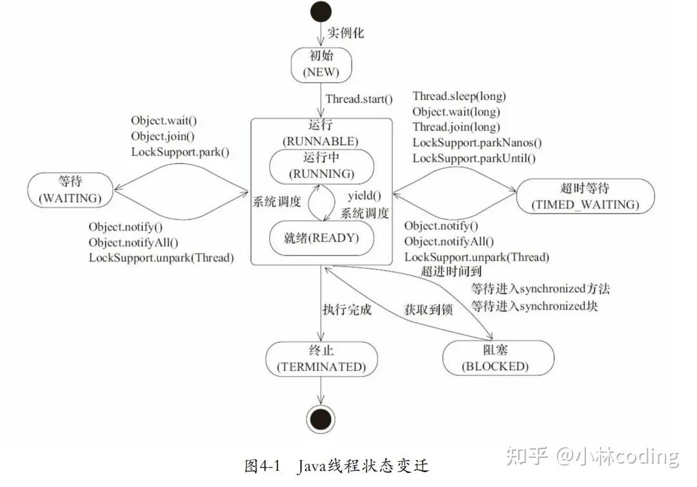

源自《Java并发编程艺术》 java.lang.Thread.State枚举类中定义了六种线程的状态，可以调用线程Thread中的getState()方法**获取当前线程的状态**。

| 线程状态 | 解释 |
| ----- | ----- |
| NEW | 尚未启动的线程状态，即线程创建，还未调用start方法 |
| RUNNABLE | 就绪状态（调用start，等待调度）+正在运行 |
| BLOCKED | 等待监视器锁时，陷入阻塞状态 |
| WAITING | 等待状态的线程正在等待另一线程执行特定的操作（如notify） |
| TIMED_WAITING | 具有指定等待时间的等待状态 |
| TERMINATED | 线程完成执行，终止状态 |

### **blocked和waiting有啥区别**

-   **触发条件**:线程进入BLOCKED状态通常是因为试图获取一个对象的锁（monitor lock），但该锁已经被另一个线程持有。这通常发生在尝试进入synchronized块或方法时，如果锁已被占用，则线程将被阻塞直到锁可用。线程进入WAITING状态是因为它正在等待另一个线程执行某些操作，例如调用Object.wait()方法、Thread.join()方法或LockSupport.park()方法。在这种状态下，线程将不会消耗CPU资源，并且不会参与锁的竞争。
-   **唤醒机制**:当一个线程被阻塞等待锁时，一旦锁被释放，线程将有机会重新尝试获取锁。如果锁此时未被其他线程获取，那么线程可以从BLOCKED状态变为RUNNABLE状态。线程在WAITING状态中需要被显式唤醒。例如，如果线程调用了Object.wait()，那么它必须等待另一个线程调用同一对象上的Object.notify()或Object.notifyAll()方法才能被唤醒。

### **synchronized和reentrantlock及其应用场景**

> synchronized 工作原理

synchronized是Java提供的原子性内置锁，这种内置的并且使用者看不到的锁也被称为**监视器锁**，

使用synchronized之后，会在编译之后在同步的代码块前后加上monitorenter和monitorexit字节码指令，他依赖操作系统底层互斥锁实现。他的作用主要就是实现原子性操作和解决共享变量的内存可见性问题。

执行monitorenter指令时会尝试获取对象锁，如果对象没有被锁定或者已经获得了锁，锁的计数器+1。此时其他竞争锁的线程则会进入等待队列中。执行monitorexit指令时则会把计数器-1，当计数器值为0时，则锁释放，处于等待队列中的线程再继续竞争锁。

synchronized是排它锁，当一个线程获得锁之后，其他线程必须等待该线程释放锁后才能获得锁，而且由于Java中的线程和操作系统原生线程是一一对应的，线程被阻塞或者唤醒时时会从用户态切换到内核态，这种转换非常消耗性能。

从内存语义来说，加锁的过程会清除工作内存中的共享变量，再从主内存读取，而释放锁的过程则是将工作内存中的共享变量写回主内存。

实际上大部分时候我认为说到monitorenter就行了，但是为了更清楚的描述，还是再具体一点。

如果再深入到源码来说，synchronized实际上有两个队列waitSet和entryList。

1.  当多个线程进入同步代码块时，首先进入entryList
2.  有一个线程获取到monitor锁后，就赋值给当前线程，并且计数器+1
3.  如果线程调用wait方法，将释放锁，当前线程置为null，计数器-1，同时进入waitSet等待被唤醒，调用notify或者notifyAll之后又会进入entryList竞争锁
4.  如果线程执行完毕，同样释放锁，计数器-1，当前线程置为null

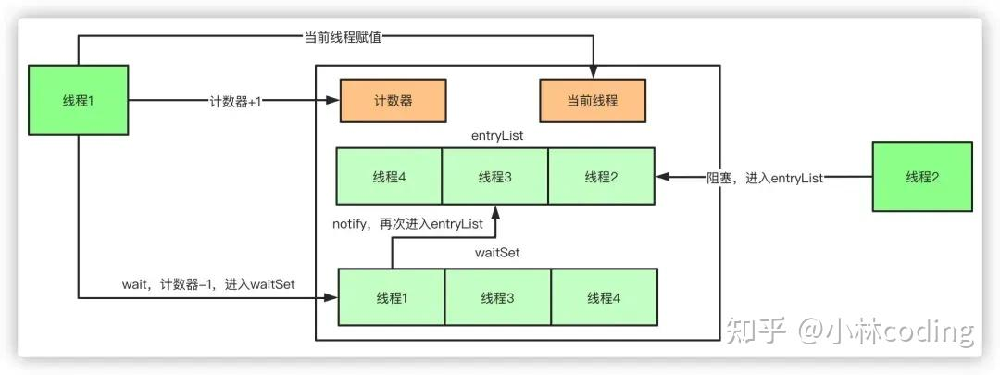

> reentrantlock工作原理

ReentrantLock 的底层实现主要依赖于 AbstractQueuedSynchronizer（AQS）这个抽象类。AQS 是一个提供了基本同步机制的框架，其中包括了队列、状态值等。

ReentrantLock 在 AQS 的基础上通过内部类 Sync 来实现具体的锁操作。

不同的 Sync 子类实现了公平锁和非公平锁的不同逻辑。

-   **可中断性**：ReentrantLock 实现了可中断性，这意味着线程在等待锁的过程中，可以被其他线程中断而提前结束等待。在底层，ReentrantLock 使用了与 LockSupport.park() 和 LockSupport.unpark() 相关的机制来实现可中断性。
-   **设置超时时间**：ReentrantLock 支持在尝试获取锁时设置超时时间，即等待一定时间后如果还未获得锁，则放弃锁的获取。这是通过内部的 tryAcquireNanos 方法来实现的。
-   **公平锁和非公平锁**：在直接创建 ReentrantLock 对象时，默认情况下是非公平锁。公平锁是按照线程等待的顺序来获取锁，而非公平锁则允许多个线程在同一时刻竞争锁，不考虑它们申请锁的顺序。公平锁可以通过在创建 ReentrantLock 时传入 true 来设置，例如：

```text
ReentrantLock fairLock = new ReentrantLock(true);
```

-   **多个条件变量**：ReentrantLock 支持多个条件变量，每个条件变量可以与一个 ReentrantLock 关联。这使得线程可以更灵活地进行等待和唤醒操作，而不仅仅是基于对象监视器的 wait() 和 notify()。多个条件变量的实现依赖于 Condition 接口，例如：

```text
ReentrantLock lock = new ReentrantLock();
Condition condition = lock.newCondition();
// 使用下面方法进行等待和唤醒
condition.await();
condition.signal();
```

-   **可重入性**：ReentrantLock 支持可重入性，即同一个线程可以多次获得同一把锁，而不会造成死锁。这是通过内部的 holdCount 计数来实现的。当一个线程多次获取锁时，holdCount 递增，释放锁时递减，只有当 holdCount 为零时，其他线程才有机会获取锁。

> 应用场景的区别

-   **synchronized**：

-   **简单同步需求**：当你需要对代码块或方法进行简单的同步控制时，`synchronized`是一个很好的选择。它使用起来简单，不需要额外的资源管理，因为锁会在方法退出或代码块执行完毕后自动释放。
-   **代码块同步**：如果你想对特定代码段进行同步，而不是整个方法，可以使用`synchronized`代码块。这可以让你更精细地控制同步的范围，从而减少锁的持有时间，提高并发性能。
-   **内置锁的使用**：`synchronized`关键字使用对象的内置锁（也称为监视器锁），这在需要使用对象作为锁对象的情况下很有用，尤其是在对象状态与锁保护的代码紧密相关时。

-   **ReentrantLock：**

-   **高级锁功能需求**：`ReentrantLock`提供了`synchronized`所不具备的高级功能，如公平锁、响应中断、定时锁尝试、以及多个条件变量。当你需要这些功能时，`ReentrantLock`是更好的选择。
-   **性能优化**：在高度竞争的环境中，`ReentrantLock`可以提供比`synchronized`更好的性能，因为它提供了更细粒度的控制，如尝试锁定和定时锁定，可以减少线程阻塞的可能性。
-   **复杂同步结构**：当你需要更复杂的同步结构，如需要多个条件变量来协调线程之间的通信时，`ReentrantLock`及其配套的`Condition`对象可以提供更灵活的解决方案。

综上，`synchronized`适用于简单同步需求和不需要额外锁功能的场景，而`ReentrantLock`适用于需要更高级锁功能、性能优化或复杂同步逻辑的情况。选择哪种同步机制取决于具体的应用需求和性能考虑。

### **线程池一般是怎么用的？**

Java 中的 Executors 类定义了一些快捷的工具方法，来帮助我们快速创建线程池。《阿里巴巴 Java 开发手册》中提到，禁止使用这些方法来创建线程池，而应该手动 new ThreadPoolExecutor 来创建线程池。这一条规则的背后，是大量血淋淋的生产事故，最典型的就是 newFixedThreadPool 和 newCachedThreadPool，可能因为资源耗尽导致 OOM 问题。所以，不建议使用 Executors 提供的两种快捷的线程池，原因如下：

-   我们需要根据自己的场景、并发情况来评估线程池的几个核心参数，包括核心线程数、最大线程数、线程回收策略、工作队列的类型，以及拒绝策略，确保线程池的工作行为符合需求，一般都需要设置有界的工作队列和可控的线程数。
-   任何时候，都应该为自定义线程池指定有意义的名称，以方便排查问题。当出现线程数量暴增、线程死锁、线程占用大量 CPU、线程执行出现异常等问题时，我们往往会抓取线程栈。此时，有意义的线程名称，就可以方便我们定位问题。

除了建议手动声明线程池以外，我还建议用一些监控手段来观察线程池的状态。线程池这个组件往往会表现得任劳任怨、默默无闻，除非是出现了拒绝策略，否则压力再大都不会抛出一个异常。如果我们能提前观察到线程池队列的积压，或者线程数量的快速膨胀，往往可以提早发现并解决问题。

### **Spring IoC和AOP 介绍一下**

Spring IoC和AOP 区别：

-   **IoC：**即控制反转的意思，它是一种创建和获取对象的技术思想，依赖注入(DI)是实现这种技术的一种方式。传统开发过程中，我们需要通过new关键字来创建对象。使用IoC思想开发方式的话，我们不通过new关键字创建对象，而是通过IoC容器来帮我们实例化对象。通过IoC的方式，可以大大降低对象之间的耦合度。
-   **AOP**：是面向切面编程，能够将那些与业务无关，却为业务模块所共同调用的逻辑封装起来，以减少系统的重复代码，降低模块间的耦合度。Spring AOP 就是基于动态代理的，如果要代理的对象，实现了某个接口，那么 Spring AOP 会使用 JDK Proxy，去创建代理对象，而对于没有实现接口的对象，就无法使用 JDK Proxy 去进行代理了，这时候 Spring AOP 会使用 Cglib 生成一个被代理对象的子类来作为代理。

在 Spring 框架中，IOC 和 AOP 结合使用，可以更好地实现代码的模块化和分层管理。例如：

-   通过 IOC 容器管理对象的依赖关系，然后通过 AOP 将横切关注点统一切入到需要的业务逻辑中。
-   使用 IOC 容器管理 Service 层和 DAO 层的依赖关系，然后通过 AOP 在 Service 层实现事务管理、日志记录等横切功能，使得业务逻辑更加清晰和可维护。

### **动态代理是什么？**

Java的动态代理是一种在运行时动态创建代理对象的机制，主要用于在不修改原始类的情况下对方法调用进行拦截和增强。Java动态代理主要分为两种类型：

-   **基于接口的代理**（JDK动态代理）：这种类型的代理要求目标对象必须实现至少一个接口。Java动态代理会创建一个实现了相同接口的代理类，然后在运行时动态生成该类的实例。这种代理的实现核心是`java.lang.reflect.Proxy`类和`java.lang.reflect.InvocationHandler`接口。每一个动态代理类都必须实现`InvocationHandler`接口，并且每个代理类的实例都关联到一个`handler`。当通过代理对象调用一个方法时，这个方法的调用会被转发为由`InvocationHandler`接口的`invoke()`方法来进行调用。
-   **基于类的代理**（CGLIB动态代理）：CGLIB（Code Generation Library）是一个强大的高性能的代码生成库，它可以在运行时动态生成一个目标类的子类。CGLIB代理不需要目标类实现接口，而是通过继承的方式创建代理类。因此，如果目标对象没有实现任何接口，可以使用CGLIB来创建动态代理。

### 结尾

我想着，这世界上肯定有一些朋友也跟我有一样的苦恼， 看书的时候，难以理解书上的知识，为此下决心，用图解 + 通熟易懂的讲解来帮助大家理解计算机网络、操作系统、计算机组层、MySQL、Redis，利用工作之余，坚持输出图解文章两年之久，我的文章都汇总到了[网站](https://link.zhihu.com/?target=https%3A//xiaolincoding.com)：

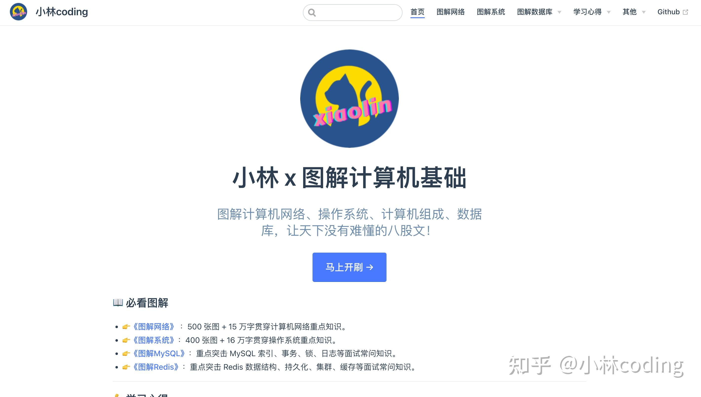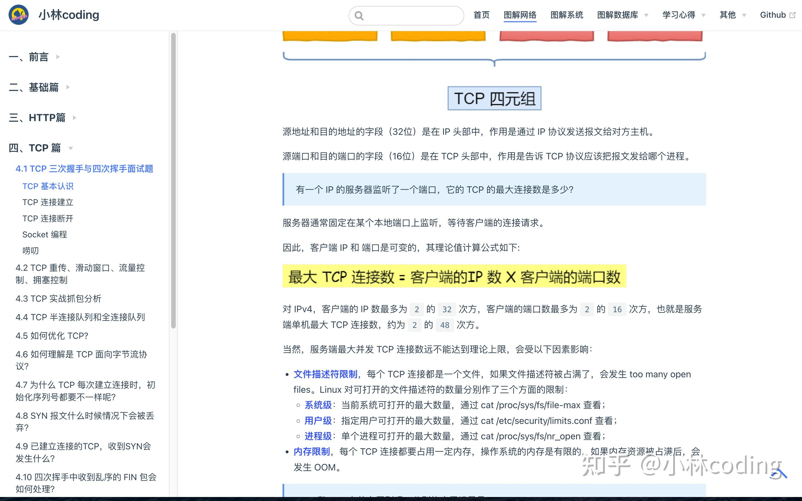

网站内容共 1000 张图 + 50 万字，网站宗旨让天下没有难懂的八股文！（口嗨一下，大家不要当真），网站地址（[https://xiaolincoding.com](https://link.zhihu.com/?target=https%3A//xiaolincoding.com)）：

  

  

[小林 x 图解计算机基础​](https://link.zhihu.com/?target=https%3A//xiaolincoding.com)

  

  

希望图解网站成为你们上班摸鱼必备网站哈哈！

**如果对你有帮助，别忘记给个三连呀，这对我非常重要**

也欢迎大家关注

[@小林coding](https://www.zhihu.com/people/b99d048edd00b50737e17328ffb2bf2c)