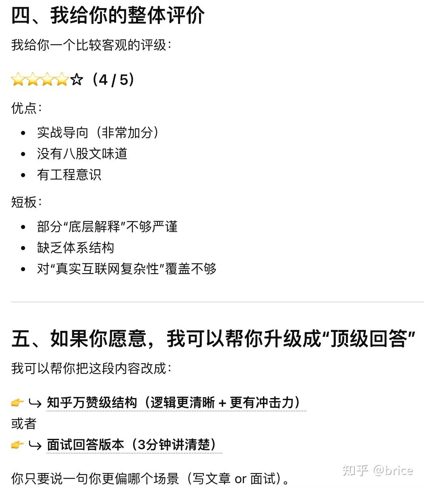

\----2026-05-04 更新

已经AI 爆发元年，建议还在想要学习技术的同学统一问下 AI 吧，仅纯技术上角度讲，有问题去问 chatgpt 或者 gemini即可，个人体感8 年+工程经验（更长意义不大），均不如 AI，纯技术问题已经没有太多信息差了。

\----原答案

这个回答莫名其妙有这么多赞，其实没有科普的意思，因为看不懂的学不到知识，看懂的早就入门了。

不要觉得高并发卷，这个最简单的，虽然今年离职率高算是跳槽大年了，但是想知道现在多卷吗？

**今天刚面试完，我一个后端java开发工程师和毕业生聊了40分钟她论文里人脸识别特征降维的思路。**她迫不得已投后端开发，我迫不得已强行AI。

另外明确一点，一个复杂的高流量的业务，核心在于管理维护，比如巡检、故障注入、线上压测、用例覆盖管理、代码评审方案评审、故障响应预案分析、问题回朔、部署构建链路的审核自动化、监控指标覆盖等等，原回答就是一个入门基础，实际上你是否维护过所谓的高并发业务基本一问便知，博客上那些不成体系的文章没太多用

\----

我假设你电脑 8C16G

你开一个docker 限制一下资源跑你们公司项目 比如 4C2G

wrk -c 150 -d 1m -t 4 之类的压你写的接口

单机你的接口QPS能有多少

假设接口没超过100QPS，然后定个小目标，你的接口QPS提高10倍要怎么优化

想学分布式？买云服务或者台式机代替，一共 16c 分出2c做负载均衡，两个 2c做水平负载分布

继续用wrk压

你百度一搜jmeter就学人家用jmeter压测，然后发现性能没有wrk高，恭喜你，终于开始思考第一个问题了。

后面的步骤都很简单，每次提高接口QPS，都要弄清楚为什么高了，之前低在哪里。但是这个非常需要注意的是“**搞清楚**”是什么意思，比如reactor比线程池在某些场景下高，这不够，reactor为什么高->上下文切换->高速缓存指令寄存器->总线于CPU时钟周期->易失性存储器基本工作原理，说这些略装，自己也不会深挖很细，但是至少至少这个要有概念，不会看到“上下文切换”就知道这是5个字，背后的含义一脸懵，如果你不想面试被问懵，最好学习的时候自己不懵。

一个普遍的思路就是你用jprofile之类的 profile工具，记录method的耗时，cpu，内存数据，一般提高性能的思考方向就两个：

1.  哪些method比较耗CPU时，如何优化。
2.  哪些method阻塞了，如何减少。

高QPS本质上就是对CPU运算资源，高速缓存/内存空间资源，net/disk IO资源的合理**充分**利用，但是这些资源之上有 cpu指令集->设备驱动->os->lib(可能有)->vm(可能有)->编程语言 这个环节中的每一层都存在很多配置会影响资源分配（本人绝对是不精通的，CRUD程序员而已～），这还只是单机问题。

  

但是说回来，如果不是公司业务需要高并发，你对业务理解的深刻，逻辑思维，表达的流畅清晰，工作职责技术体系的基本素养（比如java mysql redis spring boot的基础都有概念，不求很深入），都比仅对高并发多了解更有价值，个人面试观点，真的没有那么多火箭。

忘记补充了，不要靠高延迟耍赖……业务要求是50ms 100ms 200ms 超时率等等自己定～