SpringBoot 以其轻量级、内嵌 Web 容器、一键启动、方便调试等特点被越来越多的微服务实践者所采用。然而知其然还要知其所以然，那么学习SpringBoot就没有一个正确的路线吗，**在这就要给大家分享一个神仙级SpringBoot核心笔记了，图文并茂，非常适合有需要学习SpringBoot的朋友！**

> **每个知识点都有左侧导航书签页，看的时候十分方便，由于内容较多，这里就截取一部分图吧。需要的读者朋友们可以帮忙三连支持一下，点击下方传送门即可入手~**

## SpringBoot系列从入门到进阶手册目录：

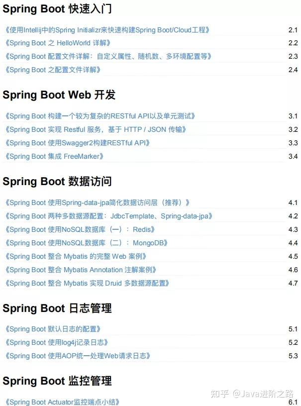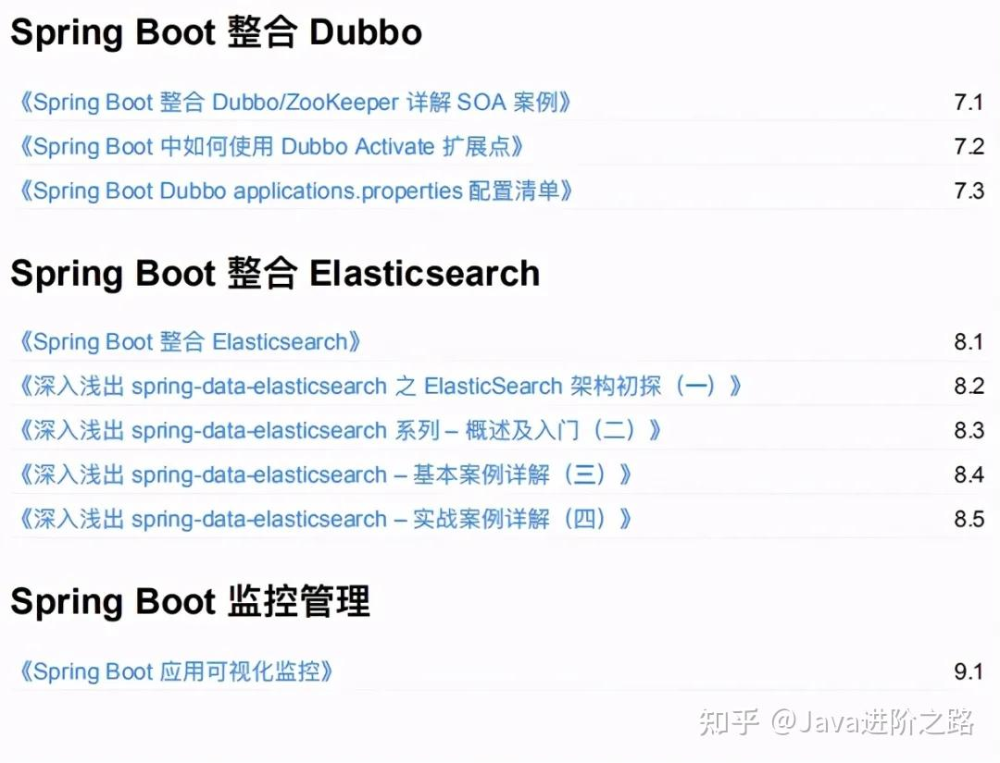

**每个知识点都有左侧导航书签页，看的时候十分方便，由于内容较多，这里就截取一部分图吧。需要的读者朋友们可以帮忙三连支持一下，点击下方传送门即可入手~**

## 内容展示：

**快速入门：**

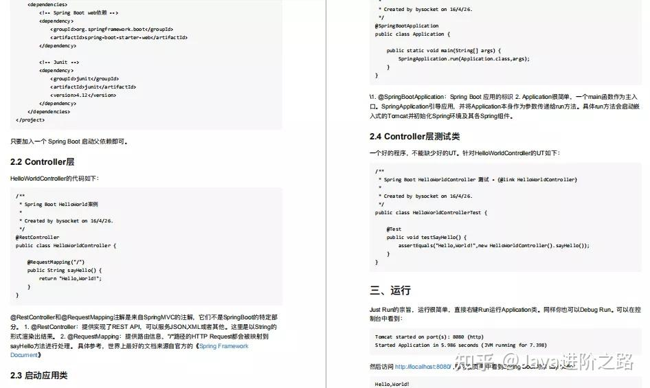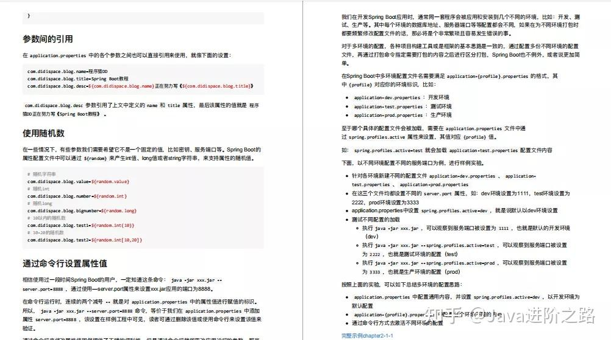

**开发：**

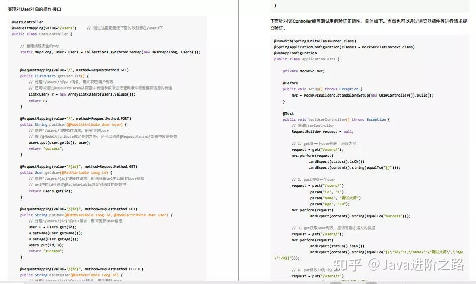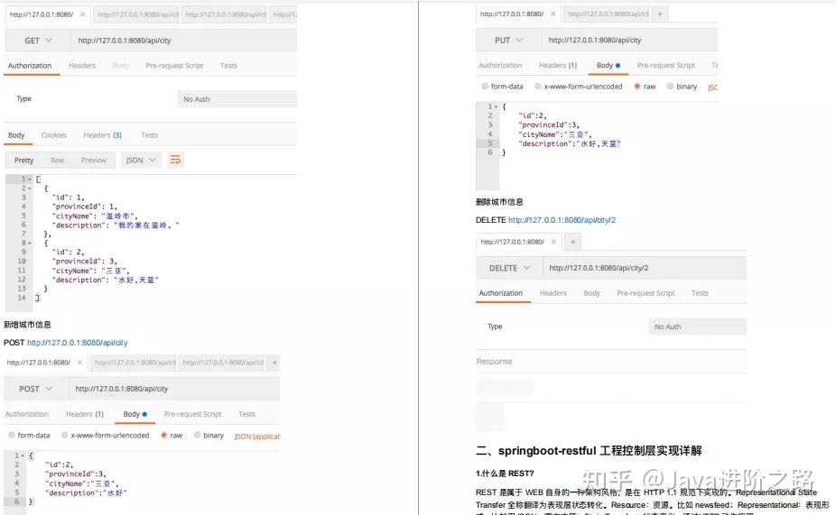

**数据访问：**

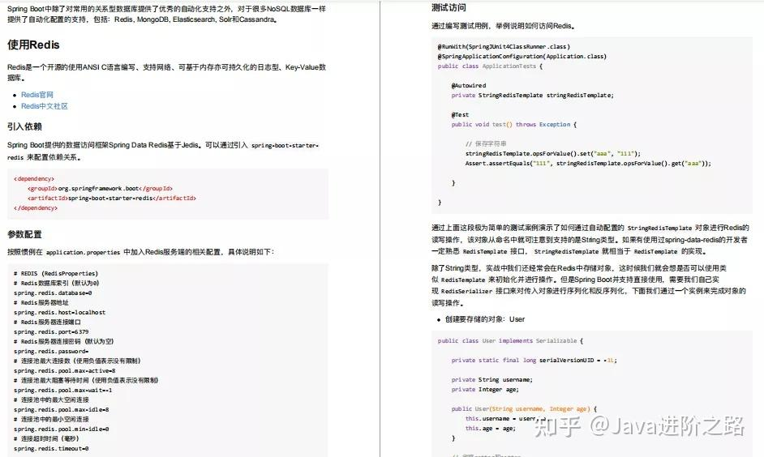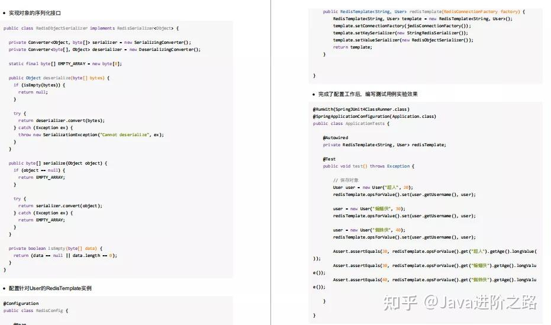

**⽇志管理：**

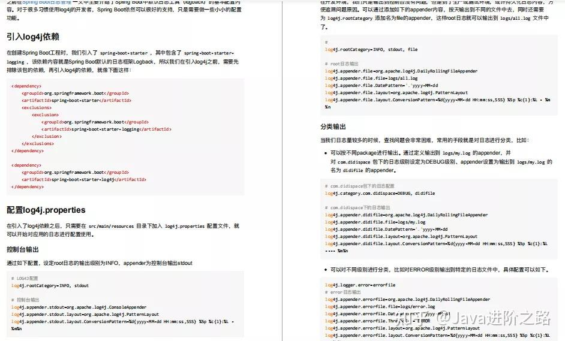

**监控管理：**

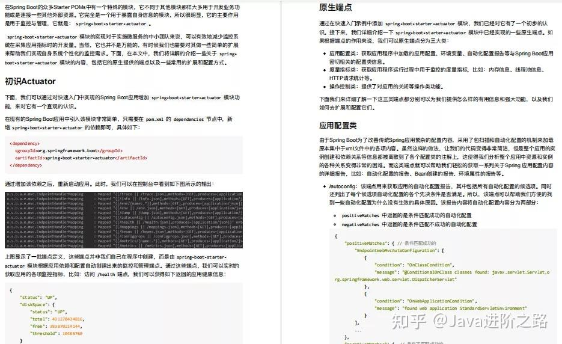

**整合 Dubbo：**

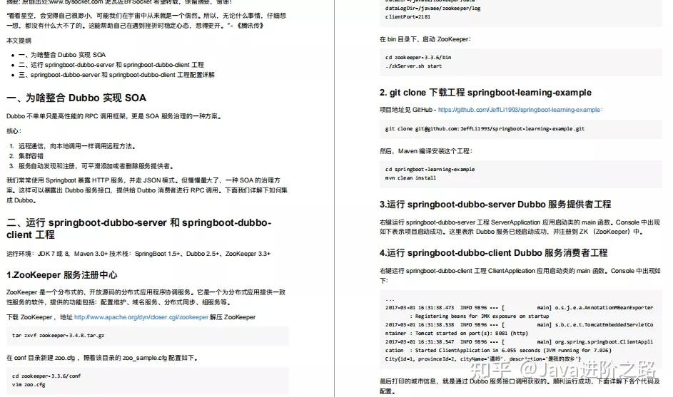

**Elasticsearch：**

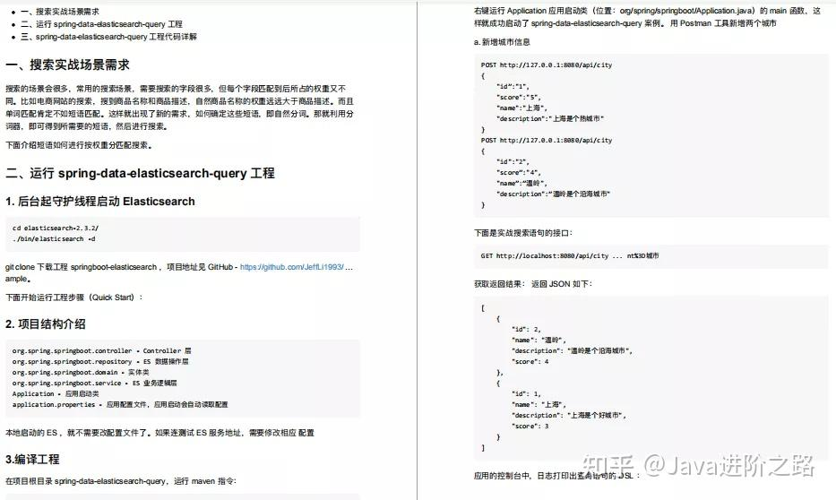

**监控管理：**

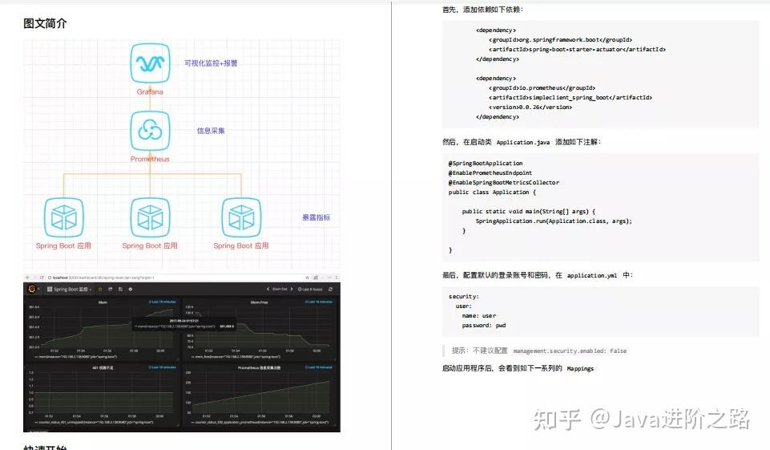