## 一、分布式事务概述

**事务**：提供一种机制将一个活动涉及的所有操作纳入到一个不可分割的执行单元，组成事务的所有操作要么全部成功要么全部失败，只要其中任一操作执行失败，都将导致整个事务的回滚。

**数据库本地事务四大特性**：原子性、一致性、隔离性、持久性

**分布式事务**：一次大的操作由不同的小操作组成，这些小的操作分布在不同的服务器上，且属于不同的应用，分布式事务需要保证这些小操作要么全部成功，要么全部失败。

**本质上来说，分布式事务解决的问题就是为了保证不同数据库的数据一致性。**

**分布式事务场景**：

•业务拆分：大系统由各子系统构成

•微服务

•业务流程涉及多个子系统，跨多个业务库，而不是在同一个库。

## 二、分布式理论基石

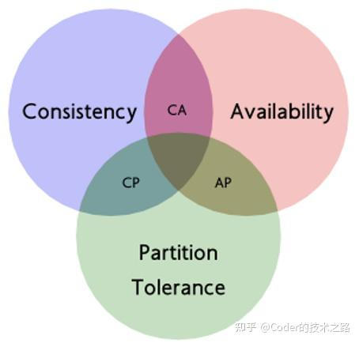

**CAP理论：**

*CAP理论说的是：在一个分布式系统中，最多只能满足C、A、P中的两个需求。*

C：Consistency 一致性 ：同一数据的多个副本是否实时相同

A：Availability 可用性：一定时间内 & 系统返回一个明确的结果 则称为该系统可用

P：Partition tolerance 分区容错性 ：将同一服务分布在多个系统中，从而保证某一个系统宕机，仍然有其他系统提供相同的服务。

**BASE理论：**

BA：Basic Available 基本可用 整个系统在某些不可抗力的情况下，仍然能够保证“可用性”，即一定时间内仍然能够返回一个明确的结果。只不过“基本可用”和“高可用”的区别是：

“一定时间”可以适当延长 当举行大促时，响应时间可以适当延长给部分用户返回一个降级页面 给部分用户直接返回一个降级页面，从而缓解服务器压力。但要注意，返回降级页面仍然是返回明确结果。

S：Soft State：柔性状态 同一数据的不同副本的状态，可以不需要实时一致。

E：Eventual Consisstency：最终一致性 同一数据的不同副本的状态，可以不需要实时一致，但一定要保证经过一定时间后仍然是一致的。

## 三、分布式事务常见解决方案

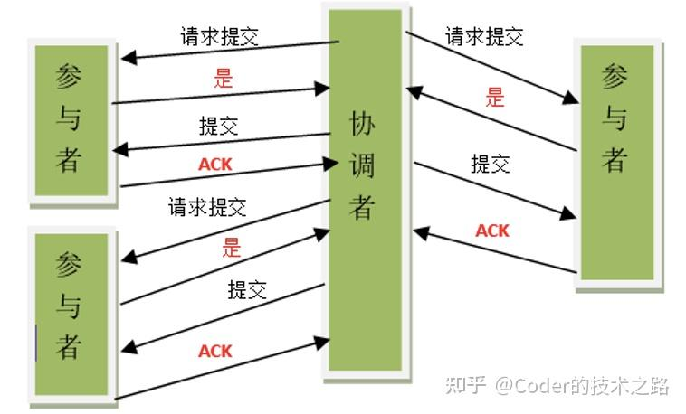

**2PC协议**：

第一阶段：协调者要求每个涉及到事务的数据库预提交(precommit)操作，并反映是否可以提交.

第二阶段：协调者通知每个数据库提交数据，或者回滚数据。

**分布式事务多种主流形态**：基于消息实现的分布式事务；基于补偿实现的分布式事务；基于TCC实现的分布式事务；基于SAGA实现的分布式事务；基于2PC实现的分布式事务

**分布式事务方案常见的有**：全局事务（DTP）；TCC（两阶段 补偿）；基于可靠消息队列的分布式事务；最大努力通知；saga长事务

### 3.1 全局事务模型DTP

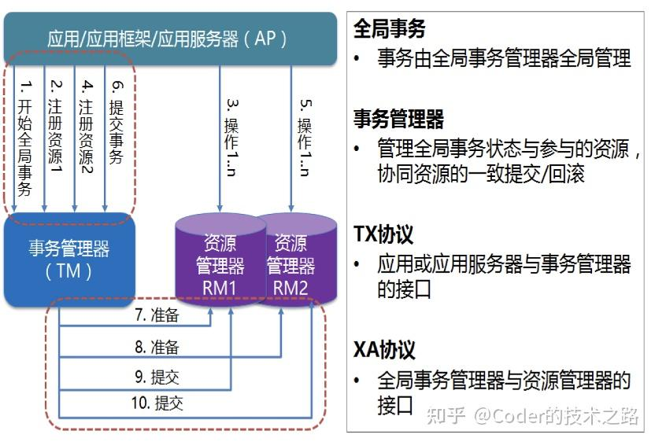

AP(Application Program)：也就是应用程序，可以理解为使用 DTP 的程序；

RM(Resource Manager)：资源管理器（这里可以是一个 DBMS，或者消息服务器管理系统）应用程序通过资源管理器对资源进行控制，资源必须实现 XA 定义的接口；

TM(Transaction Manager)：事务管理器，负责协调和管理事务，提供给 AP 应用程序编程接口以及管理资源管理器。

事务管理器控制着全局事务，管理事务生命周期，并协调资源。资源管理器负责控制和管理实际资源。

XA接口是双向的系统接口，在事务管理器（TM）以及一个或多个资源管理器（RM）之间形成通信桥梁。

***全局事务 两阶段提交***

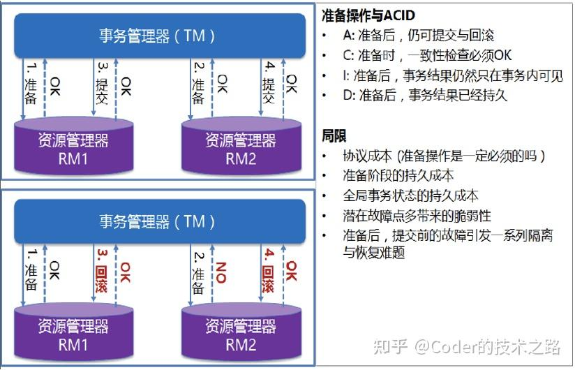

两阶段提交协议（Two-phase commit protocol）是XA用于在全局事务中协调多个资源的机制。

TM和RM间采取两阶段提交(Two Phase Commit)的方案来解决一致性问题。

两阶段提交需要一个协调者（TM）来掌控所有参与者节点（RM）的操作结果并且指引这些节点是否需要最终提交。

**全局事务的优点**：严格的ACID，强一致性。

**全局事务的缺点**：

Ø全局事务方式下，全局事务管理器（TM）通过XA接口使用二阶段提交协议（ 2PC ）与资源层（如数据库）进行交互， XA 协议的系统开销相当大。

Ø 使用全局事务，数据被Lock的时间跨整个事务，直到全局事务结束，与本地事务相比， ，因而应当慎重考虑是否确实需要分布式事务。而且只有支持 XA 协议的资源才能参与分布式事务。

Ø 高并发下存在性能隐患（吞吐量）。

Ø 系统复杂性也成倍增加。

### 3.2 TCC方案（两阶段+补偿型）

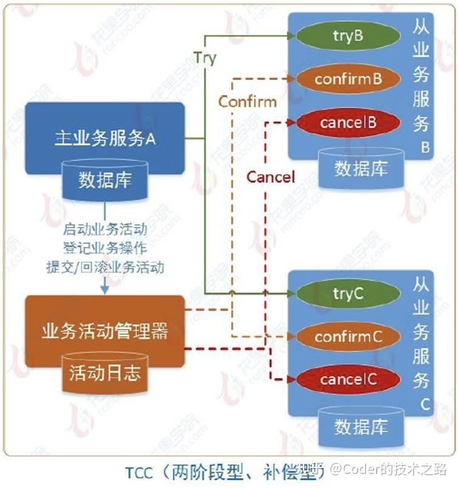

**TCC** 的全程分为三个阶段，分别是 Try、Confirm、Cancel：

**Try阶段**：这个阶段说的是对各个服务的资源做检测以及对资源进行锁定或者预留

**Confirm阶段**：这个阶段说的是在各个服务中执行实际的操作

**Cancel阶段**：如果任何一个服务的业务方法执行出错，那么这里就需要进行补偿，就是执行已经执行成功的业务逻辑的回滚操作

**实现：**

•一个完整的业务活动由一个主业务服务与若干从业务服务组成

•主业务服务负责发起并完成整个业务活动

•从业务服务提供TCC型业务操作

•业务活动管理器控制业务活动的一致性，它登记业务活动中的操作， 并在业务活动提交时确认所有的TCC型操作的confirm操作，在业务活动取消时调用所有TCC型操作的cancel操作

•TCC 事务框架都是要记录一些分布式事务的活动日志的，可以在磁盘上的日志文件里记录，也可以在数据库里记录。保存下来分布式事务运行的各个阶段和状态。

**成本：**

•原本服务一个接口，需要同时改造为三个接口，即try-confirm-cancel

•如自己实现tcc框架，成本高，系统复杂性高

•如引入开源事务框架，涉及服务都需要引入开源框架

•事务活动日志存储

**适用场景：**强一致性要求的业务；执行时间较短的业务；资金交易类业务；业务接口同步调用

**应用案例：**•支付宝XTS；•阿里TXC •Seata\_TCC

### 3.3 基于可靠消息服务分布式事务

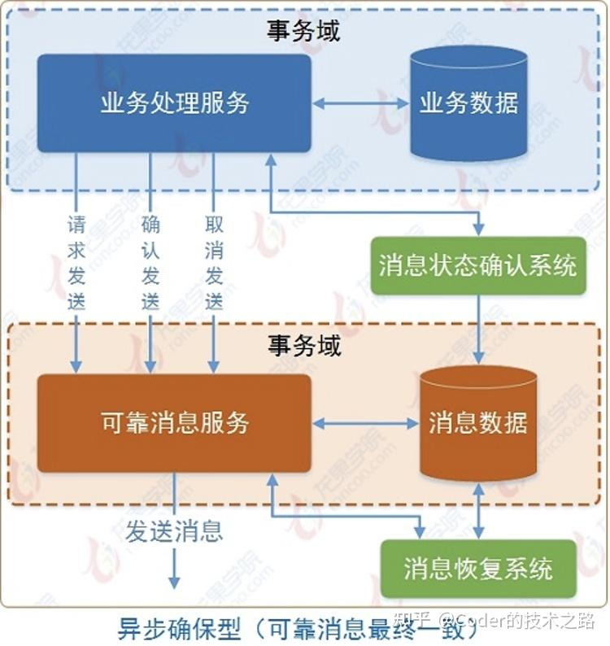

**实现：**

•业务处理服务在业务事务提交前，向实时消息服务请求发送消息，实时消息服务只记录消息数据，而不真正发送。业务处理服务在业务事务提交后，向实时消息服务确认发送。只有在得到确认发送指令后，实时消息服务才真正发送

•业务处理服务在业务事务回滚后，向实时消息服务取消发送。消息状态确认系统定期找到未确认发送或回滚发送的消息，向业务处理服务询问消息状态，业务处理服务根据消息ID或消息内容确定该消息是否有效

**成本：**可靠消息系统建设; 业务系统需要提供消息状态反查接口 ; 下游处理方式需要保证幂等

**适用场景与优点：**

•事务协调处理由消息中间件完成，系统间解耦

•基于可靠消息可以实现最终一致性

•适用于实时性要求不高场景，能容忍一定延迟

•适用于异步业务处理场景

**应用案例：**RocketMQ消息队列框架支持事务消息，一个业务任务会包括几个子任务，每个子任务都可以当成一个子事务，事务以异步方式执行 【大事务 = 小事务 + 异步】，图是基于RocketMQ是一个转账案例

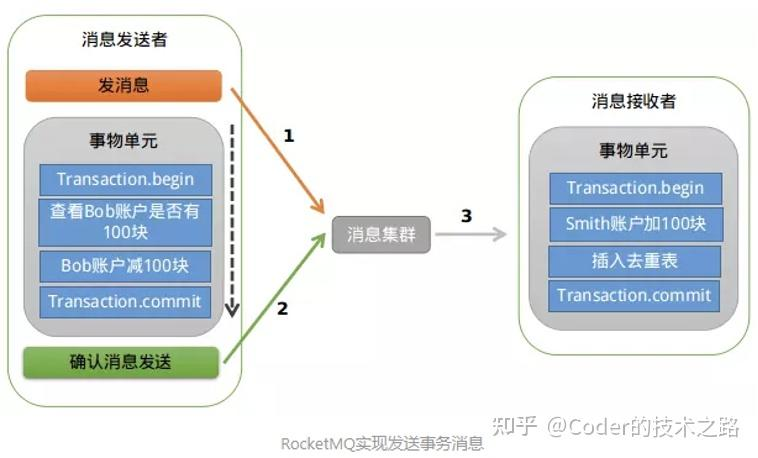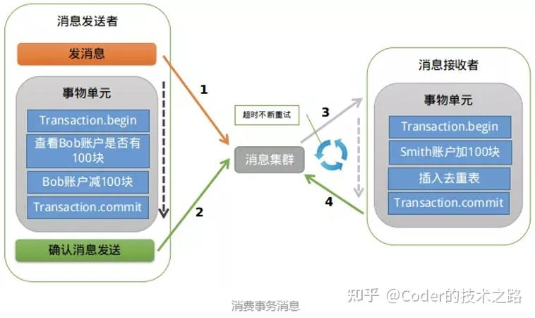

### 3.4 最大努力通知型

**实现：**上游业务系统完成任务后，向消息中间件发送一条消息，MQ持久化消息后同步给下游，触发下游任务，执行成功后确认应答，本次事务完成；

如上游发送消息失败会不断进行重试，如果持续失败意味着消息中间件出现故障，需人工干预；

MQ通知消费端也可能失败，同样会重试，持续失败会记录到失败消息表，下游系统会定期查询失败消息，并将其消费；

最大努力型主要通过重试机制+定期校对实现分布式事务

消费方都需要支持幂等

**适用场景：**适用于实时性要求低的业务场景; 对业务最终一致性时间敏感度低; 消息中间件如不支持事务可以采用本方式

### 3.5 Seata分布式事务框架

Seata 是一款开源的分布式事务解决方案，致力于提供高性能和简单易用的分布式事务服务。Seata 将为用户提供了 AT、TCC、SAGA 和 XA 事务模式，为用户打造一站式的分布式解决方案。

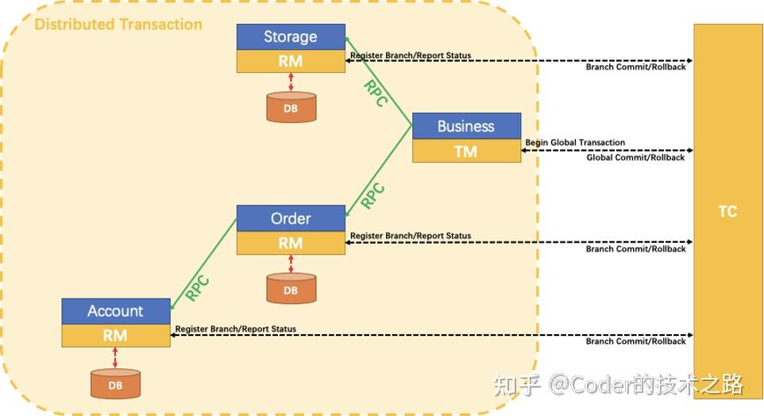

**TC - 事务协调者** 维护全局和分支事务的状态，驱动全局事务提交或回滚。

**TM - 事务管理器** 定义全局事务的范围：开始全局事务、提交或回滚全局事务。

**RM - 资源管理器** 管理分支事务处理的资源，与TC交谈以注册分支事务和报告分支事务的状态，并驱动分支事务提交或回滚

  

***一个典型的分布式事务过程：***

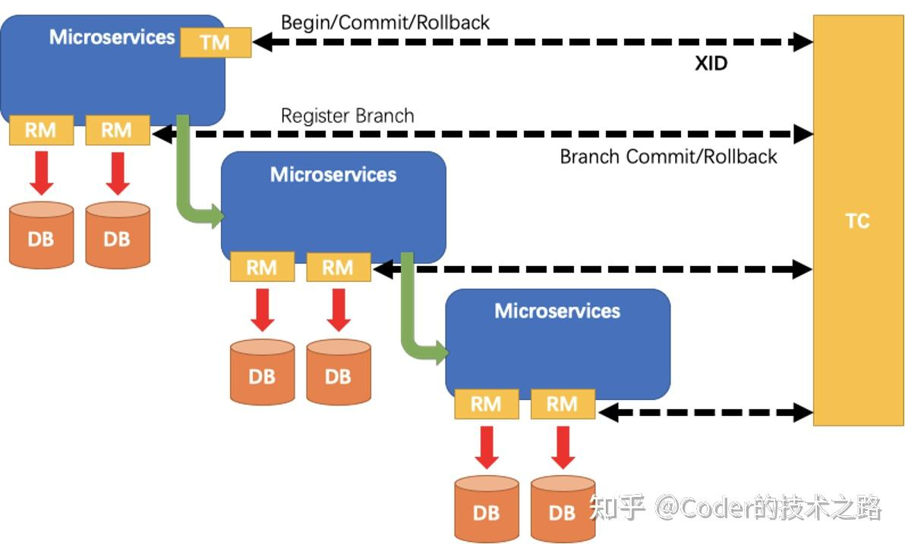

-   TM 向 TC 申请开启一个全局事务，全局事务创建成功并生成一个全局唯一的 XID。
-   XID 在微服务调用链路的上下文中传播。
-   RM 向 TC 注册分支事务，将其纳入 XID 对应全局事务的管辖。
-   TM 向 TC 发起针对 XID 的全局提交或回滚决议。
-   TC 调度 XID 下管辖的全部分支事务完成提交或回滚请求。

**Seata分布式事务框架-TCC**

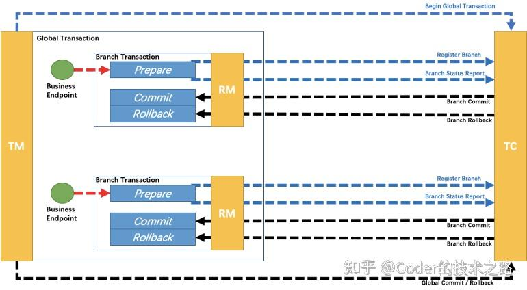

TCC 将事务提交分为 Try - Confirm - Cancel 3个操作。其和两阶段提交有点类似，Try为第一阶段，Confirm - Cancel为第二阶段，是一种应用层面侵入业务的两阶段提交。

**AT 模式基于支持本地 ACID 事务 的 关系型数据库：而TCC模式则是由用户自定义**

TCC 三个方法描述，由用户自定义：

Try：资源的检测和预留；

Confirm：执行的业务操作提交；要求 Try 成功 Confirm 一定要能成功；

Cancel：预留资源释放；

其核心在于将业务分为两个操作步骤完成。不依赖 RM 对分布式事务的支持，而是通过对业务逻辑的分解来实现分布式事务。但是 TCC 模式无 AT 模式的全局行锁，**TCC 性能会比 AT 模式高很多**。

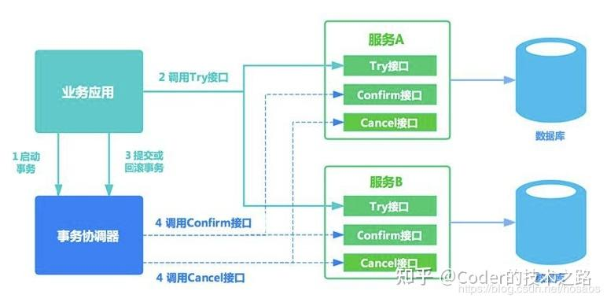

总得来说就是分为如下几步：

-   业务方调用各个微服务的try()方法，执行资源检查及预留操作
-   当所有try()方法均执行成功时，对全局事物进行提交，即由事物管理器调用每个微服务的confirm()方法
-   当任意一个方法try()失败(预留资源不足，抑或网络异常，代码异常等任何异常)，由事物管理器调用每个微服务的cancle()方法对全局事务进行回滚

总结一下全局事务提交的大致流程: 业务方调用微服务无异常，通过TM发起事务提交请求TC接收到事务提交请求后，通过Xid找到全局事务，再取出所有的分支事务遍历分支事务，发出分支事务提交请求TCC资源管理器RM接收到提交请求后，调用commit方法.

**Seata分布式事务框架-saga模式**

Saga模式是SEATA提供的长事务解决方案，在Saga模式中，业务流程中每个参与者都提交本地事务，当出现某一个参与者失败则补偿前面已经成功的参与者，一阶段正向服务和二阶段补偿服务都由业务开发实现。

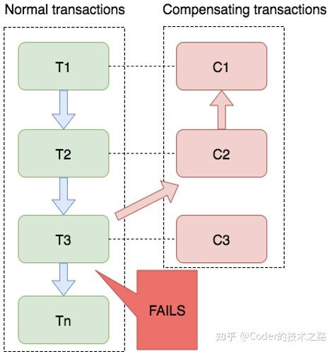

目前SEATA提供的Saga模式是基于状态机引擎来实现的，机制是：

-   通过状态图来定义服务调用的流程并生成 json 状态语言定义文件
-   状态图中一个节点可以是调用一个服务，节点可以配置它的补偿节点
-   状态图 json 由状态机引擎驱动执行，当出现异常时状态引擎反向执行已成功节点对应的补偿节点将事务回滚.

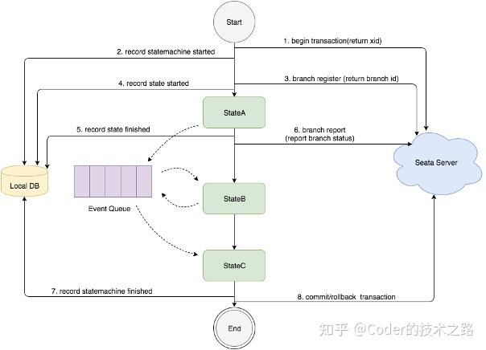

总体上seata框架中

-   AT模式业务侵入最少，但是涉及本地锁和全局锁，高并发性能隐患；业务提交和回滚都是基于数据库层侵入实现；
-   TCC模式业务侵入最多，改造成本最高，涉及上下游系统都需要改造，业务方需要改造业务逻辑，拆成try阶段和confirm阶段，业务回滚也由业务方自己实现；
-   Saga 模式适用于业务流程长且需要保证事务最终一致性的业务系统，Saga 模式一阶段就会提交本地事务，无锁、长流程情况下可以保证性能。不过业务回滚操作也是由业务方自己实现；saga模式是接入成本最低的一种模式
-   整体上接入开源框架，都需要维护部署seata TC server端，各系统需融入seata客户端，Tcserver端会存在单点隐患.

**几个原则：**

-   对存在非常多的微服务的公司来说，服务之间的调用异常的复杂，那么在引入分布式事务的过程中，你需要考虑加入分布式事务后，系统实现起来的复杂性和开发成本，或者说哪些地方根本就不需要搞分布式事务。
-   对于大多数的业务来说，其实我们并不需要做分布式事务，直接做日志，做监控就好了。然后出现问题，手工去处理，一个月也不会有那么多的问题的。如果你天天都出现这些问题，你是不是要好好去排查排查你的代码Bug了。
-   对于资金类的场景，那么基本上会采用分布式事务方案来保证，像其他的服务，会员，积分，商品信息呀这些，可能就不需要这么去搞了。

***最后，推荐两篇文章，基于saga自实现的公司级分布式事务框架：***

[《分布式事务从入门到放弃--数据一致性引擎概览》](https://link.zhihu.com/?target=https%3A//mp.weixin.qq.com/s/dFmxdLtPFCXIR73gg2d1UA)

[《分布式事务从入门到放弃(二)--详述DT引擎一致性原理及设计》](https://link.zhihu.com/?target=https%3A//mp.weixin.qq.com/s/Ow2HWBEgeqHdbMw3XNeyoA)

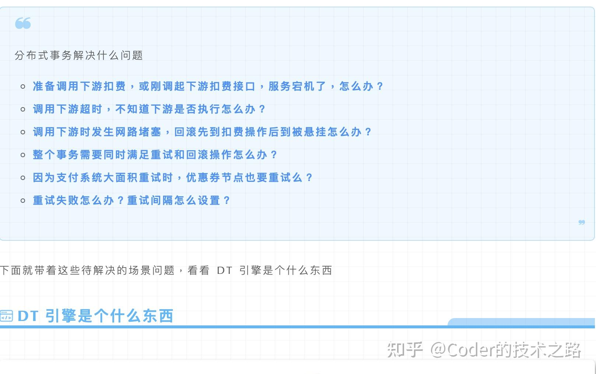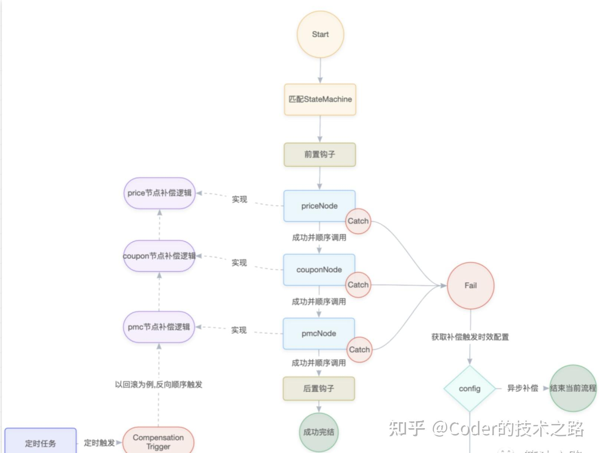

  

***欢迎关注同名微信公众号，有任何问题，欢迎大家留言讨论~***