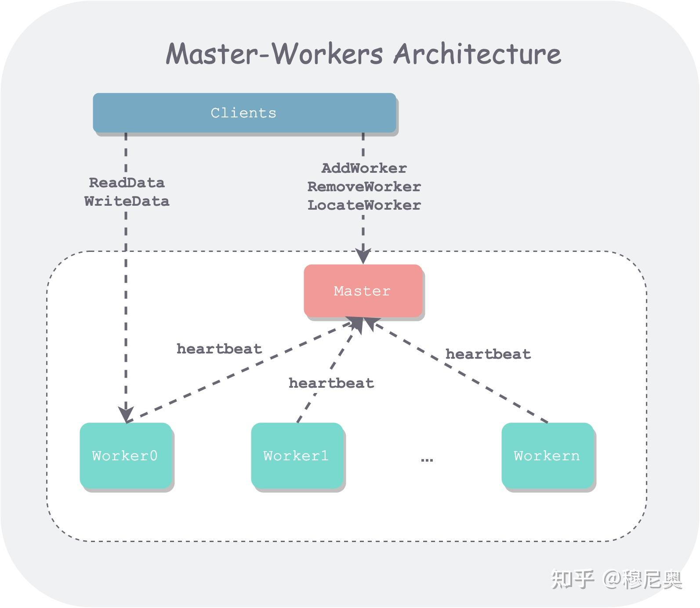

> 分布式系统有很多经典的套路，也即设计模式。每个设计模式可以解决经典的一类问题，积累的多了，便可以稍加变化，进行取舍，设计出贴合需求的架构组织。但似乎大家在这方面经验分享的不太多，因此之后打算总结一些工作和学习的经验，既是备忘，也希望对大家有些助益。篇幅所限、能力所囿，难以面面俱到，又或疏于精确。不当之处，欢迎指正。  
> 每篇将以概述背景、架构模块、总结延伸来分别解析，本篇是第一篇：Master-Workers 架构。

## 概述

Master-Workers 架构（粗译为**主从架构**）是分布式系统中常见的一种组织方式，如 GFS 中的 Master、ChunkServers；MapReduce 中的 Master、Workers。面对分布式系统中一堆分离的机器资源，主从架构是一种最自然、直白的组织方式——就像一群人，有个说了算 leader 进行组织、协调，才能最大化这群人的对外输出能力。

这也是计算机系统中常见的一种分而治之思想的体现。即将一个复杂的系统，拆解成几个相对高内聚、低耦合的子模块，定义清楚其**功能边界**和**交互接口**，使得系统易于理解、维护和扩展。对于主从架构来说，**主（Master）** 通常会维护集群元信息、进而依靠这些元信息进行调度，**从（Workers）** 通常负责具体**数据切片**（存储系统）的读写或者作为**子任务**（计算系统）的执行单元。

*作者：青藤木鸟 [https://www.qtmuniao.com/2021/07/03/distributed/system/1/master/worekrs](https://link.zhihu.com/?target=https%3A//www.qtmuniao.com/2021/07/03/distributed/system/1/master/worekrs), 转载请注明出处*

## 架构模块

主从架构系统，通常由单个 Master ，多个 Worker 组成。插一句，这里**从**英文翻译没有用 Slave 的原因是，我觉得 Worker 更中性一些。当然，单个 Master 会有性能瓶颈和可用性问题，通常也有多种解决方案，后面详说。但单个 Master 的好处是显而易见的：Master 作为一个控制节点，而不用处理由多副本带来的一致性问题，大大降低实现难度。

以我更熟悉一点的**存储系统**架构为例，其架构图通常长这样。

  

除了系统内部的 Master 和 Worker 外，还有使用系统的外部用户。我们通常称之为**客户端（Client），**Client 通过系统暴露的接口（如 RPC、HTTP）与系统进行交互。

## Master

Master 通常会存储系统的**元信息**，什么是元信息呢？可以理解为集群组织信息在 Master 脑中的一个倒影，或者说视图（View）：比如集群有多少 Worker、每个 Worker 有多少剩余容量、负载如何、哪些 Worker 存储了哪些数据等等。

那元信息是怎么收集的呢？主要分两种情况：

1.  **配置**。可以理解为集群**静态信息**，比如系统初始有多少个 Worker、Worker 的物理拓扑、每个 Worker 的容量等等，Master 会在启动时加载这些配置信息。
2.  **汇报**。主要是集群**动态信息**，Worker 在运行时，主动将自身状态汇报给 Master，比如 Worker 是否存活、Worker 负载信息、Worker 存了哪些数据等等。在系统运行中，Worker 会定时地通过**心跳（Heartbeat）**等方式，持续给 Master 汇报。

有了这些元信息，Master 就可以对整个集群情况有个掌握，从而做出一系列的决策，试举几例：

1.  **调度（Schedule）**。一个新的写数据请求来了，要分配给哪个 Worker 负责？通常会选择一个负载小的。
2.  **均衡（Balance）**。随着 Worker 变动、数据增删，数据在不同机器中分布可能不再均匀，在某些机器形成读写热点、在另一些机器却存在资源浪费，从而影响系统整体性能。因此需要实时监测，适时迁移。
3.  **路由（Locate/Route）**。一个读写请求来了，不知道去找哪个 Worker？Master 便会查询元信息，给出对应数据的 Worker 信息。

### Master 的可用性

可以看出整个系统的可用性全系 Master 一身。业界也有很多解决办法，比如：

1.  **使用主备**。即给 Master 做个分身，备 Master 所有元信息要时刻跟主 Master 保持一致，一旦主 Master 挂掉，分身立刻跟上。Hadoop 后来这么干过。
2.  **使用共识算法**（[consensus](https://link.zhihu.com/?target=https%3A//en.wikipedia.org/wiki/Consensus_%28computer_science%29) algorithm）。简单来说，就是由一堆 Master 机器来组成*委员会*，每个状态变更都要通过某种算法达成共识。Google 的 [Spanner](https://link.zhihu.com/?target=https%3A//static.googleusercontent.com/media/research.google.com/zh-CN//archive/spanner-osdi2012.pdf) 就是这么干的。
3.  **无主**。系统中不再有 Master，人人平等，然后通过某种策略，比如说一致性哈希（[consistent hash](https://link.zhihu.com/?target=https%3A//en.wikipedia.org/wiki/Consistent_hashing)），来分活干。Amazon 的 [Dynamo](https://link.zhihu.com/?target=https%3A//www.qtmuniao.com/2020/06/13/dynamo/) 是这么干的。

每种策略都是比较大的主题，以后可以分别单开一篇，本文限于篇幅不再展开。

## Workers

在存储系统中，Workers 会存储实际数据，并对外提供数据 IO 服务。

**从单机视角来看**，Worker 需要设计一个贴合业务需求的单机引擎，高效的存储数据。单机引擎设计也是一个很大的话题，这里简要提一嘴：

1.  **索引设计**：比如 B+ 树、LSM-tree、哈希索引等等。
2.  **底层系统**：是用裸盘还是文件系统。
3.  **存储介质**：使用可持久化内存、固态硬盘还是机械硬盘。

**从多机视角来看**，机器的数量一上去，系统中单台机器出现故障的概率便大大提高。为了应对这种常态化的故障，需要：

1.  **运维的自动化**。机器不可用后要自动剔除，修好后要便捷上线。
2.  **数据的冗余化**。机器故障后数据不能丢，因此每份数据要多副本存放、使用 EC 算法做冗余。

## 小结

Master-Workers 架构是分布式系统中最常用的一种组织方式。该架构类似于人类社群的组织方式，将系统的职责进行拆解，Master 收集元信息，并据此进行任务调度；Workers 负责实际工作负载，需要设计高效的单机引擎，并配合全局做冗余。该架构简单直接，但威力强大。

* * *

我是青藤木鸟，一个喜欢摄影的程序员，欢迎关注我的公众号：“木鸟杂记”。

