2020年，笔者负责的一个高德打车弹外订单系统进行了一次扩分库分表和数据库迁移。该订单系统整体部署在阿里云上，服务使用阿里云ECS部署，数据库采用阿里云RDS，配置中心基于阿里云ACM自研，数据同步基于阿里云DTS自研以及自研分库分表组件、分布式ID组件等等。

此次进行扩分库分表的背景是，原4实例4库、每个库64张表一共256张表，部分单表已超千万量级，按当前每日单量量级，一年内单表会达到上亿条记录，单表数据量过大会带来数据库性能问题。

> 注：【弹内弹外】弹是指弹性计算，弹内与弹外其实是指两套独立的弹性计算网络环境。弹内主要是指部署在阿里生产网的弹性计算环境，最早是基于原有淘宝技术构建的，主要用于支撑淘宝业务。弹外主要是指部署在阿里公有云的弹性计算环境，支撑了阿里云计算业务。

### 二 容量规划

### 1 当前分库分表情况

4实例（16C/64G/3T SSD），4库（每个实例一个库），每库64张表，共256张表。

通过RDS后台一键诊断功能，来计算表空间使用情况（这里拿测试环境数据库举例）。

  

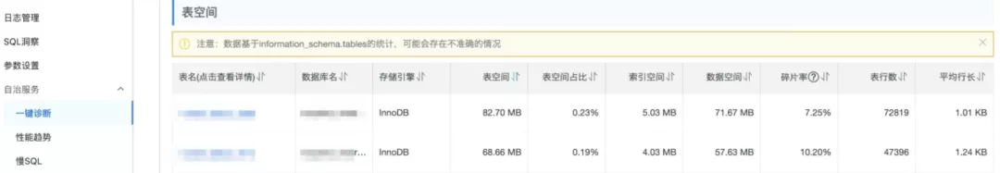

  

### 2 容量计算

### 实例数

数据库的瓶颈主要体现在：磁盘、CPU、内存、网络、连接数，而连接数主要是受CPU和内存影响。CPU和内存可以通过动态升配来提升，但是SSD磁盘容量最大支持到6T（32C以下最大3T、32C及以上最大6T）。

但是现阶段兼顾成本，可先将实例扩容一倍，采用8个实例(16C/64G/3T SSD)，每个实例建4个库（database）、每个库128张表（这里实际上是一个成本取舍的过程，理论上应该采取"多库少表"的原则，单库128张表其实太多了，单库建议32或64张表为宜）。

后续如果实例压力提升可进行实例配置升级(16C/128G、32C/128G、32C/256G等)；未来如出现单实例升配无法解决，在考虑扩容实例，只需要将database迁移至新实例，迁移成本较小。

  

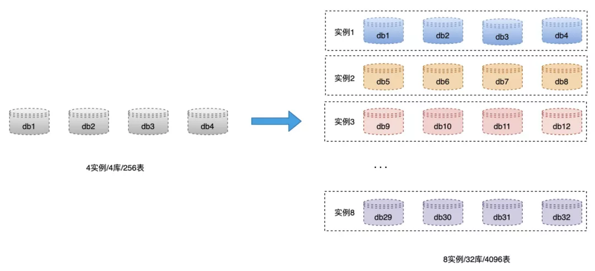

  

### 表数

按单表最多1000w条数据评估，4096张表可支持日5000w单*3年(10.1压测标准)、日2000w单*5年的架构。（因业务表比较多，此处忽略掉单条数据大小的计算过程）

### 库数

32个库，每个库128张表。未来可最大扩容到32个实例，无需rehash，只需要迁移数据。

  

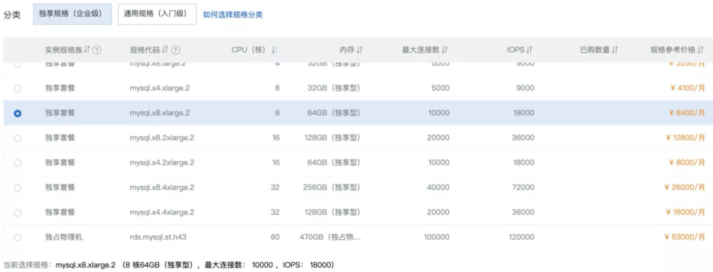

  

阿里云RDS规格和价格一览

  

### 三 数据迁移

因扩分库分表涉及到rehash过程（256表变4096表），而阿里云DTS只支持同构库数据迁移，所以我们基于DTS的binlog转kafka能力自研了数据同步中间件。

整个数据迁移工作包括：前期准备、数据同步环节（历史数据全量同步、增量数据实时同步、rehash）、数据校验环节（全量校验、实时校验、校验规则配置）、数据修复工具等。

  

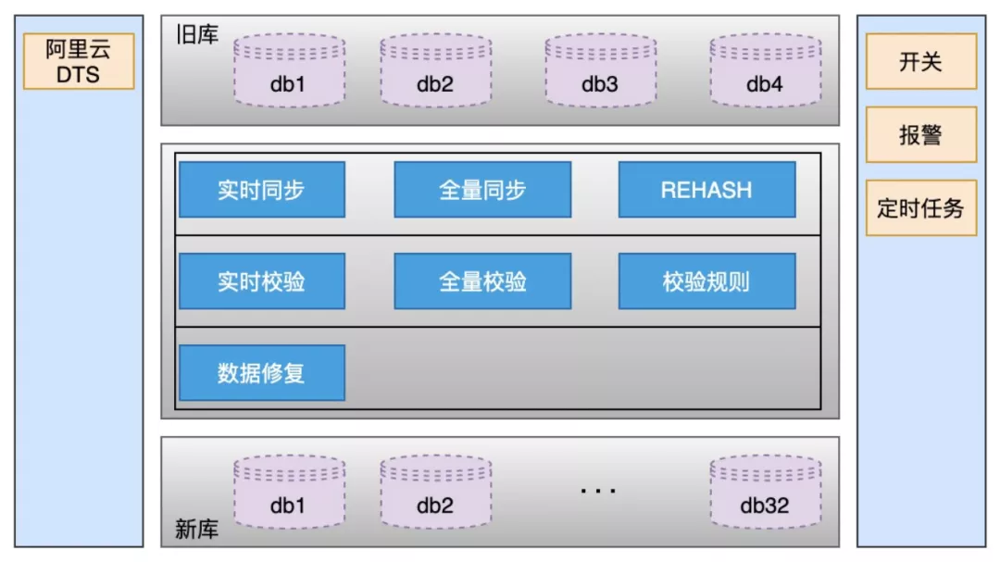

  

### 1 准备工作

### 唯一业务ID

在进行数据同步前，需要先梳理所有表的唯一业务ID，只有确定了唯一业务ID才能实现数据的同步操作。

需要注意的是：

-   业务中是否有使用数据库自增ID做为业务ID使用的，如果有需要业务先进行改造，还好订单业务里没有。
-   每个表是否都有唯一索引，这个在梳理的过程中发现有几张表没有唯一索引。

一旦表中没有唯一索引，就会在数据同步过程中造成数据重复的风险，所以我们先将没有唯一索引的表根据业务场景增加唯一索引（有可能是联合唯一索引）。

在这里顺便提一下，阿里云DTS做同构数据迁移，使用的是数据库自增ID做为唯一ID使用的，这种情况如果做双向同步，会造成数据覆盖的问题。解决方案也有，之前我们的做法是，新旧实体采用自增ID单双号解决，保证新旧实例的自增ID不会出现冲突就行。因为这次我们使用的自研双向同步组件，这个问题这里不细聊。

### 分表规则梳理

分表规则不同决定着rehash和数据校验的不同。需逐个表梳理是用户ID纬度分表还是非用户ID纬度分表、是否只分库不分表、是否不分库不分表等等。

### 2 数据同步

数据同步整体方案见下图，数据同步基于binlog，独立的中间服务做同步，对业务代码无侵入。

接下来对每一个环节进行介绍。

  

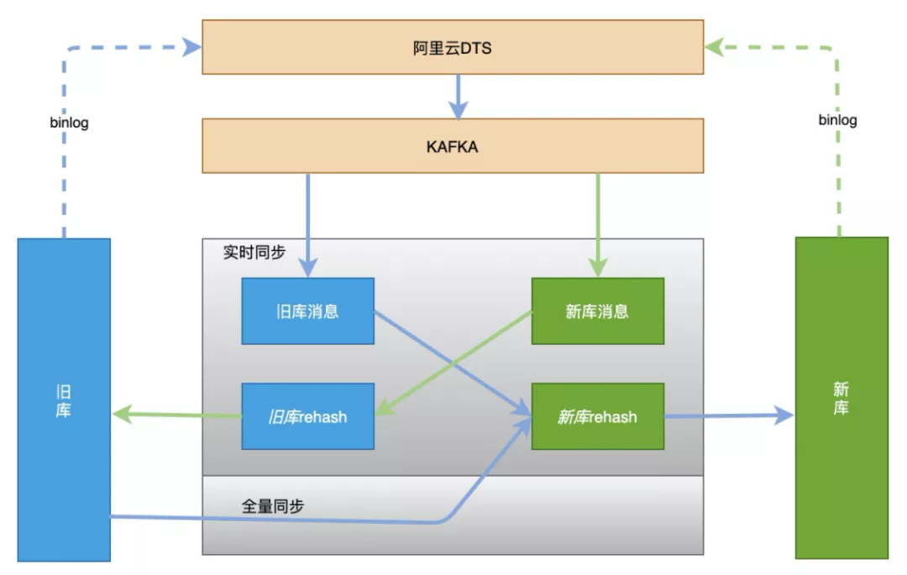

  

### 历史数据全量同步

单独一个服务，使用游标的方式从旧库分批select数据，经过rehash后批量插入（batch insert）到新库，此处需要配置jdbc连接串参数rewriteBatchedStatements=true才能使批处理操作生效。

另外特别需要注意的是，历史数据也会存在不断的更新，如果先开启历史数据全量同步，则刚同步完成的数据有可能不是最新的。所以这里的做法是，先开启增量数据单向同步（从旧库到新库），此时只是开启积压kafka消息并不会真正消费；然后在开始历史数据全量同步，当历史全量数据同步完成后，在开启消费kafka消息进行增量数据同步（提高全量同步效率减少积压也是关键的一环），这样来保证迁移数据过程中的数据一致。

### 增量数据实时同步

增量数据同步考虑到灰度切流稳定性、容灾和可回滚能力，采用实时双向同步方案，切流过程中一旦新库出现稳定性问题或者新库出现数据一致问题，可快速回滚切回旧库，保证数据库的稳定和数据可靠。

增量数据实时同步采用基于阿里云DTS的数据订阅自研数据同步组件data-sync实现，主要方案是DTS数据订阅能力会自动将被订阅的数据库binlog转为kafka，data-sync组件订阅kafka消息、将消息进行过滤、合并、分组、rehash、拆表、批量insert/update，最后再提交offset等一系列操作，最终完成数据同步工作。

  

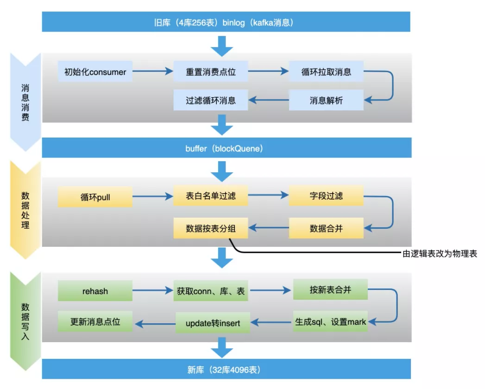

  

-   过滤循环消息：需要过滤掉循环同步的binlog消息，这个问题比较重要后面将进行单独介绍。
-   数据合并：同一条记录的多条操作只保留最后一条。为了提高性能，data-sync组件接到kafka消息后不会立刻进行数据流转，而是先存到本地阻塞队列，然后由本地定时任务每X秒将本地队列中的N条数据进行数据流转操作。此时N条数据有可能是对同一张表同一条记录的操作，所以此处只需要保留最后一条（类似于redis aof重写）。
-   update转insert：数据合并时，如果数据中有insert+update只保留最后一条update，会执行失败，所以此处需要将update转为insert语句。
-   按新表合并：将最终要提交的N条数据，按照新表进行拆分合并，这样可以直接按照新表纬度进行数据库批量操作，提高插入效率。

整个过程中有几个问题需要注意：

问题1：怎么防止因异步消息无顺序而导致的数据一致问题？

首先kafka异步消息是存在顺序问题的，但是要知道的是binlog是顺序的，所以dts在对详细进行kafka消息投递时也是顺序的，此处要做的就是一个库保证只有一个消费者就能保障数据的顺序问题、不会出现数据状态覆盖，从而解决数据一致问题。

问题2：是否会有丢消息问题，比如消费者服务重启等情况下？

这里没有采用自动提交offset，而是每次消费数据最终入库完成后，将offset异步存到一个mysql表中，如果消费者服务重启宕机等，重启后从mysql拿到最新的offset开始消费。这样唯一的一个问题可能会出现瞬间部分消息重复消费,但是因为上面介绍的binlog是顺序的,所以能保证数据的最终一致。

问题3：update转insert会不会丢字段？

binlog是全字段发送,不会存在丢字段情况。

问题4：循环消息问题。

后面进行单独介绍。

### rehash

前文有提到，因为是256表变4096表，所以数据每一条都需要经过一次rehash重新做分库分表的计算。

要说rehash，就不得不先介绍下当前订单数据的分库分表策略，订单ID中冗余了用户ID的后四位，通过用户ID后四位做hash计算确定库号和表号。

  

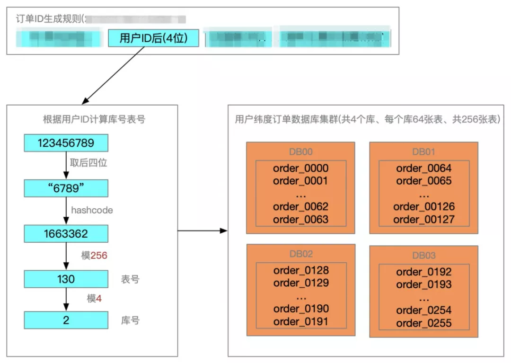

  

数据同步过程中，从旧库到新库，需要拿到订单ID中的用户ID后四位模4096，确定数据在新库中的库表位置；从新库到旧库，则需要用用户ID后四位模256，确定数据在旧库中的库表位置。

### 双向同步时的binlog循环消费问题

想象一下，业务写一条数据到旧实例的一张表，于是产生了一条binlog；data-sync中间件接到binlog后，将该记录写入到新实例，于是在新实例也产生了一条binlog；此时data-sync中间件又接到了该binlog......不断循环，消息越来越多，数据顺序也被打乱。

怎么解决该问题呢？我们采用数据染色方案，只要能够标识写入到数据库中的数据使data-sync中间件写入而非业务写入，当下次接收到该binlog数据的时候就不需要进行再次消息流转。

所以data-sync中间件要求，每个数据库实例创建一个事务表，该事务表tb\_transaction只有id、tablename、status、create\_time、update\_time几个字段，status默认为0。

再回到上面的问题，业务写一条数据到旧实例的一张表，于是产生了一条binlog；data-sync中间件接到binlog后，如下操作：

```text
# 开启事务，用事务保证一下sql的原子性和一致性
start transaction;
set autocommit = 0;
# 更新事务表status=1，标识后面的业务数据开始染色
update tb_transaction set status = 1 where tablename = ${tableName};
# 以下是业务产生binlog
insert xxx;
update xxx;
update xxx;
# 更新事务表status=0，标识后面的业务数据失去染色
update tb_transaction set status = 0 where tablename = ${tableName};
commit;
```

此时data-sync中间件将上面这些语句打包一起提交到新实例，新实例更新数据后也会生产对应上面语句的binlog；当data-sync中间件再次接收到binlog时，只要判断遇到tb\_transaction表status=1的数据开始，后面的数据都直接丢弃不要，直到遇到status=0时，再继续接收数据，以此来保证data-sync中间件只会流转业务产生的消息。

  

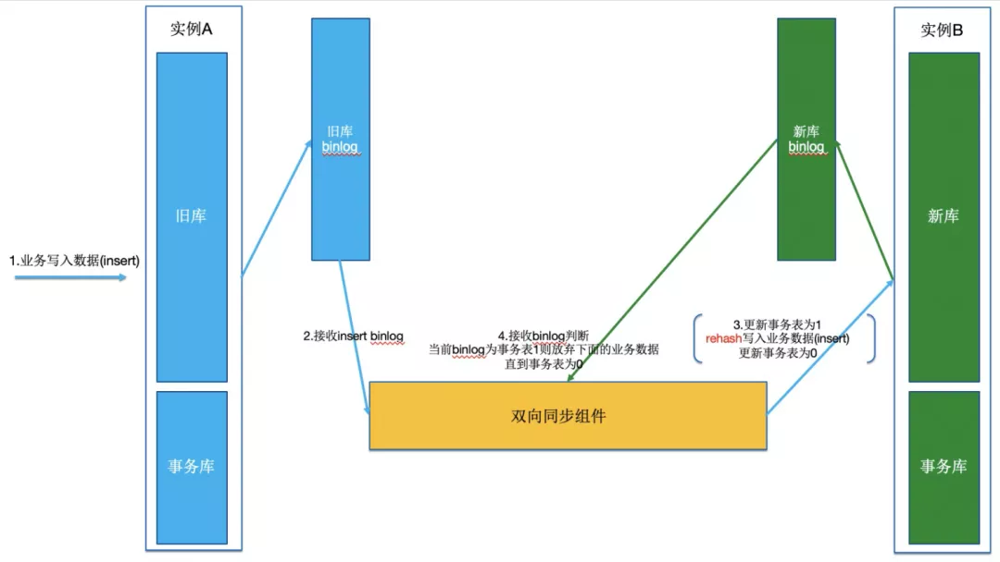

  

### 3 数据校验

数据校验模块由数据校验服务data-check模块来实现，主要是基于数据库层面的数据对比，逐条核对每一个数据字段是否一致，不一致的话会经过配置的校验规则来进行重试或者报警。

### 全量校验

-   以旧库为基准，查询每一条数据在新库是否存在，以及个字段是否一致。
-   以新库为基准，查询每一条数据在旧库是否存在，以及个字段是否一致。

### 实时校验

-   定时任务每5分钟校验，查询最近5+1分钟旧库和新库更新的数据，做diff。
-   差异数据进行二次、三次校验（由于并发和数据延迟存在），三次校验都不同则报警。

  

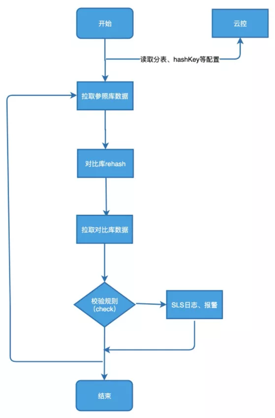

  

### 4 数据修复

经过数据校验，一旦发现数据不一致，则需要对数据进行修复操作。

数据修复有两种方案，一种是适用于大范围的数据不一致，采用重置kafka offset的方式，重新消费数据消息，将有问题的数据进行覆盖。

  

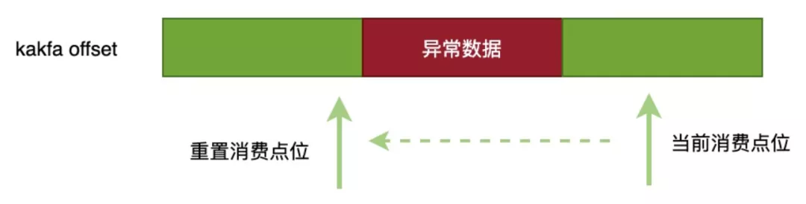

  

### 四 灰度切换数据源

### 1 整体灰度切流方案

整体灰度方案：SP+用户纬度来实现，SP纬度：依靠灰度环境切量来做，用户纬度：依赖用户ID后四位百分比切流。

灰度切量的过程一定要配合停写（秒级），为什么要停写，因为数据同步存在一定延迟（正常毫秒级），而所有业务操作一定要保障都在一个实例上，否则在旧库中业务刚刚修改了一条数据，此时切换到新库如果数据还没有同步过来就是旧数据会有数据一致问题。所以步骤应该是：

1.  先停写
2.  观察数据全部同步完
3.  在切换数据源
4.  最后关闭停写，开始正常业务写入

### 2 切流前准备——ABC验证

虽然在切流之前，在测试环境进过了大量的测试，但是测试环境毕竟和生产环境不一样，生产环境数据库一旦出问题就可能是灭顶之灾，虽然上面介绍了数据校验和数据修复流程，但是把问题拦截在发生之前是做服务稳定性最重要的工作。

因此我们提出了ABC验证的概念，灰度环境ABC验证准备：

1.  新购买两套数据库实例，当前订单库为A，新买的两套为分别为B、C
2.  配置DTS从A单项同步到B（dts支持同构不需要rehash的数据同步），B做为旧库的验证库，C库做为新库
3.  用B和C做为生产演练验证
4.  当B和C演练完成之后，在将A和C配置为正式的双向同步

  

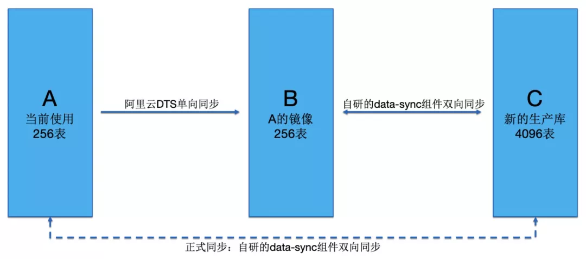

  

### 3 灰度切流步骤

具体灰度方案和数据源切换流程：

1.  代码提前配置好两套数据库分库分表规则。
2.  通过ACM配置灰度比例。
3.  代码拦截mybatis请求，根据用户id后四位取模，和ACM设置中设置的灰度比例比较，将新库标识通过ThreadLocal传递到分库分表组件。
4.  判断当前是否有灰度白名单，如命中将新库标识通过ThreadLocal传递到分库分表组件。
5.  分库分表组件根据ACM配置拿到新分库的分表规则，进行数据库读写操作。
6.  切量时会配合ACM配置灰度比例命中的用户进行停写。

  

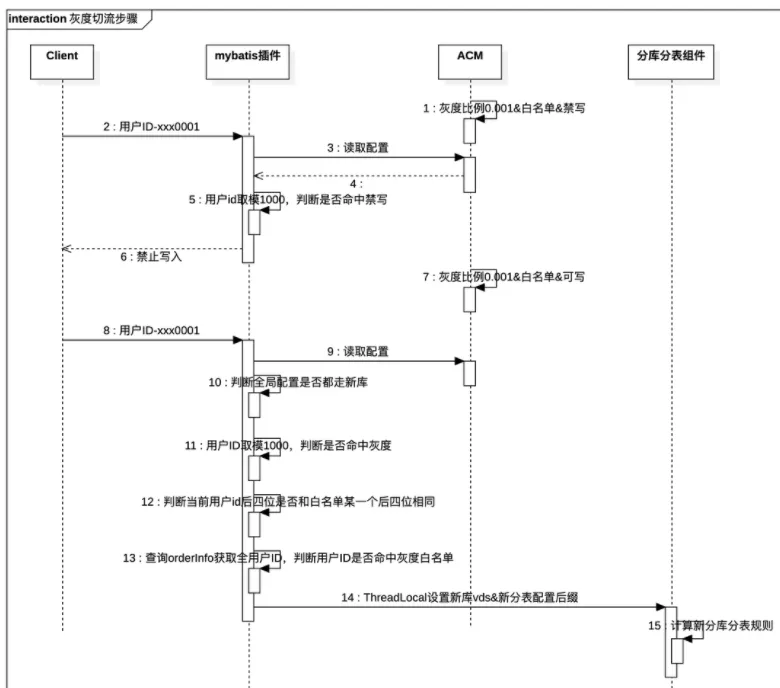

  

### 五 总结

整个数据迁移过程还是比较复杂的，时间也不是很充裕（过程中还穿插着十一全链路压测改造），在有限的时间内集大家之力重复讨论挖掘可能存在的问题，然后论证解决方案，不放过任何一个可能出现问题的环节，还是那句话，把问题拦截在发生之前是做服务稳定性最重要的工作。

过程中的细节还是很多的，从数据迁移的准备工作到数据同步测试，从灰度流程确定到正式生产切换，尤其是结合业务和数据的特点，有很多需要考虑的细节，文中没有一一列出。

最终经过近两个月的紧张工作，无业务代码侵入、零事故、平稳地完成了扩分库分表和数据迁移的工作。

...

更多python、java学习面试资料，可添加阿里妹官微(alimei6）备注【阿里技术】，还有更多阿里社招、校招、最新科技技术资讯、各类技术训练营学习名额和独家电子书可以领取。

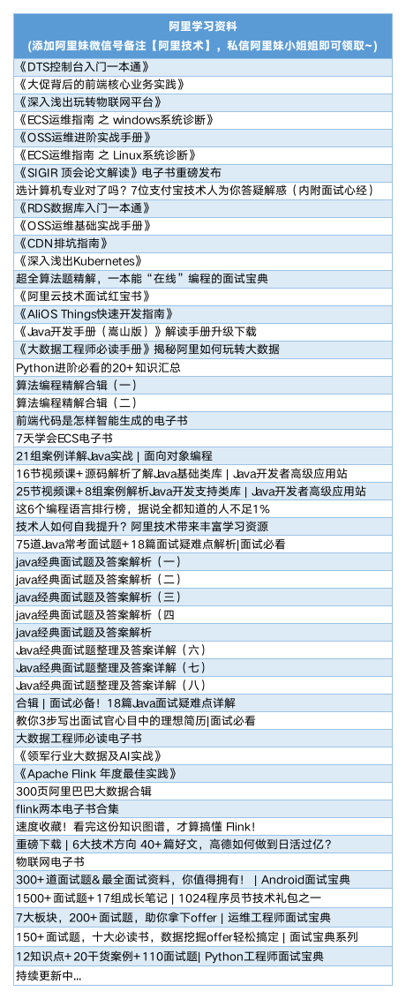